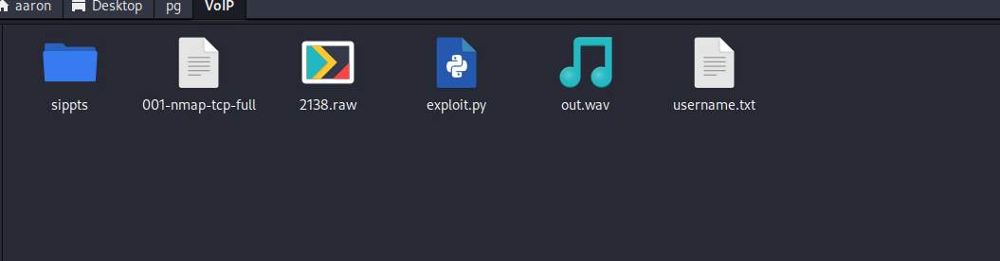

# Network Enumeration

```bash
┌──(aaron㉿aacai)-[~/Desktop/pg/VoIP]
└─$ nmap -r -v --min-rate=1500 -p- -oN 001-nmap-tcp-full  192.168.183.156
PORT     STATE SERVICE
22/tcp   open  ssh
80/tcp   open  http
8000/tcp open  http-alt

Read data files from: /usr/bin/../share/nmap
Nmap done: 1 IP address (1 host up) scanned in 60.70 seconds

```

# Web Enumeration

## Port 80


Creds `admin:admin` not useful.


## Port 8000


Creds `admin:admin` is useful for port 8000


# Use exploit 

Because the voip base SIP protocol, so use the exploit from [sippts](https://github.com/Pepelux/sippts).

Get the password from `sipdigestleak`.


So the Voip Manager password is `adm_sip:074b62fb6c21b84e6b5846e6bb001f67:passion`


Get the raw data from `cdr->streams`


Also can download a raw file from cdr.


Use `sox` can restore the wav file.

```bash
┌──(aaron㉿aacai)-[~/Desktop/pg/VoIP]
└─$ sox -t raw -r 8000 -v 4 -c 1 -e mu-law 2138.raw out.wav
```



Then get a wav file. And we can listen the audio is

`Your password has been change to password1234 where p is capitial`


Then we can use all useranmes form the port 8000 to brute force the ssh password.


Get voiper's password is `Password1234`.


# PE

Login to `voiper` we can see the user `voiper` can use sudo do anything. So directly to get root.

