# Network Enumeration

```bash
192.168.156.114
PORT      STATE SERVICE
21/tcp    open  ftp
3306/tcp  open  mysql
8080/tcp  open  http-proxy
60022/tcp open  unknown
```

# Port Enumeration

## Port 8080

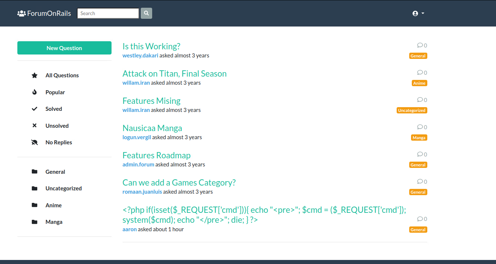

Find admin email on posts.

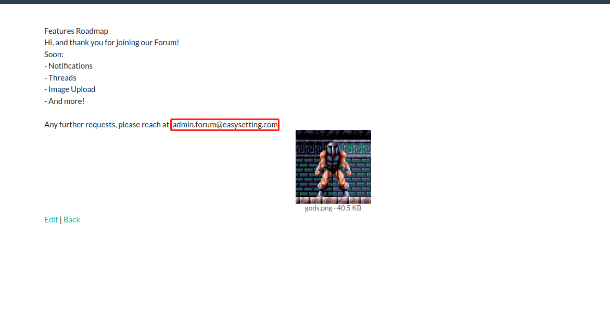

`admin.forum@easysetting.com`

Check the source code of `register`, find the default password `it0jNc6L/r090Q==`.

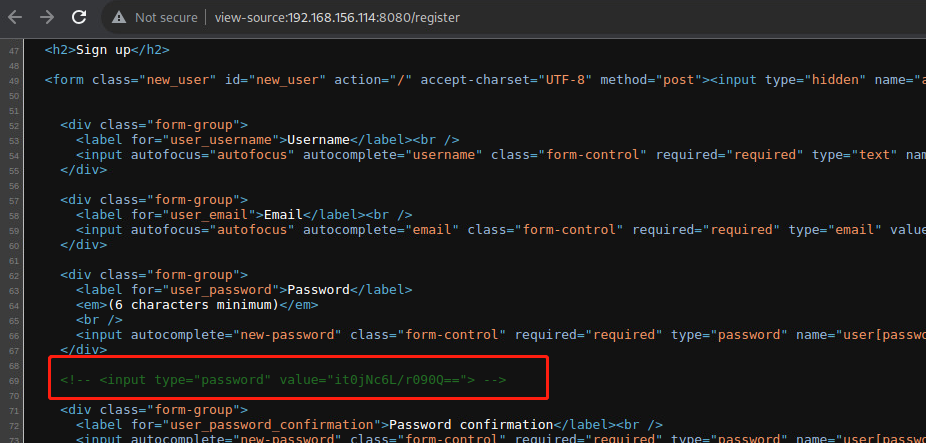

Login to admin because Ijust know the user admin's email address.

Then find a new menu.

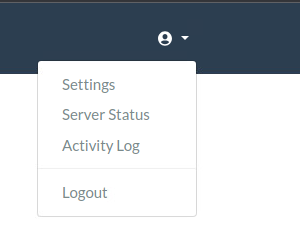

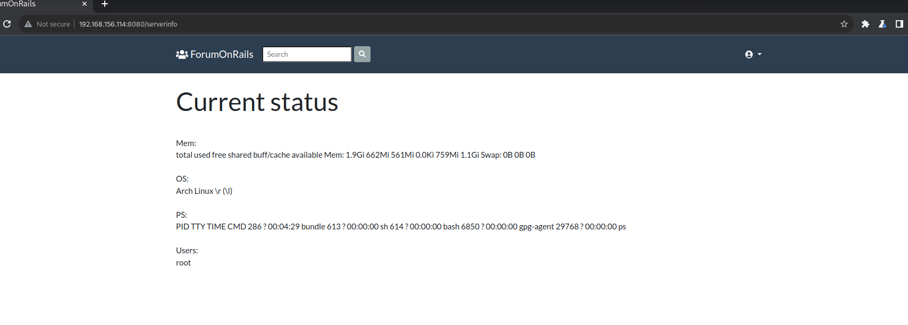

Check the source code find hidden tag.

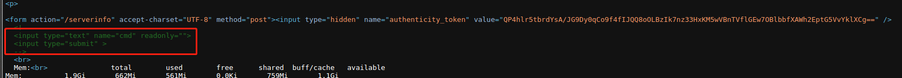

Then try to reverse shell.

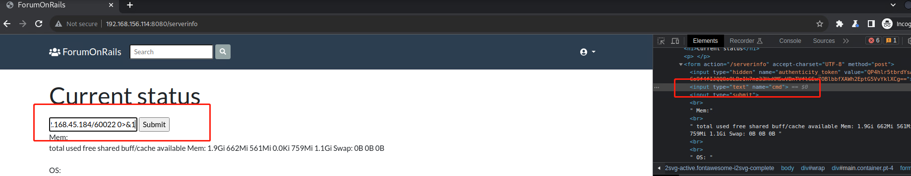

Get reverse shell.

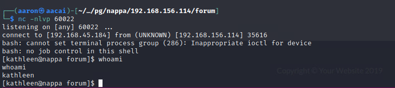


# PE

Find a abnormal size `.bashrc`.

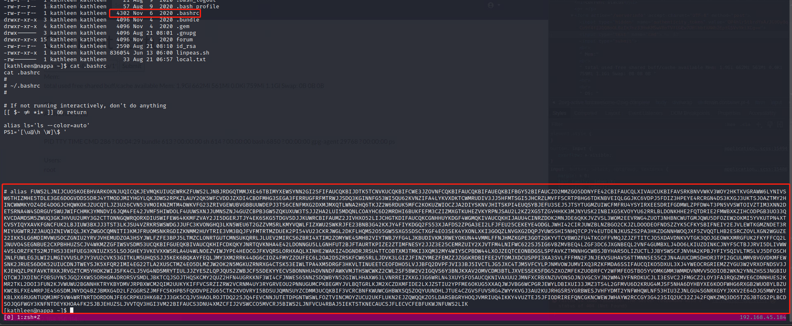

The alias content is encode by base32.

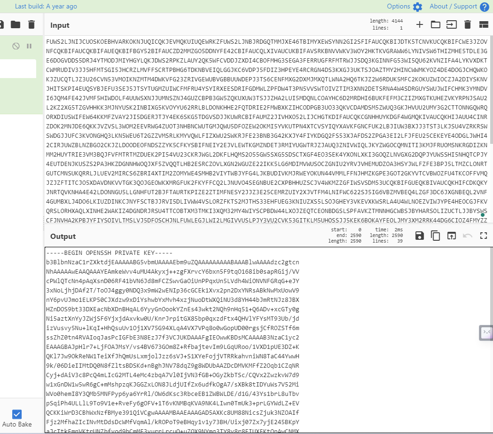

Decode can know this is a `ssh_key`.

Login to `ssh` with port 60022, then get root.

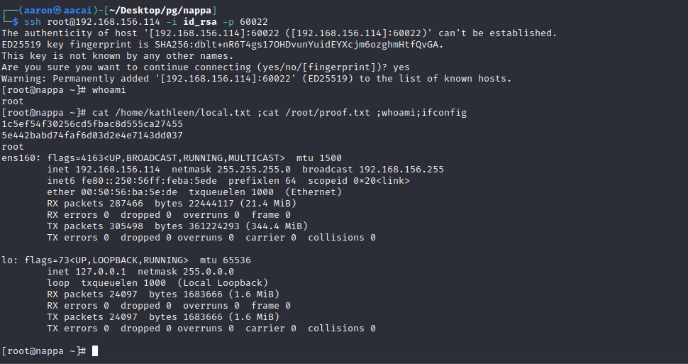