# Network Enumeration

```bash
PORT      STATE    SERVICE
21/tcp    open     ftp
80/tcp    open     http
135/tcp   open     msrpc
139/tcp   open     netbios-ssn
445/tcp   open     microsoft-ds
5040/tcp  open     unknown
8081/tcp  open     blackice-icecap
49664/tcp open     unknown
49665/tcp open     unknown
49666/tcp open     unknown
49667/tcp open     unknown
49668/tcp open     unknown
49669/tcp open     unknown
```

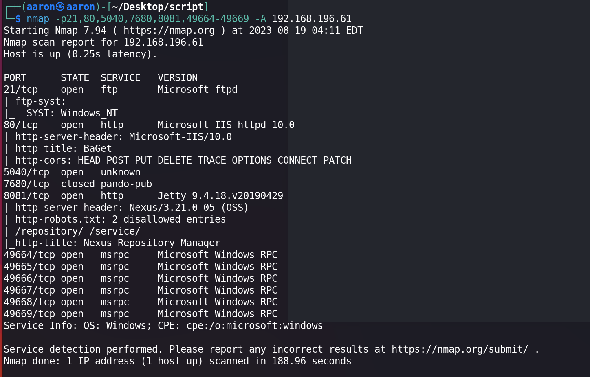


# Port Enumeration

## Port 80

Port 80 is a `lightweight NuGet and symbol server`.

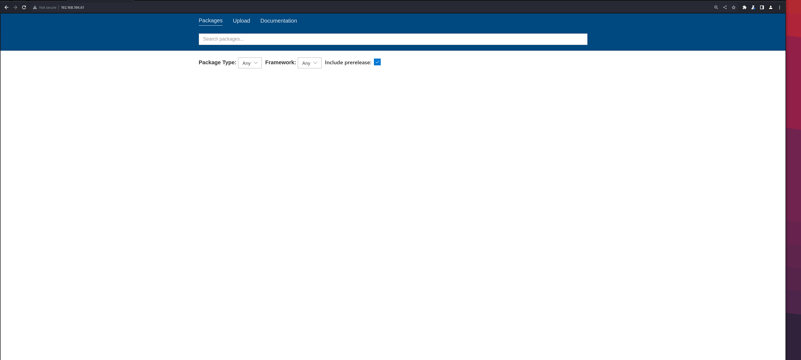

No login button, no other element.

## Port 8081

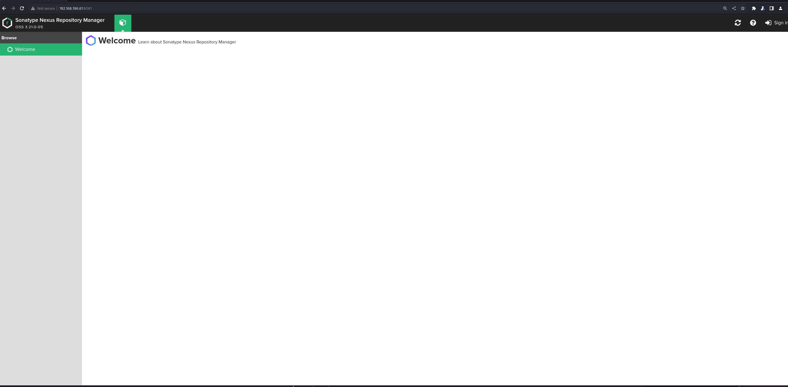

Port 8081 is a Repository Manager the version is 3.21.0-05.

Search on google there is an exploit on [exploitdb](https://www.exploit-db.com/exploits/49385), it's a RCE. But need to login.

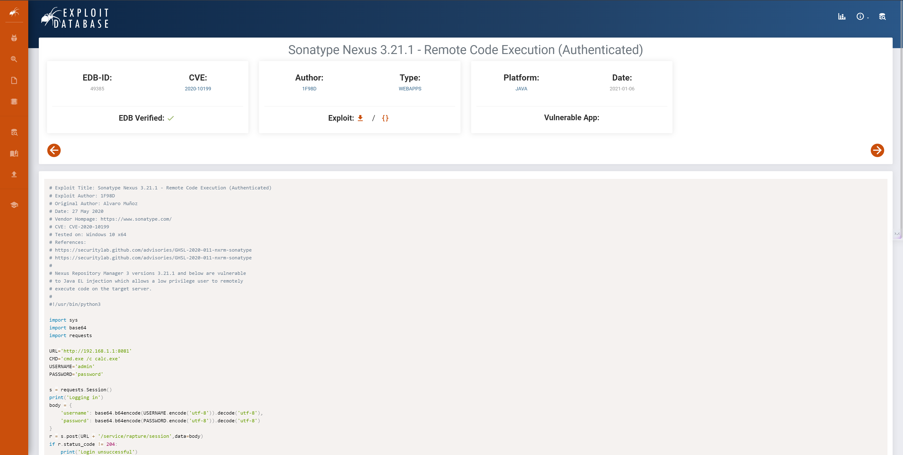

Try some easy username and password. `nexus:nexus` is good. Then try to use the exploit.

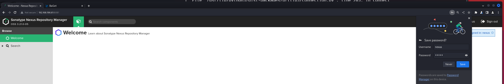

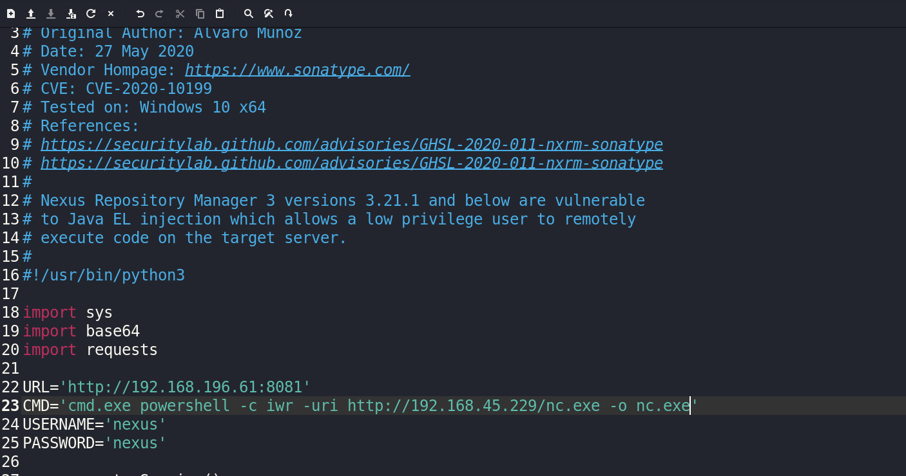

It's working.

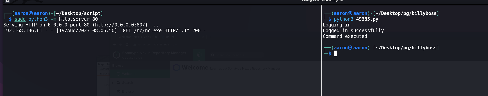

Then change the commands to running reverse shell.

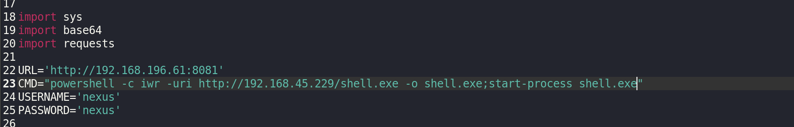

Wait a second, get reverse shell.

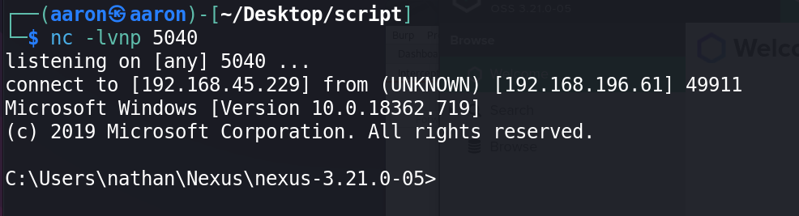

# PE

## Information Collection

### Basic information

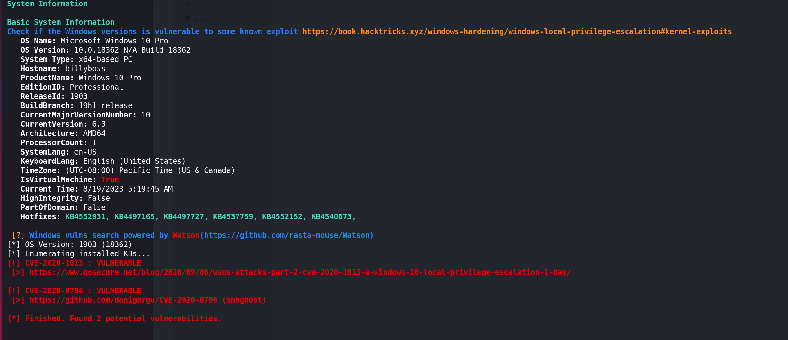

### Interesting Services

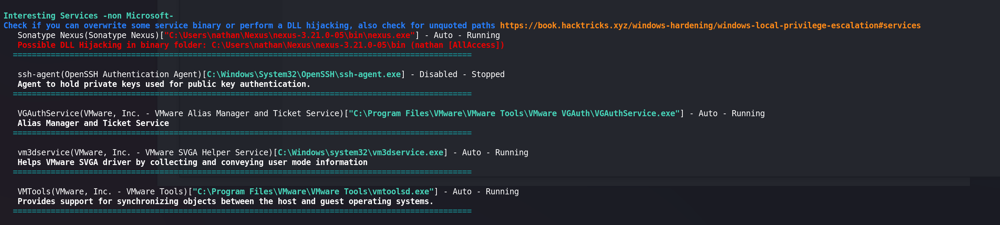

### Listening Ports

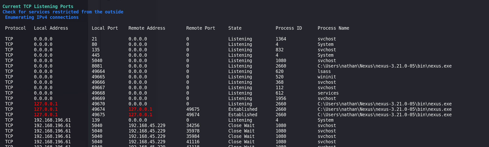

### Check `whoami /priv`

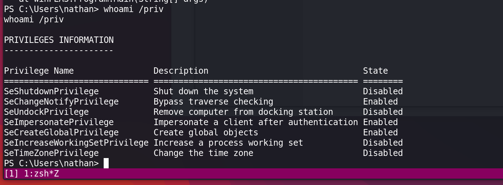

Try to use `PrintSpoofer` to PE. But not good.

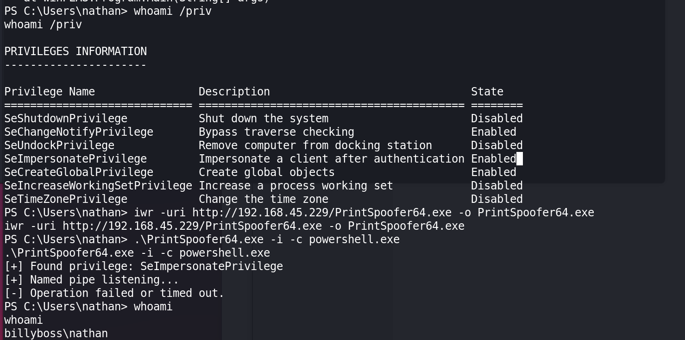

Change to use `godpotato`, then get administrator.

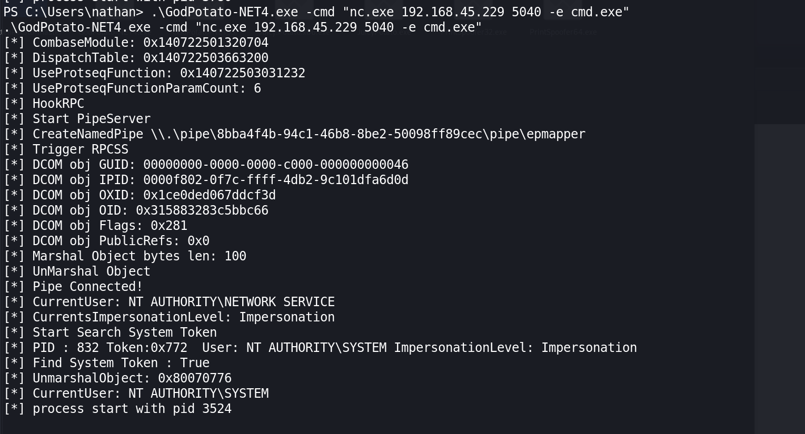

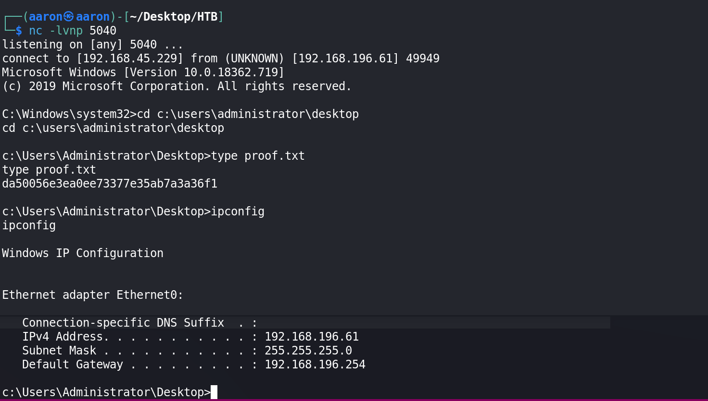
