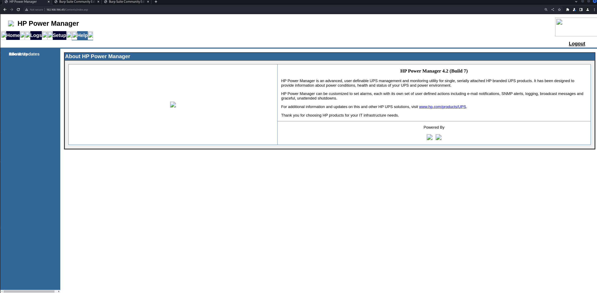
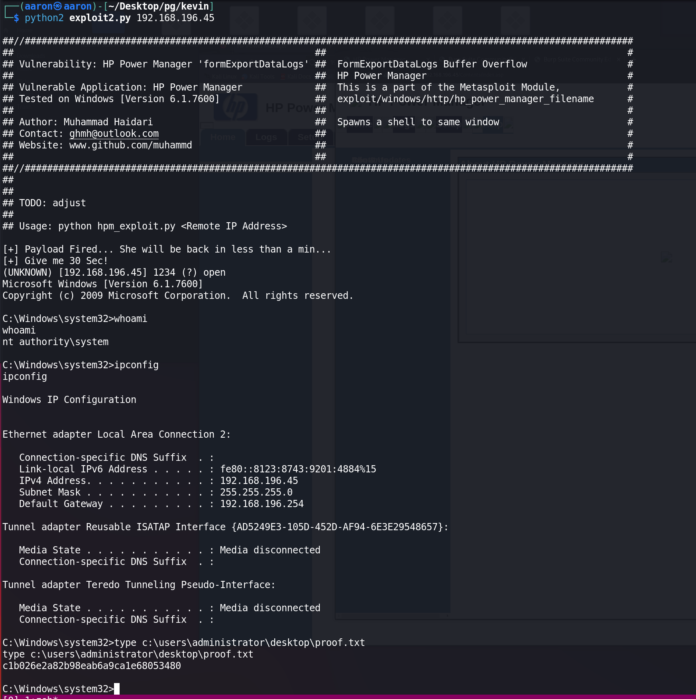

# Network Enumeration

```bash
PORT      STATE    SERVICE
80/tcp    open     http
135/tcp   open     msrpc
139/tcp   open     netbios-ssn
445/tcp   open     microsoft-ds
3573/tcp  open     tag-ups-1
49152/tcp open     unknown
49153/tcp open     unknown
49154/tcp open     unknown
49155/tcp open     unknown
49158/tcp open     unknown
49159/tcp open     unknown

┌──(aaron㉿aaron)-[~/Desktop/pg/kevin]
└─$ nmap -p80,3573,19942,21770 -A 192.168.196.45                     
Starting Nmap 7.94 ( https://nmap.org ) at 2023-08-19 08:58 EDT

PORT      STATE  SERVICE    VERSION
80/tcp    open   http       GoAhead WebServer (WAP http config)
| http-title: HP Power Manager
|_Requested resource was http://192.168.196.45/index.asp
|_http-server-header: GoAhead-Webs
3573/tcp  open   tag-ups-1?

```

## Port enumeration

## Port 80

There is a `HP Power Manager`, the version is 4.2(build7), creds `admin:admin` is good.



Search on google with this verion, find a buffer overflow. 

1. https://www.exploit-db.com/exploits/10099
2. https://github.com/Muhammd/HP-Power-Manager/blob/master/hpm_exploit.py

Use the 2rd, wait for 30 seconds. Then get system shell.


