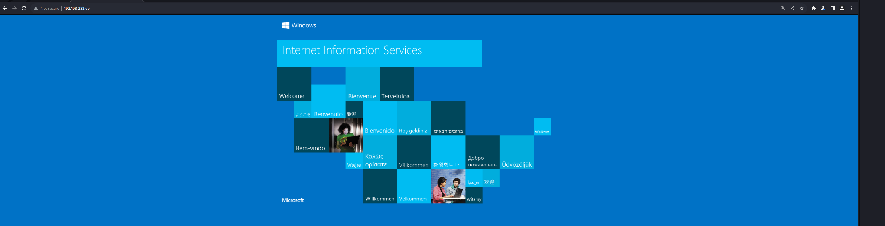
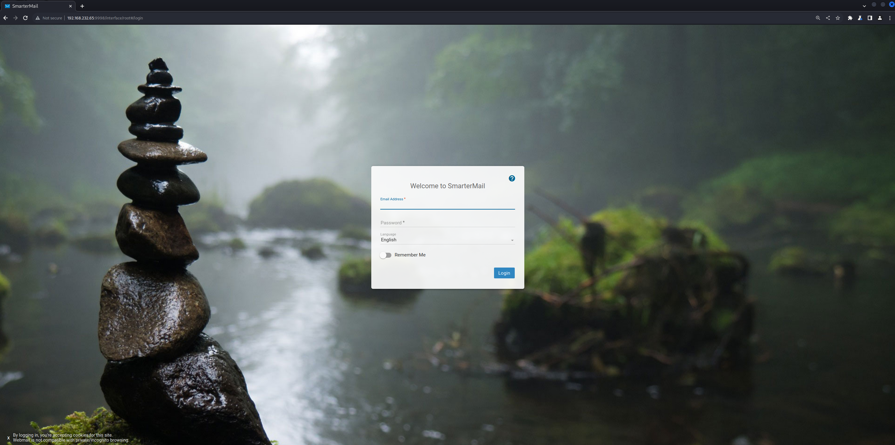
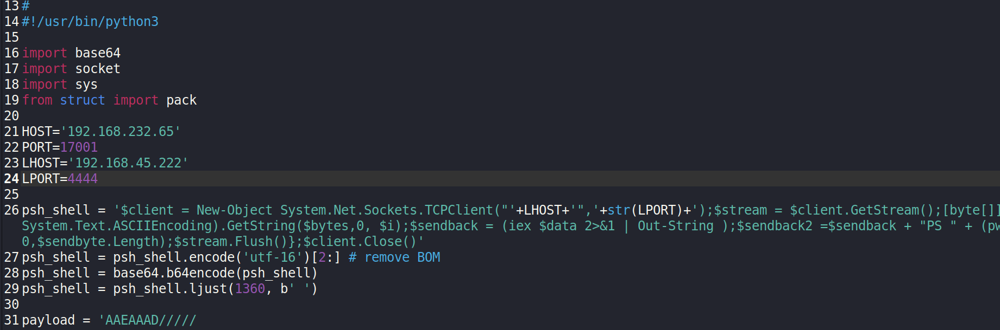
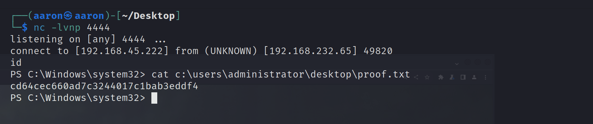

# Network Enumeration

```bash
PORT      STATE    SERVICE
21/tcp    open     ftp
80/tcp    open     http
135/tcp   open     msrpc
139/tcp   open     netbios-ssn
445/tcp   open     microsoft-ds
5040/tcp  open     unknown
9998/tcp  open     distinct32
17001/tcp open     unknown
```

# Port enumeration

## 80

IIS Server



## Port 9998

SmarterMail



Use the [SmarterMail Build 6985 - Remote Code Execution](https://www.exploit-db.com/exploits/49216).



Change the IP address, then get shell.

